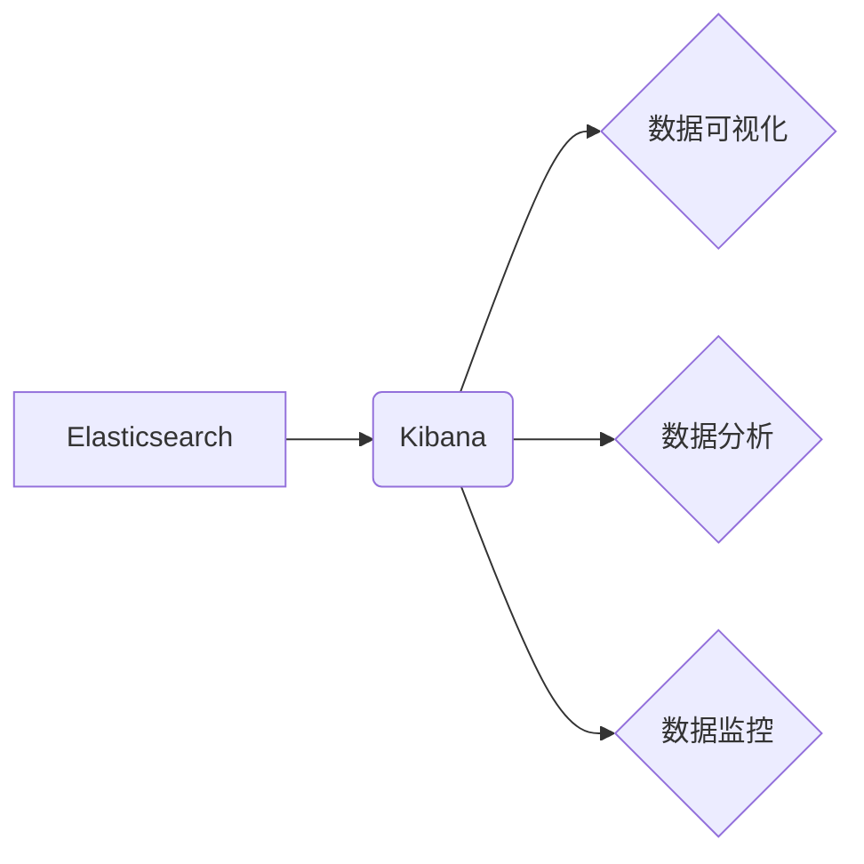

> Kibana, Elasticsearch, Logstash, 数据可视化, 数据分析, 监控, 告警, 

## 1. 背景介绍

在当今数据爆炸的时代，海量数据涌入企业，如何有效地收集、存储、分析和可视化这些数据成为了企业发展的重要课题。Elastic Stack（由 Elasticsearch、Logstash 和 Kibana 组成）应运而生，为企业提供了强大的数据处理和分析解决方案。

Kibana 作为 Elastic Stack 的数据可视化和分析工具，为用户提供了直观、交互式的界面，帮助用户探索、理解和洞察数据。它可以将 Elasticsearch 中的日志、指标和事件数据转化为图表、仪表盘、地图等多种形式，方便用户进行数据分析和监控。

## 2. 核心概念与联系

Kibana 的核心功能是将 Elasticsearch 中的数据进行可视化和分析。它通过以下几个核心概念实现这一功能：

* **数据源:** Kibana 可以连接到 Elasticsearch 集群，并从 Elasticsearch 中获取数据。
* **索引:** Elasticsearch 中的数据存储在索引中，Kibana 可以选择特定的索引进行分析。
* **图表:** Kibana 提供多种图表类型，例如柱状图、折线图、饼图等，用于展示数据趋势和分布。
* **仪表盘:** Kibana 可以将多个图表组合在一起，形成仪表盘，用于监控和分析多个指标。
* **搜索:** Kibana 提供强大的搜索功能，可以根据特定的条件查询 Elasticsearch 中的数据。

**Kibana 与 Elasticsearch 的关系**



## 3. 核心算法原理 & 具体操作步骤

Kibana 的核心算法原理主要体现在数据查询、图表渲染和仪表盘构建等方面。

### 3.1  算法原理概述

* **数据查询:** Kibana 使用 Elasticsearch 的查询语言（DSL）来查询数据。DSL 提供了丰富的查询操作，例如过滤、聚合、排序等，可以根据用户的需求进行灵活的查询。
* **图表渲染:** Kibana 使用 JavaScript 库 D3.js 来渲染图表。D3.js 提供了强大的数据绑定和图形绘制功能，可以生成各种类型的图表。
* **仪表盘构建:** Kibana 使用 JSON 格式定义仪表盘的结构和布局。用户可以拖放图表、添加文本和链接等元素，自定义仪表盘的样式和功能。

### 3.2  算法步骤详解

1. **用户请求:** 用户通过 Kibana 的界面发起数据查询请求。
2. **DSL 解析:** Kibana 将用户的查询请求转换为 Elasticsearch 的 DSL 语句。
3. **数据查询:** Elasticsearch 根据 DSL 语句查询数据并返回结果。
4. **数据处理:** Kibana 对查询结果进行处理，例如聚合、排序等。
5. **图表渲染:** Kibana 使用 D3.js 将处理后的数据渲染成图表。
6. **仪表盘构建:** Kibana 将图表和其他元素组合成仪表盘，并展示给用户。

### 3.3  算法优缺点

* **优点:** Kibana 的算法原理简单易懂，并且可以灵活地扩展和定制。
* **缺点:** Kibana 的算法性能相对较低，对于海量数据分析可能存在性能瓶颈。

### 3.4  算法应用领域

Kibana 的算法应用领域广泛，例如：

* **日志分析:** 分析应用程序、系统和网络日志，发现异常行为和潜在问题。
* **监控和告警:** 监控系统指标和应用程序性能，并设置告警规则，及时提醒管理员。
* **数据探索和分析:** 探索和分析数据趋势和模式，发现隐藏的价值。
* **业务智能:** 基于数据分析，为业务决策提供支持。

## 4. 数学模型和公式 & 详细讲解 & 举例说明

Kibana 的数据分析功能基于一些数学模型和公式，例如：

### 4.1  数学模型构建

* **聚合函数:** Kibana 使用聚合函数来对数据进行分组和统计分析。常见的聚合函数包括：
    * **count:** 计算数据项的数量。
    * **sum:** 计算数据项的总和。
    * **avg:** 计算数据项的平均值。
    * **max:** 计算数据项的最大值。
    * **min:** 计算数据项的最小值。

* **时间序列分析:** Kibana 支持时间序列数据的分析，可以使用滑动窗口、趋势线和季节性分析等方法来分析数据趋势。

### 4.2  公式推导过程

* **平均值:** 平均值公式为：

$$
\bar{x} = \frac{\sum_{i=1}^{n} x_i}{n}
$$

其中：

* $\bar{x}$ 表示平均值。
* $x_i$ 表示每个数据项的值。
* $n$ 表示数据项的数量。

* **标准差:** 标准差公式为：

$$
\sigma = \sqrt{\frac{\sum_{i=1}^{n} (x_i - \bar{x})^2}{n-1}}
$$

其中：

* $\sigma$ 表示标准差。
* $x_i$ 表示每个数据项的值。
* $\bar{x}$ 表示平均值。
* $n$ 表示数据项的数量。

### 4.3  案例分析与讲解

假设我们有一组数据：10, 12, 15, 18, 20。

* **平均值:** $\bar{x} = (10 + 12 + 15 + 18 + 20) / 5 = 15$
* **标准差:** $\sigma = \sqrt{((10-15)^2 + (12-15)^2 + (15-15)^2 + (18-15)^2 + (20-15)^2) / (5-1)} = 3.16$

## 5. 项目实践：代码实例和详细解释说明

### 5.1  开发环境搭建

* 安装 Elasticsearch 和 Kibana：参考官方文档进行安装。
* 配置数据源：在 Kibana 中配置 Elasticsearch 集群的连接信息。

### 5.2  源代码详细实现

Kibana 的源代码主要由 JavaScript、HTML 和 CSS 组成。由于篇幅限制，这里只展示一个简单的图表代码示例：

```javascript
// 使用 D3.js 创建柱状图
var margin = {top: 20, right: 20, bottom: 30, left: 40},
    width = 960 - margin.left - margin.right,
    height = 500 - margin.top - margin.bottom;

var svg = d3.select("body").append("svg")
    .attr("width", width + margin.left + margin.right)
    .attr("height", height + margin.top + margin.bottom)
  .append("g")
    .attr("transform", "translate(" + margin.left + "," + margin.top + ")");

// 数据
var data = [10, 20, 30, 40, 50];

// 设定 x 轴范围
var x = d3.scaleBand().range([0, width]).padding(0.1);

// 设定 y 轴范围
var y = d3.scaleLinear().range([height, 0]);

// 绑定数据
x.domain(d3.range(data.length));
y.domain([0, d3.max(data)]);

// 绘制柱状图
svg.selectAll(".bar")
    .data(data)
  .enter().append("rect")
    .attr("class", "bar")
    .attr("x", function(d, i) { return x(i); })
    .attr("y", function(d) { return y(d); })
    .attr("width", x.bandwidth())
    .attr("height", function(d) { return height - y(d); });
```

### 5.3  代码解读与分析

* **数据准备:** 代码首先定义了数据数组 `data`，并使用 D3.js 的 `scaleBand` 和 `scaleLinear` 函数创建 x 轴和 y 轴的范围。
* **图形绘制:** 使用 `d3.selectAll` 选择所有元素，并使用 `data` 绑定数据。然后使用 `enter().append("rect")` 创建矩形元素，并设置其属性，例如位置、宽度和高度。

### 5.4  运行结果展示

运行上述代码后，将生成一个简单的柱状图，展示数据 `data` 的值。

## 6. 实际应用场景

Kibana 的实际应用场景非常广泛，例如：

* **IT运维:** 使用 Kibana 监控服务器、网络设备和应用程序的性能指标，及时发现和解决问题。
* **安全分析:** 使用 Kibana 分析安全日志，识别恶意活动和潜在威胁。
* **业务分析:** 使用 Kibana 分析业务数据，例如用户行为、销售数据和市场趋势，为业务决策提供支持。

### 6.4  未来应用展望

随着数据量的不断增长和分析需求的不断提高，Kibana 将在以下方面得到进一步发展：

* **人工智能集成:** 将人工智能技术集成到 Kibana 中，例如使用机器学习算法进行数据分析和预测。
* **云原生支持:** 更好地支持云原生环境，例如 Kubernetes 和 Docker。
* **实时分析:** 提高实时分析能力，能够及时处理流式数据。

## 7. 工具和资源推荐

### 7.1  学习资源推荐

* **Elastic 官方文档:** https://www.elastic.co/guide/en/kibana/current/index.html
* **Kibana 中文社区:** https://www.elastic.co/cn/community

### 7.2  开发工具推荐

* **Visual Studio Code:** https://code.visualstudio.com/
* **Atom:** https://atom.io/

### 7.3  相关论文推荐

* **Elasticsearch: A Distributed, Restful Search and Analytics Engine:** https://www.elastic.co/guide/en/elasticsearch/reference/current/index.html
* **Kibana: A Data Visualization and Analysis Tool:** https://www.elastic.co/guide/en/kibana/current/index.html

## 8. 总结：未来发展趋势与挑战

### 8.1  研究成果总结

Kibana 作为 Elastic Stack 的数据可视化和分析工具，已经取得了显著的成果，为企业提供了强大的数据处理和分析解决方案。

### 8.2  未来发展趋势

未来，Kibana 将朝着以下方向发展：

* **人工智能集成:** 将人工智能技术集成到 Kibana 中，例如使用机器学习算法进行数据分析和预测。
* **云原生支持:** 更好地支持云原生环境，例如 Kubernetes 和 Docker。
* **实时分析:** 提高实时分析能力，能够及时处理流式数据。

### 8.3  面临的挑战

Kibana 也面临着一些挑战，例如：

* **性能优化:** 随着数据量的不断增长，Kibana 的性能需要得到进一步优化。
* **用户体验:** 需要不断改进 Kibana 的用户体验，使其更加易用和直观。
* **生态系统建设:** 需要加强 Kibana 的生态系统建设，例如开发更多插件和工具。

### 8.4  研究展望

未来，我们将继续研究 Kibana 的技术发展趋势，探索其在人工智能、云原生和实时分析等领域的应用，并致力于提升 Kibana 的性能、用户体验和生态系统建设。

## 9. 附录：常见问题与解答

* **Kibana 如何连接到 Elasticsearch 集群？**

在 Kibana 的设置页面中，可以配置 Elasticsearch 集群的连接信息，例如主机地址、端口号和用户名密码。

* **Kibana 支持哪些类型的图表？**

Kibana 支持多种类型的图表，例如柱状图、折线图、饼图、地图等。

* **如何创建自定义仪表盘？**

在 Kibana 中，可以拖放图表、添加文本和链接等元素，自定义仪表盘的样式和功能。

* **如何使用 Kibana