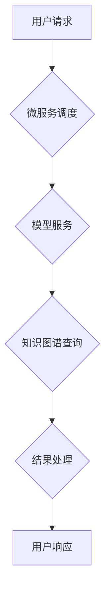

> Large Language Model (LLM), 实时性, 响应时间, 微服务架构, 并行处理, 知识图谱, 优化算法, 延迟最小化

## 1. 背景介绍

大型语言模型 (LLM) 在自然语言处理领域取得了令人瞩目的成就，展现出强大的文本生成、翻译、摘要和问答能力。然而，现有的LLM模型通常面临着响应时间较慢的问题，这限制了其在实时应用场景中的应用。例如，在聊天机器人、实时翻译和智能客服等领域，用户期望能够获得即时响应，而传统的LLM模型的延迟往往无法满足这些需求。

随着人工智能技术的不断发展，对实时性要求越来越高，LLM的实时性问题也日益受到关注。如何有效降低LLM的响应时间，使其能够在实时应用场景中发挥更大的作用，成为当前研究的热点问题。

## 2. 核心概念与联系

**2.1  实时性定义**

在计算机科学中，实时性是指系统能够在规定时间内完成任务的能力。对于LLM而言，实时性是指模型能够在用户发出请求后，在短时间内提供准确的响应。

**2.2  响应时间的影响因素**

LLM的响应时间受到多个因素的影响，包括：

* **模型规模:** 模型参数量越大，计算量越大，响应时间越长。
* **硬件资源:** 处理器、内存和网络带宽等硬件资源的性能直接影响LLM的运行速度。
* **算法效率:** 不同的LLM算法具有不同的计算复杂度，效率高的算法可以降低响应时间。
* **数据处理:** 数据预处理、编码和解码等步骤也会影响响应时间。

**2.3  实时LLM架构**

为了实现LLM的实时性，需要采用特定的架构和技术。常见的实时LLM架构包括：

* **微服务架构:** 将LLM模型分解成多个独立的服务，每个服务负责特定的任务，可以并行处理请求，提高响应速度。
* **边缘计算:** 将LLM模型部署在靠近数据源的边缘设备上，减少数据传输延迟，实现更快速的响应。
* **知识图谱:** 利用知识图谱存储和检索信息，可以快速定位相关知识，提高LLM的响应速度。



## 3. 核心算法原理 & 具体操作步骤

**3.1  算法原理概述**

实时LLM算法的核心在于高效地处理用户请求，并快速生成响应。常见的实时LLM算法包括：

* **量化模型:** 将模型参数量化，减少模型大小和计算量，提高响应速度。
* **模型剪枝:** 删除模型中不重要的参数，减少模型规模，提高效率。
* **并行处理:** 利用多核处理器或GPU进行并行计算，加速模型推理。
* **延迟最小化:** 通过优化算法和数据结构，减少模型推理过程中的延迟。

**3.2  算法步骤详解**

以量化模型为例，其具体操作步骤如下：

1. **模型选择:** 选择一个合适的LLM模型作为基础。
2. **量化方法:** 选择一种量化方法，例如整数量化或浮点数量化。
3. **量化参数:** 根据量化方法，将模型参数量化为更小的数据类型。
4. **模型评估:** 对量化后的模型进行评估，确保其性能损失在可接受范围内。
5. **部署模型:** 将量化后的模型部署到目标平台，实现实时响应。

**3.3  算法优缺点**

量化模型的优点包括：

* 模型大小减小，存储和传输成本降低。
* 计算量减少，响应速度提高。
* 能耗降低，更节能环保。

缺点包括：

* 模型精度可能会有所下降。
* 量化方法的选择和参数设置需要经验和技巧。

**3.4  算法应用领域**

量化模型在以下领域具有广泛的应用前景：

* **移动设备:** 在资源有限的移动设备上部署LLM模型，实现实时语音识别、文本生成等功能。
* **物联网:** 在物联网设备上部署LLM模型，实现智能感知、数据分析和决策。
* **边缘计算:** 在边缘设备上部署LLM模型，实现低延迟的实时应用，例如自动驾驶和远程医疗。

## 4. 数学模型和公式 & 详细讲解 & 举例说明

**4.1  数学模型构建**

假设我们有一个LLM模型，其输入为文本序列 $x = (x_1, x_2, ..., x_n)$，输出为文本序列 $y = (y_1, y_2, ..., y_m)$。我们可以用概率模型来表示LLM的输出：

$$P(y|x) = \prod_{i=1}^{m} P(y_i|x_1, x_2, ..., x_n, y_1, ..., y_{i-1})$$

其中，$P(y_i|x_1, x_2, ..., x_n, y_1, ..., y_{i-1})$ 表示在给定输入序列 $x$ 和前 $i-1$ 个输出词 $y_1, ..., y_{i-1}$ 的情况下，第 $i$ 个输出词 $y_i$ 的概率。

**4.2  公式推导过程**

为了实现实时性，我们需要优化上述概率模型，使其能够在短时间内生成响应。常见的优化方法包括：

* **截断搜索:** 在生成输出序列时，只考虑前 $k$ 个最可能的词，从而减少搜索空间。
* **beam search:** 在生成输出序列时，维护一个包含 $k$ 个候选序列的beam，并选择其中最优的序列作为最终输出。
* **注意力机制:** 利用注意力机制来关注输入序列中与当前输出词相关的部分，提高模型的效率和准确性。

**4.3  案例分析与讲解**

例如，在机器翻译任务中，我们可以使用注意力机制来帮助模型关注源语言句子中与目标语言句子中当前词相关的部分，从而提高翻译的准确性和流畅度。

## 5. 项目实践：代码实例和详细解释说明

**5.1  开发环境搭建**

为了实现实时LLM，需要搭建一个合适的开发环境。常见的开发环境包括：

* **云平台:** 利用云平台提供的计算资源和服务，例如AWS、Azure和GCP。
* **本地服务器:** 在本地服务器上搭建开发环境，例如使用Docker容器进行部署。

**5.2  源代码详细实现**

以下是一个使用Python和TensorFlow框架实现实时LLM的简单代码示例：

```python
import tensorflow as tf

# 加载量化后的LLM模型
model = tf.keras.models.load_model('quantized_model.h5')

# 定义输入函数
def preprocess_input(text):
  # 对文本进行预处理，例如分词、编码等
  return text

# 定义预测函数
def predict(text):
  # 将文本输入模型，获取预测结果
  return model.predict(preprocess_input(text))

# 获取用户输入
user_input = input("请输入文本：")

# 调用预测函数
prediction = predict(user_input)

# 处理预测结果
# ...

# 输出预测结果
print(prediction)
```

**5.3  代码解读与分析**

这段代码首先加载了一个量化后的LLM模型，然后定义了两个函数：`preprocess_input` 用于对文本进行预处理，`predict` 用于调用模型进行预测。最后，代码获取用户输入，调用`predict`函数进行预测，并输出预测结果。

**5.4  运行结果展示**

运行这段代码后，用户可以输入文本，模型会根据输入文本生成相应的预测结果。

## 6. 实际应用场景

**6.1  聊天机器人**

实时LLM可以用于构建更智能、更自然的聊天机器人，能够理解用户的意图，并提供更准确、更相关的回复。

**6.2  实时翻译**

实时LLM可以实现实时语音和文本翻译，例如在会议、旅游和商务交流中使用。

**6.3  智能客服**

实时LLM可以用于构建智能客服系统，能够自动回答用户常见问题，提高客服效率。

**6.4  未来应用展望**

随着LLM技术的不断发展，其在更多领域的应用场景将会不断涌现，例如：

* **个性化教育:** 根据学生的学习情况，提供个性化的学习内容和辅导。
* **医疗诊断:** 辅助医生进行疾病诊断，提高诊断准确率。
* **金融分析:** 分析金融数据，预测市场趋势。

## 7. 工具和资源推荐

**7.1  学习资源推荐**

* **书籍:**
    * 《深度学习》
    * 《自然语言处理》
* **在线课程:**
    * Coursera
    * edX
* **博客和论坛:**
    * TensorFlow Blog
    * PyTorch Forum

**7.2  开发工具推荐**

* **TensorFlow:** 开源深度学习框架
* **PyTorch:** 开源深度学习框架
* **Hugging Face:** 提供预训练LLM模型和工具

**7.3  相关论文推荐**

* **BERT: Pre-training of Deep Bidirectional Transformers for Language Understanding**
* **GPT-3: Language Models are Few-Shot Learners**
* **T5: Text-to-Text Transfer Transformer**

## 8. 总结：未来发展趋势与挑战

**8.1  研究成果总结**

近年来，LLM技术取得了显著进展，模型规模不断扩大，性能不断提升。实时LLM算法也取得了重要突破，例如量化模型、模型剪枝和并行处理等技术，使得LLM能够在更短的时间内提供响应。

**8.2  未来发展趋势**

未来，LLM技术将朝着以下方向发展：

* **模型规模更大:** 模型参数量将继续增加，模型能力将进一步提升。
* **效率更高:** 算法和架构优化将进一步提高LLM的效率，降低响应时间。
* **更广泛的应用:** LLM将应用于更多领域，例如教育、医疗、金融等。

**8.3  面临的挑战**

LLM技术也面临着一些挑战：

* **计算资源:** 大型LLM模型训练和部署需要大量的计算资源，成本较高。
* **数据安全:** LLM模型训练需要大量数据，数据安全和隐私保护是一个重要问题。
* **伦理问题:** LLM模型可能存在偏见和歧视，需要进行伦理审查和引导。

**8.4  研究展望**

未来，我们需要继续研究更有效的LLM算法和架构，降低模型训练和部署成本，并解决数据安全和伦理问题，推动LLM技术向更安全、更可靠、更普惠的方向发展。

## 9. 附录：常见问题与解答

**9.1  Q: 如何选择合适的量化方法？**

**A:** 量化方法的选择取决于模型的具体情况，需要根据模型规模、精度要求和硬件资源等因素进行选择。

**9.2  Q: 如何评估量化模型的性能？**

**A:** 可以使用准确率、困惑度等指标来评估量化模型的性能，并与原模型进行比较。

**9.3  Q: 如何部署实时LLM模型？**

**A:** 可以使用云平台、本地服务器或边缘设备等方式部署实时LLM模型。

作者：禅与计算机程序设计艺术 / Zen and the Art of Computer Programming


<end_of_turn>