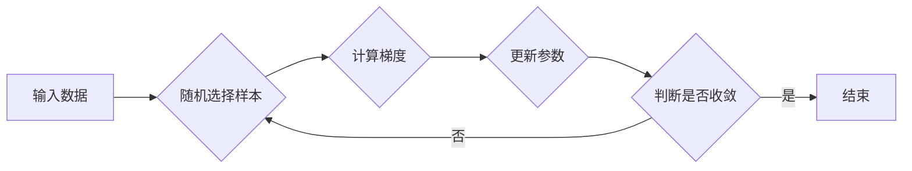

> Stochastic Gradient Descent (SGD), 梯度下降, 机器学习, 深度学习, 优化算法, 代码实战

## 1. 背景介绍

在机器学习和深度学习领域，模型训练的核心是找到最优的模型参数，使得模型在给定数据上表现最佳。 梯度下降算法作为一种经典的优化算法，在模型训练中扮演着至关重要的角色。其中，随机梯度下降 (Stochastic Gradient Descent，简称 SGD) 是一种高效且广泛应用的梯度下降变体。

SGD 算法的核心思想是通过随机采样数据来计算梯度，并根据梯度更新模型参数。与传统的批量梯度下降 (Batch Gradient Descent) 相比，SGD 具有以下优势：

* **计算效率高:** SGD 只需要处理单个样本或一小批样本的梯度，因此计算量远小于批量梯度下降。
* **收敛速度快:** SGD 由于每次更新都基于随机样本，可以跳出局部最优解，从而更快地收敛到全局最优解。
* **内存占用小:** SGD 不需要存储整个训练数据集，因此内存占用更小。

## 2. 核心概念与联系

**2.1 梯度下降算法**

梯度下降算法是一种迭代优化算法，其目标是找到一个函数的最小值。 算法的基本思想是：

1. 从一个初始点开始。
2. 计算该点处的梯度。
3. 根据梯度方向更新参数，朝着梯度下降的方向移动。
4. 重复步骤 2 和 3，直到达到收敛条件。

**2.2 随机梯度下降算法**

随机梯度下降算法是梯度下降算法的一种变体，其核心区别在于梯度计算方式。

* **批量梯度下降:** 计算所有训练样本的梯度，然后更新模型参数。
* **随机梯度下降:** 随机选择一个样本，计算该样本的梯度，然后更新模型参数。

**2.3 流程图**



## 3. 核心算法原理 & 具体操作步骤

### 3.1 算法原理概述

SGD 算法的核心思想是利用随机梯度来更新模型参数。 具体来说，算法会随机选择一个样本，计算该样本对应的损失函数的梯度，然后根据梯度方向更新模型参数。 

### 3.2 算法步骤详解

1. **初始化模型参数:**  随机初始化模型参数。
2. **随机采样数据:** 从训练数据集中随机选择一个样本。
3. **计算梯度:** 计算该样本对应的损失函数的梯度。
4. **更新参数:** 根据梯度方向更新模型参数。
5. **重复步骤 2-4:** 重复上述步骤，直到达到收敛条件。

### 3.3 算法优缺点

**优点:**

* 计算效率高
* 收敛速度快
* 内存占用小

**缺点:**

* 可能会震荡，难以收敛到全局最优解
* 容易受到噪声的影响

### 3.4 算法应用领域

SGD 算法广泛应用于机器学习和深度学习领域，例如：

* **分类:**  图像分类、文本分类等
* **回归:**  房价预测、股票预测等
* **生成模型:**  文本生成、图像生成等

## 4. 数学模型和公式 & 详细讲解 & 举例说明

### 4.1 数学模型构建

假设我们的目标函数为 $J(w)$，其中 $w$ 是模型参数。 我们的目标是找到 $w$ 的最小值，即 $min_{w} J(w)$。

### 4.2 公式推导过程

SGD 算法的核心公式为：

$$w_{t+1} = w_t - \eta \nabla J(w_t; x_t)$$

其中：

* $w_t$ 是第 $t$ 次迭代的参数值
* $w_{t+1}$ 是第 $t+1$ 次迭代的参数值
* $\eta$ 是学习率，控制参数更新的步长
* $\nabla J(w_t; x_t)$ 是在样本 $x_t$ 上损失函数 $J(w)$ 的梯度

### 4.3 案例分析与讲解

假设我们有一个线性回归模型，目标函数为均方误差 (MSE)：

$$J(w) = \frac{1}{2n} \sum_{i=1}^{n} (y_i - w^T x_i)^2$$

其中：

* $n$ 是样本数量
* $y_i$ 是第 $i$ 个样本的真实值
* $x_i$ 是第 $i$ 个样本的特征向量
* $w$ 是模型参数

我们可以使用 SGD 算法来更新模型参数 $w$。 具体来说，我们会在每次迭代中随机选择一个样本 $(x_t, y_t)$，计算梯度：

$$\nabla J(w_t; x_t) = \frac{1}{n} (w_t^T x_t - y_t) x_t$$

然后根据公式更新参数：

$$w_{t+1} = w_t - \eta \nabla J(w_t; x_t)$$

## 5. 项目实践：代码实例和详细解释说明

### 5.1 开发环境搭建

* Python 3.x
* NumPy
* Scikit-learn

### 5.2 源代码详细实现

```python
import numpy as np
from sklearn.datasets import make_regression

# 生成回归数据集
X, y = make_regression(n_samples=100, n_features=1, noise=10, random_state=42)

# 定义损失函数
def mean_squared_error(y_true, y_pred):
    return np.mean((y_true - y_pred)**2)

# 定义SGD算法
def stochastic_gradient_descent(X, y, learning_rate=0.01, epochs=100):
    n_samples = X.shape[0]
    w = np.zeros(X.shape[1])  # 初始化参数
    for epoch in range(epochs):
        for i in range(n_samples):
            # 随机选择一个样本
            x = X[i].reshape(1, -1)
            y_true = y[i]

            # 计算梯度
            y_pred = np.dot(x, w)
            gradient = (1/n_samples) * (y_pred - y_true) * x

            # 更新参数
            w -= learning_rate * gradient

    return w

# 训练模型
w = stochastic_gradient_descent(X, y, learning_rate=0.01, epochs=100)

# 打印模型参数
print("模型参数:", w)
```

### 5.3 代码解读与分析

* **数据生成:** 使用 `make_regression` 函数生成回归数据集。
* **损失函数:** 定义均方误差 (MSE) 作为损失函数。
* **SGD 算法:** 定义 `stochastic_gradient_descent` 函数实现 SGD 算法。
* **参数初始化:** 初始化模型参数为零向量。
* **迭代更新:** 循环迭代，每次随机选择一个样本，计算梯度，并根据梯度更新参数。
* **模型训练:** 调用 `stochastic_gradient_descent` 函数训练模型。
* **结果展示:** 打印训练后的模型参数。

### 5.4 运行结果展示

运行代码后，会输出训练后的模型参数。

## 6. 实际应用场景

SGD 算法在机器学习和深度学习领域有着广泛的应用场景，例如：

* **图像分类:** 使用 CNN (卷积神经网络) 进行图像分类，SGD 算法可以有效地训练 CNN 模型，提高分类精度。
* **自然语言处理:** 使用 RNN (循环神经网络) 进行文本分类、机器翻译等任务，SGD 算法可以帮助训练 RNN 模型，提高模型性能。
* **推荐系统:** 使用协同过滤算法进行用户推荐，SGD 算法可以优化推荐模型的参数，提高推荐效果。

### 6.4 未来应用展望

随着机器学习和深度学习技术的不断发展，SGD 算法的应用场景将会更加广泛。 

## 7. 工具和资源推荐

### 7.1 学习资源推荐

* **书籍:**
    * "Deep Learning" by Ian Goodfellow, Yoshua Bengio, and Aaron Courville
    * "Hands-On Machine Learning with Scikit-Learn, Keras & TensorFlow" by Aurélien Géron
* **在线课程:**
    * Coursera: Machine Learning by Andrew Ng
    * Udacity: Deep Learning Nanodegree

### 7.2 开发工具推荐

* **Python:** 作为机器学习和深度学习的常用编程语言
* **NumPy:** 用于数值计算的 Python 库
* **Scikit-learn:** 用于机器学习算法的 Python 库
* **TensorFlow:** 用于深度学习的开源框架
* **Keras:** 用于深度学习的简洁易用的框架

### 7.3 相关论文推荐

* "Stochastic Gradient Descent" by Robbins and Monro (1951)
* "On the Convergence of Stochastic Approximation Methods" by Polyak (1964)
* "Optimization Methods for Large-Scale Machine Learning" by Bottou (2010)

## 8. 总结：未来发展趋势与挑战

### 8.1 研究成果总结

SGD 算法作为一种经典的优化算法，在机器学习和深度学习领域取得了显著的成果。 

### 8.2 未来发展趋势

* **加速 SGD 算法:** 研究更快的 SGD 算法变体，例如 mini-batch SGD、Momentum SGD、Nesterov Accelerated Gradient (NAG) 等。
* **结合其他优化算法:** 将 SGD 与其他优化算法结合，例如 Adam、RMSprop 等，提高算法性能。
* **应用于新领域:** 将 SGD 算法应用于新的机器学习和深度学习领域，例如强化学习、迁移学习等。

### 8.3 面临的挑战

* **参数选择:** SGD 算法的学习率和批处理大小等参数需要精心选择，否则可能会影响算法收敛速度和性能。
* **局部最优解:** SGD 算法可能会陷入局部最优解，难以找到全局最优解。
* **稀疏数据:** SGD 算法在处理稀疏数据时可能会遇到挑战。

### 8.4 研究展望

未来，SGD 算法的研究将继续深入，探索更有效的优化策略，并将其应用于更广泛的机器学习和深度学习领域。

## 9. 附录：常见问题与解答

**问题 1:** SGD 算法的学习率如何选择？

**解答:** 学习率是 SGD 算法的一个重要参数，控制着参数更新的步长。 学习率过大可能会导致参数震荡，难以收敛；学习率过小可能会导致收敛速度过慢。 通常，可以采用学习率衰减策略，随着训练的进行，逐渐减小学习率。

**问题 2:** SGD 算法容易陷入局部最优解，如何解决？

**解答:** SGD 算法确实容易陷入局部最优解。 为了解决这个问题，可以采用一些策略，例如：

* 使用 Momentum SGD 或 Nesterov Accelerated Gradient (NAG) 等加速算法。
* 使用随机初始化多个模型，并选择性能最好的模型。
* 使用正则化技术，例如 L1 正则化或 L2 正则化，来避免过拟合。

**问题 3:** SGD 算法适用于哪些场景？

**解答:** SGD 算法适用于各种机器学习和深度学习场景，例如：

* 分类
* 回归
* 生成模型
* 推荐系统


作者：禅与计算机程序设计艺术 / Zen and the Art of Computer Programming<end_of_turn>