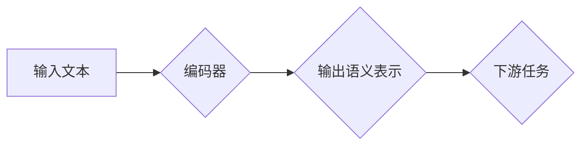

> Transformer, BERT, 预训练, 自然语言处理, 深度学习, 文本分类, 问答系统

## 1. 背景介绍

自然语言处理 (NLP) 领域近年来取得了飞速发展，深度学习技术的应用推动了 NLP 领域的新突破。其中，Transformer 架构的出现彻底改变了 NLP 的发展方向，其强大的序列建模能力和并行计算效率为各种 NLP 任务带来了巨大的提升。BERT (Bidirectional Encoder Representations from Transformers) 模型正是基于 Transformer 架构，通过预训练的方式学习到丰富的语言表示，在许多 NLP 任务中取得了state-of-the-art 的性能。

BERT 模型的出现，标志着预训练语言模型的时代正式到来。预训练模型能够在海量文本数据上学习到通用的语言表示，为下游任务提供强大的基础，大大降低了任务的训练成本和时间。

## 2. 核心概念与联系

### 2.1 Transformer 架构

Transformer 架构是 BERT 模型的基础，它摒弃了传统的循环神经网络 (RNN) 的顺序处理方式，采用注意力机制 (Attention) 来捕捉序列中的长距离依赖关系。Transformer 的核心结构包括：

* **编码器 (Encoder):** 负责将输入序列编码成语义表示。编码器由多个 Transformer 块组成，每个 Transformer 块包含多头注意力机制和前馈神经网络。
* **解码器 (Decoder):** 负责根据编码器的输出生成目标序列。解码器也由多个 Transformer 块组成，每个 Transformer 块包含多头注意力机制、masked multi-head attention 和前馈神经网络。

### 2.2 BERT 模型

BERT 模型是一个基于 Transformer 架构的双向编码器模型。它通过在大量的文本数据上进行预训练，学习到丰富的语言表示。BERT 模型的预训练目标主要有两种：

* **Masked Language Modeling (MLM):** 随机掩盖输入序列中的某些词，然后预测被掩盖的词。
* **Next Sentence Prediction (NSP):** 判断两个句子是否连续。

预训练后的 BERT 模型可以用于各种下游 NLP 任务，例如文本分类、问答系统、机器翻译等。

### 2.3 Mermaid 流程图



## 3. 核心算法原理 & 具体操作步骤

### 3.1 算法原理概述

BERT 模型的核心算法原理是基于 Transformer 架构的双向编码器模型，通过预训练的方式学习到丰富的语言表示。

* **双向编码:** BERT 模型采用双向编码的方式，即在处理输入序列时，会同时考虑前后上下文信息，从而更好地理解词语的语义。
* **注意力机制:** BERT 模型中使用了多头注意力机制，可以捕捉序列中不同词语之间的长距离依赖关系。
* **预训练:** BERT 模型通过在海量文本数据上进行预训练，学习到通用的语言表示，为下游任务提供强大的基础。

### 3.2 算法步骤详解

1. **数据预处理:** 将文本数据进行清洗、分词、标记等预处理操作。
2. **模型构建:** 根据 BERT 模型的架构搭建模型，包括编码器、注意力机制、前馈神经网络等。
3. **预训练:** 使用预训练数据集进行模型训练，训练目标包括 Masked Language Modeling (MLM) 和 Next Sentence Prediction (NSP)。
4. **微调:** 将预训练好的模型用于下游任务，对模型进行微调，使其能够适应特定任务的需求。
5. **预测:** 使用微调后的模型对新的输入数据进行预测。

### 3.3 算法优缺点

**优点:**

* **强大的语言表示能力:** BERT 模型通过预训练的方式学习到丰富的语言表示，能够更好地理解文本语义。
* **高效的训练速度:** Transformer 架构的并行计算能力使得 BERT 模型的训练速度更快。
* **广泛的应用场景:** BERT 模型可以用于各种 NLP 任务，例如文本分类、问答系统、机器翻译等。

**缺点:**

* **参数量大:** BERT 模型的参数量较大，需要大量的计算资源进行训练和部署。
* **训练数据依赖:** BERT 模型的性能依赖于预训练数据集的质量和规模。

### 3.4 算法应用领域

BERT 模型在以下领域具有广泛的应用场景:

* **文本分类:** 识别文本的类别，例如情感分析、主题分类等。
* **问答系统:** 回答用户提出的问题，例如搜索引擎、聊天机器人等。
* **机器翻译:** 将文本从一种语言翻译成另一种语言。
* **文本摘要:** 生成文本的简短摘要。
* **自然语言推理:** 理解文本之间的逻辑关系。

## 4. 数学模型和公式 & 详细讲解 & 举例说明

### 4.1 数学模型构建

BERT 模型的数学模型构建主要基于 Transformer 架构，其核心组件包括多头注意力机制和前馈神经网络。

* **多头注意力机制:** 用于捕捉序列中不同词语之间的关系，其计算公式如下:

$$
Attention(Q, K, V) = softmax(\frac{QK^T}{\sqrt{d_k}})V
$$

其中，Q、K、V 分别代表查询矩阵、键矩阵和值矩阵，$d_k$ 代表键向量的维度。

* **前馈神经网络:** 用于对每个词的表示进行非线性变换，其结构通常为两层全连接神经网络。

### 4.2 公式推导过程

多头注意力机制的公式推导过程如下:

1. 将输入序列的词嵌入表示分别转换为查询矩阵 (Q)、键矩阵 (K) 和值矩阵 (V)。
2. 计算 Q 与 K 的点积，并进行归一化，得到注意力权重。
3. 将注意力权重与值矩阵相乘，得到注意力输出。
4. 将多个注意力头的输出进行拼接，得到最终的注意力输出。

### 4.3 案例分析与讲解

假设我们有一个句子 "The cat sat on the mat"，将其词嵌入表示分别为 Q、K 和 V。

通过计算 Q 与 K 的点积，并进行归一化，得到每个词对其他词的注意力权重。例如，"cat" 的注意力权重会较高，因为它与 "sat" 和 "on" 相关。

将注意力权重与 V 相乘，得到每个词的注意力输出，表示该词在句子中的语义贡献。

最终将多个注意力头的输出拼接，得到句子整体的语义表示。

## 5. 项目实践：代码实例和详细解释说明

### 5.1 开发环境搭建

* Python 3.6+
* TensorFlow 或 PyTorch
* CUDA 和 cuDNN (可选)

### 5.2 源代码详细实现

```python
# 导入必要的库
import tensorflow as tf

# 定义 BERT 模型的架构
class BERT(tf.keras.Model):
    def __init__(self, vocab_size, embedding_dim, num_heads, num_layers):
        super(BERT, self).__init__()
        self.embedding = tf.keras.layers.Embedding(vocab_size, embedding_dim)
        self.transformer_blocks = [
            TransformerBlock(embedding_dim, num_heads)
            for _ in range(num_layers)
        ]

    def call(self, inputs):
        # 词嵌入
        embeddings = self.embedding(inputs)
        # 编码器
        for transformer_block in self.transformer_blocks:
            embeddings = transformer_block(embeddings)
        return embeddings

# 定义 Transformer 块的架构
class TransformerBlock(tf.keras.layers.Layer):
    def __init__(self, embedding_dim, num_heads):
        super(TransformerBlock, self).__init__()
        self.multi_head_attention = MultiHeadAttention(embedding_dim, num_heads)
        self.feed_forward_network = FeedForwardNetwork(embedding_dim)

    def call(self, inputs):
        # 多头注意力
        attention_output = self.multi_head_attention(inputs, inputs, inputs)
        # 前馈神经网络
        feed_forward_output = self.feed_forward_network(attention_output)
        return feed_forward_output + attention_output

# 定义多头注意力机制
class MultiHeadAttention(tf.keras.layers.Layer):
    def __init__(self, embedding_dim, num_heads):
        super(MultiHeadAttention, self).__init__()
        self.num_heads = num_heads
        self.head_dim = embedding_dim // num_heads

    def call(self, query, key, value):
        # ... (计算注意力权重和输出)

# 定义前馈神经网络
class FeedForwardNetwork(tf.keras.layers.Layer):
    def __init__(self, embedding_dim):
        super(FeedForwardNetwork, self).__init__()
        self.dense1 = tf.keras.layers.Dense(embedding_dim * 4, activation='relu')
        self.dense2 = tf.keras.layers.Dense(embedding_dim)

    def call(self, inputs):
        # ... (计算前馈神经网络输出)

# 实例化 BERT 模型
bert = BERT(vocab_size=30000, embedding_dim=128, num_heads=8, num_layers=6)

# 训练模型
# ...

```

### 5.3 代码解读与分析

* **BERT 模型架构:** 代码中定义了 BERT 模型的架构，包括词嵌入层、Transformer 块和输出层。
* **Transformer 块:** Transformer 块包含多头注意力机制和前馈神经网络，用于捕捉序列中的长距离依赖关系。
* **多头注意力机制:** 多头注意力机制可以并行计算多个注意力头，从而更好地捕捉不同类型的语义关系。
* **前馈神经网络:** 前馈神经网络用于对每个词的表示进行非线性变换，增强模型的表达能力。
* **训练模型:** 代码中省略了模型训练部分，但可以根据实际需求进行修改。

### 5.4 运行结果展示

训练完成后，可以使用预训练好的 BERT 模型进行下游任务的微调。例如，可以使用 BERT 模型进行文本分类任务，将文本分类为不同的类别。

## 6. 实际应用场景

BERT 模型在各种实际应用场景中取得了显著的成果，例如:

* **搜索引擎:** BERT 可以用于理解用户搜索意图，提高搜索结果的准确率。
* **聊天机器人:** BERT 可以用于训练更智能的聊天机器人，使其能够更好地理解用户对话内容。
* **问答系统:** BERT 可以用于构建更准确的问答系统，能够更好地回答用户的提问。
* **文本摘要:** BERT 可以用于生成更准确的文本摘要，保留文本的关键信息。

### 6.4 未来应用展望

BERT 模型的未来应用前景十分广阔，例如:

* **多语言理解:** BERT 可以用于训练多语言模型，实现跨语言的文本理解和生成。
* **代码生成:** BERT 可以用于训练代码生成模型，帮助程序员自动生成代码。
* **医疗诊断:** BERT 可以用于分析医疗文本，辅助医生进行诊断。

## 7. 工具和资源推荐

### 7.1 学习资源推荐

* **BERT 官方论文:** https://arxiv.org/abs/1810.04805
* **Hugging Face Transformers 库:** https://huggingface.co/transformers/
* **TensorFlow 官方文档:** https://www.tensorflow.org/

### 7.2 开发工具推荐

* **TensorFlow:** https://www.tensorflow.org/
* **PyTorch:** https://pytorch.org/
* **Jupyter Notebook:** https://jupyter.org/

### 7.3 相关论文推荐

* **XLNet:** https://arxiv.org/abs/1906.08237
* **RoBERTa:** https://arxiv.org/abs/1907.11692
* **GPT-3:** https://openai.com/blog/gpt-3/

## 8. 总结：未来发展趋势与挑战

### 8.1 研究成果总结

BERT 模型的出现，标志着