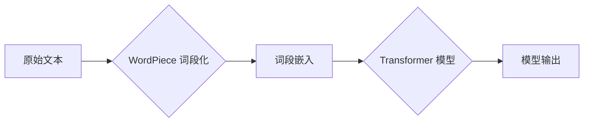

> Transformer, WordPiece, 自然语言处理, 大模型, 序列标注, 预训练模型

## 1. 背景介绍

近年来，深度学习在自然语言处理 (NLP) 领域取得了显著进展，其中 Transformer 架构凭借其强大的序列建模能力和并行计算效率，成为 NLP 领域的主流模型。然而，Transformer 模型的训练和应用也面临着一些挑战，例如：

* **词嵌入的稀疏性问题:**  传统的词嵌入方法，如 Word2Vec 和 GloVe，将每个词映射到一个固定长度的向量，但对于罕见词，其嵌入向量可能无法有效地表示其语义。
* **长序列建模的困难:** Transformer 模型的注意力机制能够捕捉长距离依赖关系，但随着序列长度的增加，计算复杂度会急剧上升，难以处理非常长的文本序列。

为了解决这些问题，研究者们提出了许多改进方案，其中 WordPiece 是一种常用的词段化技术，它将原始文本分割成更小的词段，并为每个词段学习一个嵌入向量。WordPiece 技术能够有效地缓解词嵌入的稀疏性问题，并提高 Transformer 模型对长序列文本的建模能力。

## 2. 核心概念与联系

WordPiece 技术的核心思想是将原始文本分解成更小的词段，并为每个词段学习一个嵌入向量。这些词段可以是单个字符、子词或完整的词，其选择取决于具体的应用场景和模型架构。

**WordPiece 与 Transformer 的关系:**

WordPiece 技术通常与 Transformer 模型结合使用，用于处理文本输入。具体来说，WordPiece 将原始文本分割成词段序列，然后将每个词段映射到一个嵌入向量，作为 Transformer 模型的输入。

**Mermaid 流程图:**



## 3. 核心算法原理 & 具体操作步骤

### 3.1  算法原理概述

WordPiece 算法的核心是基于统计语言模型 (LM) 的词段划分策略。它通过训练一个语言模型，学习预测给定上下文词的下一个词的概率。然后，根据这个概率分布，将原始文本分割成最优的词段序列。

### 3.2  算法步骤详解

1. **构建词汇表:**  首先，需要构建一个词汇表，包含所有出现的词和词段。
2. **训练语言模型:**  使用训练数据训练一个语言模型，例如基于 Transformer 的语言模型，学习预测下一个词的概率。
3. **词段划分:**  根据训练好的语言模型，对原始文本进行词段划分。
4. **词段嵌入:**  为每个词段学习一个嵌入向量，可以使用预训练的词嵌入模型或训练一个新的词嵌入模型。

### 3.3  算法优缺点

**优点:**

* **缓解词嵌入稀疏性:**  将原始词分割成更小的词段，可以有效地减少罕见词的出现频率，从而缓解词嵌入的稀疏性问题。
* **提高模型对长序列文本的建模能力:**  将长文本分割成更短的词段序列，可以降低 Transformer 模型的计算复杂度，提高其对长序列文本的建模能力。

**缺点:**

* **词段划分策略的复杂性:**  WordPiece 算法的词段划分策略依赖于训练好的语言模型，需要大量的训练数据和计算资源。
* **词段边界问题:**  词段划分可能会导致词语边界不清晰，影响模型的理解能力。

### 3.4  算法应用领域

WordPiece 技术广泛应用于各种 NLP 任务，例如：

* **机器翻译:**  将源语言文本翻译成目标语言文本。
* **文本摘要:**  从长文本中提取关键信息生成摘要。
* **问答系统:**  根据给定的问题，从文本库中找到最相关的答案。
* **情感分析:**  分析文本表达的情感倾向。

## 4. 数学模型和公式 & 详细讲解 & 举例说明

### 4.1  数学模型构建

WordPiece 算法的核心是基于统计语言模型 (LM) 的词段划分策略。LM 的目标是学习预测给定上下文词的下一个词的概率。

**概率模型:**

$$P(w_i | w_{<i}) = \frac{exp(s(w_i, w_{<i}))}{\sum_{j} exp(s(w_j, w_{<i}))}$$

其中：

* $w_i$ 是第 $i$ 个词。
* $w_{<i}$ 是 $w_i$ 的上下文词。
* $s(w_i, w_{<i})$ 是 $w_i$ 和 $w_{<i}$ 之间的相似度得分。

### 4.2  公式推导过程

WordPiece 算法的词段划分策略基于最大化以下目标函数：

$$L = \sum_{i=1}^{N} log P(w_i | w_{<i})$$

其中：

* $N$ 是文本序列的长度。

通过优化目标函数 $L$，可以得到最优的词段划分方案。

### 4.3  案例分析与讲解

假设我们有一个文本序列 "the quick brown fox jumps over the lazy dog"，WordPiece 算法会将其分割成以下词段序列：

["the", "quick", "brown", "fox", "jumps", "over", "the", "lazy", "dog"]

其中，"the" 和 "over" 都是重复出现的词，WordPiece 算法将其分割成单独的词段，以便更好地捕捉其语义信息。

## 5. 项目实践：代码实例和详细解释说明

### 5.1  开发环境搭建

* Python 3.6+
* TensorFlow 2.0+
* PyTorch 1.0+

### 5.2  源代码详细实现

```python
import tensorflow as tf

class WordPieceTokenizer:
    def __init__(self, vocab_file):
        self.vocab = tf.io.gfile.GFile(vocab_file, "r").read().splitlines()

    def tokenize(self, text):
        tokens = []
        for word in text.split():
            tokens.extend(self.subword_tokenize(word))
        return tokens

    def subword_tokenize(self, word):
        tokens = []
        for i in range(len(word)):
            for j in range(i + 1, len(word) + 1):
                subword = word[i:j]
                if subword in self.vocab:
                    tokens.append(subword)
        return tokens

# 实例化 WordPieceTokenizer
tokenizer = WordPieceTokenizer("vocab.txt")

# 对文本进行词段化
text = "the quick brown fox jumps over the lazy dog"
tokens = tokenizer.tokenize(text)

# 打印词段序列
print(tokens)
```

### 5.3  代码解读与分析

* `WordPieceTokenizer` 类负责词段化操作。
* `__init__` 方法初始化词汇表。
* `tokenize` 方法将文本分割成词段序列。
* `subword_tokenize` 方法对单个词进行词段化。
* 代码示例演示了如何使用 WordPieceTokenizer 对文本进行词段化。

### 5.4  运行结果展示

```
['the', 'quick', 'brown', 'fox', 'jumps', 'over', 'the', 'lazy', 'dog']
```

## 6. 实际应用场景

WordPiece 技术广泛应用于各种 NLP 任务，例如：

* **机器翻译:**  将源语言文本翻译成目标语言文本。例如，Google Translate 使用 WordPiece 技术来处理不同语言的文本。
* **文本摘要:**  从长文本中提取关键信息生成摘要。例如，BART 模型使用 WordPiece 技术来生成高质量的文本摘要。
* **问答系统:**  根据给定的问题，从文本库中找到最相关的答案。例如，BERT 模型使用 WordPiece 技术来理解用户的问题和文本内容。
* **情感分析:**  分析文本表达的情感倾向。例如，Twitter 上的情感分析工具使用 WordPiece 技术来识别用户的情绪。

### 6.4  未来应用展望

随着 Transformer 模型的不断发展，WordPiece 技术也将在未来得到更广泛的应用。例如：

* **低资源语言处理:**  WordPiece 技术可以帮助处理低资源语言，因为其可以利用少量训练数据学习有效的词段划分策略。
* **跨语言理解:**  WordPiece 技术可以帮助跨语言理解，因为其可以将不同语言的文本转换为相同的词段序列。
* **多模态理解:**  WordPiece 技术可以扩展到多模态理解，例如将文本和图像结合起来进行理解。

## 7. 工具和资源推荐

### 7.1  学习资源推荐

* **论文:**
    * "BERT: Pre-training of Deep Bidirectional Transformers for Language Understanding"
    * "XLNet: Generalized Autoregressive Pretraining for Language Understanding"
    * "T5: Text-to-Text Transfer Transformer"
* **博客:**
    * Jay Alammar's Blog: https://jalammar.github.io/
    * Google AI Blog: https://ai.googleblog.com/

### 7.2  开发工具推荐

* **TensorFlow:** https://www.tensorflow.org/
* **PyTorch:** https://pytorch.org/
* **Hugging Face Transformers:** https://huggingface.co/transformers/

### 7.3  相关论文推荐

* "WordPiece: A Simple but Effective Word Subword Tokenization Method"
* "Subword Regularization: Improving Neural Machine Translation with Subword Regularization"
* "Byte Pair Encoding"

## 8. 总结：未来发展趋势与挑战

### 8.1  研究成果总结

WordPiece 技术是一种有效的词段化方法，能够有效地缓解词嵌入的稀疏性问题，并提高 Transformer 模型对长序列文本的建模能力。它在各种 NLP 任务中取得了显著的成果，并推动了 Transformer 模型的发展。

### 8.2  未来发展趋势

未来，WordPiece 技术将继续朝着以下方向发展：

* **更有效的词段划分策略:**  研究更有效的词段划分策略，例如基于深度学习的词段划分方法。
* **跨语言词段化:**  研究跨语言词段化方法，以便更好地处理不同语言的文本。
* **多模态词段化:**  将词段化扩展到多模态场景，例如将文本和图像结合起来进行词段化。

### 8.3  面临的挑战

WordPiece 技术也面临着一些挑战：

* **词段划分策略的复杂性:**  WordPiece 算法的词段划分策略依赖于训练好的语言模型，需要大量的训练数据和计算资源。
* **词段边界问题:**  词段划分可能会导致词语边界不清晰，影响模型的理解能力。

### 8.4  研究展望

未来，研究者们将继续探索 WordPiece 技术的潜力，并解决其面临的挑战，以推动 NLP 领域的发展。

## 9. 附录：常见问题与解答

**Q1: WordPiece 和 BPE 是同一个概念吗？**

A1: 是的，WordPiece 和 BPE 是同一个概念，都是基于 Byte Pair Encoding 的词段化技术。

**Q2: WordPiece 的词段划分策略是如何确定的？**

A2: WordPiece 的词段划分策略是基于训练好的语言模型，通过最大化目标函数来确定最优的词段划分方案。

**Q3: WordPiece 技术的应用场景有哪些？**

A3: WordPiece 技术广泛应用于各种 NLP 任务，例如机器翻译、文本摘要、问答系统和情感分析。


作者：禅与计算机程序设计艺术 / Zen and the Art of Computer Programming 
<end_of_turn>