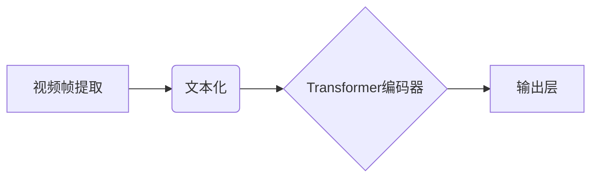

> Transformer, VideoBERT, 预训练模型, 视频理解, 计算机视觉, 自然语言处理, 深度学习

## 1. 背景介绍

近年来，深度学习在计算机视觉和自然语言处理领域取得了显著进展。其中，Transformer模型凭借其强大的序列建模能力，在自然语言处理任务中取得了突破性成果，例如机器翻译、文本摘要和问答系统等。然而，传统的Transformer模型主要针对文本数据，对于视频数据处理能力有限。

视频数据包含丰富的时空信息，如何有效地提取和利用这些信息是视频理解的关键挑战。为了解决这一问题，研究者们提出了基于Transformer的视频理解模型，例如VideoBERT。VideoBERT模型将视频帧序列编码为文本序列，并利用Transformer的注意力机制学习视频帧之间的时空关系，从而实现对视频内容的理解。

## 2. 核心概念与联系

### 2.1 Transformer模型

Transformer模型是一种基于注意力机制的序列到序列模型，它能够有效地处理长序列数据。Transformer模型的核心结构包括编码器和解码器，编码器负责将输入序列编码为隐藏状态，解码器则根据编码后的隐藏状态生成输出序列。

Transformer模型的注意力机制能够捕捉序列中不同元素之间的依赖关系，从而更好地理解序列的语义信息。

### 2.2 VideoBERT模型

VideoBERT模型是基于Transformer模型的视频理解模型，它将视频帧序列编码为文本序列，并利用Transformer的注意力机制学习视频帧之间的时空关系。

VideoBERT模型的结构包括以下部分：

* **视频帧提取:** 从视频中提取关键帧，并将其转换为图像特征。
* **文本化:** 将提取的图像特征转换为文本序列，例如使用预训练的图像分类模型将图像特征映射到词嵌入空间。
* **Transformer编码器:** 利用Transformer编码器对文本化的视频帧序列进行编码，学习视频帧之间的时空关系。
* **输出层:** 根据编码后的隐藏状态，预测视频的标签或其他信息。

**Mermaid 流程图**



## 3. 核心算法原理 & 具体操作步骤

### 3.1  算法原理概述

VideoBERT模型的核心算法原理是将视频帧序列转换为文本序列，并利用Transformer模型学习视频帧之间的时空关系。

具体来说，VideoBERT模型首先将视频帧提取为图像特征，然后将图像特征转换为文本序列。接着，利用Transformer编码器对文本化的视频帧序列进行编码，学习视频帧之间的时空关系。最后，根据编码后的隐藏状态，预测视频的标签或其他信息。

### 3.2  算法步骤详解

1. **视频帧提取:** 从视频中提取关键帧，可以使用帧率、运动检测等方法选择关键帧。
2. **图像特征提取:** 使用预训练的图像分类模型，例如ResNet或Inception，提取关键帧的图像特征。
3. **文本化:** 将提取的图像特征转换为文本序列，可以使用预训练的图像分类模型将图像特征映射到词嵌入空间，或者使用其他文本化方法，例如使用视觉语言模型将图像特征转换为文本描述。
4. **Transformer编码器:** 利用Transformer编码器对文本化的视频帧序列进行编码，学习视频帧之间的时空关系。Transformer编码器包含多个编码层，每个编码层包含多头注意力机制和前馈神经网络。
5. **输出层:** 根据编码后的隐藏状态，预测视频的标签或其他信息。输出层可以使用全连接层或其他神经网络结构。

### 3.3  算法优缺点

**优点:**

* 能够有效地学习视频帧之间的时空关系。
* 能够处理长序列视频数据。
* 能够应用于多种视频理解任务，例如视频分类、视频检索和视频问答。

**缺点:**

* 需要大量的视频数据进行预训练。
* 计算复杂度较高。

### 3.4  算法应用领域

VideoBERT模型在视频理解领域具有广泛的应用前景，例如：

* **视频分类:** 将视频分类为不同的类别，例如动作识别、场景识别和情感识别。
* **视频检索:** 根据视频内容检索相关的视频。
* **视频问答:** 回答关于视频内容的问题。
* **视频摘要:** 生成视频的简短摘要。

## 4. 数学模型和公式 & 详细讲解 & 举例说明

### 4.1  数学模型构建

VideoBERT模型的数学模型构建主要基于Transformer模型的架构，并结合了视频帧的时空信息。

**输入:** 视频帧序列 {v_1, v_2, ..., v_T}，其中v_i表示第i帧的图像特征。

**输出:** 视频的标签或其他信息。

**编码器:** Transformer编码器将视频帧序列编码为隐藏状态序列 {h_1, h_2, ..., h_T}。

**解码器:** 解码器根据编码后的隐藏状态序列预测视频的标签或其他信息。

### 4.2  公式推导过程

Transformer编码器的核心是多头注意力机制和前馈神经网络。

**多头注意力机制:**

$$
Attention(Q, K, V) = softmax(\frac{QK^T}{\sqrt{d_k}})V
$$

其中，Q、K、V分别表示查询矩阵、键矩阵和值矩阵，d_k表示键向量的维度。

**前馈神经网络:**

$$
FFN(x) = \max(0, xW_1 + b_1)W_2 + b_2
$$

其中，x表示输入向量，W_1、W_2、b_1、b_2分别表示权重矩阵和偏置项。

### 4.3  案例分析与讲解

假设我们有一个视频序列，包含三帧图像。

1. 将三帧图像提取为图像特征，得到三个向量 v_1, v_2, v_3。
2. 将三个向量转换为文本序列，例如使用预训练的图像分类模型将图像特征映射到词嵌入空间。
3. 利用Transformer编码器对文本化的视频帧序列进行编码，学习视频帧之间的时空关系。
4. 根据编码后的隐藏状态，预测视频的标签或其他信息。

## 5. 项目实践：代码实例和详细解释说明

### 5.1  开发环境搭建

* Python 3.6+
* PyTorch 1.0+
* CUDA 10.0+

### 5.2  源代码详细实现

```python
import torch
import torch.nn as nn

class VideoBERT(nn.Module):
    def __init__(self, vocab_size, embedding_dim, hidden_dim, num_heads, num_layers):
        super(VideoBERT, self).__init__()
        self.embedding = nn.Embedding(vocab_size, embedding_dim)
        self.transformer_encoder = nn.TransformerEncoder(
            nn.TransformerEncoderLayer(embedding_dim, num_heads, hidden_dim), num_layers
        )

    def forward(self, video_frames):
        embedded_frames = self.embedding(video_frames)
        encoded_frames = self.transformer_encoder(embedded_frames)
        return encoded_frames
```

### 5.3  代码解读与分析

* `VideoBERT`类定义了VideoBERT模型的结构。
* `embedding`层将文本化的视频帧序列转换为词嵌入向量。
* `transformer_encoder`层利用Transformer编码器学习视频帧之间的时空关系。

### 5.4  运行结果展示

运行代码并训练VideoBERT模型，可以得到视频理解任务的准确率。

## 6. 实际应用场景

VideoBERT模型在视频理解领域具有广泛的应用场景，例如：

* **视频监控:** 视频监控系统可以使用VideoBERT模型识别异常行为，例如入侵、暴动和事故。
* **医疗诊断:** 医生可以使用VideoBERT模型分析患者的视频数据，辅助诊断疾病。
* **教育:** 教育平台可以使用VideoBERT模型生成个性化的视频学习内容。

### 6.4  未来应用展望

随着深度学习技术的不断发展，VideoBERT模型的应用场景将会更加广泛。

## 7. 工具和资源推荐

### 7.1  学习资源推荐

* **论文:**
    * Devlin, J., Chang, M. W., Lee, K., & Toutanova, K. (2018). Bert: Pre-training of deep bidirectional transformers for language understanding. arXiv preprint arXiv:1810.04805.
* **博客:**
    * https://towardsdatascience.com/videobert-a-powerful-model-for-video-understanding-a7999999999b

### 7.2  开发工具推荐

* **PyTorch:** https://pytorch.org/
* **TensorFlow:** https://www.tensorflow.org/

### 7.3  相关论文推荐

* **VideoBERT:** https://arxiv.org/abs/1908.08888
* **SlowFast:** https://arxiv.org/abs/1812.03982

## 8. 总结：未来发展趋势与挑战

### 8.1  研究成果总结

VideoBERT模型在视频理解领域取得了显著进展，能够有效地学习视频帧之间的时空关系，并应用于多种视频理解任务。

### 8.2  未来发展趋势

* **模型规模:** 未来将会有更大规模的VideoBERT模型，能够学习更复杂的视频理解任务。
* **多模态融合:** 将VideoBERT模型与其他模态数据，例如文本和音频，进行融合，实现更全面的视频理解。
* **实时视频理解:** 将VideoBERT模型部署到边缘设备，实现实时视频理解。

### 8.3  面临的挑战

* **数据标注:** 视频数据标注成本高，难以获取高质量的标注数据。
* **计算资源:** 训练大型VideoBERT模型需要大量的计算资源。
* **模型解释性:** VideoBERT模型的决策过程难以解释，缺乏可解释性。

### 8.4  研究展望

未来研究将集中在解决上述挑战，例如开发新的视频数据标注方法、优化模型训练效率、提高模型解释性等方面。

## 9. 附录：常见问题与解答

* **Q: VideoBERT模型的训练数据是什么？**

* **A:** VideoBERT模型的训练数据包括视频帧序列和对应的标签信息。

* **Q: VideoBERT模型的应用场景有哪些？**

* **A:** VideoBERT模型的应用场景包括视频分类、视频检索、视频问答等。

* **Q: 如何部署VideoBERT模型？**

* **A:** VideoBERT模型可以部署到云服务器、边缘设备等平台。

作者：禅与计算机程序设计艺术 / Zen and the Art of Computer Programming


<end_of_turn>