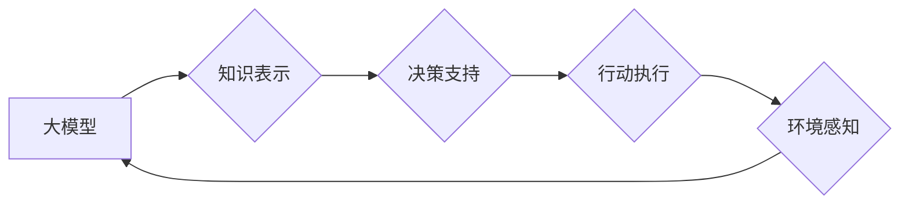

> 大模型、AI Agent、应用开发、商业模式、变革、智能化、自动化

## 1. 背景介绍

近年来，人工智能（AI）技术取得了飞速发展，特别是大模型的涌现，为AI应用带来了前所未有的机遇。大模型，是指参数规模庞大、训练数据海量的人工智能模型，具备强大的泛化能力和学习能力，能够在自然语言处理、计算机视觉、语音识别等多个领域取得突破性进展。

然而，大模型的应用开发并非易事。传统的AI应用开发模式往往需要针对特定任务进行模型训练和部署，效率低下，难以满足快速迭代和个性化需求。

为了解决这一问题，AI Agent的概念应运而生。AI Agent是一种能够自主学习、感知环境、做出决策并与环境交互的智能体。它可以将大模型的强大能力与实际应用场景相结合，实现更智能、更自动化、更灵活的应用开发。

## 2. 核心概念与联系

**2.1 AI Agent 简介**

AI Agent是一种软件程序，它能够感知环境、设定目标、选择行动并执行这些行动以实现目标。AI Agent通常具有以下特征：

* **自主性:** AI Agent能够独立地做出决策，无需人工干预。
* **感知能力:** AI Agent能够感知环境信息，例如文本、图像、声音等。
* **推理能力:** AI Agent能够对感知到的信息进行推理，做出合理的判断。
* **行动能力:** AI Agent能够执行行动，例如控制机器人、发送邮件、访问网站等。

**2.2 大模型与AI Agent的结合**

大模型为AI Agent提供了强大的能力支持。大模型可以提供以下功能：

* **自然语言理解:** 大模型可以理解和处理自然语言文本，例如对话、文本摘要、机器翻译等。
* **知识表示:** 大模型可以构建知识图谱，表示和推理知识。
* **决策支持:** 大模型可以根据输入信息进行决策分析，提供决策建议。

**2.3 AI Agent应用场景**

AI Agent的应用场景非常广泛，例如：

* **客服机器人:** AI Agent可以自动回答客户问题，提供24小时在线服务。
* **智能助理:** AI Agent可以帮助用户完成日常任务，例如日程安排、邮件发送、信息查询等。
* **个性化推荐:** AI Agent可以根据用户的喜好和行为推荐商品、服务或内容。
* **自动驾驶:** AI Agent可以感知道路环境，做出驾驶决策。

**2.4 Mermaid 流程图**



## 3. 核心算法原理 & 具体操作步骤

### 3.1  算法原理概述

AI Agent的开发通常涉及以下核心算法：

* **强化学习:** 强化学习是一种机器学习算法，通过奖励和惩罚机制训练AI Agent，使其在特定环境中学习最优策略。
* **自然语言处理:** 自然语言处理算法用于理解和处理自然语言文本，例如文本分类、情感分析、机器翻译等。
* **计算机视觉:** 计算机视觉算法用于理解和处理图像和视频信息，例如物体识别、场景理解、图像分割等。

### 3.2  算法步骤详解

**3.2.1 强化学习算法步骤:**

1. **环境建模:** 建立AI Agent所处的环境模型，包括状态空间、动作空间和奖励函数。
2. **策略学习:** 使用强化学习算法，例如Q学习或深度强化学习，训练AI Agent学习最优策略。
3. **策略评估:** 对训练好的策略进行评估，例如通过模拟环境进行测试。
4. **策略更新:** 根据策略评估结果，对策略进行更新和改进。

**3.2.2 自然语言处理算法步骤:**

1. **文本预处理:** 对文本进行清洗、分词、词性标注等预处理操作。
2. **特征提取:** 从预处理后的文本中提取特征，例如词向量、语法结构等。
3. **模型训练:** 使用自然语言处理模型，例如BERT或GPT，对特征进行训练。
4. **文本理解:** 将训练好的模型应用于文本理解任务，例如文本分类、情感分析等。

### 3.3  算法优缺点

**3.3.1 强化学习算法:**

* **优点:** 可以学习复杂决策策略，适应动态环境。
* **缺点:** 训练过程复杂，需要大量数据和计算资源。

**3.3.2 自然语言处理算法:**

* **优点:** 可以理解和处理自然语言文本，应用广泛。
* **缺点:** 对文本数据质量要求高，容易受到噪声和歧义的影响。

### 3.4  算法应用领域

* **强化学习算法:** 自动驾驶、机器人控制、游戏AI等。
* **自然语言处理算法:** 语音助手、机器翻译、聊天机器人等。

## 4. 数学模型和公式 & 详细讲解 & 举例说明

### 4.1  数学模型构建

**4.1.1 强化学习模型:**

强化学习模型通常采用马尔可夫决策过程（MDP）来描述环境和智能体的交互。MDP包含以下要素：

* **状态空间 (S):** 环境可能处于的各种状态。
* **动作空间 (A):** 智能体可以执行的各种动作。
* **转移概率 (P):** 从一个状态执行一个动作后转移到另一个状态的概率。
* **奖励函数 (R):** 智能体在某个状态执行某个动作后获得的奖励。

**4.1.2 自然语言处理模型:**

自然语言处理模型通常采用神经网络架构，例如循环神经网络（RNN）或Transformer。这些模型通过学习文本数据中的语义和语法关系来理解和处理文本信息。

### 4.2  公式推导过程

**4.2.1 强化学习算法公式:**

* **Bellman方程:**

$$
V(s) = \max_a \left[ R(s,a) + \gamma \sum_{s'} P(s'|s,a) V(s') \right]
$$

其中：

* $V(s)$ 是状态 $s$ 的价值函数。
* $R(s,a)$ 是在状态 $s$ 执行动作 $a$ 后获得的奖励。
* $\gamma$ 是折扣因子，控制未来奖励的权重。
* $P(s'|s,a)$ 是从状态 $s$ 执行动作 $a$ 后转移到状态 $s'$ 的概率。

**4.2.2 自然语言处理模型公式:**

* **交叉熵损失函数:**

$$
L = -\sum_{i=1}^{N} y_i \log \hat{y}_i
$$

其中：

* $y_i$ 是真实标签。
* $\hat{y}_i$ 是模型预测的概率。

### 4.3  案例分析与讲解

**4.3.1 强化学习案例:**

AlphaGo 是 DeepMind 开发的围棋 AI，它利用强化学习算法击败了世界冠军围棋手。AlphaGo 通过与自己进行博弈，学习最优策略，最终取得了胜利。

**4.3.2 自然语言处理案例:**

BERT 是 Google 开发的预训练语言模型，它在多个自然语言处理任务上取得了优异的性能。BERT 通过在大量文本数据上进行预训练，学习了丰富的语义和语法知识，可以用于文本分类、问答系统、机器翻译等任务。

## 5. 项目实践：代码实例和详细解释说明

### 5.1  开发环境搭建

* **操作系统:** Linux 或 macOS
* **编程语言:** Python
* **深度学习框架:** TensorFlow 或 PyTorch
* **其他工具:** Git、Jupyter Notebook

### 5.2  源代码详细实现

```python
# 强化学习示例代码

import gym
import numpy as np

# 创建环境
env = gym.make('CartPole-v1')

# 定义策略网络
class PolicyNetwork(nn.Module):
    def __init__(self):
        super(PolicyNetwork, self).__init__()
        # ...

    def forward(self, state):
        # ...

# 创建策略网络实例
policy_network = PolicyNetwork()

# 定义训练循环
for episode in range(num_episodes):
    state = env.reset()
    done = False
    while not done:
        # 获取策略网络的输出
        action_probs = policy_network(state)
        # 根据策略网络的输出选择动作
        action = np.random.choice(env.action_space.n, p=action_probs)
        # 执行动作
        next_state, reward, done, _ = env.step(action)
        # 更新策略网络
        # ...
        state = next_state

# 保存训练好的策略网络
torch.save(policy_network.state_dict(), 'policy_network.pth')
```

### 5.3  代码解读与分析

* **环境创建:** 使用OpenAI Gym库创建CartPole-v1环境，这是一个经典的强化学习环境。
* **策略网络定义:** 定义一个简单的策略网络，它接受环境状态作为输入，输出动作概率分布。
* **训练循环:** 训练循环中，智能体与环境交互，根据策略网络的输出选择动作，并根据奖励更新策略网络。
* **代码保存:** 保存训练好的策略网络，以便后续使用。

### 5.4  运行结果展示

训练完成后，可以将训练好的策略网络应用于环境中，观察智能体的行为。

## 6. 实际应用场景

### 6.1  客服机器人

AI Agent可以作为客服机器人，自动回答客户常见问题，提供24小时在线服务，提高客户满意度。

### 6.2  智能助理

AI Agent可以作为智能助理，帮助用户完成日常任务，例如日程安排、邮件发送、信息查询等，提高工作效率。

### 6.3  个性化推荐

AI Agent可以根据用户的喜好和行为推荐商品、服务或内容，提供个性化体验。

### 6.4  未来应用展望

AI Agent的应用场景还在不断扩展，未来将应用于更多领域，例如：

* **医疗保健:** AI Agent可以辅助医生诊断疾病、制定治疗方案。
* **教育:** AI Agent可以作为个性化学习助手，帮助学生学习和进步。
* **金融:** AI Agent可以辅助金融分析师进行风险评估、投资决策。

## 7. 工具和资源推荐

### 7.1  学习资源推荐

* **书籍:**
    * 《Reinforcement Learning: An Introduction》
    * 《Deep Learning》
* **在线课程:**
    * Coursera: Reinforcement Learning Specialization
    * Udacity: Deep Learning Nanodegree

### 7.2  开发工具推荐

* **深度学习框架:** TensorFlow, PyTorch
* **强化学习库:** OpenAI Gym, Stable Baselines3
* **自然语言处理库:** NLTK, SpaCy

### 7.3  相关论文推荐

* **AlphaGo:** Mastering the game of Go with deep neural networks and tree search
* **BERT:** BERT: Pre-training of Deep Bidirectional Transformers for Language Understanding

## 8. 总结：未来发展趋势与挑战

### 8.1  研究成果总结

近年来，AI Agent领域取得了显著进展，例如AlphaGo、BERT等模型的成功应用证明了AI Agent的强大能力。

### 8.2  未来发展趋势

* **更强大的模型:** 随着计算资源的增加，未来将出现更强大的AI Agent模型，能够解决更复杂的任务。
* **更广泛的应用场景:** AI Agent将应用于更多领域，例如医疗保健、教育、金融等。
* **更智能的交互:** AI Agent将能够与人类进行更自然、更智能的交互。

### 8.3  面临的挑战

* **数据获取和标注:** AI Agent的训练需要大量数据，获取和标注这些数据是一个挑战。
* **模型解释性和可信度:** AI Agent的决策过程往往难以解释，如何