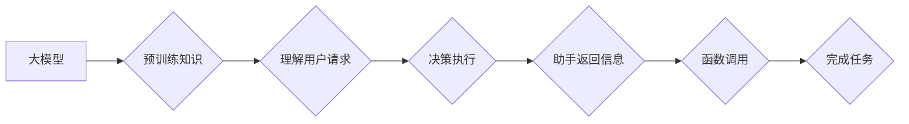

> 大模型、AI Agent、函数调用、助手、应用开发、代码实例

## 1. 背景介绍

近年来，大模型技术取得了飞速发展，其强大的语言理解和生成能力为人工智能应用的开发带来了新的机遇。AI Agent作为一种智能化的软件实体，能够自主地感知环境、制定决策并执行行动，在各个领域展现出巨大的应用潜力。

然而，传统的AI Agent开发方式往往需要复杂的规则定义和手工编码，难以应对复杂多变的现实世界。而大模型的出现为AI Agent的开发提供了新的思路，通过利用大模型的预训练知识和强大的泛化能力，可以构建更加智能、灵活和高效的AI Agent。

## 2. 核心概念与联系

### 2.1 大模型

大模型是指参数量巨大、训练数据海量的人工智能模型，通常拥有数十亿甚至数千亿个参数。通过对海量数据的训练，大模型能够学习到丰富的语言知识和模式，从而实现强大的文本理解、生成、翻译、问答等能力。

### 2.2 AI Agent

AI Agent是一种能够感知环境、做出决策并执行行动的智能软件实体。它通常由以下几个核心组件组成：

* **感知模块:** 用于获取环境信息，例如文本、图像、音频等。
* **决策模块:** 用于根据环境信息和目标进行决策。
* **执行模块:** 用于执行决策并与环境交互。

### 2.3 函数调用

函数调用是编程语言中的一种重要机制，用于将代码块封装成可重复使用的单元。通过调用函数，可以简化代码结构、提高代码复用性，并使代码更加易于维护和扩展。

### 2.4 助手

助手是一种能够提供帮助和服务的AI Agent，它通常能够理解用户的自然语言请求，并根据请求提供相应的帮助。例如，智能语音助手可以帮助用户设置闹钟、发送邮件、查询天气等。

**核心概念与联系的Mermaid流程图:**



## 3. 核心算法原理 & 具体操作步骤

### 3.1 算法原理概述

大模型应用开发中的AI Agent通常采用基于Transformer的深度学习模型，例如GPT-3、BERT等。这些模型通过学习大量的文本数据，能够捕捉语言的复杂语义关系，并实现强大的文本理解和生成能力。

在AI Agent中，大模型通常用于理解用户的请求、生成响应文本、执行决策等任务。通过将用户的请求作为输入，大模型可以生成相应的响应文本，并通过函数调用机制执行相应的操作。

### 3.2 算法步骤详解

1. **用户请求:** 用户向AI Agent提出一个请求，例如“帮我查询天气”。
2. **文本预处理:** 将用户的请求进行文本预处理，例如分词、词性标注等，以便大模型能够理解用户的意图。
3. **大模型理解:** 将预处理后的文本作为输入，输入到预训练的大模型中，大模型会根据其学习到的知识和模式，理解用户的意图，并生成相应的响应文本。
4. **函数调用:** 根据大模型生成的响应文本，调用相应的函数，执行相应的操作，例如查询天气信息。
5. **结果返回:** 函数执行完成后，将结果返回给用户，例如“今天的天气是晴朗”。

### 3.3 算法优缺点

**优点:**

* **强大的语言理解能力:** 大模型能够理解复杂的自然语言，并准确地识别用户的意图。
* **灵活的应用场景:** 可以应用于各种不同的AI Agent场景，例如聊天机器人、智能客服、语音助手等。
* **可扩展性强:** 可以通过微调大模型，使其适应不同的应用场景和领域。

**缺点:**

* **训练成本高:** 大模型的训练需要大量的计算资源和数据。
* **推理速度慢:** 大模型的推理速度相对较慢，尤其是在处理长文本时。
* **可解释性差:** 大模型的决策过程难以解释，难以理解模型是如何做出决定的。

### 3.4 算法应用领域

大模型应用开发中的AI Agent在各个领域都有着广泛的应用前景，例如：

* **客服服务:** 智能客服机器人能够自动回答用户的问题，提高客服效率。
* **教育领域:** AI Tutor可以根据学生的学习进度和能力，提供个性化的学习辅导。
* **医疗领域:** AI医生能够辅助医生诊断疾病，并提供个性化的治疗方案。
* **娱乐领域:** AI游戏角色能够与玩家进行互动，提供更加沉浸式的游戏体验。

## 4. 数学模型和公式 & 详细讲解 & 举例说明

### 4.1 数学模型构建

大模型的训练通常基于Transformer模型架构，其核心是自注意力机制。自注意力机制能够捕捉文本序列中不同词语之间的关系，并赋予每个词语不同的权重，从而更好地理解文本的语义。

**自注意力机制的数学公式:**

$$
Attention(Q, K, V) = softmax(\frac{QK^T}{\sqrt{d_k}})V
$$

其中：

* $Q$：查询矩阵
* $K$：键矩阵
* $V$：值矩阵
* $d_k$：键向量的维度
* $softmax$：softmax函数

### 4.2 公式推导过程

自注意力机制的公式推导过程可以参考Transformer论文中的详细描述。

### 4.3 案例分析与讲解

假设我们有一个句子“我爱学习编程”，其词语分别为“我”、“爱”、“学习”、“编程”。

通过自注意力机制，我们可以计算出每个词语与其他词语之间的关系，例如“我”与“学习”之间的关系比“我”与“编程”之间的关系更强。

最终，自注意力机制会生成一个权重矩阵，该矩阵表示每个词语与其他词语之间的关系强度。

## 5. 项目实践：代码实例和详细解释说明

### 5.1 开发环境搭建

* Python 3.7+
* TensorFlow/PyTorch
* 其他必要的库，例如NLTK、spaCy等

### 5.2 源代码详细实现

```python
# 导入必要的库
import tensorflow as tf

# 定义一个简单的Transformer模型
class SimpleTransformer(tf.keras.Model):
    def __init__(self, vocab_size, embedding_dim, num_heads, num_layers):
        super(SimpleTransformer, self).__init__()
        self.embedding = tf.keras.layers.Embedding(vocab_size, embedding_dim)
        self.transformer_layers = tf.keras.layers.StackedRNNCells([
            tf.keras.layers.MultiHeadAttention(num_heads=num_heads, key_dim=embedding_dim)
            for _ in range(num_layers)
        ])

    def call(self, inputs):
        # 将输入转换为嵌入向量
        embedded_inputs = self.embedding(inputs)
        # 通过Transformer层进行处理
        outputs = self.transformer_layers(embedded_inputs)
        return outputs

# 实例化模型
model = SimpleTransformer(vocab_size=10000, embedding_dim=128, num_heads=8, num_layers=6)

# 训练模型
# ...

# 使用模型进行预测
predictions = model.predict(inputs)
```

### 5.3 代码解读与分析

* **模型定义:** 代码定义了一个简单的Transformer模型，包含嵌入层、多头注意力层和循环神经网络层。
* **嵌入层:** 将输入的词语转换为嵌入向量，每个词语都对应一个向量表示。
* **多头注意力层:** 捕捉文本序列中不同词语之间的关系，并赋予每个词语不同的权重。
* **循环神经网络层:** 将多头注意力层的输出进行处理，并生成最终的输出。
* **模型训练:** 代码中省略了模型训练的部分，实际训练需要使用训练数据进行模型训练。
* **模型预测:** 使用训练好的模型进行预测，将输入的文本序列转换为相应的输出。

### 5.4 运行结果展示

运行结果展示需要根据具体的应用场景和训练数据进行分析。

## 6. 实际应用场景

### 6.1 智能客服

AI Agent可以作为智能客服机器人，自动回答用户的问题，例如查询产品信息、处理订单、提供售后服务等。

### 6.2 智能问答

AI Agent可以作为智能问答系统，根据用户的问题从知识库中获取答案，并以自然语言形式返回给用户。

### 6.3 个性化推荐

AI Agent可以根据用户的兴趣爱好和行为数据，提供个性化的商品、内容或服务推荐。

### 6.4 未来应用展望

随着大模型技术的不断发展，AI Agent的应用场景将会更加广泛，例如：

* **虚拟助手:** 更智能、更人性化的虚拟助手，能够帮助用户完成各种日常任务。
* **教育机器人:** 更具互动性和趣味性的教育机器人，能够帮助学生更好地学习和理解知识。
* **医疗诊断助手:** 更精准、更可靠的医疗诊断助手，能够帮助医生更快地诊断疾病。

## 7. 工具和资源推荐

### 7.1 学习资源推荐

* **论文:**
    * Attention Is All You Need (https://arxiv.org/abs/1706.03762)
    * BERT: Pre-training of Deep Bidirectional Transformers for Language Understanding (https://arxiv.org/abs/1810.04805)
* **书籍:**
    * Deep Learning (https://www.deeplearningbook.org/)
    * Natural Language Processing with Python (https://www.nltk.org/)

### 7.2 开发工具推荐

* **TensorFlow:** https://www.tensorflow.org/
* **PyTorch:** https://pytorch.org/
* **Hugging Face Transformers:** https://huggingface.co/transformers/

### 7.3 相关论文推荐

* **GPT-3:** https://openai.com/blog/gpt-3/
* **LaMDA:** https://ai.googleblog.com/2021/05/lamda-scaling-language-models-with.html

## 8. 总结：未来发展趋势与挑战

### 8.1 研究成果总结

大模型应用开发中的AI Agent取得了显著的进展，其强大的语言理解和生成能力为人工智能应用带来了新的机遇。

### 8.2 未来发展趋势

* **模型规模和能力的提升:** 未来大模型的规模和能力将会进一步提升，能够处理更加复杂的任务。
* **多模态AI Agent:** 未来AI Agent将能够处理多种模态的数据，例如文本、图像、音频等，从而提供更加丰富的交互体验。
* **可解释性增强:** 未来研究将更加注重大模型的可解释性，使其决策过程更加透明和可理解。

### 8.3 面临的挑战

* **训练成本高:** 大模型的训练需要大量的计算资源和数据，这对于资源有限的机构来说是一个挑战。
* **推理速度慢:** 大模型的推理速度相对较慢，这对于实时应用来说是一个限制。
* **数据安全和隐私问题:** 大模型的训练需要大量的用户数据，如何保证数据安全和隐私是一个重要的挑战。

### 8.4 研究展望

未来研究将继续探索大模型应用开发中的AI Agent，例如：

* 开发更加高效、更加可解释的大模型。
* 研究多模态AI Agent的开发方法。
* 探索大模型在不同领域的应用场景。

## 9. 附录：常见问题与解答

### 9.1 如何选择合适的AI Agent框架？

选择合适的AI Agent框架需要根据具体的应用场景和需求进行考虑。一些常用的AI Agent框架包括：

* **Rasa:** 用于构建对话式AI Agent的开源框架。
* **Dialogflow:** Google提供的云端对话平台。
* **Microsoft Bot Framework:** Microsoft提供的用于构建聊天机器人和虚拟助手的框架。

### 9.2 如何训练大模型？

