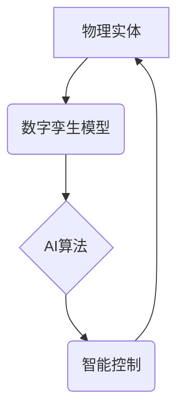

> AI、先进制造业、数字孪生、机器学习、深度学习、预测维护、智能制造

## 1. 背景介绍

先进制造业正处于数字化、智能化转型升级的关键时期。传统制造业面临着生产效率低下、产品质量难以保证、成本控制困难等挑战。而人工智能（AI）技术的快速发展为先进制造业带来了新的机遇，为解决上述问题提供了强大的技术支撑。

AI技术能够通过对海量数据进行分析和学习，实现对生产过程的智能化控制和优化，从而提升生产效率、降低生产成本、提高产品质量。

## 2. 核心概念与联系

**2.1 数字孪生**

数字孪生是基于物理实体构建的虚拟模型，它能够实时反映物理实体的状态、行为和运行情况。数字孪生技术将物理世界与数字世界相连接，为先进制造业提供了实时感知、模拟和优化生产过程的平台。

**2.2 AI在先进制造业中的应用**

AI技术在先进制造业中的应用涵盖多个领域，包括：

* **预测性维护：** 利用机器学习算法分析设备运行数据，预测设备故障，提前进行维护，降低设备停机时间和维修成本。
* **质量控制：** 利用计算机视觉和深度学习算法对产品进行实时检测，识别缺陷，提高产品质量。
* **生产优化：** 利用AI算法优化生产流程，提高生产效率和资源利用率。
* **智能机器人：** 利用AI算法控制机器人，实现自动化生产和协同工作。

**2.3 AI与数字孪生的结合**

数字孪生技术为AI技术的应用提供了强大的支撑。通过将AI算法嵌入到数字孪生模型中，可以实现对物理实体的智能化控制和优化。例如，在预测性维护领域，AI算法可以分析数字孪生模型中的设备运行数据，预测设备故障，并根据预测结果自动触发维护操作。



## 3. 核心算法原理 & 具体操作步骤

### 3.1 算法原理概述

本节将介绍预测性维护中常用的机器学习算法——支持向量机（SVM）。

SVM是一种监督学习算法，用于分类和回归问题。在预测性维护中，SVM可以根据设备运行数据，预测设备是否会发生故障。

SVM的基本原理是找到一个超平面，将不同类别的样本分开。超平面的选择需要满足以下条件：

* 最大化样本之间的间隔
* 尽可能少地将样本错分

### 3.2 算法步骤详解

1. **数据收集和预处理:** 收集设备运行数据，并进行清洗、转换和特征提取。
2. **模型训练:** 使用SVM算法对训练数据进行训练，得到模型参数。
3. **模型评估:** 使用测试数据对模型进行评估，计算模型的准确率、召回率等指标。
4. **模型部署:** 将训练好的模型部署到生产环境中，对实时运行数据进行预测。

### 3.3 算法优缺点

**优点:**

* 能够处理高维数据
* 对噪声数据鲁棒性强
* 泛化能力强

**缺点:**

* 训练时间较长
* 对参数选择敏感
* 难以解释模型决策

### 3.4 算法应用领域

SVM算法广泛应用于各个领域，例如：

* **图像识别**
* **文本分类**
* **金融预测**
* **医疗诊断**

## 4. 数学模型和公式 & 详细讲解 & 举例说明

### 4.1 数学模型构建

SVM的目标是找到一个超平面，将不同类别的样本分开，并最大化样本之间的间隔。

假设训练数据为：

$$
\{(x_1, y_1), (x_2, y_2), ..., (x_n, y_n)\}
$$

其中，$x_i$为样本特征向量，$y_i$为样本类别标签。

SVM的目标函数为：

$$
\min_{w, b} \frac{1}{2} ||w||^2 + C \sum_{i=1}^{n} \xi_i
$$

其中，$w$为超平面的权重向量，$b$为超平面的截距，$C$为惩罚参数，$\xi_i$为松弛变量。

### 4.2 公式推导过程

SVM的目标函数的推导过程较为复杂，涉及到拉格朗日乘子法和KKT条件等优化理论。

### 4.3 案例分析与讲解

假设我们有一个二分类问题，需要将数据点分为正类和负类。我们可以使用SVM算法训练一个模型，并根据模型的预测结果对新的数据点进行分类。

## 5. 项目实践：代码实例和详细解释说明

### 5.1 开发环境搭建

本项目使用Python语言进行开发，需要安装以下软件包：

* scikit-learn
* pandas
* matplotlib

### 5.2 源代码详细实现

```python
from sklearn import svm
from sklearn.model_selection import train_test_split
from sklearn.metrics import accuracy_score

# 数据加载和预处理
# ...

# 数据分割
X_train, X_test, y_train, y_test = train_test_split(X, y, test_size=0.2)

# 模型训练
model = svm.SVC()
model.fit(X_train, y_train)

# 模型预测
y_pred = model.predict(X_test)

# 模型评估
accuracy = accuracy_score(y_test, y_pred)
print(f"模型准确率: {accuracy}")
```

### 5.3 代码解读与分析

* `train_test_split()`函数将数据分为训练集和测试集。
* `SVC()`函数创建SVM模型。
* `fit()`函数对模型进行训练。
* `predict()`函数对测试数据进行预测。
* `accuracy_score()`函数计算模型的准确率。

### 5.4 运行结果展示

运行代码后，会输出模型的准确率。

## 6. 实际应用场景

### 6.1 预测性维护

在制造业中，设备故障会导致生产停机，造成经济损失。利用AI技术进行预测性维护，可以提前预测设备故障，并及时进行维护，从而降低设备停机时间和维修成本。

### 6.2 质量控制

产品质量是企业竞争力的关键因素。利用AI技术进行质量控制，可以对产品进行实时检测，识别缺陷，提高产品质量。

### 6.3 生产优化

生产过程中的资源利用率和效率是企业关注的重点。利用AI技术进行生产优化，可以分析生产数据，优化生产流程，提高生产效率和资源利用率。

### 6.4 未来应用展望

随着AI技术的不断发展，其在先进制造业中的应用场景将更加广泛。例如，未来可能出现：

* **智能工厂：** 全面采用AI技术，实现工厂的自动化、智能化和柔性化。
* **个性化定制：** 利用AI技术实现对产品的个性化定制，满足客户多样化的需求。
* **可持续制造：** 利用AI技术优化生产过程，降低资源消耗和环境污染。

## 7. 工具和资源推荐

### 7.1 学习资源推荐

* **书籍:**
    * 《深度学习》
    * 《机器学习实战》
* **在线课程:**
    * Coursera
    * edX
    * Udacity

### 7.2 开发工具推荐

* **Python:** 
    * scikit-learn
    * TensorFlow
    * PyTorch

* **云平台:**
    * AWS
    * Azure
    * Google Cloud

### 7.3 相关论文推荐

* **论文:**
    * 《工业互联网中的人工智能应用》
    * 《基于深度学习的预测性维护》

## 8. 总结：未来发展趋势与挑战

### 8.1 研究成果总结

AI技术在先进制造业的应用取得了显著成果，例如预测性维护、质量控制、生产优化等领域取得了突破。

### 8.2 未来发展趋势

未来，AI技术在先进制造业的应用将更加深入和广泛，例如智能工厂、个性化定制、可持续制造等领域将成为新的发展方向。

### 8.3 面临的挑战

AI技术在先进制造业的应用也面临着一些挑战，例如：

* 数据安全和隐私保护
* 模型解释性和可信度
* 人工智能人才短缺

### 8.4 研究展望

未来，需要加强对AI技术的研发和应用，解决AI技术在先进制造业应用中的挑战，推动AI技术在先进制造业的全面发展。

## 9. 附录：常见问题与解答

**常见问题:**

* **AI技术在先进制造业的应用有哪些？**
* **如何选择合适的AI算法？**
* **如何解决AI技术在先进制造业应用中的挑战？**

**解答:**

* **AI技术在先进制造业的应用包括预测性维护、质量控制、生产优化等。**
* **选择合适的AI算法需要根据具体应用场景和数据特点进行选择。**
* **解决AI技术在先进制造业应用中的挑战需要加强对AI技术的研发和应用，并制定相应的政策和标准。**


作者：禅与计算机程序设计艺术 / Zen and the Art of Computer Programming 
<end_of_turn>