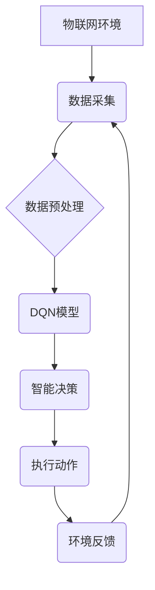

> Deep Q-Network (DQN), 物联网 (IoT), 智能决策, Reinforcement Learning (RL), 预测模型, 算法优化

## 1. 背景介绍

物联网 (IoT) 的快速发展为智能决策带来了前所未有的机遇。随着传感器、设备和网络的广泛部署，海量数据不断涌入，为基于数据驱动的智能决策提供了丰富的资源。然而，传统决策方法难以有效处理复杂、动态的 IoT 环境。深度强化学习 (Deep Reinforcement Learning, DRL) 作为一种新兴的机器学习范式，凭借其强大的学习能力和适应性，逐渐成为 IoT 智能决策的热门研究方向。

其中，深度 Q 网络 (Deep Q-Network, DQN) 作为 DRL 的经典算法，在解决复杂决策问题方面展现出显著优势。DQN 通过深度神经网络学习状态-动作价值函数，并利用 Q 学习算法进行策略优化，从而实现智能决策。

## 2. 核心概念与联系

**2.1 核心概念**

* **物联网 (IoT):** 指的是将各种物理设备、传感器、软件和网络连接在一起，形成一个互联互通的智能网络。
* **智能决策:** 指的是在复杂环境下，根据数据分析和模型预测，做出最优选择的过程。
* **深度强化学习 (DRL):** 一种机器学习范式，通过强化学习算法和深度神经网络，使智能体在环境中学习最优策略。
* **深度 Q 网络 (DQN):** 基于深度神经网络的强化学习算法，通过学习状态-动作价值函数，实现智能决策。

**2.2 架构关系**



**2.3 核心联系**

DQN 算法可以应用于 IoT 环境，通过学习状态-动作价值函数，实现智能决策。

* **数据采集:** 物联网设备收集环境数据。
* **数据预处理:** 对收集到的数据进行清洗、转换和特征提取。
* **DQN模型:** 利用深度神经网络学习状态-动作价值函数，并通过 Q 学习算法进行策略优化。
* **智能决策:** 根据学习到的价值函数，选择最优动作。
* **执行动作:** 将决策结果发送到 IoT 设备执行。
* **环境反馈:** 设备执行动作后，反馈环境状态给 DQN 模型。

## 3. 核心算法原理 & 具体操作步骤

### 3.1 算法原理概述

DQN 算法的核心思想是通过深度神经网络学习状态-动作价值函数，即在给定状态下执行特定动作的期望回报。

DQN 算法利用 Q 学习算法进行策略优化，通过不断更新价值函数，使智能体在环境中学习最优策略。

### 3.2 算法步骤详解

1. **初始化:** 初始化 DQN 模型参数，并设置学习率、折扣因子等超参数。
2. **环境交互:** 智能体与环境交互，获取当前状态和奖励。
3. **选择动作:** 根据当前状态和学习到的价值函数，选择最优动作。
4. **更新价值函数:** 根据环境反馈的奖励和下一个状态的价值函数，更新当前状态-动作的价值函数。
5. **重复步骤 2-4:** 重复以上步骤，直到智能体学习到最优策略。

### 3.3 算法优缺点

**优点:**

* **能够学习复杂决策策略:** DQN 算法可以学习复杂、非线性决策策略。
* **适应性强:** DQN 算法能够适应动态变化的环境。
* **数据效率高:** DQN 算法能够从有限的数据中学习。

**缺点:**

* **训练过程复杂:** DQN 算法的训练过程相对复杂，需要大量的计算资源。
* **容易陷入局部最优:** DQN 算法容易陷入局部最优，难以找到全局最优策略。

### 3.4 算法应用领域

DQN 算法在以下领域具有广泛的应用前景:

* **智能交通:** 智能交通信号灯控制、自动驾驶车辆决策
* **工业自动化:** 工厂设备优化控制、生产流程自动化
* **能源管理:** 智能电网调度、能源消耗优化
* **医疗保健:** 智能诊断、个性化治疗方案

## 4. 数学模型和公式 & 详细讲解 & 举例说明

### 4.1 数学模型构建

DQN 算法的核心是学习状态-动作价值函数 Q(s, a)，其中 s 表示状态，a 表示动作。

Q(s, a) 表示在状态 s 下执行动作 a 的期望回报。

### 4.2 公式推导过程

DQN 算法利用 Q 学习算法进行策略优化，其更新规则如下:

$$Q(s, a) \leftarrow Q(s, a) + \alpha [r + \gamma \max_{a'} Q(s', a') - Q(s, a)]$$

其中:

* $\alpha$ 为学习率
* $r$ 为当前状态的奖励
* $\gamma$ 为折扣因子
* $s'$ 为下一个状态
* $a'$ 为下一个状态下的最优动作

### 4.3 案例分析与讲解

假设一个智能体在玩游戏，状态 s 表示游戏画面，动作 a 表示智能体可以执行的操作，例如向上、向下、向左、向右。

当智能体执行动作 a 在状态 s 时，会获得奖励 r，并进入下一个状态 s'。

DQN 算法会根据上述信息更新状态-动作价值函数 Q(s, a)，使其逐渐逼近最优策略。

## 5. 项目实践：代码实例和详细解释说明

### 5.1 开发环境搭建

* Python 3.x
* TensorFlow 或 PyTorch 深度学习框架
* OpenAI Gym 或其他强化学习环境

### 5.2 源代码详细实现

```python
import tensorflow as tf
import numpy as np

# 定义 DQN 模型
class DQN(tf.keras.Model):
    def __init__(self, state_size, action_size):
        super(DQN, self).__init__()
        self.fc1 = tf.keras.layers.Dense(64, activation='relu')
        self.fc2 = tf.keras.layers.Dense(64, activation='relu')
        self.fc3 = tf.keras.layers.Dense(action_size)

    def call(self, state):
        x = self.fc1(state)
        x = self.fc2(x)
        return self.fc3(x)

# 定义训练函数
def train(model, state, action, reward, next_state, done):
    with tf.GradientTape() as tape:
        q_values = model(state)
        target_q_values = reward + gamma * tf.reduce_max(model(next_state), axis=1)
        loss = tf.keras.losses.mean_squared_error(target_q_values, q_values[tf.range(tf.shape(state)[0]), action])
    gradients = tape.gradient(loss, model.trainable_variables)
    optimizer.apply_gradients(zip(gradients, model.trainable_variables))

# ... 其他代码 ...
```

### 5.3 代码解读与分析

* DQN 模型使用深度神经网络结构，包含三个全连接层。
* 训练函数使用 Q 学习算法更新价值函数。
* 训练过程中，使用目标网络来稳定训练过程。

### 5.4 运行结果展示

训练完成后，可以将 DQN 模型应用于实际环境中，观察其决策效果。

## 6. 实际应用场景

### 6.1 智能家居

DQN 算法可以用于智能家居场景，例如:

* **智能灯光控制:** 根据用户行为和环境光线，自动调节灯光亮度和颜色。
* **智能空调控制:** 根据用户喜好和环境温度，自动调节空调温度和风速。
* **智能家电控制:** 根据用户需求和家电状态，自动控制家电开关和运行模式。

### 6.2 智能农业

DQN 算法可以用于智能农业场景，例如:

* **精准灌溉:** 根据土壤湿度和作物需求，自动调节灌溉量和时间。
* **精准施肥:** 根据土壤肥力和作物需求，自动调节施肥量和类型。
* **病虫害防治:** 根据作物生长情况和病虫害信息，自动进行病虫害防治。

### 6.3 智能制造

DQN 算法可以用于智能制造场景，例如:

* **设备故障预测:** 根据设备运行数据，预测设备故障风险，并及时进行维护。
* **生产流程优化:** 根据生产数据和目标，优化生产流程，提高生产效率。
* **质量控制:** 根据产品质量数据，自动进行质量控制，提高产品质量。

### 6.4 未来应用展望

随着物联网技术的不断发展，DQN 算法在 IoT 领域的应用前景更加广阔。未来，DQN 算法将被应用于更多智能化场景，例如:

* **智能城市:** 智能交通、智能能源、智能环境监测
* **智能医疗:** 智能诊断、智能治疗、智能康复
* **智能教育:** 个性化学习、智能辅导、智能评估

## 7. 工具和资源推荐

### 7.1 学习资源推荐

* **书籍:**
    * Reinforcement Learning: An Introduction by Richard S. Sutton and Andrew G. Barto
    * Deep Reinforcement Learning Hands-On by Maxim Lapan
* **在线课程:**
    * Deep Reinforcement Learning Specialization by DeepLearning.AI
    * Reinforcement Learning by David Silver (University of DeepMind)

### 7.2 开发工具推荐

* **TensorFlow:** https://www.tensorflow.org/
* **PyTorch:** https://pytorch.org/
* **OpenAI Gym:** https://gym.openai.com/

### 7.3 相关论文推荐

* Deep Q-Network (DQN) by Volodymyr Mnih et al. (2015)
* Dueling Network Architectures for Deep Reinforcement Learning by Hado van Hasselt et al. (2016)
* Double Q-Learning by  Hasselt et al. (2015)

## 8. 总结：未来发展趋势与挑战

### 8.1 研究成果总结

DQN 算法在智能决策领域取得了显著成果，为物联网智能化发展提供了重要的技术支撑。

### 8.2 未来发展趋势

* **模型效率提升:** 研究更轻量级、更高效的 DQN 模型，降低计算资源需求。
* **鲁棒性增强:** 研究更鲁棒的 DQN 算法，提高其对环境变化和噪声的适应能力。
* **多智能体协作:** 研究多智能体协作的 DQN 算法，实现更复杂的智能决策。

### 8.3 面临的挑战

* **数据获取和标注:** DQN 算法需要大量数据进行训练，数据获取和标注成本较高。
* **模型解释性:** DQN 算法的决策过程较为复杂，难以解释其决策依据。
* **安全性和可靠性:** DQN 算法在实际应用中需要保证安全性和可靠性，避免出现安全漏洞和系统故障。

### 8.4 研究展望

未来，DQN 算法将继续朝着更智能、更安全、更可靠的方向发展，为物联网智能化发展提供更强大的技术支撑。

## 9. 附录：常见问题与解答

**Q1: DQN 算法与其他强化学习算法相比有什么优势？**

**A1:** DQN 算法能够学习复杂、非线性决策策略，并能够从有限的数据中学习，具有较高的数据效率。

**Q2: DQN 算法的训练过程复杂吗？**

**A2:** DQN 算法的训练过程相对复杂，需要大量的计算资源和专业知识。

**Q3: DQN 算法在实际应用中有哪些挑战？**

**A3:** DQN 算法在实际应用中面临数据获取、模型解释性和安全