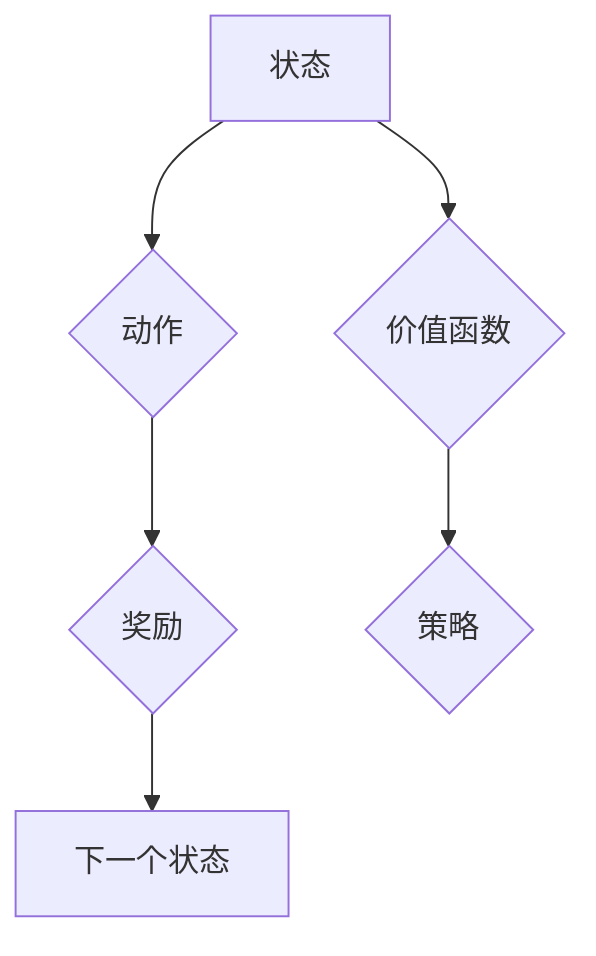

> Deep Q-Network (DQN), 动态规划, Bellman方程, 强化学习, 价值函数, 策略梯度

## 1. 背景介绍

在机器学习领域，强化学习 (Reinforcement Learning, RL) 作为一种学习智能体与环境交互并通过奖励信号优化行为的算法，近年来取得了显著进展。其中，Deep Q-Network (DQN) 作为一种深度学习结合强化学习的经典算法，在解决复杂决策问题方面展现出强大的能力。

DQN 的核心思想是学习一个 Q 函数，该函数能够估计在给定状态下采取特定动作的期望未来回报。然而，传统的 Q 学习算法在处理高维状态空间时会面临巨大的计算复杂度。DQN 通过引入深度神经网络来逼近 Q 函数，有效地解决了这一问题。

## 2. 核心概念与联系

DQN 的工作原理本质上与动态规划 (Dynamic Programming, DP) 紧密相关。动态规划是一种优化算法，通过将复杂问题分解成一系列子问题，并利用子问题的解来解决原问题。

**Mermaid 流程图:**



**核心概念:**

* **状态 (State):** 智能体所处的环境描述。
* **动作 (Action):** 智能体在当前状态下可以采取的行动。
* **奖励 (Reward):** 智能体在执行某个动作后获得的反馈信号。
* **价值函数 (Value Function):** 评估在给定状态下采取特定动作的期望未来回报。
* **策略 (Policy):** 根据当前状态选择动作的规则。

**联系:**

DQN 的 Q 函数本质上就是一种价值函数，它通过学习状态-动作对的价值来指导智能体的决策。而动态规划的核心思想是利用 Bellman 等式来更新价值函数，从而找到最优策略。

## 3. 核心算法原理 & 具体操作步骤

### 3.1  算法原理概述

DQN 算法的核心是利用深度神经网络来逼近 Q 函数，并通过经验回放 (Experience Replay) 和目标网络 (Target Network) 等技术来稳定训练过程。

**核心步骤:**

1. **初始化:** 初始化 Q 网络参数，并构建经验回放缓冲池。
2. **收集经验:** 智能体与环境交互，收集状态、动作、奖励和下一个状态的经验数据。
3. **更新经验回放缓冲池:** 将收集到的经验数据存储到经验回放缓冲池中。
4. **采样经验:** 从经验回放缓冲池中随机采样一批经验数据。
5. **计算 Q 值:** 使用 Q 网络计算采样数据对应的 Q 值。
6. **更新 Q 网络:** 使用梯度下降算法更新 Q 网络参数，目标是最小化 Q 值与实际奖励的误差。
7. **更新目标网络:** 定期更新目标网络的参数，使其与 Q 网络保持一致。

### 3.2  算法步骤详解

1. **初始化:**

* 初始化 Q 网络参数，通常使用随机初始化。
* 创建经验回放缓冲池，用于存储智能体与环境交互的经验数据。

2. **收集经验:**

* 智能体与环境交互，根据当前策略选择动作。
* 收集状态、动作、奖励和下一个状态的经验数据。

3. **更新经验回放缓冲池:**

* 将收集到的经验数据存储到经验回放缓冲池中。

4. **采样经验:**

* 从经验回放缓冲池中随机采样一批经验数据，每个数据包含一个状态、动作、奖励和下一个状态。

5. **计算 Q 值:**

* 使用 Q 网络计算采样数据对应的 Q 值。

6. **更新 Q 网络:**

* 使用梯度下降算法更新 Q 网络参数，目标是最小化 Q 值与实际奖励的误差。

7. **更新目标网络:**

* 定期更新目标网络的参数，使其与 Q 网络保持一致。

### 3.3  算法优缺点

**优点:**

* 可以处理高维状态空间。
* 训练稳定性较好。
* 能够学习复杂的策略。

**缺点:**

* 训练过程需要大量数据。
* 训练时间较长。
* 容易陷入局部最优解。

### 3.4  算法应用领域

DQN 算法在许多领域都有广泛的应用，例如:

* 游戏 AI
* 机器人控制
* 自动驾驶
* 医疗诊断

## 4. 数学模型和公式 & 详细讲解 & 举例说明

### 4.1  数学模型构建

DQN 算法的核心是学习一个 Q 函数，该函数能够估计在给定状态下采取特定动作的期望未来回报。

数学模型:

$$
Q(s, a) = E[R_{t+1} + \gamma \max_{a'} Q(s', a') | s_t = s, a_t = a]
$$

其中:

* $Q(s, a)$ 表示在状态 $s$ 下采取动作 $a$ 的价值。
* $R_{t+1}$ 表示从状态 $s$ 执行动作 $a$ 后获得的奖励。
* $\gamma$ 表示折扣因子，控制未来奖励的权重。
* $s'$ 表示执行动作 $a$ 后进入的下一个状态。
* $a'$ 表示在下一个状态 $s'$ 中可以采取的动作。

### 4.2  公式推导过程

Bellman 等式是动态规划的核心公式，它描述了价值函数的更新规则。

Bellman 等式:

$$
V(s) = \max_a [R(s, a) + \gamma V(s')]
$$

其中:

* $V(s)$ 表示状态 $s$ 的价值。
* $R(s, a)$ 表示在状态 $s$ 下采取动作 $a$ 后获得的奖励。
* $V(s')$ 表示执行动作 $a$ 后进入的下一个状态 $s'$ 的价值。

DQN 算法利用 Bellman 等式来更新 Q 函数，目标是找到最优策略。

### 4.3  案例分析与讲解

假设一个智能体在玩一个简单的游戏，游戏环境包含两个状态：

* 状态 1: 智能体在起点。
* 状态 2: 智能体到达终点。

智能体可以采取两种动作：

* 动作 1: 向右移动。
* 动作 2: 向左移动。

奖励函数如下:

* 如果智能体到达终点，奖励为 10。
* 否则，奖励为 0。

使用 Bellman 等式和 DQN 算法，我们可以学习到最优策略，即智能体应该始终向右移动，直到到达终点。

## 5. 项目实践：代码实例和详细解释说明

### 5.1  开发环境搭建

* Python 3.x
* TensorFlow 或 PyTorch
* OpenAI Gym

### 5.2  源代码详细实现

```python
import tensorflow as tf
import numpy as np

# 定义 Q 网络
class QNetwork(tf.keras.Model):
    def __init__(self, state_size, action_size):
        super(QNetwork, self).__init__()
        self.dense1 = tf.keras.layers.Dense(64, activation='relu')
        self.dense2 = tf.keras.layers.Dense(32, activation='relu')
        self.output = tf.keras.layers.Dense(action_size)

    def call(self, state):
        x = self.dense1(state)
        x = self.dense2(x)
        return self.output(x)

# 定义 DQN 算法
class DQNAgent:
    def __init__(self, state_size, action_size, learning_rate=0.001, gamma=0.99, epsilon=1.0, epsilon_decay=0.995, epsilon_min=0.01):
        self.state_size = state_size
        self.action_size = action_size
        self.learning_rate = learning_rate
        self.gamma = gamma
        self.epsilon = epsilon
        self.epsilon_decay = epsilon_decay
        self.epsilon_min = epsilon_min
        self.q_network = QNetwork(state_size, action_size)
        self.optimizer = tf.keras.optimizers.Adam(learning_rate=self.learning_rate)

    def choose_action(self, state):
        if np.random.rand() < self.epsilon:
            return np.random.randint(self.action_size)
        else:
            q_values = self.q_network(state)
            return np.argmax(q_values[0])

    def train(self, state, action, reward, next_state, done):
        with tf.GradientTape() as tape:
            q_values = self.q_network(state)
            target_q = reward + self.gamma * tf.reduce_max(self.q_network(next_state), axis=1) * (1 - done)
            loss = tf.keras.losses.mean_squared_error(target_q, q_values[0, action])
        gradients = tape.gradient(loss, self.q_network.trainable_variables)
        self.optimizer.apply_gradients(zip(gradients, self.q_network.trainable_variables))

        self.epsilon = max(self.epsilon * self.epsilon_decay, self.epsilon_min)

```

### 5.3  代码解读与分析

* **QNetwork:** 定义了 Q 网络的结构，使用两层全连接神经网络来逼近 Q 函数。
* **DQNAgent:** 定义了 DQN 算法的实现，包括初始化、选择动作、训练等方法。
* **choose_action:** 根据 epsilon-greedy 策略选择动作。
* **train:** 使用梯度下降算法更新 Q 网络参数，目标是最小化 Q 值与实际奖励的误差。

### 5.4  运行结果展示

运行代码后，智能体将在环境中学习并逐渐提高其表现。

## 6. 实际应用场景

DQN 算法在许多实际应用场景中取得了成功，例如:

* **游戏 AI:** DQN 算法被用于训练游戏 AI，例如 AlphaGo 和 AlphaZero。
* **机器人控制:** DQN 算法可以用于训练机器人控制策略，例如自主导航和抓取。
* **自动驾驶:** DQN 算法可以用于训练自动驾驶系统的决策策略。
* **医疗诊断:** DQN 算法可以用于辅助医生进行医疗诊断。

### 6.4  未来应用展望

DQN 算法在未来将有更广泛的应用，例如:

* **个性化推荐:** DQN 算法可以用于个性化推荐系统，例如推荐电影、音乐和商品。
* **金融交易:** DQN 算法可以用于金融交易策略，例如股票交易和期货交易。
* **自然语言处理:** DQN 算法可以用于自然语言处理任务，例如机器翻译和文本摘要。

## 7. 工具和资源推荐

### 7.1  学习资源推荐

* **书籍:**
    * Reinforcement Learning: An Introduction by Richard S. Sutton and Andrew G. Barto
    * Deep Reinforcement Learning Hands-On by Maxim Lapan
* **在线课程:**
    * Deep Reinforcement Learning Specialization by DeepLearning.AI
    * Reinforcement Learning by David Silver (University of DeepMind)

### 7.2  开发工具推荐

* **TensorFlow:** https://www.tensorflow.org/
* **PyTorch:** https://pytorch.org/
* **OpenAI Gym:** https://gym.openai.com/

### 7.3  相关论文推荐

* Deep Q-Network (DQN) by Volodymyr Mnih et al. (2015)
* Dueling Network Architectures for Deep Reinforcement Learning by Hado van Hasselt et al. (2016)
* Double Q-Learning by  