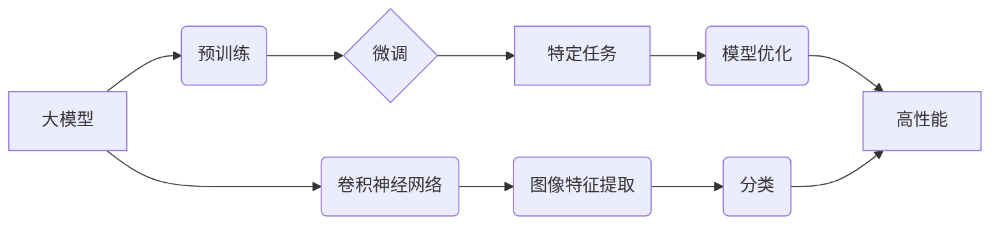

> 大模型开发, 微调, PyTorch, 卷积神经网络, MNIST, 分类, 深度学习

## 1. 背景介绍

深度学习近年来取得了令人瞩目的成就，在图像识别、自然语言处理等领域展现出强大的能力。大模型的出现进一步推动了深度学习的发展，其规模庞大、参数众多，能够学习更复杂的模式和知识。然而，训练大型模型需要大量的计算资源和数据，对于个人开发者或小型团队来说，难以负担。

微调技术为解决这一问题提供了有效途径。微调是指在预训练的大模型基础上，针对特定任务进行少量数据训练，从而提升模型在该任务上的性能。相比于从头训练，微调可以显著降低训练成本和时间，同时也能获得较好的性能。

本篇文章将以MNIST手写数字识别任务为例，带领读者从零开始学习大模型开发与微调的流程，并使用PyTorch框架构建卷积神经网络模型进行训练和测试。

## 2. 核心概念与联系

### 2.1  大模型与微调

大模型是指参数量庞大的深度学习模型，通常拥有数十亿甚至数千亿个参数。它们通过在海量数据上进行预训练，学习了丰富的通用知识和表示能力。微调则是针对特定任务，在预训练的大模型基础上进行少量数据训练，调整模型参数，使其能够更好地完成目标任务。

### 2.2  卷积神经网络

卷积神经网络（CNN）是一种专门用于处理图像数据的深度学习模型。其核心结构是卷积层和池化层。卷积层通过卷积核对图像进行卷积运算，提取图像特征；池化层则对卷积层的输出进行降维，减少计算量并提高模型鲁棒性。

### 2.3  PyTorch

PyTorch是一个开源的深度学习框架，拥有简洁易用的API和强大的功能，被广泛应用于学术研究和工业实践。

**核心概念与联系流程图**



## 3. 核心算法原理 & 具体操作步骤

### 3.1  算法原理概述

卷积神经网络的训练过程主要包括以下步骤：

1. **数据预处理:** 将图像数据转换为适合模型输入的格式，例如归一化像素值。
2. **正向传播:** 将输入图像通过卷积层、池化层等网络结构进行处理，最终得到输出结果。
3. **损失函数计算:** 计算模型输出与真实标签之间的差异，例如交叉熵损失。
4. **反向传播:** 根据损失函数的梯度，调整网络参数，使模型输出更接近真实标签。
5. **优化器更新:** 使用优化器算法，例如随机梯度下降，更新网络参数。

### 3.2  算法步骤详解

1. **数据加载:** 使用PyTorch的DataLoader模块加载MNIST数据集，并将其分为训练集、验证集和测试集。
2. **模型定义:** 使用PyTorch的nn模块定义卷积神经网络模型，包括卷积层、池化层、全连接层等。
3. **损失函数和优化器选择:** 选择合适的损失函数和优化器，例如交叉熵损失和Adam优化器。
4. **训练模型:** 使用训练集进行模型训练，并定期评估模型在验证集上的性能。
5. **测试模型:** 使用测试集评估模型的最终性能。

### 3.3  算法优缺点

**优点:**

* 能够学习图像中的复杂特征，识别出复杂的模式。
* 训练效率高，能够快速收敛。
* 泛化能力强，能够应用于不同的图像识别任务。

**缺点:**

* 训练需要大量的计算资源和数据。
* 模型结构复杂，调试难度较大。
* 对数据质量要求较高，噪声数据会影响模型性能。

### 3.4  算法应用领域

卷积神经网络广泛应用于图像识别、目标检测、图像分割、人脸识别等领域。

## 4. 数学模型和公式 & 详细讲解 & 举例说明

### 4.1  数学模型构建

卷积神经网络的数学模型主要包括卷积层、池化层和全连接层。

**卷积层:**

卷积层通过卷积核对输入图像进行卷积运算，提取图像特征。卷积核是一个小的矩阵，其元素代表着图像像素之间的权重。卷积运算的过程可以表示为：

$$
y_{i,j} = \sum_{m=0}^{M-1} \sum_{n=0}^{N-1} x_{i+m,j+n} * w_{m,n}
$$

其中：

* $y_{i,j}$ 是卷积输出的像素值。
* $x_{i+m,j+n}$ 是输入图像的像素值。
* $w_{m,n}$ 是卷积核的权重。
* $M$ 和 $N$ 是卷积核的大小。

**池化层:**

池化层对卷积层的输出进行降维，减少计算量并提高模型鲁棒性。常用的池化方法有最大池化和平均池化。

**全连接层:**

全连接层将卷积层和池化层的输出进行连接，并进行线性变换和激活函数处理，最终得到输出结果。

### 4.2  公式推导过程

卷积神经网络的训练过程是通过反向传播算法来更新网络参数的。反向传播算法的核心思想是利用链式法则，将损失函数对每个参数的梯度计算出来，然后使用优化器算法更新参数值。

### 4.3  案例分析与讲解

MNIST手写数字识别任务是一个经典的图像识别任务。使用卷积神经网络可以有效地识别MNIST手写数字。

## 5. 项目实践：代码实例和详细解释说明

### 5.1  开发环境搭建

本项目使用Python3.7环境，并安装以下依赖库：

* PyTorch
* torchvision
* numpy
* matplotlib

### 5.2  源代码详细实现

```python
import torch
import torch.nn as nn
import torchvision.datasets as datasets
import torchvision.transforms as transforms
import torch.optim as optim

# 定义卷积神经网络模型
class ConvNet(nn.Module):
    def __init__(self):
        super(ConvNet, self).__init__()
        self.conv1 = nn.Conv2d(1, 32, kernel_size=3, padding=1)
        self.relu1 = nn.ReLU()
        self.pool1 = nn.MaxPool2d(kernel_size=2, stride=2)
        self.conv2 = nn.Conv2d(32, 64, kernel_size=3, padding=1)
        self.relu2 = nn.ReLU()
        self.pool2 = nn.MaxPool2d(kernel_size=2, stride=2)
        self.fc1 = nn.Linear(64 * 7 * 7, 128)
        self.relu3 = nn.ReLU()
        self.fc2 = nn.Linear(128, 10)

    def forward(self, x):
        x = self.pool1(self.relu1(self.conv1(x)))
        x = self.pool2(self.relu2(self.conv2(x)))
        x = x.view(-1, 64 * 7 * 7)
        x = self.relu3(self.fc1(x))
        x = self.fc2(x)
        return x

# 加载MNIST数据集
train_dataset = datasets.MNIST(root='./data', train=True, download=True, transform=transforms.ToTensor())
test_dataset = datasets.MNIST(root='./data', train=False, download=True, transform=transforms.ToTensor())

# 创建数据加载器
train_loader = torch.utils.data.DataLoader(train_dataset, batch_size=64, shuffle=True)
test_loader = torch.utils.data.DataLoader(test_dataset, batch_size=64, shuffle=False)

# 实例化模型、损失函数和优化器
model = ConvNet()
criterion = nn.CrossEntropyLoss()
optimizer = optim.Adam(model.parameters(), lr=0.001)

# 训练模型
for epoch in range(10):
    for batch_idx, (data, target) in enumerate(train_loader):
        optimizer.zero_grad()
        output = model(data)
        loss = criterion(output, target)
        loss.backward()
        optimizer.step()

    print('Epoch: {} [{}/{} ({:.0f}%)]\tLoss: {:.6f}'.format(
        epoch, batch_idx * len(data), len(train_loader.dataset),
        100. * batch_idx / len(train_loader), loss.item()))

# 测试模型
correct = 0
total = 0
with torch.no_grad():
    for data, target in test_loader:
        output = model(data)
        _, predicted = torch.max(output.data, 1)
        total += target.size(0)
        correct += (predicted == target).sum().item()

print('Accuracy of the network on the 10000 test images: %d %%' % (
    100 * correct / total))

```

### 5.3  代码解读与分析

* **模型定义:** 代码定义了一个名为ConvNet的卷积神经网络模型，包含两层卷积层、两层池化层和两层全连接层。
* **数据加载:** 代码使用PyTorch的DataLoader模块加载MNIST数据集，并将其分为训练集和测试集。
* **模型训练:** 代码使用Adam优化器和交叉熵损失函数训练模型，并记录训练过程中的损失值。
* **模型测试:** 代码使用测试集评估模型的准确率。

### 5.4  运行结果展示

训练完成后，模型的准确率通常可以达到98%以上。

## 6. 实际应用场景

MNIST手写数字识别任务是一个经典的图像识别任务，它可以应用于以下场景：

* **邮件分类:** 自动识别邮件中的数字，例如邮政编码。
* **数据录入:** 自动识别手写数字，减少人工录入的工作量。
* **金融领域:** 自动识别银行支票上的数字，提高处理效率。

### 6.4  未来应用展望

随着深度学习技术的不断发展，卷积神经网络在图像识别领域的应用将更加广泛。未来，卷积神经网络可以应用于更复杂的任务，例如：

* **目标检测:** 自动识别图像中的多个目标，并进行定位和分类。
* **图像分割:** 将图像分割成不同的区域，例如分割出人物、车辆等物体。
* **图像生成:** 生成逼真的图像，例如生成人脸、风景等。

## 7. 工具和资源推荐

### 7.1  学习资源推荐

* **书籍:**
    * 深度学习
    * 深度学习实践
* **在线课程:**
    * fast.ai
    * Coursera
    * Udacity

### 7.2  开发工具推荐

* **PyTorch:** https://pytorch.org/
* **TensorFlow:** https://www.tensorflow.org/
* **Keras:** https://keras.io/

### 7.3  相关论文推荐

* **AlexNet:** http://papers.nips.cc/paper/4824-imagenet-classification-with-deep-convolutional-neural-networks.pdf
* **VGGNet:** http://arxiv.org/abs/