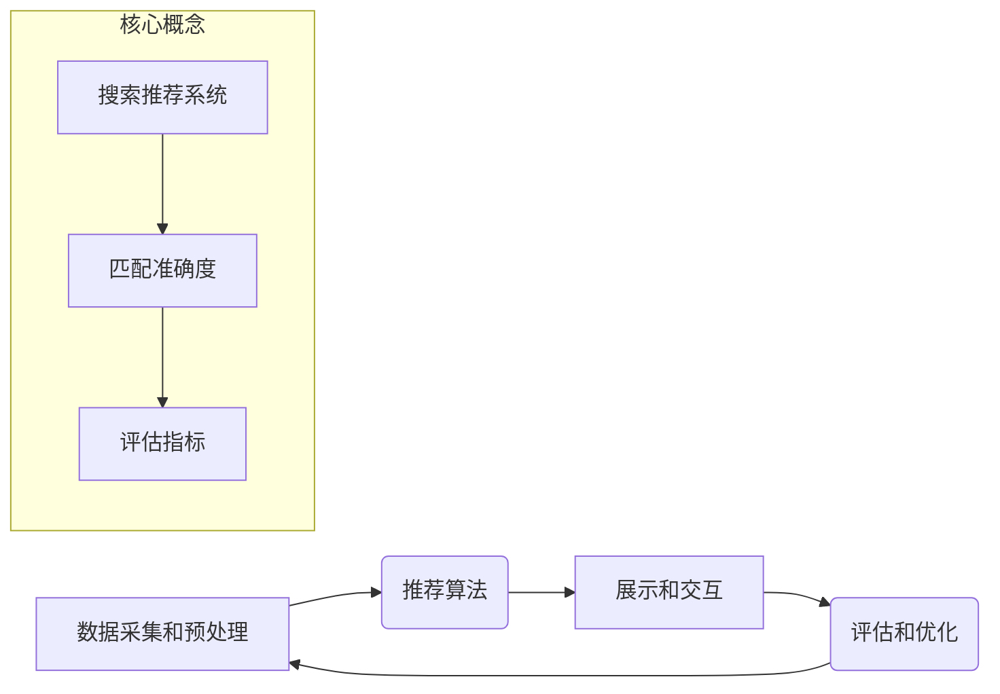

> 搜索推荐系统, 匹配准确度, 算法原理, 数学模型, 项目实践, 应用场景, 未来趋势

## 1. 背景介绍

在信息爆炸的时代，海量数据和信息涌现，用户获取所需信息的需求日益迫切。搜索推荐系统作为信息获取的重要桥梁，旨在根据用户的兴趣和需求，精准推荐相关信息，提升用户体验。匹配准确度作为搜索推荐系统的核心指标之一，直接影响着用户满意度和系统效果。

传统搜索推荐系统主要依赖于关键词匹配和基于内容的过滤算法，其匹配准确度受限于以下因素：

* **关键词匹配的局限性:** 关键词匹配过于简单粗暴，无法捕捉用户意图的复杂性和语义关联。
* **内容过滤的单一性:** 基于内容的过滤算法仅考虑信息本身的特征，忽略了用户偏好和上下文信息。
* **数据稀疏性和冷启动问题:** 新用户和新物品的数据稀疏性导致推荐结果缺乏准确性和个性化。

## 2. 核心概念与联系

**2.1 搜索推荐系统架构**

搜索推荐系统通常由以下几个核心模块组成：

* **数据采集和预处理:** 收集用户行为数据、物品信息等数据，并进行清洗、转换和特征提取。
* **推荐算法:** 根据用户兴趣和物品特征，预测用户对物品的偏好，并生成推荐列表。
* **展示和交互:** 将推荐结果以用户友好的方式展示，并提供交互机制，例如评分、收藏、评论等。
* **评估和优化:** 通过监控系统指标，例如点击率、转化率等，评估推荐效果，并对算法和系统进行优化。

**2.2 匹配准确度的定义**

匹配准确度是指推荐系统推荐结果与用户真实需求的匹配程度。常用的评估指标包括：

* **准确率:** 推荐结果中正确预测的用户偏好的比例。
* **召回率:** 推荐结果中包含所有用户真实偏好的比例。
* **F1-score:** 准确率和召回率的调和平均值，综合衡量推荐系统的性能。

**2.3 核心概念关系图**



## 3. 核心算法原理 & 具体操作步骤

**3.1 算法原理概述**

传统搜索推荐系统中常用的算法包括：

* **关键词匹配:** 根据用户输入的关键词，从数据库中检索出相关物品。
* **基于内容的过滤:** 根据物品的特征，例如类别、描述、标签等，推荐与用户兴趣相似的物品。
* **协同过滤:** 根据用户的历史行为数据，预测用户对其他物品的偏好。

**3.2 算法步骤详解**

**3.2.1 关键词匹配**

1. 用户输入关键词。
2. 将关键词转换为关键词向量。
3. 将物品信息转换为关键词向量。
4. 计算关键词向量之间的相似度。
5. 返回相似度最高的物品。

**3.2.2 基于内容的过滤**

1. 将物品信息转换为特征向量。
2. 将用户的兴趣偏好转换为特征向量。
3. 计算特征向量之间的相似度。
4. 返回相似度最高的物品。

**3.2.3 协同过滤**

1. 计算用户之间的相似度。
2. 计算物品之间的相似度。
3. 根据用户相似度和物品相似度，预测用户对其他物品的偏好。
4. 返回预测结果最高的物品。

**3.3 算法优缺点**

| 算法 | 优点 | 缺点 |
|---|---|---|
| 关键词匹配 | 简单易实现 | 无法捕捉语义关联 |
| 基于内容的过滤 | 能够考虑物品特征 | 容易陷入数据孤岛 |
| 协同过滤 | 能够发现隐性关联 | 容易受到数据稀疏性和冷启动问题的影响 |

**3.4 算法应用领域**

* **电商推荐:** 推荐商品、优惠券、促销活动等。
* **新闻推荐:** 推荐新闻文章、视频、音频等。
* **社交推荐:** 推荐好友、群组、活动等。
* **音乐推荐:** 推荐歌曲、专辑、艺术家等。

## 4. 数学模型和公式 & 详细讲解 & 举例说明

**4.1 数学模型构建**

**4.1.1 关键词匹配**

假设用户输入的关键词为 **q**，物品的关键词向量为 **d**，可以使用余弦相似度来衡量关键词匹配的程度：

$$
\text{相似度}(q, d) = \frac{q \cdot d}{||q|| ||d||}
$$

其中， **q** 和 **d** 分别表示用户输入的关键词向量和物品的关键词向量， **||q||** 和 **||d||** 分别表示 **q** 和 **d** 的长度。

**4.1.2 基于内容的过滤**

可以使用余弦相似度或皮尔逊相关系数来衡量物品特征向量和用户兴趣偏好向量的相似度。

**4.1.3 协同过滤**

可以使用矩阵分解技术来构建协同过滤模型，例如奇异值分解 (SVD)。

**4.2 公式推导过程**

**4.2.1 余弦相似度**

余弦相似度是衡量两个向量的夹角大小的指标，其值介于 -1 和 1 之间。夹角越小，相似度越高。

**4.2.2 皮尔逊相关系数**

皮尔逊相关系数是衡量两个变量之间的线性相关性的指标，其值介于 -1 和 1 之间。值越接近 1，表示正相关性越强；值越接近 -1，表示负相关性越强。

**4.3 案例分析与讲解**

**4.3.1 关键词匹配案例**

用户输入关键词 "智能手机"，系统会检索出所有包含 "智能手机" 关键词的物品，并根据关键词匹配的程度排序。

**4.3.2 基于内容的过滤案例**

用户喜欢阅读科技类书籍，系统会根据用户的阅读历史，推荐其他科技类书籍。

**4.3.3 协同过滤案例**

用户 A 和用户 B 都喜欢观看科幻电影，系统会根据用户的共同喜好，推荐其他科幻电影。

## 5. 项目实践：代码实例和详细解释说明

**5.1 开发环境搭建**

* 操作系统: Ubuntu 20.04
* Python 版本: 3.8
* 依赖库: numpy, pandas, scikit-learn

**5.2 源代码详细实现**

```python
# 基于内容的过滤推荐算法

import pandas as pd
from sklearn.metrics.pairwise import cosine_similarity

# 加载物品数据
data = pd.read_csv("items.csv")

# 提取物品特征
features = data[['category', 'description', 'tags']]

# 将特征转换为数值型
features = pd.get_dummies(features)

# 计算物品之间的余弦相似度
similarity_matrix = cosine_similarity(features)

# 获取用户ID
user_id = input("请输入用户ID: ")

# 获取用户偏好
user_preferences = data[data['user_id'] == user_id]['category'].values

# 计算用户与物品的相似度
user_similarity = cosine_similarity(features[user_preferences.astype(str)], features)

# 返回相似度最高的物品
top_n_items = similarity_matrix[user_preferences.astype(str)].argsort()[-5:][::-1]

# 打印推荐结果
print(f"推荐给用户 {user_id} 的物品:")
for item_id in top_n_items:
    print(data['item_name'][item_id])
```

**5.3 代码解读与分析**

* 代码首先加载物品数据，并提取物品特征。
* 然后，将特征转换为数值型，并计算物品之间的余弦相似度。
* 接着，获取用户ID和用户偏好，并计算用户与物品的相似度。
* 最后，返回相似度最高的物品，并打印推荐结果。

**5.4 运行结果展示**

运行代码后，系统会根据用户的偏好，推荐相关物品。

## 6. 实际应用场景

**6.1 电商推荐**

电商平台可以利用传统搜索推荐系统，根据用户的浏览历史、购买记录、收藏列表等数据，推荐相关商品、优惠券、促销活动等。

**6.2 新闻推荐**

新闻网站可以利用传统搜索推荐系统，根据用户的阅读历史、关注领域、新闻偏好等数据，推荐相关新闻文章、视频、音频等。

**6.3 社交推荐**

社交平台可以利用传统搜索推荐系统，根据用户的兴趣爱好、好友关系、社交行为等数据，推荐相关好友、群组、活动等。

**6.4 未来应用展望**

随着人工智能技术的不断发展，传统搜索推荐系统将更加智能化、个性化和精准化。未来，搜索推荐系统将更加注重用户体验，并融入更多的情感、情感和个性化元素。

## 7. 工具和资源推荐

**7.1 学习资源推荐**

* **书籍:**
    * 《推荐系统》
    * 《机器学习》
* **在线课程:**
    * Coursera: Recommender Systems
    * edX: Machine Learning

**7.2 开发工具推荐**

* **Python:** 
    * scikit-learn
    * TensorFlow
    * PyTorch

**7.3 相关论文推荐**

* **协同过滤:**
    * "Collaborative Filtering: A User-Based Approach"
* **内容过滤:**
    * "Content-Based Recommendation Systems"
* **混合推荐:**
    * "Hybrid Recommender Systems: A Survey"

## 8. 总结：未来发展趋势与挑战

**8.1 研究成果总结**

传统搜索推荐系统在信息推荐领域取得了显著成果，为用户提供了便捷的信息获取方式。

**8.2 未来发展趋势**

* **深度学习:** 深度学习技术将进一步提升推荐系统的准确性和个性化程度。
* **多模态推荐:** 将文本、图像、音频等多模态数据融合到推荐系统中，提升推荐效果。
* **个性化推荐:** 基于用户的个性化需求，提供更加精准和定制化的推荐服务。

**8.3 面临的挑战**

* **数据稀疏性和冷启动问题:** 如何解决新用户和新物品的数据稀疏性问题，提升推荐效果。
* **用户隐私保护:** 如何保护用户的隐私信息，同时提供个性化的推荐服务。
* **算法可解释性:** 如何提高推荐算法的可解释性，让用户理解推荐结果背后的逻辑。

**8.4 研究展望**

未来，搜索推荐系统将朝着更加智能化、个性化、精准化和可解释化的方向发展，为用户提供更加便捷、高效和个性化的信息服务。

## 9. 附录：常见问题与解答

**9.1 如何提高推荐系统的准确度？**

* 丰富用户数据，例如用户行为、兴趣偏好、社交关系等。
* 采用更先进的推荐算法，例如深度学习算法。
* 结合多种推荐策略，例如基于内容的过滤、协同过滤和混合推荐。

**9.2 如何解决数据稀疏性和冷启动问题？**

* 利用协同过滤算法，挖掘用户之间的隐性关联。
* 使用矩阵分解技术，对稀疏数据进行降维和表示。
* 利用知识图谱，补充用户和物品之间的关系信息。

**9.3 如何保护用户的隐私信息？**

* 使用匿名化技术，对用户数据进行脱敏处理。
* 采用联邦学习技术，在不共享原始数据的情况下进行模型训练。
* 明确告知用户数据使用方式，并获得用户同意。


作者：禅与计算机程序设计艺术 / Zen and the Art of Computer Programming 
<end_of_turn>