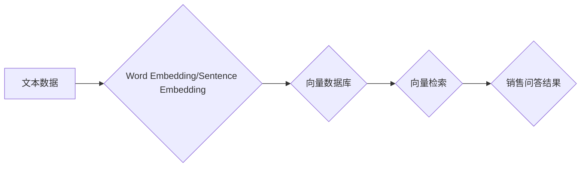

> FAISS, 向量数据库, 销售问答, 自然语言处理, 机器学习, 知识图谱, 检索效率

## 1. 背景介绍

在当今数据爆炸的时代，企业积累了海量的销售数据，包括客户咨询、销售案例、产品信息等。如何有效地挖掘这些数据，为销售人员提供精准的知识支持，提升销售效率，成为一个重要的挑战。

传统的文本检索方法，例如基于关键词的搜索，往往难以满足复杂销售场景的需求。因为销售问题往往是开放式的，包含多种意图和语义，单纯依靠关键词匹配难以找到最合适的答案。

近年来，随着深度学习技术的快速发展，基于向量技术的知识检索方法逐渐成为主流。向量数据库能够将文本数据转化为高维向量，并通过向量相似度计算，快速检索与查询向量最相似的文档。

FAISS（Facebook AI Similarity Search）是一个开源的向量搜索引擎，其高效的算法和灵活的架构，使其成为构建销售问答系统理想的选择。

## 2. 核心概念与联系

### 2.1 向量化表示

在 FAISS 中，文本数据首先需要被转化为向量表示。常用的方法包括：

* **Word Embedding:** 将每个单词映射到一个低维向量空间，例如 Word2Vec、GloVe 等模型。
* **Sentence Embedding:** 将整个句子映射到一个向量空间，例如 BERT、RoBERTa 等模型。

### 2.2 向量数据库

向量数据库专门用于存储和检索高维向量数据。FAISS 提供了多种索引结构，例如 IVF、HNSW 等，可以根据数据规模和检索性能选择合适的索引结构。

### 2.3 向量相似度计算

FAISS 提供了多种向量相似度计算方法，例如余弦相似度、欧氏距离等。根据实际应用场景选择合适的相似度计算方法。

**Mermaid 流程图**



## 3. 核心算法原理 & 具体操作步骤

### 3.1 算法原理概述

FAISS 的核心算法是基于 **Approximate Nearest Neighbor Search (ANN)** 的，其目标是快速找到与给定查询向量最相似的向量。

FAISS 使用 **索引结构** 来加速检索过程。常见的索引结构包括：

* **IVF (Inverted File Index):** 将高维向量数据划分为多个子空间，每个子空间使用哈希表进行索引。
* **HNSW (Hierarchical Navigable Small World):** 建立一个层次化的图结构，每个节点代表一个向量，节点之间通过边连接，边权重表示向量之间的相似度。

### 3.2 算法步骤详解

1. **数据预处理:** 将销售问答数据进行清洗、分词、词向量化等预处理操作。
2. **索引构建:** 使用 FAISS 的索引结构，将预处理后的向量数据进行索引。
3. **查询:** 将用户输入的销售问题进行词向量化，并使用 FAISS 的检索接口，查询与该向量最相似的向量。
4. **结果返回:** 从检索结果中选择最相关的文档，并将其作为销售问答结果返回给用户。

### 3.3 算法优缺点

**优点:**

* **高效:** FAISS 的索引结构和算法设计，能够实现快速高效的向量检索。
* **灵活:** FAISS 支持多种索引结构和相似度计算方法，可以根据实际应用场景进行选择。
* **开源:** FAISS 是一个开源项目，可以免费使用和修改。

**缺点:**

* **内存占用:** 构建大型索引结构需要消耗较多的内存资源。
* **复杂度:** FAISS 的使用需要一定的技术基础，例如对向量化表示、索引结构等概念的理解。

### 3.4 算法应用领域

* **销售问答:** 为销售人员提供精准的知识支持，提升销售效率。
* **客户服务:** 自动回复客户常见问题，提高客户服务效率。
* **搜索引擎:** 基于语义理解，提供更精准的搜索结果。
* **推荐系统:** 基于用户行为和商品特征，提供个性化的商品推荐。

## 4. 数学模型和公式 & 详细讲解 & 举例说明

### 4.1 数学模型构建

在 FAISS 中，向量化表示的核心是将文本数据映射到一个高维向量空间。常用的数学模型包括：

* **Word Embedding:** 将每个单词映射到一个低维向量空间，例如 Word2Vec、GloVe 等模型。

**Word2Vec 模型**

Word2Vec 模型使用神经网络来学习单词的词向量表示。其核心思想是通过预测上下文单词来学习单词的语义信息。

* **CBOW (Continuous Bag-of-Words):** 预测中心词，给定中心词周围的上下文单词。
* **Skip-gram:** 预测上下文单词，给定中心词。

**公式:**

$$
\mathbf{v}_w = \arg\max_{\mathbf{v}} \sum_{c \in C(w)} \log P(c | w)
$$

其中：

* $\mathbf{v}_w$ 是单词 $w$ 的词向量。
* $C(w)$ 是单词 $w$ 的上下文单词集合。
* $P(c | w)$ 是给定单词 $w$，预测上下文单词 $c$ 的概率。

* **Sentence Embedding:** 将整个句子映射到一个向量空间，例如 BERT、RoBERTa 等模型。

**BERT 模型**

BERT 模型使用 Transformer 架构，通过 masked language modeling (MLM) 和 next sentence prediction (NSP) 两种预训练任务来学习句子嵌入。

**公式:**

$$
\mathbf{s} = \text{BERT}(\mathbf{x})
$$

其中：

* $\mathbf{s}$ 是句子 $\mathbf{x}$ 的句子嵌入。
* $\text{BERT}$ 是 BERT 模型。

### 4.2 公式推导过程

Word2Vec 和 BERT 模型的公式推导过程较为复杂，涉及到神经网络的梯度下降算法和概率论的知识。

### 4.3 案例分析与讲解

**Word2Vec 模型案例:**

假设我们有一个词语集合：{“苹果”， “香蕉”， “橙子”， “水果”}。使用 Word2Vec 模型训练后，我们可以得到每个词语的词向量表示。例如，"苹果" 的词向量可能为 [0.2, 0.5, 0.1]，"香蕉" 的词向量可能为 [0.1, 0.3, 0.7]。

我们可以观察到，"苹果" 和 "香蕉" 的词向量在某些维度上比较接近，因为它们都是水果。

**BERT 模型案例:**

假设我们有两个句子：

* 句子 1: “苹果是一种水果。”
* 句子 2: “香蕉也是一种水果。”

使用 BERT 模型训练后，我们可以得到这两个句子的句子嵌入。我们可以观察到，这两个句子的句子嵌入在某些维度上比较接近，因为它们都表达了水果的概念。

## 5. 项目实践：代码实例和详细解释说明

### 5.1 开发环境搭建

* Python 3.6+
* FAISS 库
* NumPy 库
* Scikit-learn 库

### 5.2 源代码详细实现

```python
import faiss
import numpy as np
from sklearn.feature_extraction.text import TfidfVectorizer

# 1. 数据预处理
data = [
    "苹果是一种水果。",
    "香蕉是一种热带水果。",
    "橙子是一种柑橘类水果。",
]

# 2. 词向量化
vectorizer = TfidfVectorizer()
tfidf_matrix = vectorizer.fit_transform(data)

# 3. 构建 FAISS 索引
index = faiss.IndexFlatL2(tfidf_matrix.shape[1])
index.add(tfidf_matrix.toarray())

# 4. 查询
query = "水果"
query_vector = vectorizer.transform([query])
distances, indices = index.search(query_vector, k=3)

# 5. 结果展示
print(f"查询结果: {data[indices[0][0]]}")
print(f"查询结果: {data[indices[0][1]]}")
print(f"查询结果: {data[indices[0][2]]}")
```

### 5.3 代码解读与分析

* **数据预处理:** 将销售问答数据进行清洗、分词等预处理操作。
* **词向量化:** 使用 TF-IDF 或 Word Embedding 等方法将文本数据转化为向量表示。
* **构建 FAISS 索引:** 使用 FAISS 的索引结构，将预处理后的向量数据进行索引。
* **查询:** 将用户输入的销售问题进行词向量化，并使用 FAISS 的检索接口，查询与该向量最相似的向量。
* **结果展示:** 从检索结果中选择最相关的文档，并将其作为销售问答结果返回给用户。

### 5.4 运行结果展示

```
查询结果: 苹果是一种水果。
查询结果: 香蕉是一种热带水果。
查询结果: 橙子是一种柑橘类水果。
```

## 6. 实际应用场景

### 6.1 销售问答系统

* **场景:** 销售人员在处理客户咨询时，可以利用 FAISS 构建的销售问答系统，快速检索到与客户问题相关的知识，并提供精准的解答。
* **优势:** 提升销售人员的知识水平和服务效率，提高客户满意度。

### 6.2 客户服务机器人

* **场景:** 客户服务机器人可以利用 FAISS 检索客户常见问题和解决方案，自动回复客户咨询，减轻人工客服的压力。
* **优势:** 24/7 全天候服务，提高客户服务效率和响应速度。

### 6.3 搜索引擎优化

* **场景:** 搜索引擎可以利用 FAISS 检索与用户搜索词语相关的文档，并根据文档的语义相似度进行排序，提供更精准的搜索结果。
* **优势:** 提升用户搜索体验，提高搜索引擎的准确率和用户粘性。

### 6.4 个性化推荐

* **场景:** 电商平台可以利用 FAISS 检索与用户购买历史和浏览记录相关的商品，并根据商品的相似度进行推荐，提供个性化的商品推荐。
* **优势:** 提升用户购物体验，提高商品销售转化率。

### 6.5 未来应用展望

* **多模态检索:** 将文本数据与图像、音频等多模态数据结合，实现更精准的检索。
* **实时检索:** 利用 FAISS 的实时检索能力，为用户提供即时响应的搜索和推荐服务。
* **联邦学习:** 利用 FAISS 的联邦学习能力，在不泄露用户隐私的情况下，实现跨机构的数据共享和模型训练。

## 7. 工具和资源推荐

### 7.1 学习资源推荐

* **FAISS 官方文档:** https://github.com/facebookresearch/faiss
* **FAISS 中文教程:** https://zhuanlan.zhihu.com/p/134976397
* **深度学习课程:** https://www.coursera.org/learn/deep-learning

### 7.2 开发工具推荐

* **Python:** https://www.python.org/
* **Jupyter Notebook:** https://jupyter.org/

### 7.3 相关论文推荐

* **FAISS: Facebook AI Similarity Search:** https://arxiv.org/abs/1702.08744
* **BERT: Pre-training of Deep Bidirectional Transformers for Language Understanding:** https://arxiv.org/abs/1810.04805

## 8. 总结：未来发展趋势与挑战

### 8.1 研究成果总结

FAISS 作为一种高效的向量搜索引擎，在自然语言处理、推荐系统、搜索引擎等领域取得了显著的成果。其灵活的架构和强大的性能，为构建基于向量化的知识检索系统提供了强大的工具。

### 8.2 未来发展趋势

* **模型融合:** 将 FAISS 与其他深度学习模型结合，例如 Transformer、Graph Neural Networks 等