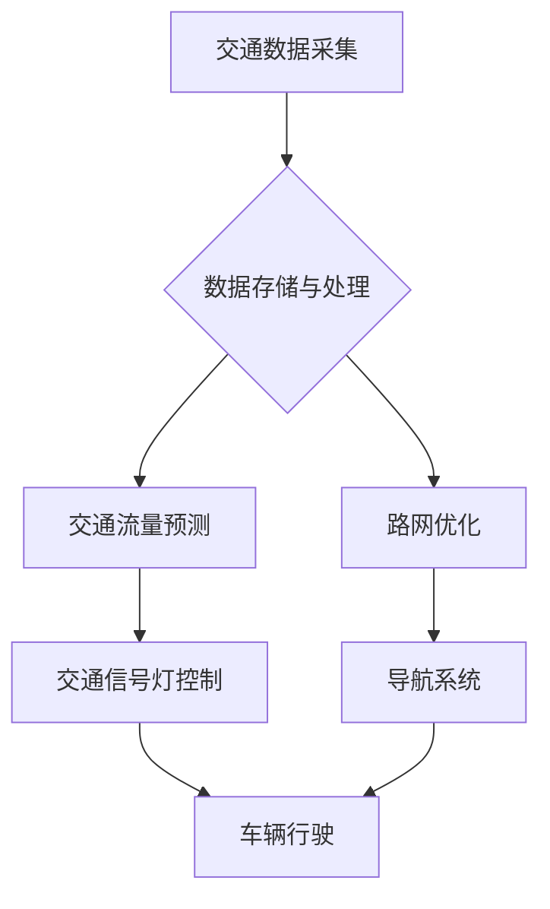

> 智能交通, 大数据, 信息差, 交通流量预测, 路网优化, 算法模型, 深度学习, 计算机视觉

## 1. 背景介绍

随着全球人口的快速增长和城市化的进程不断加速，交通拥堵已成为许多城市面临的严峻挑战。传统的交通管理模式难以有效应对日益复杂的交通状况，亟需寻求新的解决方案。智能交通系统 (ITS) 应运而生，旨在通过信息技术和通信技术，提高交通效率、安全性和可持续性。

大数据作为智能交通系统的核心驱动力，为交通管理提供了前所未有的机遇。通过收集、分析和挖掘海量交通数据，我们可以洞察交通规律、预测交通流量、优化路网结构，从而有效缓解交通拥堵，提高城市交通效率。

## 2. 核心概念与联系

**2.1 智能交通系统 (ITS)**

智能交通系统 (ITS) 是利用信息技术和通信技术，对交通系统进行智能化管理和控制的系统。ITS 的目标是通过实时信息共享、智能决策和自动化控制，提高交通效率、安全性和可持续性。

**2.2 大数据**

大数据是指海量、高速度、高多样性的数据。大数据具有以下特点：

* **海量**: 数据量巨大，难以用传统方法处理。
* **高速度**: 数据产生和更新速度快，需要实时处理。
* **高多样性**: 数据类型多样，包括结构化数据、非结构化数据和半结构化数据。

**2.3 信息差**

信息差是指不同参与者对交通信息的掌握程度不一致。在智能交通系统中，信息差主要体现在以下方面：

* **数据获取**: 不同交通参与者 (如车辆、道路设施、交通管理部门) 对交通数据的获取能力不同。
* **数据分析**: 不同参与者对交通数据的分析能力和理解程度不同。
* **信息共享**: 不同参与者之间信息共享的程度不同。

**2.4 信息差与智能交通**

信息差是智能交通系统面临的挑战之一。如果信息差过大，会导致交通管理决策不准确，交通效率低下，甚至引发交通事故。

**2.5 解决方案**

通过大数据分析和信息共享，可以有效缩小信息差，提高智能交通系统的效率和安全性。

**2.6 架构图**



## 3. 核心算法原理 & 具体操作步骤

### 3.1 算法原理概述

交通流量预测是智能交通系统的重要应用之一。通过预测未来交通流量，我们可以优化交通信号灯控制、导航系统引导和道路建设规划等方面。常用的交通流量预测算法包括：

* **时间序列模型**: 
    * ARIMA模型
    * SARIMA模型
    * Prophet模型
* **机器学习模型**: 
    * 线性回归
    * 支持向量机
    * 决策树
    * 神经网络

### 3.2 算法步骤详解

以 ARIMA 模型为例，其预测步骤如下：

1. **数据预处理**: 对历史交通流量数据进行清洗、缺失值处理和特征工程。
2. **模型识别**: 通过 ACF 和 PACF 图等方法，确定 ARIMA 模型的参数 (p, d, q)。
3. **模型估计**: 使用极大似然估计法，估计 ARIMA 模型的参数。
4. **模型诊断**: 通过残差分析等方法，评估模型的拟合效果。
5. **预测**: 使用训练好的 ARIMA 模型，预测未来交通流量。

### 3.3 算法优缺点

**优点**:

* 理论基础扎实，易于理解和实现。
* 对数据要求不高，可以处理非线性数据。

**缺点**:

* 预测精度有限，难以捕捉复杂的时间序列特征。
* 对异常值敏感，需要进行数据预处理。

### 3.4 算法应用领域

* 交通流量预测
* 交通拥堵预警
* 交通信号灯优化
* 路网规划

## 4. 数学模型和公式 & 详细讲解 & 举例说明

### 4.1 数学模型构建

ARIMA 模型的数学表达式如下：

$$
\phi(B) (1-B)^d y_t = \theta(B) \epsilon_t
$$

其中：

* $y_t$ 是时间 t 的交通流量。
* $B$ 是后向差分算子，$B^k y_t = y_{t-k}$。
* $\phi(B)$ 和 $\theta(B)$ 分别是 AR 和 MA 过程的系数多项式。
* $d$ 是差分阶数。
* $\epsilon_t$ 是白噪声序列。

### 4.2 公式推导过程

ARIMA 模型的推导过程较为复杂，涉及时间序列分析、统计学和线性代数等多个领域。

### 4.3 案例分析与讲解

假设我们想要预测某条道路的未来交通流量，可以使用 ARIMA 模型进行预测。首先，我们需要收集该道路的历史交通流量数据，然后进行数据预处理和模型识别。

假设我们确定了 ARIMA(p, d, q) 模型的参数，可以使用极大似然估计法估计模型的参数。最后，可以使用训练好的 ARIMA 模型预测未来交通流量。

## 5. 项目实践：代码实例和详细解释说明

### 5.1 开发环境搭建

* Python 3.x
* pandas
* statsmodels
* matplotlib

### 5.2 源代码详细实现

```python
import pandas as pd
from statsmodels.tsa.arima.model import ARIMA
from matplotlib import pyplot as plt

# 加载交通流量数据
data = pd.read_csv('traffic_data.csv', index_col='Date')

# 数据预处理
data = data['TrafficVolume'].dropna()

# 模型识别
# ...

# 模型估计
model = ARIMA(data, order=(p, d, q))
model_fit = model.fit()

# 预测
forecast = model_fit.predict(start=len(data), end=len(data)+10)

# 可视化
plt.plot(data, label='实际流量')
plt.plot(forecast, label='预测流量')
plt.legend()
plt.show()
```

### 5.3 代码解读与分析

* 数据加载和预处理：使用 pandas 库加载交通流量数据，并处理缺失值。
* 模型识别：根据数据特征，确定 ARIMA 模型的参数 (p, d, q)。
* 模型估计：使用 statsmodels 库的 ARIMA 模型进行模型估计。
* 预测：使用训练好的模型预测未来交通流量。
* 可视化：使用 matplotlib 库绘制实际流量和预测流量的曲线图。

### 5.4 运行结果展示

运行代码后，会生成一个包含实际流量和预测流量的曲线图。

## 6. 实际应用场景

### 6.1 交通信号灯优化

通过预测交通流量，可以优化交通信号灯的绿灯时间分配，提高交通流量的通行效率。

### 6.2 导航系统引导

导航系统可以根据实时交通流量预测，为用户提供最优的路线规划，避免交通拥堵。

### 6.3 道路建设规划

通过分析历史交通流量数据和预测未来交通流量，可以为道路建设规划提供依据，合理规划道路网络结构。

### 6.4 未来应用展望

* **智能驾驶**: 大数据和 AI 技术将推动智能驾驶的发展，实现自动驾驶车辆的精准导航和安全行驶。
* **城市规划**: 通过大数据分析，可以更好地了解城市交通状况，为城市规划提供数据支持。
* **可持续交通**: 大数据可以帮助优化交通出行模式，促进绿色出行和可持续发展。

## 7. 工具和资源推荐

### 7.1 学习资源推荐

* **书籍**:
    * 《时间序列分析》
    * 《机器学习》
* **在线课程**:
    * Coursera: Time Series Analysis
    * edX: Machine Learning

### 7.2 开发工具推荐

* **Python**: 
    * pandas
    * statsmodels
    * scikit-learn
* **R**: 
    * forecast
    * caret

### 7.3 相关论文推荐

* **交通流量预测**:
    * "A Deep Learning Approach for Traffic Flow Prediction"
    * "Traffic Flow Prediction Using Recurrent Neural Networks"
* **智能交通系统**:
    * "Intelligent Transportation Systems: A Comprehensive Overview"
    * "The Future of Intelligent Transportation Systems"

## 8. 总结：未来发展趋势与挑战

### 8.1 研究成果总结

大数据在智能交通领域的应用取得了显著成果，例如交通流量预测、路网优化、交通信号灯控制等方面都取得了突破。

### 8.2 未来发展趋势

* **深度学习**: 深度学习算法在交通流量预测和智能驾驶等领域具有巨大的潜力。
* **边缘计算**: 将数据处理和决策能力部署到边缘设备，可以降低延迟，提高实时性。
* **多模态数据融合**: 将来自不同传感器的数据融合，可以获得更全面的交通信息。

### 8.3 面临的挑战

* **数据隐私**: 大数据收集和使用需要考虑数据隐私和安全问题。
* **算法解释性**: 深度学习模型的解释性较差，难以理解模型的决策过程。
* **系统可靠性**: 智能交通系统需要保证高可靠性和安全性，避免系统故障导致的交通事故。

### 8.4 研究展望

未来，大数据在智能交通领域的应用将更加广泛和深入，需要进一步研究和探索新的算法、技术和应用场景。

## 9. 附录：常见问题与解答

**Q1: 如何处理交通流量数据中的缺失值？**

**A1:** 可以使用线性插值、时间序列插值或其他数据填充方法处理缺失值。

**Q2: 如何选择合适的 ARIMA 模型参数？**

**A2:** 可以使用 ACF 和 PACF 图等方法，以及 AIC 和 BIC 等信息准则来选择合适的 ARIMA 模型参数。

**Q3: 深度学习模型在交通流量预测中的优势是什么？**

**A3:** 深度学习模型可以学习复杂的时间序列特征，并具有较高的预测精度。

作者：禅与计算机程序设计艺术 / Zen and the Art of Computer Programming


<end_of_turn>