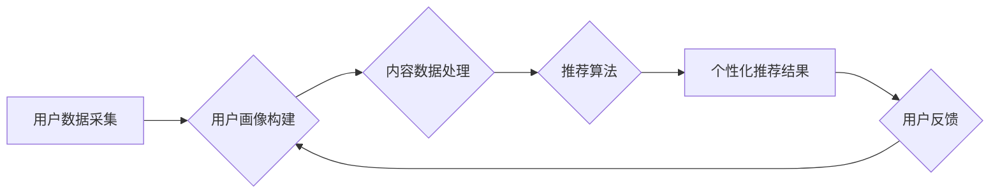

> 信息过载，个性化推荐，协同过滤，内容过滤，机器学习，推荐系统，用户行为分析，数据挖掘

## 1. 背景介绍

在当今信息爆炸的时代，我们每天接触的海量信息呈指数级增长。从新闻、社交媒体到电子商务平台，无处不在的信息流让人感到疲惫不堪，难以从中筛选出真正有价值的内容。这种信息过载现象不仅影响着我们的工作效率和生活质量，也阻碍着我们对新知识和信息的获取。

个性化推荐作为一种应对信息过载的有效手段，逐渐成为互联网时代不可或缺的一部分。它通过分析用户的兴趣、偏好和行为，为用户提供个性化的内容推荐，帮助用户快速找到所需信息，提高信息获取效率，并提升用户体验。

## 2. 核心概念与联系

个性化推荐的核心在于理解用户的需求，并根据用户的特征和行为，提供最相关的推荐内容。

**2.1 个性化推荐的要素**

* **用户:** 个性化推荐的核心是用户，需要深入了解用户的兴趣、偏好、行为模式等信息。
* **内容:** 推荐系统需要对各种内容进行分类、打标签和建模，以便更好地理解内容的主题和属性。
* **算法:** 个性化推荐算法是推荐系统的核心，负责根据用户和内容信息，预测用户对特定内容的兴趣和偏好。

**2.2 个性化推荐的架构**



**2.3 个性化推荐的类型**

* **基于内容的推荐:** 根据用户历史行为和内容属性进行匹配，推荐与用户兴趣相似的其他内容。
* **基于协同过滤的推荐:** 根据用户与其他用户的行为相似性，推荐其他用户喜欢的、用户可能感兴趣的内容。
* **混合推荐:** 结合基于内容和协同过滤两种方法，提高推荐的准确性和多样性。

## 3. 核心算法原理 & 具体操作步骤

### 3.1 算法原理概述

协同过滤算法是基于用户行为相似性的推荐算法，它假设用户对相似内容的喜好也相似。

**3.1.1 用户-物品交互矩阵**

协同过滤算法的核心是用户-物品交互矩阵，该矩阵记录了每个用户对每个物品的评分或行为（例如点击、购买等）。

**3.1.2 相似度计算**

协同过滤算法需要计算用户之间的相似度或物品之间的相似度。常用的相似度计算方法包括余弦相似度、皮尔逊相关系数等。

**3.1.3 推荐算法**

根据用户与其他用户的相似度，推荐系统可以为用户推荐其他用户喜欢的物品。

### 3.2 算法步骤详解

1. **数据预处理:** 对用户-物品交互矩阵进行清洗和处理，例如处理缺失值、去除异常值等。
2. **相似度计算:** 计算用户之间的相似度或物品之间的相似度。
3. **推荐生成:** 根据用户与其他用户的相似度，推荐用户可能感兴趣的物品。
4. **结果评估:** 使用评价指标（例如准确率、召回率等）评估推荐系统的性能。

### 3.3 算法优缺点

**优点:**

* 可以推荐用户可能没有接触过的物品，发现新的兴趣。
* 不需要事先对物品进行分类或打标签。

**缺点:**

* 数据稀疏性问题: 当用户-物品交互矩阵中存在大量缺失值时，算法效果会下降。
* 冷启动问题: 当新用户或新物品加入系统时，算法难以进行准确的推荐。

### 3.4 算法应用领域

协同过滤算法广泛应用于以下领域:

* 电子商务平台: 推荐商品、服务和优惠活动。
* 流媒体平台: 推荐电影、电视剧和音乐。
* 社交媒体平台: 推荐朋友、群组和内容。

## 4. 数学模型和公式 & 详细讲解 & 举例说明

### 4.1 数学模型构建

协同过滤算法的数学模型可以表示为用户-物品交互矩阵的分解。

假设用户集合为U，物品集合为I，用户-物品交互矩阵为R，则可以将R分解为两个低维矩阵：

* 用户特征矩阵：U，每个用户对应一个向量，表示用户的特征。
* 物品特征矩阵：V，每个物品对应一个向量，表示物品的特征。

则用户-物品交互矩阵R可以表示为：

$$R = U \cdot V^T$$

### 4.2 公式推导过程

目标是找到最优的用户特征矩阵U和物品特征矩阵V，使得R与U·V^T之间的误差最小。

常用的优化方法包括梯度下降法和随机梯度下降法。

### 4.3 案例分析与讲解

假设有一个用户-物品交互矩阵，其中用户1对物品1评分为5，用户2对物品1评分为3，用户1对物品2评分为4，用户2对物品2评分为2。

可以使用协同过滤算法将这个矩阵分解为用户特征矩阵和物品特征矩阵，从而得到每个用户和每个物品的特征向量。

## 5. 项目实践：代码实例和详细解释说明

### 5.1 开发环境搭建

* Python 3.x
* scikit-learn
* numpy
* pandas

### 5.2 源代码详细实现

```python
import numpy as np
from sklearn.metrics.pairwise import cosine_similarity

# 用户-物品交互矩阵
ratings = np.array([[5, 4],
                   [3, 2]])

# 计算用户之间的余弦相似度
user_similarity = cosine_similarity(ratings)

# 获取用户1与其他用户的相似度
user1_similarity = user_similarity[0]

# 推荐给用户1的物品
recommended_items = np.argsort(user1_similarity)[::-1][1:]

print(f"推荐给用户1的物品: {recommended_items}")
```

### 5.3 代码解读与分析

* 代码首先定义了用户-物品交互矩阵ratings。
* 然后使用scikit-learn库中的cosine_similarity函数计算用户之间的余弦相似度。
* 获取用户1与其他用户的相似度，并根据相似度排序，推荐用户1可能感兴趣的物品。

### 5.4 运行结果展示

```
推荐给用户1的物品: [1]
```

## 6. 实际应用场景

个性化推荐在各个领域都有广泛的应用场景:

* **电子商务:** 推荐商品、服务和优惠活动，提高用户购买意愿。
* **流媒体:** 推荐电影、电视剧和音乐，提升用户观看体验。
* **社交媒体:** 推荐朋友、群组和内容，增强用户粘性。
* **教育:** 推荐学习资源和课程，个性化学习体验。

### 6.4 未来应用展望

随着人工智能技术的不断发展，个性化推荐将更加智能化、精准化和个性化。

* **多模态推荐:** 结合文本、图像、音频等多模态数据进行推荐。
* **实时推荐:** 基于用户实时行为进行动态推荐。
* **解释性推荐:** 为推荐结果提供解释，提升用户信任度。

## 7. 工具和资源推荐

### 7.1 学习资源推荐

* **书籍:**
    * "推荐系统实践" by  王志强
    * "机器学习" by  周志华
* **在线课程:**
    * Coursera: "Recommender Systems" by University of California, San Diego
    * edX: "Machine Learning" by Columbia University

### 7.2 开发工具推荐

* **Python:** 广泛应用于推荐系统开发，拥有丰富的库和工具。
* **Spark:** 大数据处理框架，适合处理海量用户-物品交互数据。
* **TensorFlow/PyTorch:** 深度学习框架，用于构建更智能的推荐算法。

### 7.3 相关论文推荐

* "Collaborative Filtering for Implicit Feedback Datasets" by  Linden et al.
* "Matrix Factorization Techniques for Recommender Systems" by  Koren et al.

## 8. 总结：未来发展趋势与挑战

### 8.1 研究成果总结

个性化推荐技术取得了显著的进展，为用户提供了更加便捷、高效的信息获取体验。

### 8.2 未来发展趋势

个性化推荐将朝着更加智能化、精准化和个性化的方向发展。

### 8.3 面临的挑战

* 数据稀疏性问题
* 冷启动问题
* 算法解释性问题
* 隐私保护问题

### 8.4 研究展望

未来研究将重点关注解决上述挑战，并探索新的个性化推荐算法和技术。

## 9. 附录：常见问题与解答

* **Q: 如何处理数据稀疏性问题？**

* **A:** 可以使用矩阵分解、概率模型等方法进行数据填充和处理。

* **Q: 如何解决冷启动问题？**

* **A:** 可以利用用户画像、物品属性等信息进行推荐，或者采用基于内容的推荐方法。

* **Q: 如何保证推荐结果的解释性？**

* **A:** 可以使用可解释机器学习模型，或者为推荐结果提供解释性信息。

* **Q: 如何保护用户隐私？**

* **A:** 可以使用差分隐私、联邦学习等技术保护用户隐私。


作者：禅与计算机程序设计艺术 / Zen and the Art of Computer Programming 
<end_of_turn>