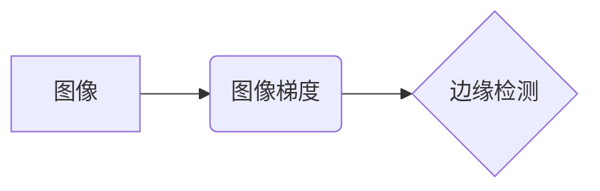

> 图像梯度，边缘检测，Sobel算子，Prewitt算子，Canny算法，图像处理，计算机视觉

## 1. 背景介绍

图像边缘是图像中像素值变化剧烈的区域，它往往对应着物体轮廓、形状变化等重要信息。边缘检测是图像处理和计算机视觉领域的基础任务之一，它能够有效地提取图像中的边缘信息，为后续的图像分析、识别和理解提供基础。

传统的边缘检测方法主要依赖于图像梯度的计算。图像梯度可以用来描述图像像素值在空间上的变化率，其方向指向像素值变化最快的方向。通过计算图像梯度的大小和方向，我们可以识别出图像中的边缘区域。

## 2. 核心概念与联系

**2.1 图像梯度**

图像梯度是图像像素值在空间上的变化率，它可以用来描述图像中像素值的变化趋势。图像梯度的计算通常使用Sobel算子、Prewitt算子等算子进行。

**2.2 边缘检测**

边缘检测是指从图像中提取边缘信息的过程。边缘检测算法通常会根据图像梯度的计算结果，识别出图像中像素值变化剧烈的区域，并将其标记为边缘。

**2.3 核心概念关系图**



## 3. 核心算法原理 & 具体操作步骤

### 3.1 算法原理概述

常见的边缘检测算法包括Sobel算子、Prewitt算子、Canny算法等。这些算法都基于图像梯度的计算原理，通过对图像进行卷积操作，计算图像梯度的大小和方向，从而识别出图像中的边缘。

### 3.2 算法步骤详解

**3.2.1 Sobel算子**

Sobel算子是一种常用的边缘检测算子，它使用两个3x3的卷积核分别计算图像在水平和垂直方向上的梯度。

* **水平方向梯度:**

```
[-1 0 1]
[-2 0 2]
[-1 0 1]
```

* **垂直方向梯度:**

```
[-1 -2 -1]
[ 0  0  0]
[ 1  2  1]
```

Sobel算子将这两个卷积核分别与图像进行卷积，得到水平和垂直方向上的梯度值。然后，将这两个梯度值相结合，计算出图像的梯度幅值和方向。

**3.2.2 Prewitt算子**

Prewitt算子与Sobel算子类似，但它使用不同的卷积核。

* **水平方向梯度:**

```
[-1 0 1]
[-1 0 1]
[-1 0 1]
```

* **垂直方向梯度:**

```
[-1 -1 -1]
[ 0  0  0]
[ 1  1  1]
```

Prewitt算子也计算出图像的梯度幅值和方向。

**3.2.3 Canny算法**

Canny算法是一种更复杂的边缘检测算法，它包括以下步骤：

1. **噪声抑制:** 使用高斯滤波器对图像进行平滑处理，抑制图像中的噪声。
2. **梯度计算:** 使用Sobel算子或Prewitt算子计算图像的梯度幅值和方向。
3. **非极大值抑制:** 沿着梯度方向进行非极大值抑制，保留边缘像素，抑制非边缘像素。
4. **边缘跟踪:** 使用双阈值法连接边缘点，形成完整的边缘轮廓。

### 3.3 算法优缺点

| 算法 | 优点 | 缺点 |
|---|---|---|
| Sobel算子 | 计算简单，速度快 | 对噪声敏感，边缘检测效果不佳 |
| Prewitt算子 | 对噪声比Sobel算子更鲁棒 | 边缘检测效果不如Canny算法 |
| Canny算法 | 边缘检测效果好，抗噪能力强 | 计算复杂度高，速度慢 |

### 3.4 算法应用领域

边缘检测算法广泛应用于图像处理和计算机视觉领域，例如：

* **图像分割:** 根据图像边缘信息，将图像分割成不同的区域。
* **目标识别:** 利用边缘信息提取目标轮廓，进行目标识别。
* **图像匹配:** 根据图像边缘信息，进行图像匹配和拼接。
* **三维重建:** 利用边缘信息重建三维物体模型。

## 4. 数学模型和公式 & 详细讲解 & 举例说明

### 4.1 数学模型构建

图像梯度可以表示为图像像素值在空间上的变化率，可以使用以下公式计算：

$$
G(x,y) = \sqrt{G_x^2(x,y) + G_y^2(x,y)}
$$

其中：

* $G(x,y)$ 表示图像在点 $(x,y)$ 的梯度幅值。
* $G_x(x,y)$ 表示图像在点 $(x,y)$ 的水平方向梯度。
* $G_y(x,y)$ 表示图像在点 $(x,y)$ 的垂直方向梯度。

### 4.2 公式推导过程

图像梯度可以由卷积核计算得到。例如，Sobel算子可以表示为：

$$
G_x(x,y) = \sum_{i=-1}^{1} \sum_{j=-1}^{1} I(x+i,y+j) * K_x(i,j)
$$

$$
G_y(x,y) = \sum_{i=-1}^{1} \sum_{j=-1}^{1} I(x+i,y+j) * K_y(i,j)
$$

其中：

* $I(x,y)$ 表示图像在点 $(x,y)$ 的像素值。
* $K_x(i,j)$ 和 $K_y(i,j)$ 分别表示水平和垂直方向的Sobel算子核。

### 4.3 案例分析与讲解

假设图像中有一个水平边缘，其像素值变化剧烈。使用Sobel算子进行边缘检测，可以得到较明显的边缘响应。

## 5. 项目实践：代码实例和详细解释说明

### 5.1 开发环境搭建

本项目使用Python语言进行开发，需要安装以下库：

* OpenCV

```bash
pip install opencv-python
```

### 5.2 源代码详细实现

```python
import cv2
import numpy as np

# 读取图像
image = cv2.imread('image.jpg', cv2.IMREAD_GRAYSCALE)

# 使用Sobel算子进行边缘检测
sobelx = cv2.Sobel(image, cv2.CV_64F, 1, 0, ksize=5)
sobely = cv2.Sobel(image, cv2.CV_64F, 0, 1, ksize=5)

# 计算梯度幅值
abs_grad_x = cv2.convertScaleAbs(sobelx)
abs_grad_y = cv2.convertScaleAbs(sobely)
gradient = cv2.addWeighted(abs_grad_x, 0.5, abs_grad_y, 0.5, 0)

# 显示结果
cv2.imshow('Original Image', image)
cv2.imshow('Gradient', gradient)
cv2.waitKey(0)
cv2.destroyAllWindows()
```

### 5.3 代码解读与分析

* `cv2.imread()` 函数读取图像文件。
* `cv2.Sobel()` 函数使用Sobel算子进行边缘检测。
* `cv2.convertScaleAbs()` 函数将浮点型梯度值转换为整数型。
* `cv2.addWeighted()` 函数将两个图像进行加权平均，得到梯度幅值图像。
* `cv2.imshow()` 函数显示图像。
* `cv2.waitKey()` 函数等待用户按键。
* `cv2.destroyAllWindows()` 函数关闭所有窗口。

### 5.4 运行结果展示

运行代码后，将显示原始图像和边缘检测结果图像。边缘检测结果图像中，边缘区域像素值较高，非边缘区域像素值较低。

## 6. 实际应用场景

### 6.1 图像分割

边缘检测可以用于图像分割，将图像分割成不同的区域。例如，可以利用边缘信息分割出图像中的物体和背景。

### 6.2 目标识别

边缘检测可以用于目标识别，提取目标轮廓，进行目标识别。例如，可以利用边缘信息识别出图像中的车辆、行人等目标。

### 6.3 图像匹配

边缘检测可以用于图像匹配，根据图像边缘信息，进行图像匹配和拼接。例如，可以利用边缘信息将多张图像拼接成一张完整的图像。

### 6.4 未来应用展望

随着计算机视觉技术的不断发展，边缘检测算法将有更广泛的应用场景。例如，可以利用边缘检测算法进行三维重建、视频分析、医学图像分析等。

## 7. 工具和资源推荐

### 7.1 学习资源推荐

* OpenCV官方文档：https://docs.opencv.org/
* 图像处理与计算机视觉教程：https://www.coursera.org/learn/computer-vision

### 7.2 开发工具推荐

* OpenCV：https://opencv.org/
* Python：https://www.python.org/

### 7.3 相关论文推荐

* Canny, J. (1986). A computational approach to edge detection. IEEE Transactions on Pattern Analysis and Machine Intelligence, 8(6), 679-698.
* Sobel, I. (1968). Detection of edges in a noisy image. IEEE Transactions on Systems Science and Cybernetics, 4(5), 345-350.

## 8. 总结：未来发展趋势与挑战

### 8.1 研究成果总结

边缘检测算法的发展经历了从简单的Sobel算子到复杂的Canny算法的演变。这些算法在图像处理和计算机视觉领域取得了显著的成果，为图像分析、识别和理解提供了基础。

### 8.2 未来发展趋势

未来边缘检测算法的发展趋势包括：

* **鲁棒性增强:** 开发更鲁棒的边缘检测算法，能够有效地应对噪声、模糊、光照变化等复杂场景。
* **实时性提升:** 提高边缘检测算法的实时性，满足实时图像处理的需求。
* **多尺度检测:** 开发能够检测不同尺度边缘的算法，能够更好地捕捉图像中的细节信息。

### 8.3 面临的挑战

边缘检测算法仍然面临一些挑战，例如：

* **边缘定位精度:** 提高边缘定位精度，减少边缘检测的误差。
* **边缘类型识别:** 识别不同类型的边缘，例如直线边缘、曲线边缘等。
* **边缘细化:** 对边缘进行细化处理，去除边缘中的噪声和虚假边缘。

### 8.4 研究展望

未来，边缘检测算法的研究将继续深入，探索更有效的算法和方法，为图像处理和计算机视觉领域的发展做出更大的贡献。

## 9. 附录：常见问题与解答

**问题 1:** 如何选择合适的边缘检测算法？

**解答:** 选择合适的边缘检测算法需要根据具体的应用场景和图像特点进行选择。例如，对于噪声较多的图像，可以使用Canny算法；对于需要实时处理的图像，可以使用Sobel算子。

**问题 2:** 如何提高边缘检测的精度？

**解答:** 可以通过以下方法提高边缘检测的精度：

* 使用高斯滤波器对图像进行平滑处理，抑制噪声。
* 使用双阈值法进行非极大值抑制，保留边缘像素，抑制非边缘像素。
* 使用边缘细化算法对边缘进行细化处理，去除边缘中的噪声和虚假边缘。


作者：禅与计算机程序设计艺术 / Zen and the Art of Computer Programming 
<end_of_turn>