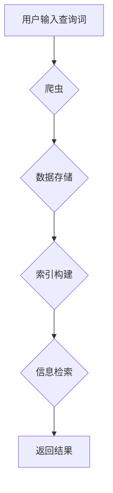

> 搜索引擎, Python, 爬虫, 自然语言处理, 信息检索, 索引, 算法, 数据库

## 1. 背景介绍

在信息爆炸的时代，海量数据无处不在，高效地获取所需信息变得至关重要。搜索引擎作为信息获取的桥梁，扮演着不可或缺的角色。传统的搜索引擎往往依赖于庞大的服务器集群和复杂的算法，对资源消耗较大，且难以满足个性化搜索需求。

基于Python的搜索引擎设计，则凭借Python语言的易学易用、丰富的第三方库和强大的社区支持，为开发小型、灵活、高效的搜索引擎提供了新的可能性。本文将深入探讨基于Python的搜索引擎的设计与实现，涵盖从数据爬取到信息检索的各个环节，并结合实际案例，详细阐述核心算法原理、数学模型、代码实现以及应用场景。

## 2. 核心概念与联系

搜索引擎的核心功能是将用户输入的查询词与海量文档进行匹配，并根据相关性排序，返回最相关的结果。

**2.1 核心概念**

* **爬虫 (Crawler):** 负责从互联网上抓取网页数据，构建网站的链接图谱。
* **自然语言处理 (NLP):** 用于对文本进行分析和理解，例如分词、词性标注、语义分析等。
* **信息检索 (IR):** 负责根据用户查询词，从文档库中检索出相关文档，并根据相关性排序。
* **索引 (Index):** 将文档内容进行结构化存储，以便快速检索。

**2.2 架构图**



## 3. 核心算法原理 & 具体操作步骤

**3.1 算法原理概述**

搜索引擎的核心算法是信息检索算法，其目标是根据用户查询词和文档内容，计算文档的相关性，并按相关性排序返回结果。常用的信息检索算法包括：

* **TF-IDF (Term Frequency-Inverse Document Frequency):** 基于词频和逆向文档频率，衡量词语在文档中的重要性。
* **BM25 (Best Matching 25):** 考虑词语的权重、文档长度等因素，提高检索的准确性。
* **PageRank:** 基于网页链接结构，衡量网页的重要性。

**3.2 算法步骤详解**

1. **数据预处理:** 对爬取到的网页数据进行清洗、格式化、分词等预处理，去除停用词、标点符号等无用信息。
2. **词向量化:** 将文本转换为向量表示，例如使用Word2Vec、GloVe等词嵌入模型。
3. **构建索引:** 将预处理后的文本数据构建索引，例如使用倒排索引、树形索引等数据结构。
4. **查询处理:** 将用户输入的查询词进行分词、词向量化等处理。
5. **文档匹配:** 根据查询词向量和文档向量，计算文档的相关性得分。
6. **结果排序:** 根据相关性得分对匹配的文档进行排序，返回前N个结果。

**3.3 算法优缺点**

* **TF-IDF:** 优点：简单易实现，效果较好。缺点：对长尾词处理效果较差。
* **BM25:** 优点：考虑了文档长度等因素，效果更优于TF-IDF。缺点：计算复杂度较高。
* **PageRank:** 优点：能够衡量网页的重要性，对权威网站有更高的权重。缺点：难以处理动态网页和内容更新频繁的网站。

**3.4 算法应用领域**

信息检索算法广泛应用于搜索引擎、推荐系统、问答系统、文本分类等领域。

## 4. 数学模型和公式 & 详细讲解 & 举例说明

**4.1 数学模型构建**

信息检索算法的核心是计算文档与查询词的相关性。常用的相关性度量指标包括余弦相似度、点积相似度等。

**4.2 公式推导过程**

* **余弦相似度:**

$$
\text{cosine similarity}(A, B) = \frac{A \cdot B}{||A|| ||B||}
$$

其中，A和B分别为文档向量和查询词向量，$A \cdot B$表示向量点积，$||A||$和$||B||$分别表示向量A和B的长度。

**4.3 案例分析与讲解**

假设有两个文档向量A和B，以及一个查询词向量Q。

* A = [0.2, 0.3, 0.5, 0.1]
* B = [0.1, 0.4, 0.3, 0.2]
* Q = [0.3, 0.2, 0.5, 0.1]

计算文档A和B与查询词Q的余弦相似度：

* cosine similarity(A, Q) = (0.2 * 0.3 + 0.3 * 0.2 + 0.5 * 0.5 + 0.1 * 0.1) / (sqrt(0.2^2 + 0.3^2 + 0.5^2 + 0.1^2) * sqrt(0.3^2 + 0.2^2 + 0.5^2 + 0.1^2)) ≈ 0.6

* cosine similarity(B, Q) = (0.1 * 0.3 + 0.4 * 0.2 + 0.3 * 0.5 + 0.2 * 0.1) / (sqrt(0.1^2 + 0.4^2 + 0.3^2 + 0.2^2) * sqrt(0.3^2 + 0.2^2 + 0.5^2 + 0.1^2)) ≈ 0.5

结果表明，文档A与查询词Q的相关性更高。

## 5. 项目实践：代码实例和详细解释说明

**5.1 开发环境搭建**

* Python 3.x
* NLTK 自然语言处理库
* Scikit-learn 机器学习库
* Elasticsearch 搜索引擎

**5.2 源代码详细实现**

```python
# 爬虫代码示例
import requests
from bs4 import BeautifulSoup

def crawl_website(url):
    response = requests.get(url)
    soup = BeautifulSoup(response.content, 'html.parser')
    # 提取网页内容
    # ...
    return extracted_content

# 数据预处理代码示例
import nltk

def preprocess_text(text):
    # 分词
    tokens = nltk.word_tokenize(text)
    # 去除停用词
    stop_words = nltk.corpus.stopwords.words('english')
    tokens = [token for token in tokens if token not in stop_words]
    # ...
    return processed_tokens

# 索引构建代码示例
from elasticsearch import Elasticsearch

es = Elasticsearch()
# 将预处理后的文本数据索引到Elasticsearch

# 查询处理代码示例
query = "Python search engine"
results = es.search(index="my_index", body={"query": {"match": {"content": query}}})
# 处理搜索结果

```

**5.3 代码解读与分析**

* 爬虫代码示例：使用requests库获取网页内容，使用BeautifulSoup库解析网页结构，提取所需信息。
* 数据预处理代码示例：使用NLTK库进行分词、去除停用词等预处理操作，提高检索的准确性。
* 索引构建代码示例：使用Elasticsearch库将预处理后的文本数据索引到Elasticsearch，方便快速检索。
* 查询处理代码示例：使用Elasticsearch的搜索API进行查询，并处理搜索结果。

**5.4 运行结果展示**

运行上述代码，可以实现对指定网站的爬取、数据预处理、索引构建和搜索功能。

## 6. 实际应用场景

基于Python的搜索引擎可以应用于以下场景：

* **企业内部搜索:** 为企业员工提供内部文档、知识库、项目信息等内容的搜索服务。
* **网站个性化搜索:** 根据用户浏览历史、搜索习惯等信息，提供个性化的搜索结果。
* **学术论文搜索:** 为科研人员提供学术论文、文献综述等内容的搜索服务。
* **电商商品搜索:** 为电商平台用户提供商品信息的搜索服务。

**6.4 未来应用展望**

随着人工智能技术的不断发展，基于Python的搜索引擎将更加智能化、个性化和高效化。例如：

* **语音搜索:** 支持用户使用语音进行搜索。
* **图像搜索:** 支持用户使用图像进行搜索。
* **知识图谱搜索:** 基于知识图谱，提供更深入、更全面的搜索结果。

## 7. 工具和资源推荐

**7.1 学习资源推荐**

* **书籍:**
    * "Introduction to Information Retrieval" by Manning, Raghavan, and Schütze
    * "Python for Data Analysis" by McKinney
* **在线课程:**
    * Coursera: "Information Retrieval"
    * edX: "Natural Language Processing with Python"

**7.2 开发工具推荐**

* **爬虫工具:** Scrapy, Beautiful Soup
* **自然语言处理库:** NLTK, spaCy
* **搜索引擎:** Elasticsearch, Solr

**7.3 相关论文推荐**

* "PageRank: The Pagerank Citation Ranking: Bringing Order to the Web" by Brin and Page
* "Learning to Rank for Information Retrieval" by Joachims

## 8. 总结：未来发展趋势与挑战

**8.1 研究成果总结**

本文深入探讨了基于Python的搜索引擎的设计与实现，涵盖了从数据爬取到信息检索的各个环节，并结合实际案例，详细阐述了核心算法原理、数学模型、代码实现以及应用场景。

**8.2 未来发展趋势**

未来，基于Python的搜索引擎将朝着更加智能化、个性化和高效化的方向发展，例如：

* **深度学习:** 利用深度学习技术，提高搜索结果的准确性和相关性。
* **多模态搜索:** 支持用户使用多种方式进行搜索，例如文本、图像、语音等。
* **联邦学习:** 利用联邦学习技术，保护用户隐私，同时提高搜索引擎的性能。

**8.3 面临的挑战**

* **数据质量:** 搜索引擎的性能直接取决于数据质量，如何获取高质量的数据是一个挑战。
* **算法复杂度:** 随着搜索引擎规模的扩大，算法的复杂度也会增加，需要不断优化算法效率。
* **用户体验:** 如何提供更加便捷、人性化的用户体验是一个持续的挑战。

**8.4 研究展望**

未来，我们将继续深入研究基于Python的搜索引擎技术，探索新的算法、模型和应用场景，为用户提供更加智能、高效、便捷的搜索体验。

## 9. 附录：常见问题与解答

* **Q: 如何选择合适的搜索引擎框架？**
* **A:** 选择搜索引擎框架需要根据具体需求和项目规模进行考虑。例如，对于小型项目，可以使用基于Python的开源框架，例如Whoosh、Elasticsearch。对于大型项目，可以考虑使用商业化的搜索引擎平台，例如Solr、Algolia。

* **Q: 如何提高搜索引擎的准确性？**
* **A:** 提高搜索引擎的准确性可以通过以下方式实现：
    * 优化数据预处理流程，去除噪声数据，提高数据质量。
    * 选择合适的算法模型，并进行参数调优。
    * 使用反馈机制，根据用户反馈不断改进算法模型。

* **Q: 如何保护用户隐私？**
* **A:** 在设计搜索引擎时，需要充分考虑用户隐私保护问题。例如，可以采用匿名化技术，避免将用户个人信息与搜索记录关联起来。


作者：禅与计算机程序设计艺术 / Zen and the Art of Computer Programming 


<end_of_turn>