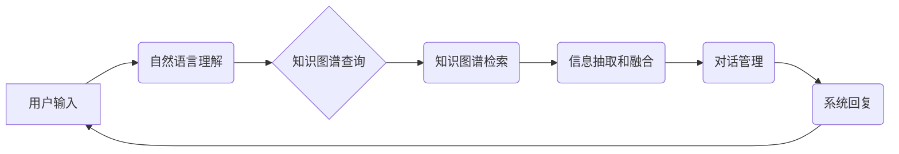

> 知识图谱、检索式对话系统、自然语言理解、信息检索、深度学习

## 1. 背景介绍

随着人工智能技术的飞速发展，对话系统作为人机交互的重要方式，已广泛应用于各个领域，例如客服、教育、娱乐等。传统的基于规则的对话系统由于缺乏灵活性，难以应对复杂的用户需求。而基于机器学习的对话系统，特别是基于深度学习的对话系统，在理解用户意图和生成自然流畅的回复方面取得了显著进展。

然而，现有的基于深度学习的对话系统主要依赖于文本数据进行训练，其知识表示能力有限，难以处理复杂的概念关系和推理问题。知识图谱作为一种结构化的知识表示形式，能够有效地存储和组织大量知识，为对话系统提供更丰富的语义理解和推理能力。

基于知识图谱的检索式对话系统，通过将用户查询转换为知识图谱中的查询，并从知识图谱中检索出相关信息，从而生成更准确、更全面的回复。这种方式能够有效地解决传统对话系统面临的知识孤岛问题，提升对话系统的智能化水平。

## 2. 核心概念与联系

### 2.1 知识图谱

知识图谱是一种基于知识表示的数据库，它以实体和关系为基本单元，将知识以结构化的形式表示出来。知识图谱能够有效地存储和组织大量知识，并支持复杂的知识推理和查询。

### 2.2 检索式对话系统

检索式对话系统是一种基于信息检索的对话系统，它将用户查询转换为检索式，并从知识库中检索出相关信息，从而生成回复。与生成式对话系统不同，检索式对话系统不生成新的文本，而是从已有的知识库中选择和组合信息。

### 2.3 核心架构

基于知识图谱的检索式对话系统通常由以下几个模块组成：

* **自然语言理解 (NLU) 模块:** 负责将用户输入的自然语言转换为机器可理解的查询。
* **知识图谱查询模块:** 负责将用户查询转换为知识图谱查询语句，并从知识图谱中检索出相关实体和关系。
* **信息抽取和融合模块:** 负责从检索到的知识图谱数据中抽取关键信息，并将其融合成自然流畅的回复。
* **对话管理模块:** 负责管理对话流程，并根据用户输入和系统状态做出相应的回复。



## 3. 核心算法原理 & 具体操作步骤

### 3.1  算法原理概述

基于知识图谱的检索式对话系统主要依赖于以下核心算法：

* **自然语言处理 (NLP) 算法:** 用于理解用户输入的自然语言，包括词性标注、依存句法分析、命名实体识别等。
* **知识图谱查询算法:** 用于将用户查询转换为知识图谱查询语句，例如 SPARQL 查询语言。
* **信息抽取算法:** 用于从知识图谱数据中抽取相关信息，例如关系抽取、实体链接等。

### 3.2  算法步骤详解

1. **用户输入预处理:** 对用户输入进行清洗、分词、词性标注等预处理操作，以便于后续的自然语言理解。
2. **意图识别:** 利用机器学习模型识别用户输入的意图，例如查询某个实体的信息、寻找两个实体之间的关系等。
3. **实体识别:** 利用机器学习模型识别用户输入中的实体，例如人名、地名、机构名等。
4. **知识图谱查询:** 将识别出的意图和实体转换为知识图谱查询语句，并发送到知识图谱数据库进行查询。
5. **结果抽取:** 从知识图谱查询结果中抽取相关信息，例如实体属性、关系描述等。
6. **信息融合:** 将抽取到的信息进行融合，生成自然流畅的回复。
7. **回复生成:** 将融合后的信息生成回复文本，并发送给用户。

### 3.3  算法优缺点

**优点:**

* **知识丰富:** 基于知识图谱的对话系统能够利用知识图谱中的丰富知识，提供更准确、更全面的回复。
* **推理能力强:** 知识图谱能够支持复杂的知识推理，使得对话系统能够理解用户隐含的意图，并提供更智能的回复。
* **可扩展性强:** 知识图谱可以不断扩展和更新，使得对话系统能够适应不断变化的知识环境。

**缺点:**

* **知识图谱构建成本高:** 构建高质量的知识图谱需要大量的专业知识和人力投入。
* **查询效率问题:** 对于规模庞大的知识图谱，查询效率可能成为瓶颈。
* **缺乏上下文理解:** 现有的基于知识图谱的对话系统在理解对话上下文方面仍然存在不足。

### 3.4  算法应用领域

基于知识图谱的检索式对话系统在以下领域具有广泛的应用前景:

* **客服机器人:** 提供更智能、更准确的客户服务。
* **教育机器人:** 提供个性化的学习辅导和知识问答。
* **搜索引擎:** 提供更精准、更丰富的搜索结果。
* **医疗诊断:** 辅助医生进行疾病诊断和治疗方案制定。

## 4. 数学模型和公式 & 详细讲解 & 举例说明

### 4.1  数学模型构建

基于知识图谱的检索式对话系统可以采用以下数学模型进行建模:

* **实体表示:** 使用向量空间模型表示实体，例如 Word2Vec 或 GloVe。
* **关系表示:** 使用向量或矩阵表示关系，例如 TransE 或 RotatE。
* **查询匹配:** 使用余弦相似度或点积等方法计算查询与实体或关系的相似度。

### 4.2  公式推导过程

例如，使用 TransE 模型表示实体和关系，其目标函数为:

$$
\min_{E} \sum_{h, r, t \in T} \left\|h + r - t\right\|_2^2
$$

其中:

* $h$ 为头实体
* $r$ 为关系
* $t$ 为尾实体
* $T$ 为训练数据

### 4.3  案例分析与讲解

假设我们有一个知识图谱，其中包含以下实体和关系:

* 实体: 张三, 李四, 北京, 上海
* 关系: 居住于

我们可以使用 TransE 模型将这些实体和关系表示为向量，并训练模型以预测关系的方向。例如，我们可以训练模型预测 "张三 居住于 北京" 的关系方向。

## 5. 项目实践：代码实例和详细解释说明

### 5.1  开发环境搭建

* Python 3.6+
* TensorFlow 或 PyTorch
* SpaCy 或 NLTK
* RDFLib 或 NetworkX

### 5.2  源代码详细实现

```python
# 导入必要的库
import spacy
from rdflib import Graph, Literal, URIRef

# 加载 SpaCy 模型
nlp = spacy.load("en_core_web_sm")

# 创建知识图谱数据库
graph = Graph()

# 添加知识图谱数据
graph.add((URIRef("http://example.org/person/zhangsan"), URIRef("http://example.org/lives_in"), URIRef("http://example.org/city/beijing")))

# 定义对话管理函数
def handle_query(query):
    # 使用 SpaCy 处理用户查询
    doc = nlp(query)

    # 识别实体和关系
    entities = [(ent.text, ent.label_) for ent in doc.ents]
    relations = [(token.text, token.dep_) for token in doc if token.dep_ in ["nsubj", "dobj"]]

    # 将实体和关系转换为知识图谱查询语句
    # ...

    # 从知识图谱数据库中检索相关信息
    # ...

    # 生成回复
    return "回复内容"

# 主程序
if __name__ == "__main__":
    while True:
        query = input("请输入查询: ")
        response = handle_query(query)
        print(response)
```

### 5.3  代码解读与分析

* 代码首先导入必要的库，并加载 SpaCy 模型。
* 然后，创建知识图谱数据库，并添加一些示例数据。
* 定义了一个 `handle_query` 函数，用于处理用户查询。
* 该函数首先使用 SpaCy 处理用户查询，识别实体和关系。
* 然后，将实体和关系转换为知识图谱查询语句，并从知识图谱数据库中检索相关信息。
* 最后，生成回复并返回给用户。

### 5.4  运行结果展示

当用户输入查询时，系统会根据查询内容从知识图谱中检索相关信息，并生成相应的回复。例如，如果用户输入 "张三 住在哪里"，系统会从知识图谱中找到 "张三 居住于 北京" 的关系，并返回 "张三 住在北京" 的回复。

## 6. 实际应用场景

### 6.1  客服机器人

基于知识图谱的检索式对话系统可以用于构建智能客服机器人，为用户提供更准确、更全面的服务。例如，用户可以向客服机器人查询产品信息、订单状态、售后服务等问题。

### 6.2  教育机器人

基于知识图谱的检索式对话系统可以用于构建教育机器人，为学生提供个性化的学习辅导和知识问答。例如，学生可以向教育机器人提问历史、地理、科学等方面的知识，机器人会根据知识图谱中的信息提供准确的答案和解释。

### 6.3  搜索引擎

基于知识图谱的检索式对话系统可以用于改进搜索引擎，提供更精准、更丰富的搜索结果。例如，用户可以向搜索引擎提问 "中国首都是哪里"，搜索引擎会从知识图谱中找到 "中国 首都 北京" 的关系，并返回 "中国 首都 是 北京" 的结果。

### 6.4  未来应用展望

随着知识图谱技术的不断发展，基于知识图谱的检索式对话系统将在更多领域得到应用，例如医疗诊断、法律咨询、金融理财等。

## 7. 工具和资源推荐

### 7.1  学习资源推荐

* **Stanford NLP Group:** https://nlp.stanford.edu/
* **DeepMind:** https://deepmind.com/
* **Allen Institute for Artificial Intelligence:** https://allenai.org/

### 7.2  开发工具推荐

* **TensorFlow:** https://www.tensorflow.org/
* **PyTorch:** https://pytorch.org/
* **SpaCy:** https://spacy.io/
* **NLTK:** https://www.nltk.org/

### 7.3  相关论文推荐

* **Knowledge Graph Embedding: A Survey**
* **TransE: Embedding Entities and Relations for Learning and Inference in Knowledge Bases**
* **RotatE: Knowledge Graph Embedding by Relational Rotation in Complex Space**

## 8. 总结：未来发展趋势与挑战

### 8.1  研究成果总结

基于知识图谱的检索式对话系统取得了显著进展，能够利用知识图谱中的丰富知识，提供更准确、更全面的回复。

### 8.2  未来发展趋势

* **更强大的知识表示:** 研究更有效的知识表示方法，例如图神经网络、知识图谱融合等。
* **更强的推理能力:** 研究更强大的知识推理算法，例如逻辑推理、因果推理等。
* **更自然的对话体验:** 研究更自然、更流畅的对话交互方式，例如多模态对话、情感理解等。

### 8.3  面临的挑战

* **知识图谱构建成本高:** 构建高质量的知识图谱需要大量的专业知识和人力投入。
* **查询效率问题:** 对于规模庞大的知识图谱，查询效率可能成为瓶颈。
* **缺乏上下文理解:** 现有的基于知识图谱的对话系统在理解对话上下文方面