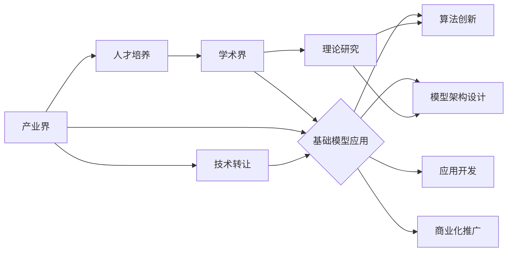

> 基础模型、学术界、产业界、合作、深度学习、人工智能、模型训练、应用开发、伦理问题

## 1. 背景介绍

近年来，深度学习技术取得了飞速发展，基础模型（Foundation Models）作为其重要组成部分，展现出强大的泛化能力和应用潜力。基础模型是指在海量数据上预训练的强大模型，能够在各种下游任务中进行微调，实现高效的学习和应用。

基础模型的出现，标志着人工智能领域迈向一个新的阶段。其强大的能力和广泛的应用场景，吸引了学术界和产业界的广泛关注。然而，基础模型的开发和应用也面临着诸多挑战，其中最为关键的是学术界与产业界的合作问题。

## 2. 核心概念与联系

**2.1 基础模型的概念**

基础模型是指在海量数据上进行预训练的深度学习模型，其目标是学习通用知识和表示能力，能够在各种下游任务中进行微调。

**2.2 学术界与产业界的合作**

学术界和产业界在基础模型的开发和应用中扮演着不同的角色，但两者之间存在着密切的联系。

* **学术界**：负责基础模型的理论研究、算法创新和模型架构设计。他们致力于探索基础模型的本质、原理和潜力，并将其应用于各种科学研究领域。
* **产业界**：负责基础模型的实际应用开发和商业化推广。他们利用基础模型的强大能力，开发出各种应用产品和服务，为社会带来实际价值。

**2.3 合作模式**

学术界与产业界之间可以采用多种合作模式，例如：

* **联合研究项目**：双方共同参与基础模型的研发，共享资源和成果。
* **技术转让**：学术界将基础模型的技术成果转让给产业界，用于商业化开发。
* **人才培养**：产业界提供实习机会和培训项目，培养学术界人才的实际应用能力。

**2.4 合作关系图**



## 3. 核心算法原理 & 具体操作步骤

**3.1 算法原理概述**

基础模型的训练主要基于自监督学习和迁移学习的原理。

* **自监督学习**：通过设计特殊的预训练任务，例如语言建模、图像分类等，让模型在无标签数据上学习到通用的知识和表示能力。
* **迁移学习**：将预训练好的基础模型迁移到下游任务中进行微调，利用模型已经学习到的知识，快速适应新的任务。

**3.2 算法步骤详解**

1. **数据预处理**: 收集海量数据，并进行清洗、格式化和分词等预处理操作。
2. **模型架构设计**: 选择合适的模型架构，例如Transformer、BERT、GPT等，并根据任务需求进行调整。
3. **预训练**: 在预训练阶段，使用自监督学习任务，让模型学习到语言或图像的表示能力。
4. **微调**: 将预训练好的模型迁移到下游任务中，使用少量标注数据进行微调，使其能够完成特定任务。
5. **评估**: 使用测试集评估模型的性能，并根据结果进行模型优化和调整。

**3.3 算法优缺点**

* **优点**:
    * 泛化能力强，能够应用于多种下游任务。
    * 训练效率高，只需要少量标注数据即可达到较好的效果。
    * 可复用性高，可以将预训练好的模型用于不同的应用场景。
* **缺点**:
    * 训练成本高，需要大量的计算资源和数据。
    * 模型规模大，部署和推理成本较高。
    * 存在潜在的偏差和风险，需要进行伦理审查和安全评估。

**3.4 算法应用领域**

基础模型在各个领域都有广泛的应用，例如：

* **自然语言处理**: 文本生成、机器翻译、问答系统等。
* **计算机视觉**: 图像识别、目标检测、图像生成等。
* **语音识别**: 语音转文本、语音合成等。
* **药物研发**: 蛋白质结构预测、药物发现等。

## 4. 数学模型和公式 & 详细讲解 & 举例说明

**4.1 数学模型构建**

基础模型的训练过程可以看作是一个优化问题，目标是找到一个模型参数，使得模型在训练数据上的损失函数最小。

损失函数通常是模型预测值与真实值的差值，例如均方误差（MSE）或交叉熵损失（Cross-Entropy Loss）。

**4.2 公式推导过程**

模型参数的更新可以使用梯度下降算法，其核心公式如下：

$$
\theta_{t+1} = \theta_t - \eta \nabla L(\theta_t)
$$

其中：

* $\theta$：模型参数
* $t$：迭代次数
* $\eta$：学习率
* $L(\theta)$：损失函数

**4.3 案例分析与讲解**

例如，在语言建模任务中，可以使用交叉熵损失函数来衡量模型预测的概率分布与真实概率分布之间的差异。

$$
L(\theta) = -\sum_{i=1}^{N} y_i \log p(y_i|\theta)
$$

其中：

* $N$：序列长度
* $y_i$：真实标签
* $p(y_i|\theta)$：模型预测的概率

通过梯度下降算法，不断更新模型参数，使得损失函数最小化，从而提高模型的语言建模能力。

## 5. 项目实践：代码实例和详细解释说明

**5.1 开发环境搭建**

使用Python语言和深度学习框架TensorFlow或PyTorch进行基础模型的开发和训练。

**5.2 源代码详细实现**

```python
import tensorflow as tf

# 定义模型架构
model = tf.keras.Sequential([
    tf.keras.layers.Embedding(vocab_size, embedding_dim),
    tf.keras.layers.LSTM(units),
    tf.keras.layers.Dense(vocab_size, activation='softmax')
])

# 定义损失函数和优化器
loss_fn = tf.keras.losses.SparseCategoricalCrossentropy(from_logits=True)
optimizer = tf.keras.optimizers.Adam(learning_rate=0.001)

# 训练模型
model.compile(optimizer=optimizer, loss=loss_fn)
model.fit(train_data, train_labels, epochs=10)

# 评估模型
loss, accuracy = model.evaluate(test_data, test_labels)
print('Loss:', loss)
print('Accuracy:', accuracy)
```

**5.3 代码解读与分析**

* 代码首先定义了模型架构，包括嵌入层、LSTM层和全连接层。
* 然后定义了损失函数和优化器，用于训练模型。
* 接着使用`model.fit()`函数训练模型，传入训练数据和标签。
* 最后使用`model.evaluate()`函数评估模型的性能。

**5.4 运行结果展示**

训练完成后，可以将模型应用于文本生成、机器翻译等下游任务，并根据实际应用场景进行评估和优化。

## 6. 实际应用场景

基础模型在各个领域都有广泛的应用，例如：

* **自然语言处理**: 文本生成、机器翻译、问答系统等。
* **计算机视觉**: 图像识别、目标检测、图像生成等。
* **语音识别**: 语音转文本、语音合成等。
* **药物研发**: 蛋白质结构预测、药物发现等。

**6.1 案例分析**

* **文本生成**: 使用预训练好的语言模型，可以生成高质量的文本内容，例如新闻报道、小说、诗歌等。
* **图像识别**: 使用预训练好的图像模型，可以识别图像中的物体、场景和人物，并进行分类和定位。
* **语音识别**: 使用预训练好的语音模型，可以将语音信号转换为文本，实现语音转文本的功能。

**6.2 未来应用展望**

基础模型的应用前景广阔，未来将应用于更多领域，例如：

* **个性化教育**: 根据学生的学习情况，提供个性化的学习内容和辅导。
* **医疗诊断**: 辅助医生进行疾病诊断，提高诊断准确率。
* **自动驾驶**: 帮助自动驾驶汽车感知周围环境，做出安全决策。

## 7. 工具和资源推荐

**7.1 学习资源推荐**

* **书籍**:
    * 《深度学习》
    * 《自然语言处理》
    * 《计算机视觉》
* **在线课程**:
    * Coursera
    * edX
    * Udacity

**7.2 开发工具推荐**

* **深度学习框架**: TensorFlow, PyTorch
* **编程语言**: Python
* **云计算平台**: AWS, Azure, GCP

**7.3 相关论文推荐**

* 《BERT: Pre-training of Deep Bidirectional Transformers for Language Understanding》
* 《GPT-3: Language Models are Few-Shot Learners》
* 《DALL-E: Creating Images from Text》

## 8. 总结：未来发展趋势与挑战

**8.1 研究成果总结**

基础模型的开发取得了显著进展，其强大的能力和广泛的应用场景，为人工智能领域的发展带来了新的机遇。

**8.2 未来发展趋势**

* 模型规模的进一步扩大
* 跨模态基础模型的开发
* 更加高效的训练方法
* 更加注重模型的可解释性和安全性

**8.3 面临的挑战**

* 训练成本高
* 模型规模大
* 存在潜在的偏差和风险

**8.4 研究展望**

未来研究将继续探索基础模型的潜力，开发更加强大、高效、安全和可解释的基础模型，推动人工智能技术的发展和应用。

## 9. 附录：常见问题与解答

**9.1 基础模型与传统机器学习模型有什么区别？**

基础模型与传统机器学习模型的主要区别在于：

* 基础模型在海量数据上进行预训练，学习到通用的知识和表示能力，而传统机器学习模型需要针对每个具体任务进行训练。
* 基础模型的泛化能力强，能够应用于多种下游任务，而传统机器学习模型的适用范围相对局限。

**9.2 如何选择合适的基础模型？**

选择合适的基础模型需要考虑以下因素：

* 任务类型
* 数据规模
* 计算资源
* 性能要求

**9.3 如何评估基础模型的性能？**

基础模型的性能可以根据具体任务进行评估，例如：

* 自然语言处理任务：可以使用准确率、召回率、F1-score等指标。
* 计算机视觉任务：可以使用准确率、mAP等指标。

**9.4 基础模型存在哪些风险？**

基础模型存在以下风险：

* 偏差和偏见：基础模型的训练数据可能存在偏差，导致模型输出结果存在偏见。
* 安全风险：恶意攻击者可以利用基础模型进行攻击，例如生成虚假信息、进行身份盗窃等。
* 伦理问题：基础模型的应用可能引发伦理问题，例如隐私泄露、算法歧视等。


作者：禅与计算机程序设计艺术 / Zen and the Art of Computer Programming 
<end_of_turn>