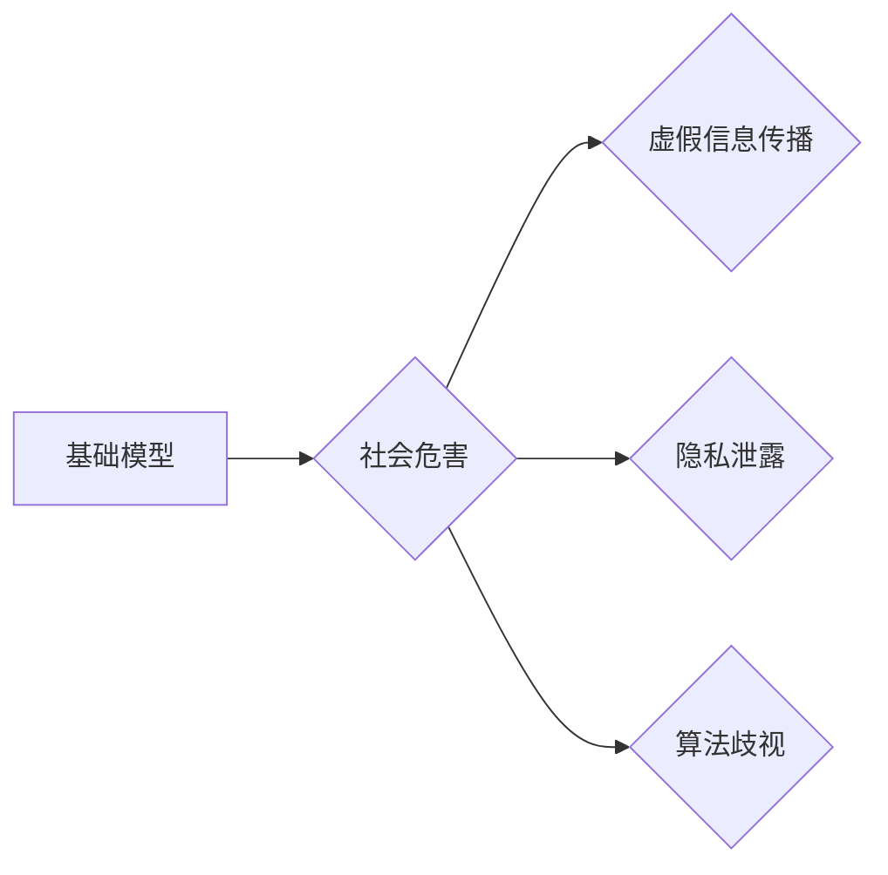

> 基础模型、人工智能、社会危害、伦理风险、可解释性、公平性、隐私、安全、监管

## 1. 背景介绍

近年来，基础模型（Foundation Models）在人工智能领域取得了突破性的进展，其强大的泛化能力和适应性使其应用于越来越广泛的领域，例如自然语言处理、计算机视觉、代码生成等。然而，基础模型的强大也带来了潜在的社会危害，需要我们认真评估和应对。

基础模型通常是指在海量数据上训练的大规模深度学习模型，其参数数量巨大，能够学习到复杂的模式和知识。由于其强大的能力，基础模型可以被用于许多有益的应用，例如：

* **提高医疗诊断的准确性:** 基于基础模型的医疗图像分析系统可以帮助医生更准确地诊断疾病。
* **个性化教育:** 基于基础模型的教育平台可以根据学生的学习进度和风格提供个性化的学习内容。
* **加速科学发现:** 基于基础模型的科学研究工具可以帮助科学家更快地发现新的知识。

然而，基础模型也可能被用于恶意目的，例如：

* **生成虚假信息:** 基于基础模型可以生成逼真的文本、图像和视频，用于制造虚假信息和进行网络攻击。
* **进行身份盗窃:** 基于基础模型可以学习到用户的语音和面部特征，用于进行身份盗窃和欺诈。
* **传播仇恨言论:** 基于基础模型可以被训练来生成仇恨言论和歧视性内容，加剧社会分化。

## 2. 核心概念与联系

### 2.1 基础模型

基础模型是指在海量数据上训练的大规模深度学习模型，其参数数量巨大，能够学习到复杂的模式和知识。

### 2.2 社会危害

社会危害是指基础模型的应用可能带来的负面影响，例如虚假信息传播、隐私泄露、算法歧视等。

### 2.3 伦理风险

伦理风险是指基础模型的应用可能带来的道德问题，例如责任归属、算法透明度、数据隐私等。

**基础模型与社会危害的联系**

基础模型的强大能力使其能够被用于许多有益的应用，但也可能被用于恶意目的，带来社会危害。

**Mermaid 流程图**



## 3. 核心算法原理 & 具体操作步骤

### 3.1 算法原理概述

基础模型通常基于深度学习算法，例如Transformer、BERT等。这些算法通过多层神经网络结构学习数据中的模式和关系，并生成相应的输出。

### 3.2 算法步骤详解

1. **数据收集和预处理:** 收集大量相关数据，并进行清洗、格式化等预处理操作。
2. **模型架构设计:** 根据任务需求设计深度学习模型的架构，例如Transformer、BERT等。
3. **模型训练:** 使用训练数据训练模型，调整模型参数，使其能够准确地完成任务。
4. **模型评估:** 使用测试数据评估模型的性能，例如准确率、召回率等。
5. **模型部署:** 将训练好的模型部署到实际应用场景中。

### 3.3 算法优缺点

**优点:**

* **强大的泛化能力:** 基于海量数据的训练，基础模型能够学习到更广泛的知识和模式，并应用于不同的任务。
* **适应性强:** 基于基础模型可以进行微调，使其适应不同的应用场景和任务需求。
* **效率高:** 基于基础模型的应用可以节省训练时间和资源。

**缺点:**

* **数据依赖性强:** 基础模型的性能取决于训练数据的质量和数量。
* **可解释性差:** 深度学习模型的决策过程复杂，难以解释其背后的逻辑。
* **伦理风险:** 基础模型的应用可能带来伦理风险，例如算法歧视、隐私泄露等。

### 3.4 算法应用领域

基础模型已广泛应用于以下领域：

* **自然语言处理:** 文本生成、机器翻译、问答系统等。
* **计算机视觉:** 图像识别、物体检测、图像生成等。
* **代码生成:** 代码自动完成、代码翻译等。
* **语音识别:** 语音转文本、语音合成等。

## 4. 数学模型和公式 & 详细讲解 & 举例说明

### 4.1 数学模型构建

基础模型的训练过程可以看作是一个优化问题，目标是找到模型参数，使得模型在训练数据上的损失函数最小。

损失函数通常是模型预测值与真实值的差值，例如均方误差（MSE）或交叉熵损失（Cross-Entropy Loss）。

### 4.2 公式推导过程

**均方误差 (MSE):**

$$MSE = \frac{1}{n} \sum_{i=1}^{n} (y_i - \hat{y}_i)^2$$

其中：

* $y_i$ 是真实值
* $\hat{y}_i$ 是模型预测值
* $n$ 是样本数量

**交叉熵损失 (Cross-Entropy Loss):**

$$CE = -\frac{1}{n} \sum_{i=1}^{n} y_i \log(\hat{y}_i) + (1-y_i) \log(1-\hat{y}_i)$$

其中：

* $y_i$ 是真实值（0或1）
* $\hat{y}_i$ 是模型预测值（0到1之间的概率）

### 4.3 案例分析与讲解

假设我们训练一个图像分类模型，目标是识别猫和狗的图片。

我们可以使用MSE损失函数来评估模型的性能。

如果模型预测的猫的概率为0.8，而真实值为1，则MSE损失为：

$$MSE = \frac{1}{1} (1 - 0.8)^2 = 0.04$$

## 5. 项目实践：代码实例和详细解释说明

### 5.1 开发环境搭建

* Python 3.7+
* TensorFlow 2.0+
* PyTorch 1.0+

### 5.2 源代码详细实现

```python
# 使用 TensorFlow 框架实现一个简单的图像分类模型

import tensorflow as tf

# 定义模型架构
model = tf.keras.models.Sequential([
    tf.keras.layers.Conv2D(32, (3, 3), activation='relu', input_shape=(28, 28, 1)),
    tf.keras.layers.MaxPooling2D((2, 2)),
    tf.keras.layers.Conv2D(64, (3, 3), activation='relu'),
    tf.keras.layers.MaxPooling2D((2, 2)),
    tf.keras.layers.Flatten(),
    tf.keras.layers.Dense(10, activation='softmax')
])

# 编译模型
model.compile(optimizer='adam',
              loss='sparse_categorical_crossentropy',
              metrics=['accuracy'])

# 训练模型
model.fit(x_train, y_train, epochs=10)

# 评估模型
loss, accuracy = model.evaluate(x_test, y_test)
print('Test loss:', loss)
print('Test accuracy:', accuracy)
```

### 5.3 代码解读与分析

* **模型架构:** 该模型是一个简单的卷积神经网络，包含两层卷积层、两层池化层和一层全连接层。
* **激活函数:** 使用ReLU激活函数，可以提高模型的表达能力。
* **损失函数:** 使用稀疏类别交叉熵损失函数，适合多分类问题。
* **优化器:** 使用Adam优化器，可以加速模型训练。

### 5.4 运行结果展示

训练完成后，可以评估模型在测试集上的性能，例如准确率。

## 6. 实际应用场景

基础模型已在许多实际应用场景中得到应用，例如：

* **医疗诊断:** 基于基础模型的医疗图像分析系统可以帮助医生更准确地诊断疾病。
* **个性化教育:** 基于基础模型的教育平台可以根据学生的学习进度和风格提供个性化的学习内容。
* **自然语言处理:** 基于基础模型的聊天机器人可以进行更自然、更流畅的对话。

### 6.4 未来应用展望

基础模型的应用前景广阔，未来可能在以下领域得到更广泛的应用：

* **科学研究:** 基于基础模型的科学研究工具可以帮助科学家更快地发现新的知识。
* **自动驾驶:** 基于基础模型的自动驾驶系统可以提高驾驶安全性和效率。
* **机器人技术:** 基于基础模型的机器人可以更好地理解和响应人类指令。

## 7. 工具和资源推荐

### 7.1 学习资源推荐

* **课程:**
    * 深度学习 Specialization (Coursera)
    * CS231n: Convolutional Neural Networks for Visual Recognition (Stanford)
* **书籍:**
    * Deep Learning (Ian Goodfellow, Yoshua Bengio, Aaron Courville)
    * Hands-On Machine Learning with Scikit-Learn, Keras & TensorFlow (Aurélien Géron)
* **博客:**
    * The Gradient
    * Towards Data Science

### 7.2 开发工具推荐

* **TensorFlow:** 开源深度学习框架，支持多种硬件平台。
* **PyTorch:** 开源深度学习框架，以其灵活性和易用性而闻名。
* **Jupyter Notebook:** 用于交互式编程和数据可视化的工具。

### 7.3 相关论文推荐

* **Attention Is All You Need (Vaswani et al., 2017):** 提出了Transformer模型架构，为自然语言处理领域带来了革命性的进展。
* **BERT: Pre-training of Deep Bidirectional Transformers for Language Understanding (Devlin et al., 2018):** 提出了BERT模型，在许多自然语言处理任务上取得了state-of-the-art性能。

## 8. 总结：未来发展趋势与挑战

### 8.1 研究成果总结

基础模型在人工智能领域取得了突破性的进展，其强大的能力和广泛的应用前景使其成为未来人工智能发展的重要方向。

### 8.2 未来发展趋势

* **模型规模的进一步扩大:** 未来基础模型的规模将继续扩大，参数数量将达到数千亿甚至万亿级别。
* **多模态学习:** 基础模型将能够处理多种数据类型，例如文本、图像、音频等，实现跨模态的理解和生成。
* **可解释性和透明度:** 研究人员将致力于提高基础模型的可解释性和透明度，使其决策过程更加可理解。

### 8.3 面临的挑战

* **数据安全和隐私:** 基础模型的训练需要海量数据，如何保证数据安全和隐私是一个重要的挑战。
* **算法偏见:** 基础模型可能学习到数据中的偏见，导致算法歧视。
* **伦理风险:** 基础模型的应用可能带来伦理风险，例如虚假信息传播、就业替代等。

### 8.4 研究展望

未来研究将集中在以下几个方面：

* **开发更安全、更可靠的基础模型:** 研究人员将致力于开发能够识别和缓解算法偏见和安全漏洞的基础模型。
* **提高基础模型的可解释性和透明度:** 研究人员将探索新的方法，使基础模型的决策过程更加可理解。
* **探索基础模型在更多领域的应用:** 基础模型的应用前景广阔，未来将探索其在更多领域的应用，例如科学研究、医疗保健、教育等。

## 9. 附录：常见问题与解答

**Q1: 基础模型的训练需要多少数据？**

A1: 基础模型的训练需要海量数据，通常需要数百万甚至数十亿个样本。

**Q2: 基础模型的训练需要多长时间？**

A2: 基础模型的训练时间取决于模型规模、数据量和硬件资源等因素，通常需要几天甚至几周的时间。

**Q3: 如何评估基础模型的性能？**

A3: 基础模型的性能可以通过各种指标评估，例如准确率、召回率、F1-score等。

**Q4: 如何应对基础模型的伦理风险？**

A4: 应对