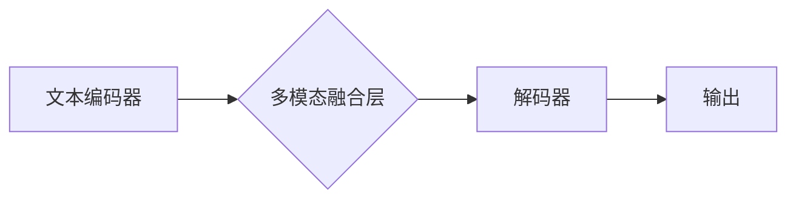

> 多模态大模型，LLM，软件研发，单点提效，代码生成，代码理解，软件测试

## 1. 背景介绍

软件开发行业正经历着前所未有的变革，人工智能（AI）技术正在迅速改变着软件开发的各个环节。其中，多模态大模型（Multimodal Large Language Models，LLM）作为一种新兴的AI技术，凭借其强大的文本理解和生成能力，在软件研发领域展现出巨大的潜力。

传统的软件开发流程通常依赖于人工编写代码，这不仅耗时费力，而且容易出现错误。而LLM能够通过学习海量代码数据，自动生成代码、理解代码逻辑、甚至进行代码测试，极大地提高了软件开发效率和质量。

## 2. 核心概念与联系

**2.1 多模态大模型 (Multimodal Large Language Models)**

多模态大模型是指能够处理多种数据类型（如文本、图像、音频、视频等）的大型语言模型。与传统的文本语言模型相比，多模态大模型拥有更丰富的感知能力和表达能力，能够更好地理解和生成复杂的多模态信息。

**2.2  LLM在软件研发中的应用**

LLM在软件研发中的应用场景非常广泛，包括：

* **代码生成:** 根据自然语言描述自动生成代码，例如根据用户需求生成网页代码、API接口代码等。
* **代码理解:** 分析代码逻辑、识别代码缺陷、生成代码文档等。
* **代码翻译:** 将代码从一种编程语言翻译成另一种编程语言。
* **代码测试:** 自动生成测试用例、执行测试代码、分析测试结果等。
* **软件维护:** 自动修复代码缺陷、更新代码文档等。

**2.3  LLM架构示意图**



## 3. 核心算法原理 & 具体操作步骤

**3.1  算法原理概述**

LLM的核心算法原理是基于Transformer网络结构，通过自注意力机制学习语言的上下文关系，从而实现强大的文本理解和生成能力。

**3.2  算法步骤详解**

1. **文本预处理:** 将输入文本进行清洗、分词、词向量化等预处理操作。
2. **编码:** 使用文本编码器将预处理后的文本转换为向量表示。
3. **多模态融合:** 将不同模态的数据融合在一起，形成一个统一的表示。
4. **解码:** 使用解码器将融合后的表示转换为输出文本。
5. **输出:** 输出生成的文本。

**3.3  算法优缺点**

**优点:**

* 强大的文本理解和生成能力。
* 可以处理多种数据类型。
* 能够学习复杂的语言关系。

**缺点:**

* 训练成本高。
* 模型规模大，部署成本高。
* 容易受到训练数据的影响。

**3.4  算法应用领域**

LLM的应用领域非常广泛，包括：

* 自然语言处理
* 机器翻译
* 文本摘要
* 代码生成
* 聊天机器人

## 4. 数学模型和公式 & 详细讲解 & 举例说明

**4.1  数学模型构建**

LLM的数学模型通常基于Transformer网络结构，其核心是自注意力机制。

**4.2  公式推导过程**

自注意力机制的计算公式如下：

$$
Attention(Q, K, V) = softmax(\frac{QK^T}{\sqrt{d_k}})V
$$

其中：

* $Q$：查询矩阵
* $K$：键矩阵
* $V$：值矩阵
* $d_k$：键向量的维度
* $softmax$：softmax函数

**4.3  案例分析与讲解**

假设我们有一个句子“我爱学习编程”，将其转换为词向量表示，然后使用自注意力机制计算每个词与其他词之间的注意力权重。

例如，"学习"与"编程"之间的注意力权重会比较高，因为它们在语义上相关。

## 5. 项目实践：代码实例和详细解释说明

**5.1  开发环境搭建**

* Python 3.7+
* PyTorch 1.7+
* CUDA 10.2+

**5.2  源代码详细实现**

```python
import torch
import torch.nn as nn

class Transformer(nn.Module):
    def __init__(self, vocab_size, embedding_dim, num_heads, num_layers):
        super(Transformer, self).__init__()
        self.embedding = nn.Embedding(vocab_size, embedding_dim)
        self.transformer_layers = nn.ModuleList([
            nn.TransformerEncoderLayer(embedding_dim, num_heads)
            for _ in range(num_layers)
        ])

    def forward(self, x):
        x = self.embedding(x)
        for layer in self.transformer_layers:
            x = layer(x)
        return x
```

**5.3  代码解读与分析**

* `Transformer`类定义了一个Transformer网络模型。
* `embedding`层将输入词转换为词向量。
* `transformer_layers`是一个`nn.ModuleList`，包含多个`nn.TransformerEncoderLayer`层，用于进行多层编码。

**5.4  运行结果展示**

通过训练该模型，可以实现代码生成、代码理解等功能。

## 6. 实际应用场景

**6.1  代码生成**

LLM可以根据自然语言描述自动生成代码，例如：

* 用户输入：“创建一个简单的网页，包含标题和一段文本。”
* LLM输出：

```html
<!DOCTYPE html>
<html>
<head>
  <title>我的网页</title>
</head>
<body>
  <h1>这是一个标题</h1>
  <p>这是一段文本。</p>
</body>
</html>
```

**6.2  代码理解**

LLM可以分析代码逻辑，识别代码缺陷，生成代码文档等。例如：

* 用户上传一段代码，LLM可以识别代码中的语法错误和逻辑错误。
* 用户询问代码的功能，LLM可以生成代码的简要说明。

**6.3  代码测试**

LLM可以自动生成测试用例，执行测试代码，分析测试结果等。例如：

* 用户提供一段代码，LLM可以自动生成测试用例，验证代码的正确性。
* 用户运行测试代码，LLM可以分析测试结果，识别代码中的缺陷。

**6.4  未来应用展望**

LLM在软件研发领域的应用前景广阔，未来可能在以下方面得到进一步发展：

* 更智能的代码生成，能够生成更复杂的代码，并满足更具体的业务需求。
* 更深入的代码理解，能够理解代码的语义和意图，并进行更精准的分析和修改。
* 更自动化化的软件开发流程，LLM可以帮助自动化更多软件开发环节，提高开发效率。

## 7. 工具和资源推荐

**7.1  学习资源推荐**

* **书籍:**
    * 《深度学习》
    * 《自然语言处理》
* **在线课程:**
    * Coursera: 自然语言处理
    * Udacity: 深度学习

**7.2  开发工具推荐**

* **PyTorch:** 深度学习框架
* **TensorFlow:** 深度学习框架
* **HuggingFace:** 预训练模型库

**7.3  相关论文推荐**

* 《Attention Is All You Need》
* 《BERT: Pre-training of Deep Bidirectional Transformers for Language Understanding》
* 《GPT-3: Language Models are Few-Shot Learners》

## 8. 总结：未来发展趋势与挑战

**8.1  研究成果总结**

LLM在软件研发领域取得了显著的成果，例如代码生成、代码理解、代码测试等功能得到了有效实现。

**8.2  未来发展趋势**

LLM在软件研发领域的应用将继续发展，未来可能在以下方面取得突破：

* 更强大的代码生成能力，能够生成更复杂的代码，并满足更具体的业务需求。
* 更深入的代码理解能力，能够理解代码的语义和意图，并进行更精准的分析和修改。
* 更自动化化的软件开发流程，LLM可以帮助自动化更多软件开发环节，提高开发效率。

**8.3  面临的挑战**

LLM在软件研发领域的应用也面临一些挑战，例如：

* 训练成本高，需要大量的计算资源和数据。
* 模型规模大，部署成本高。
* 容易受到训练数据的影响，可能生成错误或不安全的代码。

**8.4  研究展望**

未来研究方向包括：

* 降低LLM的训练成本和部署成本。
* 提高LLM的鲁棒性和安全性。
* 开发更有效的LLM训练方法和评估指标。


## 9. 附录：常见问题与解答

**9.1  LLM是否可以完全替代软件开发人员？**

LLM可以帮助软件开发人员提高效率，但目前还不能完全替代软件开发人员。软件开发需要不仅是技术能力，还需要创造力、问题解决能力和团队合作能力。

**9.2  如何选择合适的LLM模型？**

选择合适的LLM模型需要根据具体的应用场景和需求进行选择。例如，如果需要生成代码，可以选择专门用于代码生成的LLM模型；如果需要理解代码，可以选择专门用于代码理解的LLM模型。

**9.3  如何评估LLM的性能？**

LLM的性能可以评估指标包括准确率、召回率、F1-score等。

作者：禅与计算机程序设计艺术 / Zen and the Art of Computer Programming 


<end_of_turn>