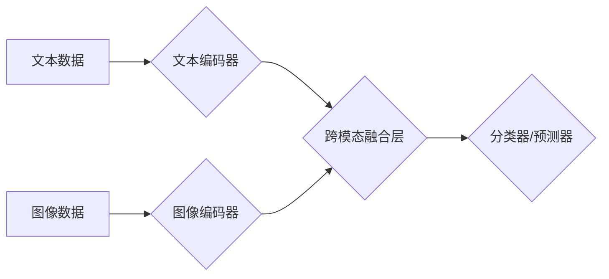

> 多模态大模型，跨模态学习，图像识别，自然语言处理，语音识别，多媒体理解，深度学习，Transformer

## 1. 背景介绍

近年来，人工智能（AI）技术取得了飞速发展，其中大模型在自然语言处理（NLP）、计算机视觉（CV）等领域展现出强大的能力。然而，现实世界的信息往往是多模态的，例如文本、图像、音频、视频等多种形式的混合。单模态模型难以捕捉跨模态之间的复杂关系，限制了AI在多模态场景下的应用。

多模态大模型（Multimodal Large Models，MLMs）应运而生，旨在学习和理解多种模态数据之间的关系，从而实现更全面、更智能的认知和交互。MLMs 能够将不同模态的信息融合，提升模型的理解能力和泛化能力，在图像字幕生成、视频问答、跨模态检索等领域展现出巨大的潜力。

## 2. 核心概念与联系

**2.1 多模态学习**

多模态学习是指训练模型从多个模态数据中学习知识，并理解不同模态之间的关系。它旨在构建一个能够跨模态感知、理解和交互的智能系统。

**2.2 多模态大模型**

多模态大模型是指拥有海量参数，能够处理多种模态数据的深度学习模型。它通过学习不同模态之间的映射关系，实现跨模态的知识表示和推理。

**2.3 跨模态组合技术**

跨模态组合技术是指将不同模态的数据融合在一起，构建一个统一的表示，以便模型更好地理解和处理多模态信息。常见的跨模态组合技术包括：

* **早期融合:** 将不同模态的数据在特征提取阶段进行融合。
* **晚期融合:** 将不同模态的特征分别提取，然后在分类或预测阶段进行融合。
* **注意力机制:** 利用注意力机制学习不同模态之间的重要关系，动态地权重不同模态的信息。

**2.4 Mermaid 流程图**



## 3. 核心算法原理 & 具体操作步骤

### 3.1  算法原理概述

多模态大模型的训练通常基于深度学习框架，例如 PyTorch 和 TensorFlow。常用的算法包括：

* **Transformer:** Transformer 是一种强大的序列建模架构，能够有效地捕捉长距离依赖关系。它在 NLP 领域取得了巨大成功，也逐渐应用于多模态学习。
* **Vision Transformer (ViT):** ViT 将图像分割成一系列patch，然后将其作为序列输入 Transformer 模型进行处理。
* **Multimodal Transformer:** Multimodal Transformer 将文本和图像等不同模态的数据分别编码，然后通过跨模态注意力机制进行融合。

### 3.2  算法步骤详解

1. **数据预处理:** 将多模态数据进行清洗、格式化和预处理，例如文本分词、图像裁剪、音频降噪等。
2. **模态编码:** 使用不同的编码器对每个模态的数据进行编码，例如使用 BERT 对文本进行编码，使用 ResNet 对图像进行编码。
3. **跨模态融合:** 使用跨模态注意力机制或其他融合技术将不同模态的编码结果进行融合，形成一个统一的表示。
4. **分类或预测:** 使用分类器或预测器对融合后的表示进行分类或预测，例如进行图像字幕生成、视频问答等任务。
5. **模型训练:** 使用交叉熵损失函数或其他损失函数对模型进行训练，优化模型参数。

### 3.3  算法优缺点

**优点:**

* 能够学习和理解多模态之间的复杂关系。
* 提升模型的理解能力和泛化能力。
* 在多模态任务中取得了优异的性能。

**缺点:**

* 训练成本高，需要大量的计算资源和数据。
* 模型复杂度高，难以解释和调试。
* 跨模态融合技术仍处于发展阶段，存在一些挑战。

### 3.4  算法应用领域

* **图像字幕生成:** 将图像转换为文本描述。
* **视频问答:** 根据视频内容回答问题。
* **跨模态检索:** 根据文本查询图像或视频。
* **多媒体理解:** 理解和分析多媒体内容。
* **机器人交互:** 帮助机器人理解和响应人类的多模态指令。

## 4. 数学模型和公式 & 详细讲解 & 举例说明

### 4.1  数学模型构建

多模态大模型的数学模型通常基于深度神经网络，其结构可以分为编码器和解码器两部分。

* **编码器:** 用于将不同模态的数据编码成特征向量。
* **解码器:** 用于根据编码后的特征向量生成目标输出。

### 4.2  公式推导过程

跨模态注意力机制的公式推导过程如下：

$$
\text{Attention}(Q, K, V) = \text{softmax}\left(\frac{Q K^T}{\sqrt{d_k}}\right) V
$$

其中：

* $Q$：查询矩阵
* $K$：键矩阵
* $V$：值矩阵
* $d_k$：键向量的维度

### 4.3  案例分析与讲解

假设我们有一个图像和文本对，我们需要使用跨模态注意力机制学习图像和文本之间的关系。

* 将图像编码成图像特征向量 $I$。
* 将文本编码成文本特征向量 $T$。
* 使用跨模态注意力机制计算图像和文本之间的注意力权重 $A$。
* 将注意力权重与图像特征向量 $I$ 和文本特征向量 $T$ 进行加权求和，得到融合后的特征向量 $F$。

$$
F = A \cdot I + (1-A) \cdot T
$$

## 5. 项目实践：代码实例和详细解释说明

### 5.1  开发环境搭建

* Python 3.7+
* PyTorch 1.7+
* CUDA 10.2+

### 5.2  源代码详细实现

```python
import torch
import torch.nn as nn

class MultimodalTransformer(nn.Module):
    def __init__(self, image_dim, text_dim, hidden_dim, num_heads):
        super(MultimodalTransformer, self).__init__()
        self.image_encoder = nn.Linear(image_dim, hidden_dim)
        self.text_encoder = nn.Linear(text_dim, hidden_dim)
        self.cross_modal_attention = nn.MultiheadAttention(hidden_dim, num_heads)

    def forward(self, image_features, text_features):
        image_features = self.image_encoder(image_features)
        text_features = self.text_encoder(text_features)
        # Cross-modal attention
        attention_output, _ = self.cross_modal_attention(image_features, text_features, text_features)
        # Concatenate features
        fused_features = torch.cat([image_features, attention_output], dim=-1)
        return fused_features
```

### 5.3  代码解读与分析

* `MultimodalTransformer` 类定义了一个多模态Transformer模型。
* `image_encoder` 和 `text_encoder` 用于分别编码图像和文本特征。
* `cross_modal_attention` 使用多头注意力机制学习图像和文本之间的关系。
* `forward` 方法定义了模型的正向传播过程。

### 5.4  运行结果展示

运行代码并使用训练好的模型进行预测，可以得到图像和文本之间的关系表示，例如图像字幕生成、视频问答等任务的结果。

## 6. 实际应用场景

### 6.1  图像字幕生成

多模态大模型可以将图像转换为文本描述，例如将一张图片描述为“一只小狗在公园里玩耍”。

### 6.2  视频问答

多模态大模型可以根据视频内容回答问题，例如“视频中发生了什么？”、“视频中的人物是谁？”。

### 6.3  跨模态检索

多模态大模型可以根据文本查询图像或视频，例如根据“猫”这个文本查询所有与猫相关的图像或视频。

### 6.4  未来应用展望

* **增强现实 (AR) 和虚拟现实 (VR):** 为 AR 和 VR 应用提供更丰富的交互体验。
* **智能家居:** 理解用户的多模态指令，控制智能家居设备。
* **医疗诊断:** 辅助医生进行诊断，例如分析病人的影像数据和病历信息。

## 7. 工具和资源推荐

### 7.1  学习资源推荐

* **书籍:**
    * 《深度学习》
    * 《自然语言处理》
    * 《计算机视觉》
* **在线课程:**
    * Coursera
    * edX
    * Udacity

### 7.2  开发工具推荐

* **PyTorch:** 深度学习框架
* **TensorFlow:** 深度学习框架
* **HuggingFace:** 预训练模型库

### 7.3  相关论文推荐

* **BERT:** Devlin et al. (2018)
* **GPT-3:** Brown et al. (2020)
* **DALL-E:** Radford et al. (2021)

## 8. 总结：未来发展趋势与挑战

### 8.1  研究成果总结

多模态大模型在图像字幕生成、视频问答、跨模态检索等领域取得了显著进展，展现出强大的应用潜力。

### 8.2  未来发展趋势

* **模型规模和能力的提升:** 训练更大规模、更强大的多模态大模型。
* **跨模态融合技术的创新:** 开发更有效的跨模态融合技术，更好地理解不同模态之间的关系。
* **应用场景的拓展:** 将多模态大模型应用于更多领域，例如医疗、教育、金融等。

### 8.3  面临的挑战

* **数据获取和标注:** 多模态数据的获取和标注成本高，数据质量难以保证。
* **模型训练和推理效率:** 训练和推理大型多模态模型需要大量的计算资源。
* **模型解释性和可解释性:** 多模态大模型的决策过程复杂，难以解释和理解。

### 8.4  研究展望

未来，多模态大模型的研究将继续朝着更强大、更智能、更可解释的方向发展，为人类社会带来更多价值。

## 9. 附录：常见问题与解答

**Q1: 多模态大模型的训练数据有哪些？**

**A1:** 多模态大模型的训练数据通常包括文本、图像、音频、视频等多种模态的数据。

**Q2: 多模态大模型的训练成本高吗？**

**A2:** 是的，训练大型多模态大模型需要大量的计算资源和时间，成本较高。

**Q3: 多模态大模型的应用场景有哪些？**

**A3:** 多模态大模型的应用场景非常广泛，例如图像字幕生成、视频问答、跨模态检索、智能家居、医疗诊断等。


作者：禅与计算机程序设计艺术 / Zen and the Art of Computer Programming 
<end_of_turn>