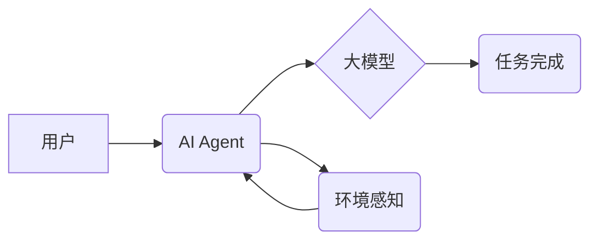

> 大模型，AI Agent，自然语言处理，强化学习，知识图谱，多模态交互，智能助手

## 1. 背景介绍

近年来，人工智能领域取得了令人瞩目的进展，其中大模型和AI Agent的快速发展尤为引人注目。大模型凭借其强大的参数规模和学习能力，在自然语言处理、图像识别、机器翻译等领域展现出令人惊叹的性能。而AI Agent则致力于构建能够自主学习、决策和执行任务的智能实体。将这两项技术相结合，将为人工智能的发展带来新的机遇和挑战。

**1.1 大模型的崛起**

大模型是指参数规模庞大、训练数据海量的人工智能模型。近年来，随着计算能力的提升和训练数据的积累，大模型的规模不断扩大，例如GPT-3、BERT、LaMDA等模型参数规模已达数十亿甚至数百亿级别。大模型的强大能力源于其海量参数和庞大的训练数据，能够学习到复杂的语言模式和知识结构，从而在各种自然语言处理任务中取得优异的性能。

**1.2 AI Agent的定义与发展**

AI Agent是指能够感知环境、做出决策并执行行动的智能实体。AI Agent的目标是构建能够自主学习、适应环境变化并完成特定任务的智能系统。传统的AI Agent通常基于规则或模板，而现代AI Agent则更倾向于利用机器学习和深度学习技术，通过学习数据来提高其决策和执行能力。

## 2. 核心概念与联系

大模型和AI Agent的结合，本质上是将大模型的强大学习能力与AI Agent的自主决策和执行能力相融合。

**2.1 大模型赋能AI Agent**

大模型可以为AI Agent提供丰富的知识和语言理解能力，使其能够更好地理解用户需求、获取相关信息和生成自然流畅的对话。例如，大模型可以训练一个聊天机器人，使其能够理解用户的自然语言输入，并生成符合语境的回复。

**2.2 AI Agent引导大模型应用**

AI Agent可以将大模型应用于更具体的场景和任务中，使其能够发挥更大的价值。例如，AI Agent可以利用大模型的知识库，构建一个智能问答系统，帮助用户快速获取所需信息。

**2.3 架构图**



## 3. 核心算法原理 & 具体操作步骤

**3.1 算法原理概述**

大模型与AI Agent的结合主要依赖于以下核心算法：

* **自然语言处理 (NLP)**：用于理解和生成人类语言，包括文本分类、情感分析、机器翻译等。
* **强化学习 (RL)**：用于训练AI Agent，使其能够通过与环境交互学习最佳策略。
* **知识图谱 (KG)**：用于存储和组织知识，帮助AI Agent理解世界并做出更智能的决策。

**3.2 算法步骤详解**

1. **数据预处理**: 收集和预处理大模型训练数据和AI Agent训练数据，例如文本清洗、标注等。
2. **大模型训练**: 利用大规模数据训练大模型，使其具备强大的语言理解和生成能力。
3. **知识图谱构建**: 基于大模型的知识，构建知识图谱，组织和存储知识。
4. **AI Agent设计**: 设计AI Agent的架构和行为策略，例如使用强化学习算法训练AI Agent。
5. **模型集成**: 将大模型、知识图谱和AI Agent集成在一起，形成一个完整的智能系统。
6. **系统测试和评估**: 对集成系统进行测试和评估，不断优化模型和算法。

**3.3 算法优缺点**

* **优点**: 能够实现更智能、更自然的交互，并应用于更广泛的场景。
* **缺点**: 训练成本高，模型复杂度大，需要大量的计算资源和数据。

**3.4 算法应用领域**

* **智能客服**: 提供更智能、更自然的客服体验。
* **智能助手**: 帮助用户完成各种任务，例如日程安排、信息查询等。
* **个性化推荐**: 根据用户的兴趣和偏好，提供个性化的产品和服务推荐。
* **教育领域**: 提供个性化学习辅导和智能答疑。

## 4. 数学模型和公式 & 详细讲解 & 举例说明

**4.1 数学模型构建**

大模型与AI Agent的结合可以抽象为一个马尔可夫决策过程 (MDP)，其中：

* **状态 (S)**：AI Agent所处的环境状态。
* **动作 (A)**：AI Agent可以执行的动作。
* **奖励 (R)**：AI Agent执行动作后获得的奖励。
* **转移概率 (P)**：从一个状态到另一个状态的概率。

**4.2 公式推导过程**

AI Agent的目标是最大化累积奖励，可以使用动态规划算法或强化学习算法来求解最优策略。

* **Bellman方程**: 描述状态价值函数与动作价值函数之间的关系。

$$
V(s) = \max_a \left[ R(s, a) + \gamma \sum_{s'} P(s' | s, a) V(s') \right]
$$

其中：

* $V(s)$：状态 $s$ 的价值函数。
* $R(s, a)$：执行动作 $a$ 在状态 $s$ 后获得的奖励。
* $\gamma$：折扣因子，控制未来奖励的权重。
* $P(s' | s, a)$：从状态 $s$ 执行动作 $a$ 到状态 $s'$ 的转移概率。

**4.3 案例分析与讲解**

例如，训练一个AI Agent玩游戏，可以将游戏状态作为状态空间，游戏动作作为动作空间，游戏得分作为奖励函数。通过强化学习算法，AI Agent可以学习到最优策略，从而获得更高的游戏得分。

## 5. 项目实践：代码实例和详细解释说明

**5.1 开发环境搭建**

* Python 3.7+
* TensorFlow/PyTorch
* CUDA/cuDNN

**5.2 源代码详细实现**

```python
# 使用TensorFlow构建一个简单的聊天机器人模型
import tensorflow as tf

# 定义模型结构
model = tf.keras.Sequential([
    tf.keras.layers.Embedding(input_dim=vocab_size, output_dim=embedding_dim),
    tf.keras.layers.LSTM(units=hidden_size),
    tf.keras.layers.Dense(units=vocab_size, activation='softmax')
])

# 编译模型
model.compile(optimizer='adam', loss='sparse_categorical_crossentropy', metrics=['accuracy'])

# 训练模型
model.fit(x_train, y_train, epochs=10)

# 使用模型生成文本
text = "你好"
for _ in range(max_length):
    prediction = model.predict(tf.expand_dims(text, 0))
    predicted_index = tf.argmax(prediction, axis=-1).numpy()[0]
    text += vocabulary[predicted_index]
print(text)
```

**5.3 代码解读与分析**

* 该代码示例使用TensorFlow构建了一个简单的聊天机器人模型。
* 模型结构包括嵌入层、LSTM层和全连接层。
* 嵌入层将单词映射到向量空间。
* LSTM层用于捕捉文本序列中的上下文信息。
* 全连接层用于预测下一个单词。
* 模型使用Adam优化器、交叉熵损失函数和准确率作为评估指标。

**5.4 运行结果展示**

运行该代码后，可以生成一段基于训练数据的文本。

## 6. 实际应用场景

**6.1 智能客服**

大模型与AI Agent结合可以构建更智能的客服系统，能够理解用户的自然语言问题，并提供准确、高效的解答。

**6.2 智能助手**

AI Agent可以利用大模型的知识和语言理解能力，帮助用户完成各种任务，例如日程安排、信息查询、文件处理等。

**6.3 个性化推荐**

大模型可以分析用户的行为数据和偏好，并结合AI Agent的决策能力，提供个性化的产品和服务推荐。

**6.4 未来应用展望**

大模型与AI Agent的结合将应用于更广泛的领域，例如医疗诊断、教育辅导、金融分析等。

## 7. 工具和资源推荐

**7.1 学习资源推荐**

* **书籍**:
    * Deep Learning by Ian Goodfellow
    * Reinforcement Learning: An Introduction by Richard S. Sutton and Andrew G. Barto
* **在线课程**:
    * Coursera: Deep Learning Specialization
    * Udacity: Artificial Intelligence Nanodegree

**7.2 开发工具推荐**

* **TensorFlow**: 开源深度学习框架
* **PyTorch**: 开源深度学习框架
* **Hugging Face**: 提供预训练大模型和工具

**7.3 相关论文推荐**

* **BERT**: Devlin et al. (2018)
* **GPT-3**: Brown et al. (2020)
* **AlphaGo**: Silver et al. (2016)

## 8. 总结：未来发展趋势与挑战

**8.1 研究成果总结**

大模型与AI Agent的结合取得了显著的进展，在自然语言处理、游戏AI、机器人控制等领域展现出巨大的潜力。

**8.2 未来发展趋势**

* **模型规模和能力的提升**: 大模型的规模和能力将继续提升，从而实现更复杂的任务和更智能的交互。
* **多模态交互**: 大模型将融合多模态数据，例如文本、图像、音频等，实现更丰富的交互体验。
* **可解释性增强**: 研究如何提高大模型的透明度和可解释性，使其决策过程更加可理解。

**8.3 面临的挑战**

* **数据获取和隐私保护**: 大模型训练需要海量数据，如何获取高质量数据并保护用户隐私是一个重要挑战。
* **计算资源需求**: 大模型训练和推理需要大量的计算资源，如何降低计算成本是一个关键问题。
* **伦理和安全问题**: 大模型的应用可能带来伦理和安全问题，例如偏见、虚假信息和恶意利用，需要谨慎考虑和应对。

**8.4 研究展望**

未来，大模型与AI Agent的结合将继续是人工智能领域的重要研究方向，需要进一步探索模型架构、算法设计、数据处理和伦理问题等方面。


## 9. 附录：常见问题与解答

**9.1 如何选择合适的AI Agent架构？**

选择AI Agent架构需要根据具体任务和环境特点进行考虑。例如，对于简单任务，可以使用基于规则的Agent；对于复杂任务，可以使用基于强化学习的Agent。

**9.2 如何训练大模型？**

训练大模型需要大量的计算资源和数据。可以使用分布式训练技术和预训练技术来提高训练效率。

**9.3 如何评估AI Agent的性能？**

可以使用各种指标来评估AI Agent的性能，例如准确率、召回率、F1-score等。

**9.4 如何解决大模型的偏见问题？**

可以通过数据预处理、模型正则化和公平性评估等方法来缓解大模型的偏见问题。


作者：禅与计算机程序设计艺术 / Zen and the Art of Computer Programming 
<end_of_turn>