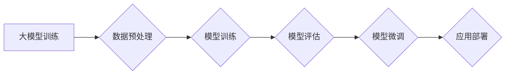

> 大模型、应用开发、深度学习、Transformer、自然语言处理、计算机视觉

## 1. 背景介绍

近年来，深度学习技术取得了飞速发展，特别是大模型的出现，为人工智能领域带来了革命性的变革。大模型是指参数规模庞大、训练数据海量的人工智能模型，其强大的学习能力和泛化能力使其能够在各种任务中表现出卓越的性能。从自然语言处理（NLP）到计算机视觉（CV），大模型已经广泛应用于各个领域，并取得了令人瞩目的成果。

然而，大模型的应用开发并非易事。由于其规模庞大、训练成本高昂，以及需要处理海量数据，开发大模型应用需要具备丰富的技术经验和专业的知识体系。

本指南旨在为开发者提供一个全面的指南，帮助他们理解大模型的原理、掌握应用开发的技巧，并成功构建出具有实用价值的大模型应用。

## 2. 核心概念与联系

### 2.1 大模型的概念

大模型是指参数规模庞大、训练数据海量的人工智能模型。通常，大模型的参数数量超过数十亿甚至数千亿，训练数据也达到数万亿甚至数千亿级别。

### 2.2 Transformer架构

Transformer是一种新型的神经网络架构，其核心是注意力机制（Attention）。注意力机制能够学习到输入序列中不同元素之间的关系，从而更好地理解上下文信息。Transformer架构在自然语言处理领域取得了突破性的进展，例如BERT、GPT-3等大模型都基于Transformer架构。

### 2.3 训练与微调

大模型的训练是一个复杂且耗时的过程，需要大量的计算资源和数据。训练完成后，大模型可以用于各种下游任务，例如文本分类、机器翻译、问答系统等。为了提高模型在特定任务上的性能，可以对预训练的大模型进行微调，即在特定数据集上进行进一步训练。

**Mermaid 流程图**



## 3. 核心算法原理 & 具体操作步骤

### 3.1 算法原理概述

Transformer架构的核心是注意力机制，它能够学习到输入序列中不同元素之间的关系，从而更好地理解上下文信息。注意力机制可以分为自注意力（Self-Attention）和交叉注意力（Cross-Attention）。

* 自注意力：用于学习输入序列中不同元素之间的关系。
* 交叉注意力：用于学习输入序列和输出序列之间的关系。

Transformer架构还包含编码器（Encoder）和解码器（Decoder）两个部分。编码器负责将输入序列编码成上下文表示，解码器则根据编码后的表示生成输出序列。

### 3.2 算法步骤详解

1. **数据预处理:** 将原始数据转换为模型可以理解的格式，例如文本数据需要进行分词、词嵌入等处理。
2. **模型训练:** 使用训练数据训练Transformer模型，通过反向传播算法更新模型参数。
3. **模型评估:** 使用验证集评估模型的性能，例如准确率、召回率等指标。
4. **模型微调:** 根据评估结果，对模型进行微调，例如调整学习率、增加训练数据等。
5. **应用部署:** 将训练好的模型部署到实际应用场景中。

### 3.3 算法优缺点

**优点:**

* 能够学习到长距离依赖关系。
* 训练效率高。
* 在各种NLP任务中表现出色。

**缺点:**

* 参数量大，训练成本高。
* 对数据质量要求高。

### 3.4 算法应用领域

* 自然语言处理：文本分类、机器翻译、问答系统、文本生成等。
* 计算机视觉：图像识别、目标检测、图像分割等。
* 其他领域：语音识别、音乐生成、代码生成等。

## 4. 数学模型和公式 & 详细讲解 & 举例说明

### 4.1 数学模型构建

Transformer模型的数学模型主要基于线性变换、激活函数和注意力机制。

* **线性变换:** 用于将输入数据映射到不同的维度空间。
* **激活函数:** 用于引入非线性，提高模型的表达能力。
* **注意力机制:** 用于学习输入序列中不同元素之间的关系。

### 4.2 公式推导过程

注意力机制的计算公式如下：

$$
Attention(Q, K, V) = softmax(\frac{QK^T}{\sqrt{d_k}})V
$$

其中：

* $Q$：查询矩阵
* $K$：键矩阵
* $V$：值矩阵
* $d_k$：键向量的维度
* $softmax$：softmax函数

### 4.3 案例分析与讲解

假设我们有一个句子“我爱学习编程”，将其转换为词嵌入向量，得到以下矩阵：

$$
Q = \begin{bmatrix}
q_1 & q_2 & q_3 & q_4 & q_5
\end{bmatrix}
$$

$$
K = \begin{bmatrix}
k_1 & k_2 & k_3 & k_4 & k_5
\end{bmatrix}
$$

$$
V = \begin{bmatrix}
v_1 & v_2 & v_3 & v_4 & v_5
\end{bmatrix}
$$

其中，$q_i$、$k_i$、$v_i$分别代表每个词的查询向量、键向量和值向量。

通过计算注意力机制，可以得到每个词对其他词的注意力权重，例如“学习”对“编程”的注意力权重可能较高，因为它们在语义上相关。

## 5. 项目实践：代码实例和详细解释说明

### 5.1 开发环境搭建

* Python 3.7+
* PyTorch 1.7+
* CUDA 10.2+

### 5.2 源代码详细实现

```python
import torch
import torch.nn as nn

class Transformer(nn.Module):
    def __init__(self, vocab_size, embedding_dim, num_heads, num_layers):
        super(Transformer, self).__init__()
        self.embedding = nn.Embedding(vocab_size, embedding_dim)
        self.transformer_layers = nn.ModuleList([
            nn.TransformerEncoderLayer(embedding_dim, num_heads)
            for _ in range(num_layers)
        ])
        self.linear = nn.Linear(embedding_dim, vocab_size)

    def forward(self, x):
        x = self.embedding(x)
        for layer in self.transformer_layers:
            x = layer(x)
        x = self.linear(x)
        return x
```

### 5.3 代码解读与分析

* `__init__` 方法：初始化模型参数，包括词嵌入层、Transformer编码器层和输出层。
* `forward` 方法：定义模型的正向传播过程，将输入序列转换为输出序列。

### 5.4 运行结果展示

训练完成后，可以使用测试集评估模型的性能，例如计算准确率、困惑度等指标。

## 6. 实际应用场景

### 6.1 自然语言处理

* **文本分类:** 将文本分类到预定义的类别，例如情感分析、主题分类等。
* **机器翻译:** 将文本从一种语言翻译成另一种语言。
* **问答系统:** 根据给定的问题，从文本数据中找到答案。
* **文本生成:** 生成新的文本，例如文章、故事、对话等。

### 6.2 计算机视觉

* **图像识别:** 将图像分类到预定义的类别，例如识别物体、场景等。
* **目标检测:** 在图像中定位和识别目标，例如人、车、动物等。
* **图像分割:** 将图像分割成不同的区域，例如分割前景和背景。

### 6.3 其他领域

* **语音识别:** 将语音转换为文本。
* **音乐生成:** 生成新的音乐。
* **代码生成:** 根据自然语言描述生成代码。

### 6.4 未来应用展望

大模型的应用前景广阔，未来将应用于更多领域，例如：

* **个性化推荐:** 根据用户的兴趣和行为，推荐个性化的商品、服务等。
* **医疗诊断:** 辅助医生进行疾病诊断。
* **教育辅助:** 提供个性化的学习辅导。

## 7. 工具和资源推荐

### 7.1 学习资源推荐

* **书籍:**
    * 《深度学习》
    * 《自然语言处理》
    * 《Transformer模型详解》
* **在线课程:**
    * Coursera: 深度学习
    * Udacity: 自然语言处理
    * fast.ai: 深度学习

### 7.2 开发工具推荐

* **框架:**
    * PyTorch
    * TensorFlow
* **库:**
    * HuggingFace Transformers
    * OpenAI API

### 7.3 相关论文推荐

* 《Attention Is All You Need》
* 《BERT: Pre-training of Deep Bidirectional Transformers for Language Understanding》
* 《GPT-3: Language Models are Few-Shot Learners》

## 8. 总结：未来发展趋势与挑战

### 8.1 研究成果总结

近年来，大模型在各个领域取得了显著的成果，例如在自然语言处理、计算机视觉等领域取得了突破性的进展。

### 8.2 未来发展趋势

* **模型规模的进一步扩大:** 随着计算资源的不断发展，大模型的规模将继续扩大，从而提升模型的性能。
* **多模态大模型的开发:** 将文本、图像、音频等多种模态数据融合到一起，开发更强大的多模态大模型。
* **可解释性研究:** 研究大模型的决策过程，提高模型的可解释性。

### 8.3 面临的挑战

* **训练成本高:** 大模型的训练需要大量的计算资源和数据，成本很高。
* **数据安全和隐私问题:** 大模型的训练需要使用大量数据，如何保证数据安全和隐私是一个重要的挑战。
* **模型偏见问题:** 大模型可能存在偏见，需要进行相应的缓解措施。

### 8.4 研究展望

未来，大模型研究将继续朝着更强大、更安全、更可解释的方向发展。


## 9. 附录：常见问题与解答

### 9.1 如何选择合适的预训练模型？

选择预训练模型需要根据具体的应用场景和任务需求进行选择。例如，对于文本分类任务，可以选择BERT、RoBERTa等预训练模型；对于机器翻译任务，可以选择T5、MarianMT等预训练模型。

### 9.2 如何进行模型微调？

模型微调是指在预训练模型的基础上，在特定数据集上进行进一步训练。微调过程通常包括以下步骤：

1. 加载预训练模型。
2. 冻结预训练模型的某些参数。
3. 添加新的层或修改现有层的参数。
4. 使用特定数据集进行训练。

### 9.3 如何评估模型性能？

模型性能的评估指标取决于具体的应用场景和任务需求。常见的评估指标包括：

* **准确率:** 预测正确的样本数量占总样本数量的比例。
* **召回率:** 预测正确的正样本数量占所有正样本数量的比例。
* **F1-score:** 准确率和召回率的调和平均值。
* **困惑度:** 模型预测下一个词的概率分布的熵值，越小表示模型预测能力越强。


作者：禅与计算机程序设计艺术 / Zen and the Art of Computer Programming 
<end_of_turn>