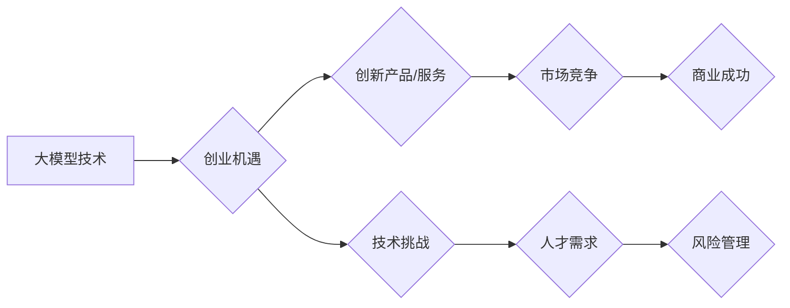

> 大模型、创业趋势、人工智能、技术趋势、市场趋势、政策趋势、商业模式、应用场景

## 1. 背景介绍

近年来，人工智能（AI）技术取得了飞速发展，特别是大模型的出现，为各行各业带来了革命性的变革。大模型是指参数规模庞大、训练数据海量的人工智能模型，具备强大的泛化能力和学习能力，能够在自然语言处理、计算机视觉、语音识别等领域取得突破性进展。

大模型的涌现，为创业者提供了前所未有的机遇。其强大的能力可以被应用于各种场景，例如：

* **个性化推荐:** 大模型可以分析用户的行为数据，提供更精准的商品推荐，提升用户体验和转化率。
* **智能客服:** 大模型可以模拟人类对话，提供24小时在线客服服务，降低企业人力成本。
* **内容创作:** 大模型可以生成高质量的文本、图像、音频等内容，帮助企业进行内容营销和品牌建设。
* **数据分析:** 大模型可以分析海量数据，挖掘隐藏的商业价值，帮助企业做出更明智的决策。

然而，大模型的应用也面临着一些挑战，例如：

* **高昂的开发成本:** 训练大模型需要大量的计算资源和数据，成本较高。
* **模型可解释性:** 大模型的决策过程复杂，难以解释，这可能会导致信任问题。
* **数据安全和隐私:** 大模型的训练需要大量数据，如何保证数据安全和隐私是一个重要问题。

## 2. 核心概念与联系

### 2.1 大模型

大模型是指参数规模庞大、训练数据海量的人工智能模型。其核心特点是：

* **参数规模:** 大模型的参数数量通常在数十亿甚至数千亿级别，这使得模型能够学习更复杂的模式。
* **训练数据:** 大模型需要大量的训练数据才能达到最佳性能，通常包含文本、图像、音频等多种类型的数据。
* **泛化能力:** 大模型具有较强的泛化能力，能够应用于多种不同的任务和领域。

### 2.2 创业

创业是指创立新企业，开发新产品或服务，并将其推向市场。创业者需要具备以下素质：

* **创新精神:** 能够提出新颖的商业模式和产品想法。
* **执行力:** 能够将想法付诸实践，并高效地完成目标。
* **风险承受能力:** 能够承受创业过程中的风险和挑战。

### 2.3 联系

大模型为创业者提供了新的机遇和挑战。大模型的强大能力可以帮助创业者开发出更具创新性和竞争力的产品和服务，但同时也需要创业者具备相应的技术能力和风险承受能力。

**Mermaid 流程图**



## 3. 核心算法原理 & 具体操作步骤

### 3.1  算法原理概述

大模型的训练主要基于深度学习算法，其中Transformer模型是目前最主流的架构。Transformer模型的核心思想是利用注意力机制来捕捉文本序列中的长距离依赖关系，从而实现更准确的文本理解和生成。

### 3.2  算法步骤详解

大模型的训练过程可以概括为以下步骤：

1. **数据预处理:** 将原始数据进行清洗、格式化和编码，使其能够被模型理解。
2. **模型构建:** 根据具体的任务需求，选择合适的模型架构，并设置模型参数。
3. **模型训练:** 使用训练数据对模型进行训练，调整模型参数，使其能够准确地完成任务。
4. **模型评估:** 使用测试数据对模型进行评估，衡量模型的性能。
5. **模型部署:** 将训练好的模型部署到实际应用场景中。

### 3.3  算法优缺点

**优点:**

* **强大的泛化能力:** 大模型能够学习到复杂的模式，并应用于多种不同的任务。
* **高精度:** 大模型在许多任务上都取得了state-of-the-art的性能。
* **可扩展性:** 大模型的参数规模可以不断增加，从而提升模型性能。

**缺点:**

* **高昂的开发成本:** 训练大模型需要大量的计算资源和数据，成本较高。
* **模型可解释性:** 大模型的决策过程复杂，难以解释，这可能会导致信任问题。
* **数据安全和隐私:** 大模型的训练需要大量数据，如何保证数据安全和隐私是一个重要问题。

### 3.4  算法应用领域

大模型的应用领域非常广泛，包括：

* **自然语言处理:** 文本分类、情感分析、机器翻译、文本摘要等。
* **计算机视觉:** 图像识别、物体检测、图像分割等。
* **语音识别:** 语音转文本、语音合成等。
* **推荐系统:** 商品推荐、内容推荐等。
* **医疗诊断:** 病症诊断、药物研发等。

## 4. 数学模型和公式 & 详细讲解 & 举例说明

### 4.1  数学模型构建

大模型的训练过程可以看作是一个优化问题，目标是找到一个模型参数向量，使得模型在训练数据上的损失函数最小。损失函数通常是模型预测值与真实值的差值，例如均方误差（MSE）或交叉熵损失（Cross-Entropy Loss）。

### 4.2  公式推导过程

假设模型的输出为$y$, 真实值是$y_t$, 损失函数为MSE，则损失函数的公式为：

$$
L = \frac{1}{N} \sum_{i=1}^{N} (y_i - y_{t_i})^2
$$

其中，$N$是样本数量。

为了最小化损失函数，可以使用梯度下降算法来更新模型参数。梯度下降算法的基本思想是：沿着梯度方向更新模型参数，直到损失函数达到最小值。

梯度下降算法的更新公式为：

$$
\theta = \theta - \alpha \nabla L(\theta)
$$

其中，$\theta$是模型参数，$\alpha$是学习率，$\nabla L(\theta)$是损失函数关于模型参数的梯度。

### 4.3  案例分析与讲解

例如，在机器翻译任务中，模型的输出是翻译后的文本，真实值是目标语言的文本。可以使用交叉熵损失函数来衡量模型的性能。

交叉熵损失函数的公式为：

$$
L = -\sum_{i=1}^{N} y_i \log(p_i)
$$

其中，$y_i$是真实值，$p_i$是模型预测的概率。

通过梯度下降算法，可以更新模型参数，使得模型能够更好地翻译文本。

## 5. 项目实践：代码实例和详细解释说明

### 5.1  开发环境搭建

为了开发大模型应用，需要搭建相应的开发环境。常用的开发环境包括：

* **Python:** 大多数大模型框架都是基于Python开发的，例如TensorFlow、PyTorch等。
* **GPU:** 大模型的训练需要大量的计算资源，GPU可以显著加速训练速度。
* **云计算平台:** 云计算平台可以提供强大的计算资源和存储空间，方便大模型的开发和部署。

### 5.2  源代码详细实现

以下是一个简单的文本分类模型的代码示例，使用PyTorch框架实现：

```python
import torch
import torch.nn as nn

class TextClassifier(nn.Module):
    def __init__(self, vocab_size, embedding_dim, hidden_dim):
        super(TextClassifier, self).__init__()
        self.embedding = nn.Embedding(vocab_size, embedding_dim)
        self.lstm = nn.LSTM(embedding_dim, hidden_dim)
        self.fc = nn.Linear(hidden_dim, 2)  # 2个类别

    def forward(self, x):
        x = self.embedding(x)
        x, _ = self.lstm(x)
        x = x[:, -1, :]  # 取最后一个时间步的输出
        x = self.fc(x)
        return x

# ... 模型训练和评估代码 ...
```

### 5.3  代码解读与分析

* **模型架构:** 该模型采用嵌入层、LSTM层和全连接层组成。嵌入层将文本单词映射到低维向量空间，LSTM层捕捉文本序列中的长距离依赖关系，全连接层将LSTM输出映射到分类结果。
* **参数:** 模型参数包括嵌入维度、LSTM隐藏维度和分类类别数。
* **训练过程:** 模型训练过程包括前向传播、反向传播和参数更新。

### 5.4  运行结果展示

训练完成后，可以将模型应用于新的文本数据进行分类。模型的性能可以通过准确率、召回率和F1-score等指标来评估。

## 6. 实际应用场景

### 6.1  个性化推荐

大模型可以分析用户的行为数据，例如浏览历史、购买记录、评分等，并根据用户的兴趣和偏好，推荐个性化的商品或内容。

### 6.2  智能客服

大模型可以模拟人类对话，提供24小时在线客服服务，回答用户的问题、处理订单、提供售后服务等。

### 6.3  内容创作

大模型可以生成高质量的文本、图像、音频等内容，帮助企业进行内容营销和品牌建设。例如，可以生成产品描述、广告文案、新闻报道等。

### 6.4  未来应用展望

大模型的应用场景还在不断扩展，未来可能会应用于更多领域，例如：

* **教育:** 个性化学习、智能辅导等。
* **医疗:** 疾病诊断、药物研发等。
* **金融:** 风险评估、欺诈检测等。

## 7. 工具和资源推荐

### 7.1  学习资源推荐

* **书籍:**
    * 《深度学习》
    * 《自然语言处理》
    * 《机器学习》
* **在线课程:**
    * Coursera
    * edX
    * Udacity

### 7.2  开发工具推荐

* **TensorFlow:** 开源深度学习框架。
* **PyTorch:** 开源深度学习框架。
* **Hugging Face:** 提供预训练大模型和开发工具。

### 7.3  相关论文推荐

* **Attention Is All You Need:** https://arxiv.org/abs/1706.03762
* **BERT: Pre-training of Deep Bidirectional Transformers for Language Understanding:** https://arxiv.org/abs/1810.04805

## 8. 总结：未来发展趋势与挑战

### 8.1  研究成果总结

大模型技术取得了显著进展，在自然语言处理、计算机视觉等领域取得了突破性进展。大模型的应用场景也越来越广泛，为各行各业带来了新的机遇。

### 8.2  未来发展趋势

* **模型规模的进一步扩大:** 未来大模型的参数规模将会继续扩大，从而提升模型性能。
* **模型效率的提升:** 研究人员将致力于开发更有效的训练和推理算法，降低大模型的计算成本。
* **多模态大模型的开发:** 未来大模型将能够处理多种模态数据，例如文本、图像、音频等，从而实现更智能的应用。

### 8.3  面临的挑战

* **数据安全和隐私:** 大模型的训练需要大量数据，如何保证数据安全和隐私是一个重要问题。
* **模型可解释性:** 大模型的决策过程复杂，难以解释，这可能会导致信任问题。
* **伦理问题:** 大模型的应用可能会带来一些伦理问题，例如算法偏见、信息操纵等，需要引起重视。

### 8.4  研究展望

未来，大模型技术将继续发展，并应用于更多领域。研究人员将继续探索大模型的潜力，并解决其面临的挑战，推动人工智能技术的发展。

## 9