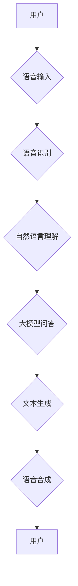

> 大模型、问答机器人、语音交互、自然语言处理、语音识别、文本生成、深度学习

## 1. 背景介绍

近年来，人工智能技术取得了飞速发展，大模型问答机器人作为人工智能领域的重要应用之一，逐渐走进人们的生活。大模型问答机器人能够理解人类的自然语言，并以自然语言进行回复，提供信息、完成任务、进行对话等功能。语音交互作为一种更加便捷、自然的交互方式，为大模型问答机器人带来了新的发展机遇。

传统的问答机器人主要依赖于规则引擎和知识库，难以处理复杂、开放式的自然语言问题。而大模型问答机器人则利用深度学习技术，通过训练海量文本数据，学习语言的语义和结构，能够理解更复杂的语言，并生成更自然、更流畅的回复。

语音交互技术的进步也为大模型问答机器人提供了强大的支持。语音识别技术能够将语音信号转换为文本，而文本生成技术能够将文本转换为语音。结合语音识别和文本生成技术，大模型问答机器人能够实现与用户无缝的语音交互。

## 2. 核心概念与联系

大模型问答机器人实现语音交互的核心概念包括：语音识别、自然语言理解、自然语言生成和语音合成。

**2.1 语音识别**

语音识别是指将语音信号转换为文本的过程。语音识别技术利用声学模型和语言模型，分析语音信号的声学特征和语言结构，识别语音中的单词和句子。

**2.2 自然语言理解**

自然语言理解是指计算机理解人类语言的含义的过程。自然语言理解技术利用语义分析、句法分析和知识图谱等方法，分析文本的语义和结构，提取文本中的关键信息和意图。

**2.3 自然语言生成**

自然语言生成是指计算机生成自然语言文本的过程。自然语言生成技术利用语言模型和文本生成算法，根据给定的输入信息，生成流畅、自然的文本。

**2.4 语音合成**

语音合成是指将文本转换为语音的过程。语音合成技术利用声学模型和声纹库，根据文本内容生成逼真的语音。

**2.5 架构图**



## 3. 核心算法原理 & 具体操作步骤

### 3.1 算法原理概述

大模型问答机器人实现语音交互的核心算法包括语音识别、自然语言理解、自然语言生成和语音合成。

**3.1.1 语音识别算法**

常用的语音识别算法包括隐马尔可夫模型（HMM）、条件随机场（CRF）和深度学习模型。深度学习模型，例如循环神经网络（RNN）和卷积神经网络（CNN），在语音识别领域取得了显著的成果。

**3.1.2 自然语言理解算法**

常用的自然语言理解算法包括词嵌入、句法分析、语义角色标注和知识图谱推理。词嵌入技术将单词映射到向量空间，捕捉单词之间的语义关系。句法分析技术分析文本的语法结构，识别句子中的成分和关系。语义角色标注技术识别文本中的动词和其对应的语义角色。知识图谱推理技术利用知识图谱中的知识，推理文本中的隐含信息。

**3.1.3 自然语言生成算法**

常用的自然语言生成算法包括序列到序列模型（seq2seq）、Transformer和生成对抗网络（GAN）。seq2seq模型利用编码器-解码器结构，将输入文本编码为向量，然后解码生成输出文本。Transformer模型利用注意力机制，捕捉文本中的长距离依赖关系。GAN模型利用生成器和鉴别器之间的对抗训练，生成更加逼真的文本。

**3.1.4 语音合成算法**

常用的语音合成算法包括基于规则的语音合成和基于神经网络的语音合成。基于规则的语音合成利用语音合成规则，将文本转换为语音。基于神经网络的语音合成利用深度学习模型，学习语音的声学特征，生成逼真的语音。

### 3.2 算法步骤详解

**3.2.1 语音识别步骤**

1. **语音信号预处理:** 滤除噪声、均衡音频信号等。
2. **特征提取:** 将语音信号转换为特征向量，例如梅尔频率倒谱系数（MFCC）。
3. **模型识别:** 利用语音识别模型，将特征向量转换为文本。

**3.2.2 自然语言理解步骤**

1. **分词:** 将文本分割成单词或词组。
2. **词性标注:** 识别每个单词的词性。
3. **句法分析:** 分析文本的语法结构，构建语法树。
4. **语义分析:** 提取文本中的关键信息和意图。

**3.2.3 自然语言生成步骤**

1. **文本编码:** 将输入文本编码为向量。
2. **解码生成:** 利用解码器生成输出文本。

**3.2.4 语音合成步骤**

1. **文本转音素:** 将文本转换为音素序列。
2. **音素合成:** 利用语音合成模型，将音素序列合成语音信号。

### 3.3 算法优缺点

**3.3.1 语音识别算法**

* **优点:** 识别准确率高，能够识别多种语言和口音。
* **缺点:** 对噪声敏感，识别速度较慢。

**3.3.2 自然语言理解算法**

* **优点:** 能够理解复杂的语言，提取文本中的关键信息。
* **缺点:** 对语义歧义和上下文信息依赖性强。

**3.3.3 自然语言生成算法**

* **优点:** 生成文本流畅自然，能够生成多种类型的文本。
* **缺点:** 生成文本可能缺乏逻辑性和准确性。

**3.3.4 语音合成算法**

* **优点:** 语音逼真自然，能够模拟不同的人声。
* **缺点:** 语音合成速度较慢，需要大量的训练数据。

### 3.4 算法应用领域

大模型问答机器人实现语音交互的算法广泛应用于以下领域：

* **智能客服:** 自动回答用户问题，提供24小时服务。
* **语音助手:** 控制智能家居设备、设置提醒、播放音乐等。
* **教育培训:** 提供个性化学习辅导、答疑解惑。
* **医疗健康:** 提供医疗咨询、预约挂号等服务。

## 4. 数学模型和公式 & 详细讲解 & 举例说明

### 4.1 数学模型构建

大模型问答机器人实现语音交互的数学模型主要包括：

* **语音识别模型:** 常用模型包括HMM、CRF和深度学习模型。
* **自然语言理解模型:** 常用模型包括词嵌入模型、句法分析模型和语义角色标注模型。
* **自然语言生成模型:** 常用模型包括seq2seq模型、Transformer模型和GAN模型。
* **语音合成模型:** 常用模型包括基于规则的语音合成模型和基于神经网络的语音合成模型。

### 4.2 公式推导过程

由于篇幅限制，这里只列举一些常用的公式，并进行简要的讲解。

**4.2.1 语音识别模型中的概率计算公式:**

$$P(W|O) = \frac{P(O|W)P(W)}{P(O)}$$

其中：

* $P(W|O)$: 给定观测序列 $O$，预测词序列 $W$ 的概率。
* $P(O|W)$: 给定词序列 $W$，预测观测序列 $O$ 的概率。
* $P(W)$: 词序列 $W$ 的先验概率。
* $P(O)$: 观测序列 $O$ 的概率。

**4.2.2 自然语言理解模型中的词嵌入公式:**

$$v_w = \text{Embedding}(w)$$

其中：

* $v_w$: 词 $w$ 的词向量表示。
* $\text{Embedding}$: 词嵌入函数。

**4.2.3 自然语言生成模型中的注意力机制公式:**

$$
\alpha_{i,j} = \frac{\exp(e_{i,j})}{\sum_{k=1}^{n} \exp(e_{i,k})}
$$

其中：

* $\alpha_{i,j}$: 第 $i$ 个词与第 $j$ 个词之间的注意力权重。
* $e_{i,j}$: 第 $i$ 个词与第 $j$ 个词之间的注意力得分。

### 4.3 案例分析与讲解

**4.3.1 语音识别案例:**

假设用户说“今天天气真好”，语音识别模型会将语音信号转换为文本“今天天气真好”。

**4.3.2 自然语言理解案例:**

自然语言理解模型会分析文本“今天天气真好”，提取出关键信息“今天”和“天气真好”，并理解用户表达的意图是询问天气情况。

**4.3.3 自然语言生成案例:**

自然语言生成模型会根据用户询问的天气情况，生成回复文本“今天天气晴朗，温度适宜”。

**4.3.4 语音合成案例:**

语音合成模型会将回复文本“今天天气晴朗，温度适宜”转换为语音信号，播放给用户。

## 5. 项目实践：代码实例和详细解释说明

### 5.1 开发环境搭建

* **操作系统:** Ubuntu 20.04
* **编程语言:** Python 3.8
* **深度学习框架:** TensorFlow 2.0
* **语音识别库:** SpeechRecognition
* **语音合成库:** gTTS

### 5.2 源代码详细实现

```python
import speech_recognition as sr
from gtts import gTTS

# 语音识别
r = sr.Recognizer()
with sr.Microphone() as source:
    print("请说话:")
    audio = r.listen(source)

try:
    text = r.recognize_google(audio, language='zh-CN')
    print("您说的是:", text)
except sr.UnknownValueError:
    print("语音识别失败")
except sr.RequestError as e:
    print("无法连接到语音识别服务; {0}".format(e))

# 自然语言理解（此处省略具体实现）

# 自然语言生成（此处省略具体实现）

# 语音合成
tts = gTTS(text=text, lang='zh-CN')
tts.save("response.mp3")
```

### 5.3 代码解读与分析

* **语音识别:** 使用SpeechRecognition库进行语音识别，识别用户输入的语音并转换为文本。
* **自然语言理解:** 此处省略具体实现，需要根据实际应用场景设计相应的自然语言理解模型。
* **自然语言生成:** 此处省略具体实现，需要根据实际应用场景设计相应的自然语言生成模型。
* **语音合成:** 使用gTTS库将文本转换为语音，并保存为MP3文件。

### 5.4 运行结果展示

运行代码后，用户可以通过麦克风输入语音，系统会识别语音并进行相应的处理，最终将回复语音播放给用户。

## 6. 实际应用场景

大模型问答机器人实现语音交互的应用场景非常广泛，例如：

* **智能客服:** 帮助企业自动处理客户咨询，提高服务效率。
* **语音助手:** 帮助用户控制智能家居设备、设置提醒、播放音乐等。
* **教育培训:** 提供个性化学习辅导、答疑解惑。
* **医疗健康:** 提供医疗咨询、预约挂号等服务。

### 6.4 未来应用展望

随着人工智能技术的不断发展，大模型问答机器人实现语音交互的应用场景将会更加广泛，例如：

* **虚拟助手:** 成为用户的虚拟助手，帮助用户完成各种任务。
* **个性化教育:** 提供个性化的学习辅导，帮助学生提高学习效率。
* **远程医疗:** 提供远程医疗服务，帮助患者获得及时有效的医疗帮助。

## 7. 工具和资源推荐

### 7.1 学习资源推荐

* **书籍:**
    * 《深度学习》
    * 《自然