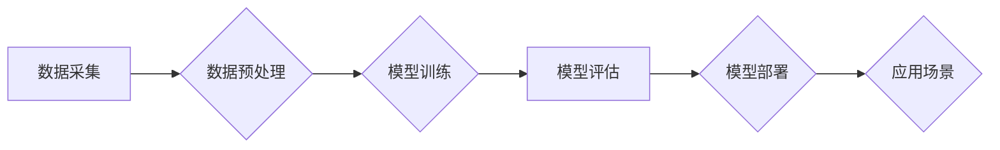

> 大模型、深度学习、Transformer、自然语言处理、计算机视觉、数据驱动、算法优化、模型训练、应用场景

## 1. 背景介绍

近年来，人工智能（AI）领域取得了令人瞩目的进展，其中大模型扮演着越来越重要的角色。大模型是指参数规模庞大、训练数据海量的人工智能模型，其强大的学习能力和泛化能力使其在自然语言处理、计算机视觉、语音识别等多个领域展现出令人惊叹的应用潜力。

传统的机器学习模型通常依赖于人工特征工程，而大模型则能够通过深度学习自动从海量数据中学习特征，从而实现更精准、更智能的决策。随着计算能力和存储技术的不断发展，大模型的训练和应用逐渐成为人工智能研究和产业发展的新热点。

## 2. 核心概念与联系

大模型的构建和应用离不开数据和算法的完美结合。

**2.1 数据驱动**

大模型的训练依赖于海量数据，数据质量和数量直接影响模型的性能。高质量的数据能够帮助模型学习更准确的特征，从而提高模型的预测精度和泛化能力。

**2.2 算法优化**

深度学习算法是构建大模型的关键技术。其中，Transformer模型凭借其强大的序列建模能力和并行训练效率，在自然语言处理领域取得了突破性的进展，成为大模型的代表性架构。

**2.3 架构图**



## 3. 核心算法原理 & 具体操作步骤

### 3.1 算法原理概述

Transformer模型的核心思想是利用注意力机制来捕捉序列数据中的长距离依赖关系。传统的循环神经网络（RNN）在处理长序列数据时容易出现梯度消失或梯度爆炸的问题，而注意力机制能够有效解决这个问题，并提高模型的学习效率。

Transformer模型由编码器和解码器两部分组成。编码器负责将输入序列映射到一个隐藏表示，解码器则根据隐藏表示生成输出序列。

### 3.2 算法步骤详解

1. **输入嵌入:** 将输入序列中的每个单词转换为向量表示，称为词嵌入。
2. **多头注意力:** 利用多头注意力机制计算每个单词与其他单词之间的注意力权重，从而捕捉序列数据中的长距离依赖关系。
3. **前馈神经网络:** 对每个单词的隐藏表示进行非线性变换，进一步提取特征。
4. **位置编码:** 将单词的相对位置信息编码到隐藏表示中，因为Transformer模型没有循环结构，无法直接捕捉单词的顺序信息。
5. **解码器:** 解码器接收编码器的输出和之前生成的输出单词，利用多头注意力机制和前馈神经网络生成下一个输出单词。

### 3.3 算法优缺点

**优点:**

* 能够有效捕捉长距离依赖关系。
* 并行训练效率高。
* 泛化能力强。

**缺点:**

* 参数量大，训练成本高。
* 对训练数据要求高。

### 3.4 算法应用领域

Transformer模型在自然语言处理领域取得了广泛应用，例如：

* 机器翻译
* 文本摘要
* 问答系统
* 情感分析
* 代码生成

## 4. 数学模型和公式 & 详细讲解 & 举例说明

### 4.1 数学模型构建

Transformer模型的核心是注意力机制，其数学模型可以表示为：

$$
Attention(Q, K, V) = softmax(\frac{QK^T}{\sqrt{d_k}})V
$$

其中：

* $Q$：查询矩阵
* $K$：键矩阵
* $V$：值矩阵
* $d_k$：键向量的维度
* $softmax$：softmax函数

### 4.2 公式推导过程

注意力机制的目的是计算每个查询向量与所有键向量的相关性，并根据相关性分配权重。

1. 计算查询向量 $Q$ 与键向量 $K$ 的点积，得到一个得分矩阵。
2. 对得分矩阵进行归一化，得到注意力权重矩阵。
3. 将注意力权重矩阵与值矩阵 $V$ 相乘，得到最终的注意力输出。

### 4.3 案例分析与讲解

假设我们有一个句子 "The cat sat on the mat"，将其转换为词嵌入向量表示。

* $Q$：查询向量
* $K$：键向量
* $V$：值向量

通过计算 $Q$ 与 $K$ 的点积，我们可以得到每个词对其他词的相关性得分。例如，"cat" 与 "sat" 的得分较高，因为它们在语义上相关。

然后，将得分矩阵进行归一化，得到注意力权重矩阵，表示每个词对其他词的关注程度。最后，将注意力权重矩阵与 $V$ 相乘，得到最终的注意力输出，表示每个词的上下文信息。

## 5. 项目实践：代码实例和详细解释说明

### 5.1 开发环境搭建

* Python 3.7+
* PyTorch 1.7+
* CUDA 10.2+

### 5.2 源代码详细实现

```python
import torch
import torch.nn as nn

class Transformer(nn.Module):
    def __init__(self, vocab_size, embedding_dim, num_heads, num_layers):
        super(Transformer, self).__init__()
        self.embedding = nn.Embedding(vocab_size, embedding_dim)
        self.encoder_layers = nn.ModuleList([EncoderLayer(embedding_dim, num_heads) for _ in range(num_layers)])
        self.decoder_layers = nn.ModuleList([DecoderLayer(embedding_dim, num_heads) for _ in range(num_layers)])

    def forward(self, src, tgt):
        src = self.embedding(src)
        tgt = self.embedding(tgt)
        # ... (Encoder and Decoder logic)
```

### 5.3 代码解读与分析

* `__init__` 方法初始化模型参数，包括词嵌入层、编码器层和解码器层。
* `forward` 方法定义模型的正向传播过程，将输入序列转换为输出序列。
* `EncoderLayer` 和 `DecoderLayer` 是编码器和解码器中的基本单元，分别负责处理输入序列和输出序列。

### 5.4 运行结果展示

通过训练模型并测试其性能，我们可以评估模型的准确率、BLEU分数等指标。

## 6. 实际应用场景

大模型在各个领域都有着广泛的应用场景：

### 6.1 自然语言处理

* **机器翻译:** 将一种语言翻译成另一种语言。
* **文本摘要:** 自动生成文本的简短摘要。
* **问答系统:** 回答用户提出的问题。
* **聊天机器人:** 与用户进行自然语言对话。

### 6.2 计算机视觉

* **图像识别:** 将图像分类为不同的类别。
* **目标检测:** 在图像中检测到特定目标。
* **图像生成:** 生成新的图像。

### 6.3 语音识别

* **语音转文本:** 将语音转换为文本。
* **语音合成:** 将文本转换为语音。

### 6.4 未来应用展望

随着大模型技术的不断发展，其应用场景将更加广泛，例如：

* **个性化教育:** 根据学生的学习情况提供个性化的学习方案。
* **医疗诊断:** 辅助医生进行疾病诊断。
* **科学研究:** 加速科学研究的进程。

## 7. 工具和资源推荐

### 7.1 学习资源推荐

* **书籍:**
    * 《深度学习》
    * 《自然语言处理》
* **在线课程:**
    * Coursera
    * edX
* **博客:**
    * The Gradient
    * Towards Data Science

### 7.2 开发工具推荐

* **PyTorch:** 深度学习框架
* **TensorFlow:** 深度学习框架
* **Hugging Face Transformers:** 预训练大模型库

### 7.3 相关论文推荐

* **Attention Is All You Need:** https://arxiv.org/abs/1706.03762
* **BERT: Pre-training of Deep Bidirectional Transformers for Language Understanding:** https://arxiv.org/abs/1810.04805

## 8. 总结：未来发展趋势与挑战

### 8.1 研究成果总结

大模型在人工智能领域取得了显著的进展，其强大的学习能力和泛化能力为解决复杂问题提供了新的思路。

### 8.2 未来发展趋势

* **模型规模进一步扩大:** 随着计算能力和存储技术的进步，大模型的规模将继续扩大，从而提升模型的性能。
* **模型架构创新:** 研究人员将探索新的模型架构，例如混合模型和联邦学习，以提高模型的效率和安全性。
* **应用场景拓展:** 大模型将应用于更多领域，例如医疗、教育、金融等，为人类社会带来更多价值。

### 8.3 面临的挑战

* **训练成本高:** 大模型的训练需要大量的计算资源和时间，这对于资源有限的机构来说是一个挑战。
* **数据安全和隐私:** 大模型的训练依赖于海量数据，如何保证数据安全和隐私是一个重要问题。
* **模型解释性和可控性:** 大模型的决策过程往往难以解释，如何提高模型的解释性和可控性是一个重要的研究方向。

### 8.4 研究展望

未来，大模型研究将继续朝着更强大、更安全、更可解释的方向发展，为人工智能的普及和应用提供更坚实的基础。

## 9. 附录：常见问题与解答

**Q1: 大模型的训练需要多少数据？**

**A1:** 大模型的训练需要海量数据，通常需要数十亿甚至数千亿个数据点。

**Q2: 大模型的训练需要多少计算资源？**

**A2:** 大模型的训练需要大量的计算资源，通常需要数百甚至数千个GPU。

**Q3: 如何评估大模型的性能？**

**A3:** 大模型的性能可以通过各种指标评估，例如准确率、BLEU分数、ROUGE分数等。

**作者：禅与计算机程序设计艺术 / Zen and the Art of Computer Programming**


<end_of_turn>