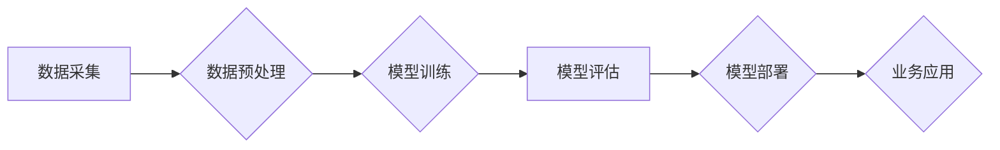

> 大模型、人工智能、深度学习、自然语言处理、商业智能化、转型升级、应用场景

## 1. 背景介绍

近年来，人工智能（AI）技术取得了飞速发展，特别是深度学习算法的突破，使得大模型的训练和应用成为可能。大模型是指参数规模庞大、训练数据海量的人工智能模型，其强大的学习能力和泛化能力赋予其在各个领域进行智能化转型的巨大潜力。

商业领域正处于数字化转型和智能化升级的关键时期。传统商业模式面临着新的挑战，而大模型的出现为企业提供了新的机遇。大模型可以帮助企业提升运营效率、优化客户体验、开发创新产品和服务，从而实现商业智能化转型。

## 2. 核心概念与联系

**2.1 大模型的概念**

大模型是指参数规模庞大、训练数据海量的人工智能模型。通常，大模型的参数数量超过数十亿甚至数千亿，训练数据也达到数万亿甚至数千亿级别。

**2.2 大模型的类型**

大模型主要分为以下几种类型：

* **自然语言处理（NLP）大模型:** 擅长理解和生成人类语言，例如BERT、GPT-3、LaMDA等。
* **计算机视觉（CV）大模型:** 擅长处理图像和视频数据，例如ResNet、EfficientNet、Vision Transformer等。
* **多模态大模型:** 能够处理多种类型的数据，例如文本、图像、音频等，例如DALL-E 2、CLIP等。

**2.3 大模型的架构**

大模型通常基于深度学习架构，例如Transformer、CNN、RNN等。这些架构能够有效地学习数据中的复杂模式和关系。

**2.4 大模型的训练**

大模型的训练需要大量的计算资源和时间。通常，需要使用分布式训练技术，将模型参数和数据分布到多个计算节点上进行并行训练。

**2.5 大模型的应用**

大模型在各个领域都有广泛的应用，例如：

* **自然语言处理:** 机器翻译、文本摘要、问答系统、聊天机器人等。
* **计算机视觉:** 图像识别、物体检测、图像分割、视频分析等。
* **语音识别:** 语音转文本、语音助手等。
* **推荐系统:** 商品推荐、内容推荐等。
* **医疗诊断:** 病情预测、疾病诊断等。

**2.6 大模型与商业智能化转型**

大模型可以帮助企业实现商业智能化转型，例如：

* **提升运营效率:** 自动化流程、优化资源配置等。
* **优化客户体验:** 个性化服务、精准营销等。
* **开发创新产品和服务:** 基于大模型的智能产品和服务。

**Mermaid 流程图**



## 3. 核心算法原理 & 具体操作步骤

### 3.1 算法原理概述

大模型的训练主要基于深度学习算法，其中Transformer模型是近年来发展最快的模型架构之一。Transformer模型的核心思想是利用注意力机制来学习序列数据之间的关系，从而实现更准确的文本理解和生成。

### 3.2 算法步骤详解

大模型的训练过程可以概括为以下步骤：

1. **数据采集和预处理:** 收集大量文本数据，并进行清洗、格式化等预处理操作。
2. **模型构建:** 根据任务需求选择合适的模型架构，例如Transformer模型。
3. **模型训练:** 使用训练数据训练模型，并通过优化算法调整模型参数，使模型的预测结果尽可能准确。
4. **模型评估:** 使用测试数据评估模型的性能，例如准确率、召回率等指标。
5. **模型部署:** 将训练好的模型部署到生产环境中，用于实际应用。

### 3.3 算法优缺点

**优点:**

* 强大的学习能力和泛化能力。
* 可以处理海量数据。
* 在自然语言处理等领域取得了突破性进展。

**缺点:**

* 训练成本高，需要大量的计算资源和时间。
* 模型参数量大，部署和推理成本较高。
* 容易受到训练数据质量的影响。

### 3.4 算法应用领域

大模型的应用领域非常广泛，包括：

* 自然语言处理: 机器翻译、文本摘要、问答系统、聊天机器人等。
* 计算机视觉: 图像识别、物体检测、图像分割、视频分析等。
* 语音识别: 语音转文本、语音助手等。
* 推荐系统: 商品推荐、内容推荐等。
* 医疗诊断: 病情预测、疾病诊断等。

## 4. 数学模型和公式 & 详细讲解 & 举例说明

### 4.1 数学模型构建

大模型的训练过程可以看作是一个优化问题，目标是找到模型参数，使得模型的预测结果与真实值之间的误差最小。

**损失函数:**

损失函数用于衡量模型预测结果与真实值的差异。常用的损失函数包括均方误差（MSE）、交叉熵损失（Cross-Entropy Loss）等。

**优化算法:**

优化算法用于更新模型参数，使得损失函数的值不断减小。常用的优化算法包括梯度下降（Gradient Descent）、Adam优化器（Adam Optimizer）等。

### 4.2 公式推导过程

**梯度下降算法:**

梯度下降算法的基本思想是沿着损失函数的负梯度方向更新模型参数。

公式：

$$
\theta_{t+1} = \theta_t - \eta \nabla L(\theta_t)
$$

其中：

* $\theta_t$ 是模型参数在第 $t$ 次迭代的值。
* $\eta$ 是学习率，控制着参数更新的步长。
* $\nabla L(\theta_t)$ 是损失函数 $L$ 在 $\theta_t$ 处的梯度。

### 4.3 案例分析与讲解

**举例说明:**

假设我们训练一个图像分类模型，目标是将图像分类为不同的类别。

* 损失函数：交叉熵损失
* 优化算法：Adam优化器

训练过程中，模型会不断更新参数，使得预测结果与真实标签之间的差异最小化。

## 5. 项目实践：代码实例和详细解释说明

### 5.1 开发环境搭建

* 操作系统：Linux
* Python版本：3.7+
* 深度学习框架：TensorFlow或PyTorch

### 5.2 源代码详细实现

```python
# 使用TensorFlow框架训练一个简单的文本分类模型

import tensorflow as tf

# 定义模型结构
model = tf.keras.Sequential([
    tf.keras.layers.Embedding(input_dim=10000, output_dim=128),
    tf.keras.layers.LSTM(units=64),
    tf.keras.layers.Dense(units=2, activation='softmax')
])

# 定义损失函数和优化器
model.compile(loss='sparse_categorical_crossentropy', optimizer='adam', metrics=['accuracy'])

# 训练模型
model.fit(x_train, y_train, epochs=10)

# 评估模型
loss, accuracy = model.evaluate(x_test, y_test)
print('Loss:', loss)
print('Accuracy:', accuracy)
```

### 5.3 代码解读与分析

* **模型结构:** 模型采用嵌入层、LSTM层和全连接层组成。嵌入层将单词映射到低维向量空间，LSTM层用于学习文本序列中的长短依赖关系，全连接层用于分类。
* **损失函数:** 使用稀疏类别交叉熵损失函数，用于训练多分类问题。
* **优化器:** 使用Adam优化器，用于更新模型参数。
* **训练过程:** 使用训练数据训练模型，并设置训练轮数（epochs）。
* **评估过程:** 使用测试数据评估模型的性能，并打印损失和准确率。

### 5.4 运行结果展示

训练完成后，可以将模型保存下来，并在需要时进行部署。

## 6. 实际应用场景

### 6.1 商业智能化转型

大模型可以帮助企业实现商业智能化转型，例如：

* **客户关系管理 (CRM):** 利用大模型分析客户数据，预测客户行为，提供个性化服务。
* **市场营销:** 利用大模型分析市场趋势，精准投放广告，提高营销效果。
* **产品开发:** 利用大模型分析用户需求，开发符合市场需求的产品。
* **运营优化:** 利用大模型分析运营数据，优化资源配置，提高运营效率。

### 6.2 其他应用场景

* **教育:** 个性化学习、智能辅导等。
* **医疗:** 疾病诊断、药物研发等。
* **金融:** 风险评估、欺诈检测等。

### 6.4 未来应用展望

随着大模型技术的不断发展，其应用场景将更加广泛，例如：

* **通用人工智能:** 开发能够理解和解决各种复杂问题的通用人工智能。
* **人机交互:** 开发更加自然、流畅的人机交互方式。
* **科学研究:** 加速科学研究，解决人类面临的重大挑战。

## 7. 工具和资源推荐

### 7.1 学习资源推荐

* **书籍:**
    * 《深度学习》
    * 《自然语言处理》
    * 《机器学习》
* **在线课程:**
    * Coursera
    * edX
    * Udacity

### 7.2 开发工具推荐

* **深度学习框架:** TensorFlow, PyTorch
* **编程语言:** Python
* **云计算平台:** AWS, Azure, GCP

### 7.3 相关论文推荐

* **Attention Is All You Need**
* **BERT: Pre-training of Deep Bidirectional Transformers for Language Understanding**
* **GPT-3: Language Models are Few-Shot Learners**

## 8. 总结：未来发展趋势与挑战

### 8.1 研究成果总结

大模型技术取得了显著进展，在自然语言处理、计算机视觉等领域取得了突破性成果。大模型的应用场景不断扩展，为商业智能化转型提供了新的机遇。

### 8.2 未来发展趋势

* **模型规模进一步扩大:** 参数规模和训练数据规模将继续增长，模型能力将进一步提升。
* **模型架构更加复杂:** 新的模型架构将不断涌现，例如多模态大模型、自监督学习模型等。
* **应用场景更加广泛:** 大模型将应用于更多领域，例如教育、医疗、金融等。

### 8.3 面临的挑战

* **训练成本高:** 大模型的训练需要大量的计算资源和时间，成本较高。
* **模型解释性差:** 大模型的决策过程难以解释，缺乏透明度。
* **数据安全和隐私问题:** 大模型的训练需要大量数据，如何保证数据安全和隐私是一个重要问题。

### 8.4 研究展望

未来，大模型研究将继续朝着以下方向发展：

* **降低训练成本:** 研究更有效的训练算法和硬件架构，降低训练成本。
* **提高模型解释性:** 研究可解释人工智能技术，提高大模型的透明度。
* **解决数据安全和隐私问题:** 研究数据安全和隐私保护技术，保障数据安全。

## 9. 附录：常见问题与解答

**常见问题:**

* **大模型的训练需要多少计算资源？**

**解答:** 大模型的训练需要大量的计算资源，例如数百甚至数千个GPU。

* **大模型的训练时间有多长？**

**解答:** 大模型的训练时间取决于模型规模、训练数据规模和硬件资源等因素，通常需要数天甚至数周的时间。

* **大模型的应用场景有哪些？**

**解答:** 大模型的应用场景非常广泛，包括自然语言处理、计算机视觉、语音识别、推荐系统等。

* **如何评估大模型的性能？**

**解答:** 大模型的性能可以通过各种指标评估，例如准确率、召回率、F1-score等。

* **大模型的未来发展趋势是什么？**

**解答:** 大模型的未来发展趋势包括模型规模扩大、模型架构更加复杂、应用场景更加广泛等。


作者：禅与计算机程序设计艺术 / Zen