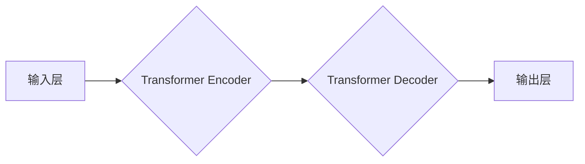

> 大语言模型，BeeBot，自然语言处理，文本生成，对话系统，机器学习，深度学习

## 1. 背景介绍

近年来，人工智能领域取得了令人瞩目的进展，其中大语言模型（LLM）作为一种强大的工具，在自然语言处理（NLP）领域展现出巨大的潜力。LLM能够理解和生成人类语言，并应用于各种场景，例如文本摘要、机器翻译、对话系统等。

BeeBot是一个基于Transformer架构的开源大语言模型，旨在为开发者提供一个易于使用和定制的平台，以探索和构建基于LLM的应用。BeeBot的开源特性使得其能够被广泛应用于学术研究、工业开发以及个人项目。

## 2. 核心概念与联系

### 2.1  Transformer架构

Transformer是一种基于注意力机制的神经网络架构，它能够有效地处理序列数据，例如文本。Transformer的核心组件是注意力机制，它允许模型关注输入序列中与当前任务相关的部分，从而提高模型的理解能力和生成质量。

### 2.2  大语言模型

大语言模型是指拥有大量参数的深度学习模型，通过训练海量文本数据，能够掌握语言的语法、语义和上下文关系。LLM可以用于各种自然语言处理任务，例如文本生成、机器翻译、问答系统等。

### 2.3  BeeBot架构

BeeBot基于Transformer架构，并结合了其他先进的NLP技术，例如预训练和微调。其架构可以概括为以下几个部分：



* **输入层:** 将文本序列转换为模型可理解的向量表示。
* **Transformer Encoder:** 对输入序列进行编码，提取其语义信息。
* **Transformer Decoder:** 根据编码后的信息生成目标文本序列。
* **输出层:** 将模型输出的向量表示转换为文本。

## 3. 核心算法原理 & 具体操作步骤

### 3.1  算法原理概述

BeeBot的核心算法是基于Transformer架构的深度学习模型。该模型通过训练海量文本数据，学习语言的语法、语义和上下文关系。训练过程主要包括以下步骤：

1. **数据预处理:** 将文本数据进行清洗、分词、标记等预处理操作。
2. **模型训练:** 使用训练数据训练Transformer模型，优化模型参数以最小化预测误差。
3. **模型评估:** 使用验证数据评估模型的性能，并根据评估结果调整训练参数。
4. **模型微调:** 将预训练好的模型微调到特定任务，例如文本生成、机器翻译等。

### 3.2  算法步骤详解

1. **输入数据:** 将文本序列输入到模型的输入层。
2. **编码:** Transformer Encoder将输入序列编码成隐藏状态向量，这些向量包含了输入序列的语义信息。
3. **解码:** Transformer Decoder根据编码后的信息生成目标文本序列。
4. **输出结果:** 将解码后的文本序列输出到模型的输出层。

### 3.3  算法优缺点

**优点:**

* **强大的文本理解能力:** Transformer架构能够有效地处理序列数据，并捕捉长距离依赖关系，从而提高模型的文本理解能力。
* **高效的训练速度:** Transformer模型的并行训练能力强，能够在较短的时间内完成训练。
* **可扩展性强:** Transformer模型可以根据需要增加模型参数，从而提高模型的性能。

**缺点:**

* **计算资源需求高:** Transformer模型的参数量较大，训练和推理需要大量的计算资源。
* **训练数据依赖性强:** Transformer模型的性能取决于训练数据的质量和数量。

### 3.4  算法应用领域

* **文本生成:** 生成高质量的文本内容，例如文章、故事、诗歌等。
* **机器翻译:** 将文本从一种语言翻译成另一种语言。
* **问答系统:** 回答用户提出的问题。
* **对话系统:** 与用户进行自然语言对话。
* **文本摘要:** 生成文本的简短摘要。

## 4. 数学模型和公式 & 详细讲解 & 举例说明

### 4.1  数学模型构建

Transformer模型的核心是注意力机制，它通过计算输入序列中每个词与目标词之间的相关性，来确定每个词对目标词的影响程度。注意力机制的数学模型可以表示为：

$$
Attention(Q, K, V) = softmax(\frac{QK^T}{\sqrt{d_k}})V
$$

其中：

* $Q$：查询矩阵
* $K$：键矩阵
* $V$：值矩阵
* $d_k$：键向量的维度
* $softmax$：softmax函数

### 4.2  公式推导过程

注意力机制的公式推导过程如下：

1. 计算查询矩阵 $Q$ 与键矩阵 $K$ 的点积，并除以 $\sqrt{d_k}$。
2. 应用softmax函数对点积结果进行归一化，得到注意力权重。
3. 将注意力权重与值矩阵 $V$ 进行加权求和，得到最终的注意力输出。

### 4.3  案例分析与讲解

假设我们有一个句子 "The cat sat on the mat"，我们要计算 "sat" 这个词对 "cat" 这个词的注意力权重。

1. 将 "sat" 作为查询词 $Q$，将 "cat" 作为键词 $K$。
2. 计算 $Q$ 和 $K$ 的点积，并除以 $\sqrt{d_k}$。
3. 应用softmax函数对点积结果进行归一化，得到注意力权重。
4. 将注意力权重与值矩阵 $V$ 进行加权求和，得到最终的注意力输出。

通过注意力机制，模型能够学习到 "sat" 和 "cat" 之间的语义关系，从而更好地理解句子含义。

## 5. 项目实践：代码实例和详细解释说明

### 5.1  开发环境搭建

BeeBot可以使用Python语言开发，并依赖于TensorFlow或PyTorch等深度学习框架。

开发环境搭建步骤如下：

1. 安装Python语言和必要的库，例如NumPy、Pandas、TensorFlow或PyTorch。
2. 下载BeeBot的源代码。
3. 创建一个新的项目文件夹，并将BeeBot的源代码复制到该文件夹中。

### 5.2  源代码详细实现

BeeBot的源代码包含了模型的架构定义、训练脚本、评估脚本等。

模型的架构定义使用Python的类语法实现，例如：

```python
class BeeBot(nn.Module):
    def __init__(self, vocab_size, embedding_dim, hidden_dim, num_layers):
        super(BeeBot, self).__init__()
        # 定义模型的层结构
        # ...

    def forward(self, x):
        # 定义模型的正向传播过程
        # ...
```

训练脚本使用TensorFlow或PyTorch的API进行模型训练，例如：

```python
# 定义训练参数
learning_rate = 0.001
batch_size = 32
epochs = 10

# 加载训练数据
train_data = ...

# 创建模型实例
model = BeeBot(vocab_size, embedding_dim, hidden_dim, num_layers)

# 定义优化器
optimizer = torch.optim.Adam(model.parameters(), lr=learning_rate)

# 训练模型
for epoch in range(epochs):
    for batch in train_data:
        # 前向传播
        output = model(batch)
        # 计算损失
        loss = ...
        # 反向传播
        optimizer.zero_grad()
        loss.backward()
        # 更新参数
        optimizer.step()
```

### 5.3  代码解读与分析

BeeBot的源代码提供了模型的架构定义、训练脚本、评估脚本等，开发者可以根据自己的需求进行修改和扩展。

### 5.4  运行结果展示

训练完成后，可以将模型应用于文本生成、机器翻译等任务，并评估模型的性能。

## 6. 实际应用场景

### 6.1  文本生成

BeeBot可以用于生成各种类型的文本内容，例如：

* **文章:** 生成新闻报道、博客文章、技术文档等。
* **故事:** 生成小说、童话故事、剧本等。
* **诗歌:** 生成诗歌、歌词、广告语等。

### 6.2  机器翻译

BeeBot可以用于将文本从一种语言翻译成另一种语言，例如：

* **中英翻译:** 将中文文本翻译成英文。
* **日韩翻译:** 将日语或韩语文本翻译成中文。

### 6.3  问答系统

BeeBot可以用于构建问答系统，例如：

* **知识问答:** 回答用户提出的关于特定领域的知识问题。
* **对话问答:** 与用户进行自然语言对话，并回答用户的提问。

### 6.4  未来应用展望

BeeBot在未来可以应用于更多领域，例如：

* **个性化教育:** 根据学生的学习情况生成个性化的学习内容。
* **智能客服:** 提供24小时在线客服服务，解答用户的疑问。
* **创意写作:** 帮助作家克服写作瓶颈，生成新的创意内容。

## 7. 工具和资源推荐

### 7.1  学习资源推荐

* **Transformer论文:** https://arxiv.org/abs/1706.03762
* **HuggingFace Transformers库:** https://huggingface.co/transformers/
* **DeepLearning.AI课程:** https://www.deeplearning.ai/

### 7.2  开发工具推荐

* **Python:** https://www.python.org/
* **TensorFlow:** https://www.tensorflow.org/
* **PyTorch:** https://pytorch.org/

### 7.3  相关论文推荐

* **BERT:** https://arxiv.org/abs/1810.04805
* **GPT-3:** https://openai.com/blog/gpt-3/
* **T5:** https://arxiv.org/abs/1910.10683

## 8. 总结：未来发展趋势与挑战

### 8.1  研究成果总结

BeeBot的开源特性使得其能够被广泛应用于学术研究、工业开发以及个人项目。

### 8.2  未来发展趋势

未来，大语言模型将会朝着以下几个方向发展：

* **模型规模更大:** 模型参数量将会继续增加，从而提高模型的性能。
* **多模态理解:** 模型将能够理解多种模态的数据，例如文本、图像、音频等。
* **更强的推理能力:** 模型将能够进行更复杂的推理，例如逻辑推理、因果推理等。

### 8.3  面临的挑战

大语言模型也面临着一些挑战，例如：

* **数据偏见:** 模型的训练数据可能存在偏见，导致模型输出结果存在偏差。
* **可解释性:** 模型的决策过程难以解释，这使得模型难以被信任。
* **安全问题:** 模型可能被用于生成恶意内容，例如虚假新闻、网络攻击等。

### 8.4  研究展望

未来，研究者将继续探索大语言模型的潜力，并解决其面临的挑战，以推动人工智能技术的发展。

## 9. 附录：常见问题与解答

### 9.1  如何使用BeeBot进行文本生成？

可以使用BeeBot的源代码中的文本生成脚本，并根据需要修改参数。

### 9.2  BeeBot的训练数据是什么？

BeeBot的训练数据包括大量的文本数据，例如书籍、文章、网站等。

### 9.3  BeeBot的性能如何？

BeeBot在各种自然语言处理任务上都表现出良好的性能。

### 9.4  BeeBot的开源许可证是什么？

BeeBot采用MIT开源许可证。

作者：禅与计算机程序设计艺术 / Zen and the Art of Computer Programming


<end_of_turn>