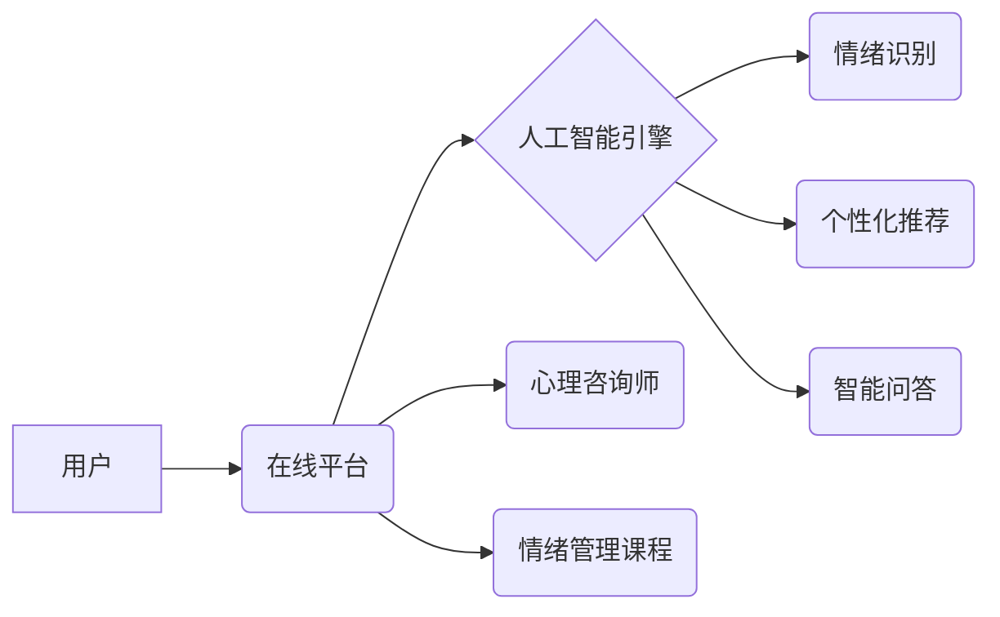

> 在线心理咨询，情绪管理，知识付费，人工智能，机器学习，深度学习，自然语言处理，心理测评，课程开发

## 1. 背景介绍

近年来，随着互联网技术的快速发展和普及，人们对心理健康的需求日益增长。然而，传统的心理咨询服务存在着时间、地域、成本等方面的限制，难以满足大众的需求。知识付费模式的兴起为在线心理咨询和情绪管理提供了新的机遇。

在线心理咨询平台通过互联网连接心理咨询师和用户，打破了时间和地域的限制，让用户能够随时随地获得心理咨询服务。情绪管理课程则通过线上学习的方式，帮助用户了解情绪的本质，掌握情绪调节技巧，提升心理素质。

## 2. 核心概念与联系

**2.1 在线心理咨询与情绪管理课程的关联**

在线心理咨询和情绪管理课程是互补的关系。在线心理咨询可以帮助用户解决具体的心理问题，而情绪管理课程则可以帮助用户建立良好的情绪调节机制，预防心理问题发生。

**2.2 知识付费模式的应用**

知识付费模式是指通过提供有价值的知识和技能，向用户收取费用。在线心理咨询和情绪管理课程可以通过知识付费模式实现商业化，并为用户提供更优质的服务。

**2.3 技术支撑**

在线心理咨询和情绪管理课程的开发和运营需要强大的技术支撑，包括：

* **人工智能技术**: 用于智能问答、情绪识别、个性化推荐等功能。
* **机器学习技术**: 用于分析用户数据，提升服务精准度。
* **深度学习技术**: 用于自然语言处理，理解用户情绪和需求。
* **云计算技术**: 用于存储和处理海量用户数据。

**2.4 架构图**



## 3. 核心算法原理 & 具体操作步骤

**3.1 算法原理概述**

在线心理咨询和情绪管理课程的核心算法主要包括：

* **自然语言处理 (NLP)**: 用于理解用户输入的文本信息，识别用户的情绪和需求。
* **机器学习 (ML)**: 用于分析用户数据，预测用户的心理状态，提供个性化建议。
* **深度学习 (DL)**: 用于构建更复杂的模型，提高算法的准确性和效率。

**3.2 算法步骤详解**

1. **数据采集**: 收集用户的心理咨询记录、情绪日记、在线行为数据等。
2. **数据预处理**: 对数据进行清洗、格式化、标注等处理，使其适合算法训练。
3. **模型训练**: 使用机器学习算法训练模型，例如支持向量机 (SVM)、随机森林 (RF)、深度神经网络 (DNN) 等。
4. **模型评估**: 使用测试数据评估模型的性能，例如准确率、召回率、F1-score 等。
5. **模型部署**: 将训练好的模型部署到在线平台，用于提供心理咨询和情绪管理服务。

**3.3 算法优缺点**

* **优点**:

    * 自动化处理大量数据，提高效率。
    * 提供个性化服务，满足不同用户的需求。
    * 降低心理咨询的成本，提高大众的接受度。

* **缺点**:

    * 算法模型的准确性有限，可能存在误判。
    * 缺乏人与人之间的情感交流，难以解决复杂的心理问题。
    * 数据隐私安全需要得到保障。

**3.4 算法应用领域**

* 在线心理咨询平台
* 情绪管理课程
* 抑郁症、焦虑症等心理疾病的辅助治疗
* 企业员工心理健康管理

## 4. 数学模型和公式 & 详细讲解 & 举例说明

**4.1 数学模型构建**

在线心理咨询和情绪管理课程的数学模型可以基于用户行为数据、心理测评结果、情绪识别结果等构建。例如，可以使用贝叶斯网络模型来预测用户的风险等级，或者使用线性回归模型来预测用户的情绪变化趋势。

**4.2 公式推导过程**

例如，可以使用以下公式来计算用户的风险等级：

$$Risk = \sum_{i=1}^{n} w_i * x_i$$

其中：

* $Risk$ 表示用户的风险等级
* $w_i$ 表示第 $i$ 个特征的权重
* $x_i$ 表示第 $i$ 个特征的值

**4.3 案例分析与讲解**

假设我们有一个在线心理咨询平台，收集了用户的年龄、性别、心理测评结果、情绪日记等数据。我们可以使用上述公式来计算用户的风险等级，并根据风险等级提供不同的服务建议。例如，风险等级较高的用户可以获得更频繁的心理咨询服务，而风险等级较低的用户的建议则可以更加轻量化。

## 5. 项目实践：代码实例和详细解释说明

**5.1 开发环境搭建**

* 操作系统: Ubuntu 20.04
* 编程语言: Python 3.8
* 框架: Flask
* 数据库: PostgreSQL
* 工具: Jupyter Notebook, Git

**5.2 源代码详细实现**

```python
from flask import Flask, request, jsonify
from sklearn.linear_model import LogisticRegression

app = Flask(__name__)

# 加载训练好的模型
model = LogisticRegression()
model.load("model.pkl")

@app.route('/predict', methods=['POST'])
def predict():
    data = request.get_json()
    # 对数据进行预处理
    # ...
    # 使用模型进行预测
    prediction = model.predict([data])
    # 返回预测结果
    return jsonify({'prediction': prediction[0]})

if __name__ == '__main__':
    app.run(debug=True)
```

**5.3 代码解读与分析**

* 该代码示例是一个简单的在线心理咨询平台接口，用于预测用户的风险等级。
* 使用Flask框架构建API接口，接收用户数据并返回预测结果。
* 使用Scikit-learn库加载训练好的LogisticRegression模型进行预测。
* 需要根据实际情况对数据进行预处理，并选择合适的模型进行训练。

**5.4 运行结果展示**

当用户向平台发送请求时，平台会根据用户数据进行预测，并返回预测结果。例如，如果预测结果为1，则表示用户风险等级较高，需要提供更频繁的心理咨询服务。

## 6. 实际应用场景

**6.1 在线心理咨询平台**

在线心理咨询平台可以利用人工智能技术，提供智能问答、情绪识别、个性化推荐等功能，提高用户体验，降低咨询成本。

**6.2 情绪管理课程**

情绪管理课程可以利用机器学习技术，分析用户的行为数据和情绪日记，提供个性化的情绪调节建议，帮助用户提升心理素质。

**6.3 企业员工心理健康管理**

企业可以利用在线心理咨询和情绪管理课程，帮助员工缓解压力，提升工作效率，打造健康的工作环境。

**6.4 未来应用展望**

随着人工智能技术的不断发展，在线心理咨询和情绪管理课程将更加智能化、个性化、便捷化。未来，我们可以期待看到：

* 更精准的风险预测和个性化服务
* 更丰富的互动体验和情感支持
* 更广泛的应用场景和社会影响

## 7. 工具和资源推荐

**7.1 学习资源推荐**

* **在线课程**: Coursera, edX, Udemy 等平台提供人工智能、机器学习、深度学习等相关课程。
* **书籍**: 《深度学习》、《机器学习实战》、《自然语言处理》等书籍。
* **开源项目**: TensorFlow, PyTorch, NLTK 等开源项目。

**7.2 开发工具推荐**

* **编程语言**: Python
* **框架**: Flask, Django
* **数据库**: PostgreSQL, MySQL
* **云平台**: AWS, Azure, GCP

**7.3 相关论文推荐**

* **情感分析**: "Sentiment Analysis Using Deep Learning"
* **情绪识别**: "Emotion Recognition from Facial Expressions Using Deep Convolutional Neural Networks"
* **心理健康预测**: "Predicting Mental Health Outcomes Using Machine Learning"

## 8. 总结：未来发展趋势与挑战

**8.1 研究成果总结**

在线心理咨询和情绪管理课程的开发和应用取得了显著的成果，为大众提供了一种便捷、高效、经济的心理健康服务方式。

**8.2 未来发展趋势**

未来，在线心理咨询和情绪管理课程将朝着更加智能化、个性化、便捷化的方向发展，并应用于更广泛的场景。

**8.3 面临的挑战**

* 算法模型的准确性需要进一步提高，以避免误判和误导。
* 人与人之间的情感交流是不可替代的，需要探索如何将人工智能技术与人际互动相结合。
* 数据隐私安全需要得到保障，需要制定相应的法律法规和技术措施。

**8.4 研究展望**

未来，需要继续加强对在线心理咨询和情绪管理课程的研发和应用，探索人工智能技术在心理健康领域的更多应用场景，为大众提供更优质的心理健康服务。

## 9. 附录：常见问题与解答

**9.1 在线心理咨询是否安全可靠？**

在线心理咨询平台需要严格遵守数据隐私安全规定，并采取相应的技术措施保障用户数据安全。选择正规的平台，并注意保护自己的个人信息。

**9.2 在线心理咨询是否能替代传统心理咨询？**

在线心理咨询可以作为传统心理咨询的补充，但对于复杂的心理问题，建议寻求专业的心理咨询师的帮助。

**9.3 在线情绪管理课程的效果如何？**

在线情绪管理课程的效果因人而异，需要根据自身的实际情况选择合适的课程，并坚持学习和实践。


作者：禅与计算机程序设计艺术 / Zen and the Art of Computer Programming 
<end_of_turn>