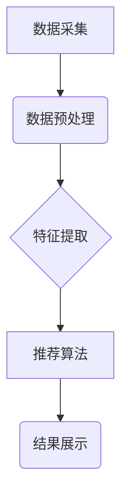

> 用户行为分析，实时推荐，机器学习，协同过滤，内容过滤，深度学习，推荐系统

## 1. 背景介绍

在当今数据爆炸的时代，用户行为数据已成为企业获取洞察、提升用户体验和驱动业务增长的宝贵资源。实时推荐系统作为一种重要的数据挖掘技术，能够根据用户的历史行为、偏好和实时上下文，精准地推荐用户感兴趣的内容或产品，从而提升用户粘性、转化率和满意度。

传统的推荐系统往往依赖于离线数据处理和批量更新，无法及时响应用户行为的变化，导致推荐结果的准确性和时效性下降。而实时推荐系统则通过实时数据流的处理和分析，能够快速捕捉用户行为的动态变化，并根据实时反馈进行动态调整，从而实现更精准、更个性化的推荐。

## 2. 核心概念与联系

**2.1 用户行为分析**

用户行为分析是指通过收集、分析和挖掘用户在使用产品或服务过程中产生的各种行为数据，以了解用户的兴趣、偏好、需求和行为模式。这些行为数据包括但不限于：

* **点击行为:** 用户点击网页、链接、广告等行为。
* **浏览行为:** 用户浏览网页、产品页面、文章等行为。
* **搜索行为:** 用户在搜索引擎或网站内进行搜索的行为。
* **购买行为:** 用户购买商品或服务的行为。
* **评论行为:** 用户对商品或服务进行评价和评论的行为。

**2.2 实时推荐系统**

实时推荐系统是一种基于用户行为数据的推荐系统，能够根据用户的实时行为和上下文信息，实时地生成个性化的推荐结果。实时推荐系统的核心特点包括：

* **实时性:** 能够快速响应用户行为的变化，并及时更新推荐结果。
* **个性化:** 根据用户的历史行为、偏好和实时上下文信息，生成个性化的推荐结果。
* **精准性:** 通过数据分析和机器学习算法，提高推荐结果的准确性和有效性。

**2.3 核心架构**

实时推荐系统的核心架构通常包括以下几个模块：

* **数据采集模块:** 收集用户行为数据，包括点击、浏览、搜索、购买等行为。
* **数据预处理模块:** 对收集到的用户行为数据进行清洗、转换和格式化，以便后续的分析和处理。
* **特征提取模块:** 从用户行为数据中提取特征，例如用户兴趣、偏好、购买历史等。
* **推荐算法模块:** 使用机器学习算法，根据用户特征和上下文信息，生成个性化的推荐结果。
* **结果展示模块:** 将推荐结果以用户友好的方式展示给用户。



## 3. 核心算法原理 & 具体操作步骤

**3.1 算法原理概述**

实时推荐系统常用的算法包括协同过滤、内容过滤和深度学习等。

* **协同过滤:** 基于用户的历史行为数据，预测用户对某项内容的兴趣。
* **内容过滤:** 基于内容的特征信息，推荐与用户兴趣相符的内容。
* **深度学习:** 使用深度神经网络，学习用户行为的复杂模式，并生成更精准的推荐结果。

**3.2 算法步骤详解**

以协同过滤算法为例，其具体步骤如下：

1. **数据收集:** 收集用户对各种内容的评分或行为数据。
2. **用户和内容表示:** 将用户和内容表示为向量，例如使用one-hot编码或词嵌入技术。
3. **相似度计算:** 计算用户之间的相似度或内容之间的相似度，例如使用余弦相似度或皮尔逊相关系数。
4. **推荐生成:** 根据用户与其他用户的相似度或用户与内容的相似度，推荐用户可能感兴趣的内容。

**3.3 算法优缺点**

* **协同过滤:**
    * **优点:** 可以发现用户之间的隐性关系，推荐个性化内容。
    * **缺点:** 数据稀疏性问题，冷启动问题。
* **内容过滤:**
    * **优点:** 不需要用户行为数据，可以推荐新内容。
    * **缺点:** 难以捕捉用户隐性需求，推荐结果可能过于单一。
* **深度学习:**
    * **优点:** 可以学习用户行为的复杂模式，推荐结果更精准。
    * **缺点:** 需要大量数据训练，模型复杂度高。

**3.4 算法应用领域**

实时推荐系统广泛应用于以下领域：

* **电商:** 商品推荐、个性化营销。
* **社交媒体:** 内容推荐、用户匹配。
* **视频平台:** 视频推荐、用户画像。
* **音乐平台:** 音乐推荐、用户发现。

## 4. 数学模型和公式 & 详细讲解 & 举例说明

**4.1 数学模型构建**

协同过滤算法的数学模型可以表示为用户-物品评分矩阵，其中每个元素表示用户对物品的评分。

**4.2 公式推导过程**

协同过滤算法常用的相似度计算公式包括余弦相似度和皮尔逊相关系数。

* **余弦相似度:**

$$
\text{相似度} = \frac{\mathbf{u} \cdot \mathbf{v}}{\|\mathbf{u}\| \|\mathbf{v}\|}
$$

其中，$\mathbf{u}$ 和 $\mathbf{v}$ 分别表示两个用户的向量表示，$\cdot$ 表示点积，$\|\mathbf{u}\|$ 和 $\|\mathbf{v}\|$ 分别表示两个向量的模长。

* **皮尔逊相关系数:**

$$
\text{相似度} = \frac{\sum_{i=1}^{n} (u_i - \bar{u})(v_i - \bar{v})}{\sqrt{\sum_{i=1}^{n} (u_i - \bar{u})^2} \sqrt{\sum_{i=1}^{n} (v_i - \bar{v})^2}}
$$

其中，$u_i$ 和 $v_i$ 分别表示两个用户对第 $i$ 个物品的评分，$\bar{u}$ 和 $\bar{v}$ 分别表示两个用户的平均评分。

**4.3 案例分析与讲解**

假设有两个用户 A 和 B，他们的评分矩阵如下：

| 物品 | A | B |
|---|---|---|
| 1 | 5 | 4 |
| 2 | 3 | 2 |
| 3 | 4 | 5 |
| 4 | 2 | 3 |

我们可以使用余弦相似度或皮尔逊相关系数计算 A 和 B 的相似度。例如，使用余弦相似度计算：

$$
\text{相似度} = \frac{(5 \cdot 4 + 3 \cdot 2 + 4 \cdot 5 + 2 \cdot 3) }{\sqrt{(5^2 + 3^2 + 4^2 + 2^2)} \sqrt{(4^2 + 2^2 + 5^2 + 3^2)}}
$$

计算结果表明 A 和 B 的相似度较高，说明他们对某些物品的偏好相似。

## 5. 项目实践：代码实例和详细解释说明

**5.1 开发环境搭建**

* 操作系统: Ubuntu 20.04
* Python 版本: 3.8
* 依赖库: pandas, numpy, scikit-learn, tensorflow

**5.2 源代码详细实现**

```python
import pandas as pd
from sklearn.metrics.pairwise import cosine_similarity

# 加载用户评分数据
ratings_data = pd.read_csv('ratings.csv')

# 构建用户-物品评分矩阵
user_item_matrix = ratings_data.pivot_table(index='user_id', columns='item_id', values='rating')

# 计算用户之间的余弦相似度
user_similarity = cosine_similarity(user_item_matrix)

# 获取用户 A 的相似用户
user_A_id = 1
similar_users = user_similarity[user_A_id].argsort()[:-6:-1]  # 获取前 5 个相似用户

# 推荐给用户 A 的物品
recommended_items = []
for similar_user in similar_users:
    # 获取相似用户喜欢的物品
    similar_user_ratings = user_item_matrix.loc[similar_user].dropna()
    # 获取用户 A 没有评分过的物品
    user_A_unrated_items = user_item_matrix.loc[user_A_id].index[user_item_matrix.loc[user_A_id].isnull()]
    # 推荐用户 A 没有评分过的，且相似用户喜欢的物品
    recommended_items.extend(similar_user_ratings.index.intersection(user_A_unrated_items))

# 去重并输出推荐结果
recommended_items = list(set(recommended_items))
print(f'推荐给用户 {user_A_id} 的物品: {recommended_items}')
```

**5.3 代码解读与分析**

* 代码首先加载用户评分数据，并构建用户-物品评分矩阵。
* 然后使用余弦相似度计算用户之间的相似度。
* 获取用户 A 的相似用户，并根据相似用户的评分推荐给用户 A 的物品。
* 最后去重并输出推荐结果。

**5.4 运行结果展示**

运行代码后，将输出用户 A 的推荐物品列表。

## 6. 实际应用场景

**6.1 电商推荐**

实时推荐系统可以根据用户的浏览历史、购买记录、购物车内容等信息，推荐用户可能感兴趣的商品，提高用户转化率和销售额。

**6.2 社交媒体推荐**

实时推荐系统可以根据用户的兴趣爱好、好友关系、社交行为等信息，推荐用户可能感兴趣的内容、话题和用户，提升用户粘性和活跃度。

**6.3 视频平台推荐**

实时推荐系统可以根据用户的观看历史、点赞记录、评论行为等信息，推荐用户可能感兴趣的视频，提升用户观看时长和用户留存率。

**6.4 未来应用展望**

随着人工智能技术的不断发展，实时推荐系统将更加智能化、个性化和精准化。未来，实时推荐系统将应用于更多领域，例如教育、医疗、金融等，为用户提供更加个性化和定制化的服务。

## 7. 工具和资源推荐

**7.1 学习资源推荐**

* **书籍:**
    * 《推荐系统》
    * 《机器学习》
* **在线课程:**
    * Coursera: Recommender Systems
    * Udacity: Machine Learning Engineer Nanodegree

**7.2 开发工具推荐**

* **Python:** 广泛应用于机器学习和数据分析领域。
* **Spark:** 大数据处理框架，可以用于处理海量用户行为数据。
* **TensorFlow:** 深度学习框架，可以用于构建更精准的推荐模型。

**7.3 相关论文推荐**

* **Collaborative Filtering for Implicit Feedback Datasets**
* **Deep Learning for Recommender Systems**

## 8. 总结：未来发展趋势与挑战

**8.1 研究成果总结**

实时推荐系统已经取得了显著的成果，在电商、社交媒体、视频平台等领域得到了广泛应用。

**8.2 未来发展趋势**

* **更精准的推荐:** 利用深度学习等先进算法，学习用户行为的复杂模式，生成更精准的推荐结果。
* **更个性化的推荐:** 结合用户画像、上下文信息等多方面数据，提供更个性化的推荐服务。
* **更实时化的推荐:** 利用实时数据流处理技术，实现更实时、更动态的推荐。

**8.3 面临的挑战**

* **数据稀疏性:** 用户行为数据往往是稀疏的，难以训练有效的推荐模型。
* **冷启动问题:** 新用户和新物品难以获得推荐，需要新的算法和策略来解决。
* **用户隐私保护:** 实时推荐系统需要处理大量用户数据，需要采取有效的措施保护用户隐私。

**8.4 研究展望**

未来，实时推荐系统将朝着更智能化、更个性化、更安全的方向发展，为用户提供更加便捷、高效、个性化的服务。

## 9. 附录：常见问题与解答

**9.1 如何解决数据稀