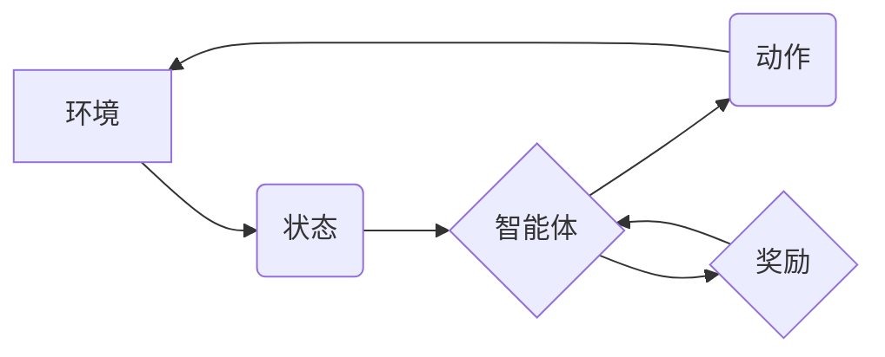

> 强化学习，金融，投资策略，风险管理，算法，模型，应用场景

## 1. 背景介绍

金融领域一直是人工智能应用的热门领域之一。传统金融模型往往依赖于历史数据和静态分析，难以应对市场的不确定性和复杂性。强化学习 (Reinforcement Learning, RL) 作为一种能够学习和优化决策策略的机器学习方法，为金融领域带来了新的机遇。

强化学习的核心思想是通过试错学习，让智能体在与环境的交互中不断优化其行为策略，以最大化累积的奖励。这种学习方式与人类的学习过程相似，能够有效地解决复杂决策问题。

## 2. 核心概念与联系

**2.1 强化学习核心概念**

* **智能体 (Agent):**  决策者，例如投资机器人。
* **环境 (Environment):** 智能体所处的外部世界，例如金融市场。
* **状态 (State):** 环境的当前状态，例如股票价格、利率等。
* **动作 (Action):** 智能体可以采取的行动，例如买入、卖出股票、调整投资组合等。
* **奖励 (Reward):** 环境对智能体动作的反馈，例如投资收益或损失。
* **策略 (Policy):** 智能体根据当前状态选择动作的规则。

**2.2 强化学习与金融的联系**

强化学习可以应用于金融领域的多个方面，例如：

* **投资策略优化:**  RL 算法可以学习最优的投资策略，以最大化投资回报率，同时控制风险。
* **风险管理:** RL 算法可以帮助金融机构识别和管理风险，例如识别潜在的市场波动或信用风险。
* **交易策略:** RL 算法可以学习高效的交易策略，例如识别交易机会并自动执行交易。
* **客户服务:** RL 算法可以用于个性化客户服务，例如推荐合适的金融产品或提供个性化的理财建议。

**2.3 强化学习架构**



## 3. 核心算法原理 & 具体操作步骤

**3.1 算法原理概述**

强化学习的核心算法是基于价值函数的算法，例如 Q-learning 和 SARSA。这些算法通过不断地与环境交互，更新智能体的价值函数，从而学习最优的策略。

* **价值函数 (Value Function):**  评估智能体在特定状态下采取特定动作的长期回报。
* **Q-learning:**  一种基于最大化期望回报的算法，学习一个 Q-table，其中存储了每个状态-动作对的价值。
* **SARSA:**  一种基于当前策略的算法，学习一个策略，并根据该策略更新价值函数。

**3.2 算法步骤详解**

1. **初始化:**  初始化价值函数，例如 Q-table。
2. **环境交互:**  智能体与环境交互，观察当前状态和获得奖励。
3. **动作选择:**  根据当前状态和价值函数，智能体选择一个动作。
4. **状态转移:**  执行动作后，环境状态发生变化。
5. **奖励更新:**  根据奖励信号，更新价值函数。
6. **重复步骤 2-5:**  重复上述步骤，直到智能体学习到最优策略。

**3.3 算法优缺点**

* **优点:**  能够学习复杂决策策略，适应动态环境。
* **缺点:**  训练时间长，数据需求大，容易陷入局部最优。

**3.4 算法应用领域**

* **游戏:**  RL 算法在游戏领域取得了巨大成功，例如 AlphaGo 和 AlphaZero。
* **机器人:**  RL 算法可以用于训练机器人进行复杂的任务，例如导航和抓取。
* **自动驾驶:**  RL 算法可以用于训练自动驾驶汽车，使其能够安全地行驶。

## 4. 数学模型和公式 & 详细讲解 & 举例说明

**4.1 数学模型构建**

强化学习的数学模型通常由以下几个部分组成:

* **状态空间 (S):**  所有可能的系统状态的集合。
* **动作空间 (A):**  智能体可以采取的所有动作的集合。
* **奖励函数 (R):**  描述智能体在特定状态采取特定动作后获得的奖励。
* **转移概率 (P):**  描述从一个状态采取一个动作后转移到另一个状态的概率。
* **价值函数 (V):**  评估智能体在特定状态下采取策略的长期回报。

**4.2 公式推导过程**

* **Bellman 方程:**  描述价值函数与奖励函数和转移概率之间的关系。

$$
V(s) = \max_a \sum_{s'} P(s'|s,a) [R(s,a,s') + \gamma V(s')]
$$

其中:

* $V(s)$ 是状态 $s$ 的价值。
* $a$ 是智能体可以采取的动作。
* $s'$ 是状态 $s$ 采取动作 $a$ 后转移到的下一个状态。
* $R(s,a,s')$ 是在状态 $s$ 采取动作 $a$ 后转移到状态 $s'$ 获得的奖励。
* $\gamma$ 是折扣因子，控制未来奖励的权重。

* **Q-learning 更新规则:**

$$
Q(s,a) = Q(s,a) + \alpha [R(s,a,s') + \gamma \max_{a'} Q(s',a') - Q(s,a)]
$$

其中:

* $Q(s,a)$ 是状态 $s$ 采取动作 $a$ 的价值。
* $\alpha$ 是学习率，控制学习速度。

**4.3 案例分析与讲解**

例如，在投资策略优化问题中，状态空间可以是股票价格、利率等金融指标，动作空间可以是买入、卖出股票等投资决策，奖励函数可以是投资收益，转移概率可以是股票价格变化的概率。

通过训练 RL 算法，可以学习到最优的投资策略，例如在特定市场条件下，选择买入或卖出股票，以最大化投资回报率。

## 5. 项目实践：代码实例和详细解释说明

**5.1 开发环境搭建**

* Python 3.x
* TensorFlow 或 PyTorch
* NumPy
* Pandas

**5.2 源代码详细实现**

```python
import numpy as np
from tensorflow.keras.models import Sequential
from tensorflow.keras.layers import Dense

# 定义环境
class StockEnv:
    def __init__(self):
        # 初始化股票价格等数据
        pass

    def reset(self):
        # 重置环境状态
        pass

    def step(self, action):
        # 执行动作，更新环境状态
        pass

    def render(self):
        # 显示环境状态
        pass

# 定义 RL 算法
class QLearningAgent:
    def __init__(self, env, learning_rate=0.1, discount_factor=0.9, epsilon=0.1):
        # 初始化 RL 算法参数
        pass

    def choose_action(self, state):
        # 选择动作
        pass

    def update_q_table(self, state, action, reward, next_state):
        # 更新 Q 表
        pass

# 创建环境和 RL 算法实例
env = StockEnv()
agent = QLearningAgent(env)

# 训练 RL 算法
for episode in range(1000):
    state = env.reset()
    done = False
    while not done:
        action = agent.choose_action(state)
        next_state, reward, done = env.step(action)
        agent.update_q_table(state, action, reward, next_state)
        state = next_state

# 测试 RL 算法
state = env.reset()
while True:
    action = agent.choose_action(state)
    next_state, reward, done = env.step(action)
    env.render()
    state = next_state
    if done:
        break
```

**5.3 代码解读与分析**

* 代码首先定义了股票交易环境和强化学习算法。
* 然后创建了环境和算法实例，并开始训练过程。
* 训练过程中，智能体与环境交互，根据奖励信号更新价值函数。
* 训练完成后，可以测试 RL 算法的性能。

**5.4 运行结果展示**

运行结果可以展示智能体在交易过程中获得的收益，以及其决策策略的变化。

## 6. 实际应用场景

**6.1 投资策略优化**

RL 算法可以学习最优的投资策略，例如根据市场趋势和风险偏好，选择合适的资产配置。

**6.2 风险管理**

RL 算法可以帮助金融机构识别和管理风险，例如识别潜在的市场波动或信用风险，并采取相应的措施进行风险控制。

**6.3 交易策略**

RL 算法可以学习高效的交易策略，例如识别交易机会并自动执行交易，提高交易效率和收益。

**6.4 客户服务**

RL 算法可以用于个性化客户服务，例如推荐合适的金融产品或提供个性化的理财建议。

**6.5 未来应用展望**

* **自动投资机器人:**  RL 算法可以用于开发自动投资机器人，帮助用户进行智能投资。
* **个性化理财服务:**  RL 算法可以根据用户的风险偏好和财务目标，提供个性化的理财建议。
* **金融风险预测:**  RL 算法可以用于预测金融风险，例如识别潜在的市场波动或信用风险。

## 7. 工具和资源推荐

**7.1 学习资源推荐**

* **书籍:**
    * Reinforcement Learning: An Introduction by Richard S. Sutton and Andrew G. Barto
    * Deep Reinforcement Learning Hands-On by Maxim Lapan
* **在线课程:**
    * Coursera: Reinforcement Learning Specialization by David Silver
    * Udacity: Deep Reinforcement Learning Nanodegree

**7.2 开发工具推荐**

* **TensorFlow:**  开源深度学习框架，支持 RL 算法的开发。
* **PyTorch:**  开源深度学习框架，支持 RL 算法的开发。
* **OpenAI Gym:**  RL 算法测试和研究平台，提供多种环境和任务。

**7.3 相关论文推荐**

* Deep Reinforcement Learning for Trading by David Silver
* Mastering the Game of Go with Deep Neural Networks and Tree Search by Demis Hassabis
* AlphaGo Zero: Starting from Scratch by David Silver

## 8. 总结：未来发展趋势与挑战

**8.1 研究成果总结**

强化学习在金融领域的应用取得了显著进展，例如投资策略优化、风险管理和交易策略。

**8.2 未来发展趋势**

* **深度强化学习:**  将深度学习与强化学习相结合，提高算法的学习能力和泛化能力。
* **多智能体强化学习:**  研究多个智能体在金融市场中的交互和协作。
* **解释性强化学习:**  提高 RL 算法的可解释性，帮助人类理解算法的决策过程。

**8.3 面临的挑战**

* **数据需求:**  RL 算法需要大量的训练数据，而金融数据往往难以获取和处理。
* **计算资源:**  训练大型 RL 算法需要大量的计算资源。
* **安全性和稳定性:**  RL 算法在金融领域应用需要保证安全性和稳定性。

**8.4 研究展望**

未来，强化学习在金融领域的应用将更加广泛和深入，为金融行业带来新的机遇和挑战。


## 9. 附录：常见问题与解答

**9.1 如何选择合适的 RL 算法？**

选择合适的 RL 算法取决于具体的应用场景和数据特点。例如，对于离散动作空间的问题，可以使用 Q-learning 算法；对于连续动作空间的问题，可以使用 Deep Q-Network (DQN) 算法。