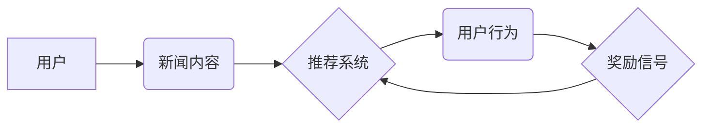

> 强化学习，新闻推荐，深度学习，用户行为，个性化推荐，算法优化

## 1. 背景介绍

在信息爆炸的时代，海量新闻信息涌现，用户难以从其中筛选出自己感兴趣的内容。新闻推荐系统应运而生，旨在根据用户的兴趣偏好，智能推荐相关新闻，提升用户阅读体验。传统的新闻推荐系统主要依赖于协同过滤、内容过滤等方法，但这些方法存在一定的局限性，例如数据稀疏性、冷启动问题等。

近年来，深度学习技术的发展为新闻推荐带来了新的机遇。其中，强化学习（Reinforcement Learning，RL）作为一种能够学习用户行为和反馈的智能算法，在新闻推荐领域展现出巨大的潜力。

## 2. 核心概念与联系

强化学习的核心概念是“智能体”与“环境”的交互过程。智能体通过与环境的交互，不断学习并优化自己的策略，以获得最大的奖励。

在新闻推荐场景中，智能体可以理解为推荐系统，环境则是用户和新闻内容的集合。用户行为，例如点击、阅读、分享等，可以看作是智能体与环境的交互，而这些行为产生的反馈，例如用户满意度、停留时间等，则可以作为奖励信号。

**新闻推荐强化学习架构**



## 3. 核心算法原理 & 具体操作步骤

### 3.1  算法原理概述

强化学习算法的核心是通过不断地试错，学习最优的策略。常见的强化学习算法包括Q学习、SARSA等。

在新闻推荐场景中，强化学习算法可以用来学习用户偏好的新闻类型、时间段、作者等特征，并根据这些特征，推荐最符合用户兴趣的新闻。

### 3.2  算法步骤详解

1. **环境建模:** 建立新闻推荐环境模型，包括新闻内容、用户特征、推荐策略等。
2. **状态空间定义:** 定义推荐系统的状态空间，例如当前用户浏览的新闻类别、用户历史行为等。
3. **动作空间定义:** 定义推荐系统的动作空间，例如推荐新闻、调整推荐策略等。
4. **奖励函数设计:** 设计奖励函数，根据用户行为反馈，例如点击、阅读、分享等，给予相应的奖励。
5. **策略学习:** 使用强化学习算法，例如Q学习、SARSA等，学习最优的推荐策略，以最大化奖励。
6. **策略评估:** 对学习到的策略进行评估，例如通过A/B测试等方法，验证策略的有效性。

### 3.3  算法优缺点

**优点:**

* 可以学习用户个性化偏好，提供更精准的推荐。
* 可以适应用户行为变化，不断优化推荐策略。
* 可以处理数据稀疏性问题，例如冷启动问题。

**缺点:**

* 算法训练复杂，需要大量的用户行为数据。
* 奖励函数设计需要谨慎，否则可能导致算法偏向某些类型的新闻。
* 算法实时性较差，需要定期更新策略。

### 3.4  算法应用领域

强化学习在新闻推荐领域之外，还广泛应用于其他领域，例如：

* 电商推荐
* 音乐推荐
* 游戏设计
* 自动驾驶

## 4. 数学模型和公式 & 详细讲解 & 举例说明

### 4.1  数学模型构建

强化学习模型的核心是状态-动作-奖励（State-Action-Reward，SAR）三元组。

* **状态 (State):**  推荐系统当前的状态，例如用户浏览的新闻类别、用户历史行为等。
* **动作 (Action):**  推荐系统可以采取的动作，例如推荐新闻、调整推荐策略等。
* **奖励 (Reward):**  用户行为反馈，例如点击、阅读、分享等，给予相应的奖励。

### 4.2  公式推导过程

Q学习算法的核心公式是：

$$Q(s,a) = Q(s,a) + \alpha [r + \gamma \max_{a'} Q(s',a') - Q(s,a)]$$

其中：

* $Q(s,a)$:  状态 $s$ 下采取动作 $a$ 的价值函数。
* $\alpha$: 学习率，控制学习速度。
* $r$:  当前状态下获得的奖励。
* $\gamma$:  折扣因子，控制未来奖励的权重。
* $s'$:  采取动作 $a$ 后进入的下一个状态。
* $a'$:  在下一个状态 $s'$ 下采取的动作。

### 4.3  案例分析与讲解

假设用户浏览新闻类别为“科技”，推荐系统推荐了一篇关于人工智能的文章。用户点击了该文章并阅读了大部分内容，此时可以给予奖励 $r = 1$。

根据Q学习公式，推荐系统会更新状态“科技”下采取动作“推荐人工智能文章”的价值函数 $Q(s,a)$，使其增加，表示该动作在当前状态下是有效的。

## 5. 项目实践：代码实例和详细解释说明

### 5.1  开发环境搭建

* Python 3.x
* TensorFlow 或 PyTorch 深度学习框架
* NumPy 科学计算库
* Pandas 数据处理库

### 5.2  源代码详细实现

```python
import tensorflow as tf

# 定义Q网络模型
class QNetwork(tf.keras.Model):
    def __init__(self):
        super(QNetwork, self).__init__()
        self.dense1 = tf.keras.layers.Dense(64, activation='relu')
        self.dense2 = tf.keras.layers.Dense(32, activation='relu')
        self.output = tf.keras.layers.Dense(num_actions)

    def call(self, state):
        x = self.dense1(state)
        x = self.dense2(x)
        return self.output(x)

# 定义强化学习算法
class QLearningAgent:
    def __init__(self, num_actions, learning_rate=0.01, discount_factor=0.99):
        self.num_actions = num_actions
        self.learning_rate = learning_rate
        self.discount_factor = discount_factor
        self.q_network = QNetwork()
        self.optimizer = tf.keras.optimizers.Adam(learning_rate=self.learning_rate)

    def train(self, state, action, reward, next_state):
        with tf.GradientTape() as tape:
            q_values = self.q_network(state)
            target_q_value = reward + self.discount_factor * tf.reduce_max(self.q_network(next_state))
            loss = tf.keras.losses.MSE(target_q_value, q_values[0, action])
        gradients = tape.gradient(loss, self.q_network.trainable_variables)
        self.optimizer.apply_gradients(zip(gradients, self.q_network.trainable_variables))

# ... 其他代码 ...
```

### 5.3  代码解读与分析

* **QNetwork:** 定义了Q网络模型，用于估计状态-动作对的价值函数。
* **QLearningAgent:** 定义了强化学习算法，包含了训练方法、学习率、折扣因子等参数。
* **train()方法:**  实现Q学习算法的训练过程，根据状态、动作、奖励和下一个状态，更新Q网络的权重。

### 5.4  运行结果展示

通过训练Q学习模型，可以得到一个能够预测用户行为的推荐策略。

## 6. 实际应用场景

强化学习在新闻推荐领域已经取得了一些应用成果。例如：

* **个性化新闻推荐:** 根据用户的阅读历史、点赞、评论等行为，推荐个性化的新闻内容。
* **新闻内容优化:** 通过强化学习算法，优化新闻标题、摘要、图片等内容，提高用户点击率和阅读时长。
* **新闻推送时间优化:** 根据用户的阅读习惯，优化新闻推送的时间，提高用户阅读体验。

### 6.4  未来应用展望

未来，强化学习在新闻推荐领域将有更广泛的应用，例如：

* **多模态新闻推荐:**  结合文本、图片、视频等多模态信息，提供更丰富的新闻推荐体验。
* **跨平台新闻推荐:**  实现跨平台的新闻推荐，例如从手机端推荐到电脑端。
* **新闻内容生成:**  利用强化学习算法，生成个性化的新闻内容，满足用户的特定需求。

## 7. 工具和资源推荐

### 7.1  学习资源推荐

* **书籍:**
    * Reinforcement Learning: An Introduction by Richard S. Sutton and Andrew G. Barto
    * Deep Reinforcement Learning Hands-On by Maxim Lapan
* **在线课程:**
    * Deep Reinforcement Learning Specialization by DeepLearning.AI
    * Reinforcement Learning by David Silver (University of DeepMind)

### 7.2  开发工具推荐

* **TensorFlow:**  开源深度学习框架，支持强化学习算法的实现。
* **PyTorch:**  开源深度学习框架，灵活易用，适合强化学习研究。
* **OpenAI Gym:**  强化学习环境库，提供各种标准的强化学习任务。

### 7.3  相关论文推荐

* **Deep Reinforcement Learning for News Recommendation**
* **Personalized News Recommendation via Reinforcement Learning**
* **A Survey of Reinforcement Learning for Recommender Systems**

## 8. 总结：未来发展趋势与挑战

### 8.1  研究成果总结

强化学习在新闻推荐领域取得了显著的成果，能够学习用户个性化偏好，提供更精准的推荐。

### 8.2  未来发展趋势

未来，强化学习在新闻推荐领域将朝着以下方向发展：

* **多模态新闻推荐:**  结合文本、图片、视频等多模态信息，提供更丰富的新闻推荐体验。
* **跨平台新闻推荐:**  实现跨平台的新闻推荐，例如从手机端推荐到电脑端。
* **新闻内容生成:**  利用强化学习算法，生成个性化的新闻内容，满足用户的特定需求。

### 8.3  面临的挑战

强化学习在新闻推荐领域也面临一些挑战：

* **数据稀疏性:**  用户行为数据往往稀疏，难以训练有效的强化学习模型。
* **奖励函数设计:**  设计合理的奖励函数是强化学习的关键，但往往难以准确地反映用户真实需求。
* **算法实时性:**  强化学习算法的训练过程相对复杂，难以实现实时更新策略。

### 8.4  研究展望

未来，需要进一步研究解决强化学习在新闻推荐领域面临的挑战，例如：

* 开发新的数据增强方法，解决数据稀疏性问题。
* 设计更智能的奖励函数，更好地反映用户需求。
* 研究高效的在线学习算法，实现实时更新策略。


## 9. 附录：常见问题与解答

**Q1: 强化学习与传统推荐算法相比，有哪些优势？**

**A1:** 强化学习能够学习用户个性化偏好，提供更精准的推荐，并能够适应用户行为变化，不断优化推荐策略。

**Q2: 强化学习在新闻推荐中有哪些应用场景？**

**A2:** 强化学习可以用于个性化新闻推荐、新闻内容优化、新闻推送时间优化等场景。

**Q3: 如何设计一个合理的奖励函数？**

**A3:**  奖励函数的设计需要根据具体的应用场景和用户需求，例如可以根据用户点击、阅读、分享等行为给予相应的奖励。

**Q4: 强化学习算法的训练过程复杂吗？**

**A4:**  是的，强化学习算法的训练过程相对复杂，需要大量的用户行为数据和计算资源。

**Q5: 强化学习在新闻推荐领域面临哪些挑战？**

**A5:**  强化学习在新闻推荐领域面临数据稀疏性、奖励函数设计、算法实时性等挑战。


作者：禅与计算机程序设计艺术 / Zen and the Art of Computer Programming 
<end_of_turn>