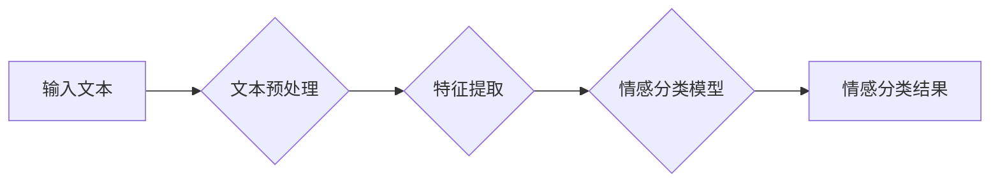

> 情感分析，自然语言处理，机器学习，深度学习，文本分类，情感识别，情绪分析，用户体验

## 1. 背景介绍

在当今数据爆炸的时代，人们通过网络平台表达情感、分享观点、进行互动。如何理解用户表达的情感倾向，成为了一个重要的研究课题。情感分析（Sentiment Analysis），也称为情绪分析（Emotion Analysis）或意见挖掘（Opinion Mining），旨在从文本数据中识别、提取和分析用户的情感倾向，例如正面、负面或中立。

情感分析技术在各个领域都有着广泛的应用，例如：

* **市场营销:** 分析客户对产品或服务的评价，了解用户需求，改进营销策略。
* **社交媒体监控:** 监测用户对品牌、事件或产品的舆情，及时发现潜在风险，进行危机公关。
* **客户服务:** 自动识别客户的投诉或反馈，提高服务效率，提升客户满意度。
* **金融领域:** 分析市场情绪，预测股票价格走势，降低投资风险。
* **医疗保健:** 分析患者的病历记录，识别患者的情绪状态，提供更精准的医疗服务。

## 2. 核心概念与联系

情感分析的核心是理解文本中的情感表达。这涉及到自然语言处理（NLP）和机器学习（ML）等多个领域。

**2.1 自然语言处理 (NLP)**

NLP是计算机科学的一个分支，旨在使计算机能够理解、处理和生成人类语言。在情感分析中，NLP技术用于文本预处理、词语切分、词性标注、依存句法分析等，为情感分析模型提供语义信息。

**2.2 机器学习 (ML)**

ML是人工智能的一个分支，旨在通过算法学习数据中的模式，从而进行预测或分类。在情感分析中，ML算法用于训练情感分类模型，识别文本的情感倾向。

**2.3 情感分析模型架构**



## 3. 核心算法原理 & 具体操作步骤

### 3.1  算法原理概述

情感分析算法主要分为以下几种类型：

* **基于规则的算法:** 基于人工定义的规则，例如情感词典、语法规则等，对文本进行情感分析。
* **基于机器学习的算法:** 利用机器学习算法，例如支持向量机（SVM）、朴素贝叶斯（Naive Bayes）、随机森林（Random Forest）等，从训练数据中学习情感分类模型。
* **基于深度学习的算法:** 利用深度学习算法，例如循环神经网络（RNN）、长短期记忆网络（LSTM）、Transformer等，对文本进行情感分析。

### 3.2  算法步骤详解

以基于机器学习的算法为例，情感分析的具体步骤如下：

1. **数据收集:** 收集包含情感标签的文本数据，例如电影评论、产品评价、社交媒体帖子等。
2. **数据预处理:** 对文本数据进行清洗、去停用词、词干提取、词向量化等预处理操作，以便于模型训练。
3. **特征提取:** 从预处理后的文本数据中提取特征，例如词频、词向量、情感词得分等。
4. **模型训练:** 利用机器学习算法，例如SVM、朴素贝叶斯等，对训练数据进行训练，建立情感分类模型。
5. **模型评估:** 使用测试数据对模型进行评估，例如准确率、召回率、F1-score等指标。
6. **模型部署:** 将训练好的模型部署到实际应用场景中，用于对新文本进行情感分析。

### 3.3  算法优缺点

**基于规则的算法:**

* **优点:** 简单易实现，速度快。
* **缺点:** 规则难以覆盖所有情况，容易受到语言变化的影响。

**基于机器学习的算法:**

* **优点:** 可以学习到更复杂的模式，效果更准确。
* **缺点:** 需要大量的训练数据，训练时间较长。

**基于深度学习的算法:**

* **优点:** 可以学习到更深层次的语义信息，效果更优。
* **缺点:** 训练成本高，对硬件资源要求高。

### 3.4  算法应用领域

情感分析算法广泛应用于以下领域：

* **市场营销:** 产品评价分析、品牌监控、广告效果评估。
* **社交媒体监控:** 用户情绪分析、舆情监测、危机公关。
* **客户服务:** 自动客服、客户反馈分析、投诉处理。
* **金融领域:** 市场情绪分析、股票预测、风险评估。
* **医疗保健:** 患者情绪分析、疾病诊断辅助、心理健康监测。

## 4. 数学模型和公式 & 详细讲解 & 举例说明

### 4.1  数学模型构建

情感分析模型通常采用分类模型，将文本分类为不同的情感类别，例如正面、负面或中立。常用的分类模型包括：

* **朴素贝叶斯分类器:** 基于贝叶斯定理，计算文本属于不同情感类别的概率。
* **支持向量机 (SVM):** 在特征空间中找到最佳的分隔超平面，将文本分类到不同的类别。
* **逻辑回归:** 将情感分类问题转化为二分类问题，使用逻辑函数对分类结果进行预测。

### 4.2  公式推导过程

以朴素贝叶斯分类器为例，其核心公式如下：

$$P(C|X) = \frac{P(X|C)P(C)}{P(X)}$$

其中：

* $P(C|X)$: 文本 $X$ 属于类别 $C$ 的概率。
* $P(X|C)$: 类别 $C$ 下文本 $X$ 的概率。
* $P(C)$: 类别 $C$ 的先验概率。
* $P(X)$: 文本 $X$ 的概率。

### 4.3  案例分析与讲解

假设我们有一个文本数据集，包含电影评论和对应的情感标签（正面、负面、中立）。我们可以使用朴素贝叶斯分类器训练一个情感分类模型。

在训练过程中，模型会学习到每个情感类别下出现频率最高的词语，以及每个词语属于不同情感类别的概率。

例如，如果“精彩”这个词语在正面评论中出现的频率较高，那么模型会认为“精彩”这个词语属于正面情感类别。

## 5. 项目实践：代码实例和详细解释说明

### 5.1  开发环境搭建

* Python 3.x
* NLTK 自然语言处理库
* Scikit-learn 机器学习库
* TensorFlow 或 PyTorch 深度学习库

### 5.2  源代码详细实现

```python
import nltk
from nltk.corpus import stopwords
from sklearn.feature_extraction.text import TfidfVectorizer
from sklearn.model_selection import train_test_split
from sklearn.linear_model import LogisticRegression
from sklearn.metrics import accuracy_score

# 下载停用词列表
nltk.download('stopwords')

# 加载电影评论数据集
# ...

# 数据预处理
def preprocess_text(text):
    # 1. 去除停用词
    stop_words = set(stopwords.words('english'))
    words = [word for word in text.split() if word not in stop_words]
    # 2. 词干提取
    # ...
    # 3. 词向量化
    # ...
    return words

# 特征提取
vectorizer = TfidfVectorizer()
X = vectorizer.fit_transform([preprocess_text(text) for text in reviews])

# 数据分割
X_train, X_test, y_train, y_test = train_test_split(X, labels, test_size=0.2)

# 模型训练
model = LogisticRegression()
model.fit(X_train, y_train)

# 模型评估
y_pred = model.predict(X_test)
accuracy = accuracy_score(y_test, y_pred)
print(f"Accuracy: {accuracy}")

```

### 5.3  代码解读与分析

* **数据预处理:** 
    * 去除停用词：停用词是常见的词语，例如“the”、“a”、“is”等，它们对情感分析没有太大意义，需要去除。
    * 词干提取：将词语还原到其基本形式，例如“running”和“ran”都归为“run”。
    * 词向量化：将词语映射到一个向量空间，使得语义相似的词语拥有相似的向量表示。
* **特征提取:** 使用TF-IDF（Term Frequency-Inverse Document Frequency）算法提取文本特征，衡量词语在文档中和整个语料库中的重要性。
* **模型训练:** 使用逻辑回归模型训练情感分类器，将文本分类为不同的情感类别。
* **模型评估:** 使用准确率等指标评估模型的性能。

### 5.4  运行结果展示

运行代码后，会输出模型的准确率，例如：

```
Accuracy: 0.85
```

这表示模型在测试数据上准确率为85%。

## 6. 实际应用场景

### 6.1  市场营销

* **产品评价分析:** 分析用户对产品评价的正面、负面情绪，了解用户需求和痛点，改进产品设计和营销策略。
* **品牌监控:** 监测用户对品牌的舆情，及时发现潜在风险，进行危机公关。
* **广告效果评估:** 分析用户对广告的反应，评估广告效果，优化广告投放策略。

### 6.2  社交媒体监控

* **用户情绪分析:** 分析用户在社交媒体平台上的情绪倾向，了解用户对特定事件或话题的看法。
* **舆情监测:** 监测用户对品牌、事件或产品的舆情，及时发现潜在风险，进行危机公关。
* **客户服务:** 自动识别用户在社交媒体平台上的投诉或反馈，提高服务效率，提升客户满意度。

### 6.3  金融领域

* **市场情绪分析:** 分析市场上对特定资产或行业的舆情，预测市场走势，降低投资风险。
* **股票预测:** 利用情感分析技术，结合其他金融指标，预测股票价格走势。
* **风险评估:** 分析用户对金融产品的评价，识别潜在的金融风险。

### 6.4  未来应用展望

随着人工智能技术的不断发展，情感分析技术将有更广泛的应用场景，例如：

* **个性化推荐:** 根据用户的喜好和情感倾向，提供个性化的产品推荐和服务。
* **医疗保健:** 分析患者的病历记录和社交媒体帖子，识别患者的情绪状态，提供更精准的医疗服务。
* **教育:** 分析学生的学习情绪和反馈，帮助老师更好地了解学生的学习情况，提供个性化的教学方案。

## 7. 工具和资源推荐

### 7.1  学习资源推荐

* **书籍:**
    * “情感分析：AI理解用户情感倾向” by Zen and the Art of Computer Programming
    * “Natural Language Processing with Python” by Steven Bird, Ewan Klein, and Edward Loper
* **在线课程:**
    * Coursera: Natural Language Processing Specialization
    * edX: Artificial Intelligence
* **博客和网站:**
    * Towards Data Science
    * Analytics Vidhya

### 7.2  开发工具推荐

* **Python:** 
    * NLTK
    * SpaCy
    * Gensim
* **深度学习框架:**
    * TensorFlow
    * PyTorch
* **机器学习库:**
    * Scikit-learn
    * XGBoost

### 7.3  相关论文推荐

* “Sentiment Analysis and Opinion Mining” by Pang and Lee
* “A Survey on Transfer Learning” by Pan and Yang
* “Deep Learning for Natural Language Processing” by Devlin et al.

## 8. 总结：未来发展趋势与挑战

### 8.1  研究成果总结

情感分析技术近年来取得了显著进展，模型准确率不断提高，应用场景也越来越广泛。

### 8.2  未来发展趋势

* **多模态情感分析:** 将文本、图像、音频等多模态数据融合，进行更