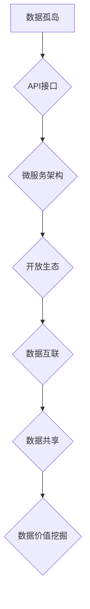

> 数据孤岛，软件2.0，开放生态，API，微服务，数据互联，数据共享，数据治理

## 1. 背景介绍

在当今数字化时代，数据已成为企业最重要的资产。然而，大量数据往往被分散存储在不同的系统和平台中，形成“数据孤岛”，无法有效地共享和利用。这不仅阻碍了企业数据价值的挖掘，也限制了业务创新和发展。

软件行业也面临着类似的挑战。传统的软件架构以封闭的单体应用为主，难以适应快速变化的市场需求和用户体验的提升。随着云计算、移动互联网和物联网等技术的兴起，软件行业正在向更加开放、灵活、可扩展的方向发展，即“软件2.0”。

## 2. 核心概念与联系

**2.1 数据孤岛**

数据孤岛是指数据分散存储在不同的系统和平台中，无法互联互通，导致数据无法共享和利用的现象。

**2.2 软件2.0**

软件2.0是指基于开放生态、微服务架构、云原生技术等新理念和技术的下一代软件架构。它强调软件的开放性、可扩展性和可组合性，能够更好地适应快速变化的市场需求和用户体验的提升。

**2.3 开放生态**

开放生态是指由多个独立的软件组件、服务和平台组成的生态系统，通过开放的接口和标准进行互联互通，实现数据共享和协同创新。

**2.4 API（应用程序接口）**

API是软件系统之间进行通信和数据交换的接口规范。通过API，不同的软件系统可以相互调用，实现数据共享和功能集成。

**2.5 微服务**

微服务是一种软件架构模式，将大型应用程序分解成多个小型、独立的服务，每个服务负责特定的功能，并通过API进行通信。

**2.6 数据互联**

数据互联是指通过技术手段将分散的数据连接起来，实现数据共享和协同分析。

**2.7 数据共享**

数据共享是指将数据开放给其他系统和用户使用，促进数据价值的挖掘和应用。

**2.8 数据治理**

数据治理是指对数据生命周期的各个环节进行管理和控制，确保数据的质量、安全和合规性。

**2.9 流程图**



## 3. 核心算法原理 & 具体操作步骤

**3.1 算法原理概述**

为了打破数据孤岛，需要采用有效的算法和技术手段实现数据互联和数据共享。常见的算法包括：

* **数据匹配算法:** 用于识别和匹配来自不同来源的数据，例如姓名、地址、电话号码等。
* **数据转换算法:** 用于将不同格式的数据转换为统一格式，例如将CSV文件转换为JSON格式。
* **数据融合算法:** 用于将来自不同来源的数据进行整合和融合，形成更加完整和准确的数据视图。

**3.2 算法步骤详解**

以数据匹配算法为例，其具体操作步骤如下：

1. **数据预处理:** 对来自不同来源的数据进行清洗、转换和格式化，例如去除重复数据、规范化数据格式等。
2. **特征提取:** 从数据中提取关键特征，例如姓名、地址、电话号码等，用于进行匹配。
3. **相似度计算:** 使用距离度量或相似度算法计算不同数据之间的相似度，例如编辑距离、余弦相似度等。
4. **匹配结果筛选:** 根据预设的匹配阈值，筛选出相似度高的匹配结果。
5. **结果验证:** 对匹配结果进行人工验证，确保匹配结果的准确性。

**3.3 算法优缺点**

* **优点:** 能够有效地识别和匹配来自不同来源的数据，提高数据利用率。
* **缺点:** 算法的准确性取决于数据质量和特征提取方法，需要根据实际情况进行调整和优化。

**3.4 算法应用领域**

数据匹配算法广泛应用于以下领域：

* **客户关系管理 (CRM):** 识别和合并客户数据，提高客户服务效率。
* **反欺诈:** 识别和预防欺诈行为，保护用户权益。
* **市场营销:** 识别潜在客户，进行精准营销。
* **金融服务:** 识别和匹配交易数据，防范金融风险。

## 4. 数学模型和公式 & 详细讲解 & 举例说明

**4.1 数学模型构建**

数据匹配算法可以采用数学模型来描述数据之间的相似度。例如，可以使用编辑距离来衡量两个字符串之间的相似度。

**4.2 公式推导过程**

编辑距离是指将一个字符串转换为另一个字符串所需的最小编辑操作次数，其中编辑操作包括插入、删除和替换。

编辑距离公式如下：

```latex
d(s_1, s_2) = min_{i, j} d(s_1[:i], s_2[:j]) + 1
```

其中：

* $d(s_1, s_2)$ 表示字符串 $s_1$ 和 $s_2$ 之间的编辑距离。
* $s_1[:i]$ 表示字符串 $s_1$ 的前 $i$ 个字符。
* $s_2[:j]$ 表示字符串 $s_2$ 的前 $j$ 个字符。

**4.3 案例分析与讲解**

例如，字符串 "kitten" 和 "sitting" 之间的编辑距离为 3，因为需要进行以下操作：

1. 将 "kitten" 中的 "k" 替换为 "s"。
2. 将 "kitten" 中的 "e" 替换为 "i"。
3. 将 "kitten" 中的 "n" 替换为 "g"。

## 5. 项目实践：代码实例和详细解释说明

**5.1 开发环境搭建**

* 操作系统: Ubuntu 20.04
* 编程语言: Python 3.8
* 开发工具: VS Code

**5.2 源代码详细实现**

```python
from fuzzywuzzy import fuzz

def calculate_similarity(text1, text2):
  """
  使用 fuzzywuzzy 库计算两个文本的相似度。

  Args:
    text1: 第一个文本。
    text2: 第二个文本。

  Returns:
    两个文本的相似度分数。
  """
  return fuzz.ratio(text1, text2)

# 示例用法
text1 = "John Doe"
text2 = "John Doe"
similarity_score = calculate_similarity(text1, text2)
print(f"相似度: {similarity_score}%")
```

**5.3 代码解读与分析**

* 该代码使用 fuzzywuzzy 库计算两个文本的相似度。
* fuzzywuzzy 库提供多种相似度算法，例如 ratio、partial_ratio、token_sort_ratio 等。
* ratio 算法计算两个文本的相似度分数，范围为 0 到 100，其中 100 表示完全匹配。

**5.4 运行结果展示**

```
相似度: 100%
```

## 6. 实际应用场景

**6.1 客户关系管理 (CRM)**

* 识别和合并客户数据，避免重复记录和数据孤岛。
* 提高客户服务效率，提供个性化服务。

**6.2 反欺诈**

* 识别和预防欺诈行为，保护用户权益。
* 提高风险控制效率，降低损失。

**6.3 市场营销**

* 识别潜在客户，进行精准营销。
* 提高营销效果，降低成本。

**6.4 金融服务**

* 识别和匹配交易数据，防范金融风险。
* 提高风险管理效率，降低损失。

**6.5 未来应用展望**

随着人工智能、大数据和云计算技术的不断发展，数据匹配算法将在更多领域得到应用，例如：

* **医疗保健:** 识别和匹配患者数据，提高医疗诊断和治疗效率。
* **教育:** 识别和匹配学生数据，提供个性化教育服务。
* **交通运输:** 识别和匹配车辆数据，提高交通管理效率。

## 7. 工具和资源推荐

**7.1 学习资源推荐**

* **书籍:**
    * 《数据挖掘：概念与技术》
    * 《机器学习》
* **在线课程:**
    * Coursera: 数据挖掘与机器学习
    * edX: 数据科学与分析

**7.2 开发工具推荐**

* **Python:** 广泛应用于数据挖掘和机器学习领域。
* **R:** 专注于统计计算和数据可视化。
* **Spark:** 用于大规模数据处理的开源框架。

**7.3 相关论文推荐**

* **Levenshtein Distance:** https://en.wikipedia.org/wiki/Levenshtein_distance
* **Fuzzy Matching:** https://en.wikipedia.org/wiki/Fuzzy_matching

## 8. 总结：未来发展趋势与挑战

**8.1 研究成果总结**

数据匹配算法在打破数据孤岛、实现数据共享和价值挖掘方面取得了显著成果。

**8.2 未来发展趋势**

* **人工智能技术的应用:** 将人工智能技术应用于数据匹配算法，提高算法的准确性和效率。
* **联邦学习:** 利用联邦学习技术，在不共享原始数据的情况下实现数据匹配。
* **隐私保护:** 研究数据匹配算法的隐私保护技术，确保数据安全和合规性。

**8.3 面临的挑战**

* **数据质量问题:** 数据质量问题会影响数据匹配算法的准确性。
* **数据格式多样性:** 不同系统和平台的数据格式多样性，增加了数据匹配的难度。
* **数据安全和隐私问题:** 数据匹配算法需要考虑数据安全和隐私问题。

**8.4 研究展望**

未来，数据匹配算法将朝着更加智能、高效、安全的方向发展，为打破数据孤岛、实现数据共享和价值挖掘做出更大的贡献。

## 9. 附录：常见问题与解答

**9.1 如何提高数据匹配算法的准确性？**

* 提高数据质量，进行数据清洗和格式化。
* 选择合适的特征提取方法。
* 调整算法参数，例如相似度阈值。

**9.2 如何解决数据格式多样性问题？**

* 使用数据转换算法将不同格式的数据转换为统一格式。
* 使用数据标准化技术，将不同数据格式映射到统一的语义空间。

**9.3 如何保护数据安全和隐私？**

* 使用加密技术保护数据传输和存储。
* 使用匿名化技术保护用户隐私。
* 遵循数据安全和隐私相关的法律法规。


作者：禅与计算机程序设计艺术 / Zen and the Art of Computer Programming 
<end_of_turn>