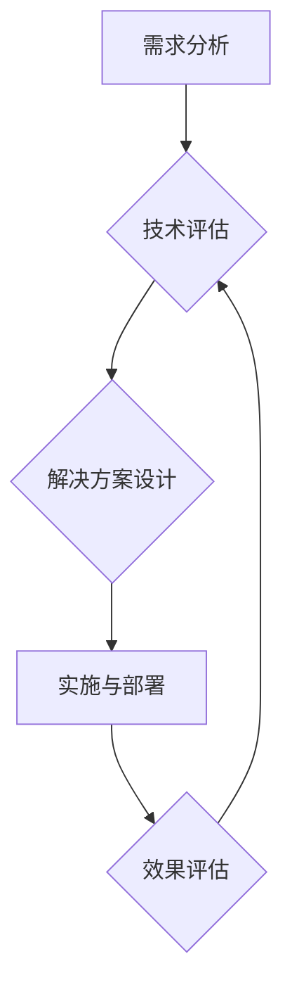

> 高价值服务，技术咨询，人工智能，机器学习，深度学习，数据分析，云计算，软件架构

## 1. 背景介绍

在当今科技日新月异的时代，技术咨询已成为企业数字化转型和业务创新不可或缺的一部分。随着人工智能、机器学习、深度学习等技术的快速发展，技术咨询的范围和深度也随之不断拓展。高价值的技术咨询服务，能够帮助企业洞察市场趋势，识别技术机遇，制定有效的技术战略，并最终实现业务目标。

然而，并非所有技术咨询服务都具有高价值。许多咨询服务仅仅停留在表面，缺乏深入的分析和解决方案，无法真正解决企业面临的实际问题。因此，提供高价值的技术咨询服务，需要具备以下几个关键要素：

* **深厚的技术背景：** 技术咨询师需要具备扎实的技术基础和丰富的实践经验，能够准确理解客户的技术需求，并提供切实可行的解决方案。
* **敏锐的洞察力：** 技术咨询师需要具备敏锐的洞察力，能够洞察客户业务痛点，识别技术趋势，并提出创新性的解决方案。
* **优秀的沟通能力：** 技术咨询师需要具备优秀的沟通能力，能够清晰地表达技术观点，并与客户建立良好的合作关系。
* **持续学习的热情：** 科技发展日新月异，技术咨询师需要保持持续学习的热情，不断更新自己的知识和技能。

## 2. 核心概念与联系

高价值的技术咨询服务，本质上是将技术知识与业务需求相结合，为客户创造价值的过程。

**核心概念：**

* **技术咨询：** 指的是利用专业技术知识和经验，为客户提供咨询、建议和解决方案的服务。
* **高价值服务：** 指的是能够为客户带来显著效益的服务，例如提高效率、降低成本、创造新的收入来源等。
* **业务需求：** 指的是客户为了实现其目标而需要满足的技术和功能要求。

**核心联系：**

高价值的技术咨询服务，通过以下步骤将技术知识与业务需求相结合：

1. **需求分析：** 深入了解客户的业务场景、痛点和目标。
2. **技术评估：** 评估现有技术和新兴技术的适用性，并提出可行的技术方案。
3. **解决方案设计：** 根据客户需求和技术评估结果，设计具体的解决方案。
4. **实施与部署：** 将解决方案实施到客户环境中，并提供必要的培训和支持。
5. **效果评估：** 评估解决方案的实施效果，并根据反馈进行优化和改进。

**Mermaid 流程图：**



## 3. 核心算法原理 & 具体操作步骤

在高价值的技术咨询服务中，算法往往扮演着至关重要的角色。例如，在数据分析领域，机器学习算法可以帮助企业从海量数据中挖掘出有价值的洞察；在推荐系统领域，协同过滤算法可以帮助企业为用户提供个性化的推荐。

### 3.1  算法原理概述

这里，我们以机器学习算法为例，介绍其核心原理。

机器学习算法是一种能够从数据中学习并不断改进的算法。其核心思想是，通过训练模型，使模型能够从数据中识别出模式和规律，并根据这些模式和规律进行预测或分类。

机器学习算法可以分为监督学习、无监督学习和强化学习三大类。

* **监督学习：** 训练模型时，需要提供标记的数据，即输入数据和对应的输出结果。模型通过学习这些标记数据，能够将输入数据映射到相应的输出结果。例如，图像分类任务，训练数据包含图像和对应的类别标签，模型通过学习这些数据，能够识别出图像的类别。
* **无监督学习：** 训练模型时，不需要提供标记的数据，模型需要从无标记数据中发现模式和规律。例如，聚类算法可以将数据点根据其相似性进行分组。
* **强化学习：** 模型通过与环境交互，学习如何做出最优决策。模型会根据其决策获得奖励或惩罚，并根据这些奖励和惩罚调整其策略，以最大化奖励。

### 3.2  算法步骤详解

以下是一个典型的监督学习算法训练步骤：

1. **数据预处理：** 对原始数据进行清洗、转换和特征工程，使其适合模型训练。
2. **模型选择：** 根据任务需求选择合适的模型算法。
3. **模型训练：** 使用训练数据训练模型，调整模型参数，使模型能够准确地预测或分类。
4. **模型评估：** 使用测试数据评估模型的性能，例如准确率、召回率、F1-score等。
5. **模型调优：** 根据评估结果，调整模型参数或选择其他模型算法，以提高模型性能。
6. **模型部署：** 将训练好的模型部署到实际应用环境中，用于预测或分类新的数据。

### 3.3  算法优缺点

每个算法都有其自身的优缺点，需要根据具体任务需求进行选择。

例如，决策树算法易于理解和解释，但容易过拟合；支持向量机算法具有较好的泛化能力，但训练时间较长；神经网络算法能够学习复杂模式，但训练数据量要求较高。

### 3.4  算法应用领域

机器学习算法广泛应用于各个领域，例如：

* **图像识别：** 人脸识别、物体检测、图像分类等。
* **自然语言处理：** 文本分类、情感分析、机器翻译等。
* **推荐系统：** 商品推荐、内容推荐、用户画像等。
* **金融领域：** 欺诈检测、风险评估、信用评分等。
* **医疗领域：** 疾病诊断、药物研发、医疗影像分析等。

## 4. 数学模型和公式 & 详细讲解 & 举例说明

数学模型和公式是描述算法原理和操作步骤的重要工具。

### 4.1  数学模型构建

例如，线性回归模型可以用来预测连续变量的值。其数学模型如下：

$$
y = \beta_0 + \beta_1 x_1 + \beta_2 x_2 + ... + \beta_n x_n + \epsilon
$$

其中：

* $y$ 是预测变量
* $x_1, x_2, ..., x_n$ 是自变量
* $\beta_0, \beta_1, ..., \beta_n$ 是模型参数
* $\epsilon$ 是误差项

### 4.2  公式推导过程

模型参数可以通过最小二乘法进行估计。最小二乘法的目标是找到一组参数，使得模型预测值与实际值之间的误差平方和最小。

### 4.3  案例分析与讲解

例如，假设我们想要预测房屋价格，自变量包括房屋面积、房间数量、地理位置等。我们可以使用线性回归模型，并根据房屋数据训练模型。训练完成后，我们可以使用模型预测新房子的价格。

## 5. 项目实践：代码实例和详细解释说明

以下是一个使用Python语言实现线性回归模型的代码实例：

### 5.1  开发环境搭建

需要安装Python语言和相关库，例如NumPy、Scikit-learn等。

### 5.2  源代码详细实现

```python
import numpy as np
from sklearn.linear_model import LinearRegression

# 准备数据
X = np.array([[100, 2], [150, 3], [200, 4], [250, 5]])  # 房屋面积和房间数量
y = np.array([200000, 250000, 300000, 350000])  # 房屋价格

# 创建线性回归模型
model = LinearRegression()

# 训练模型
model.fit(X, y)

# 预测新房子的价格
new_house = np.array([[220, 4]])
predicted_price = model.predict(new_house)

# 打印预测结果
print(f"新房子的预测价格为：{predicted_price[0]}")
```

### 5.3  代码解读与分析

代码首先准备了房屋面积和房间数量的数据，以及对应的房屋价格数据。然后，创建了一个线性回归模型，并使用训练数据训练模型。训练完成后，可以使用模型预测新房子的价格。

### 5.4  运行结果展示

运行代码后，会输出新房子的预测价格。

## 6. 实际应用场景

高价值的技术咨询服务在各个行业都有广泛的应用场景。

### 6.1  金融行业

* **欺诈检测：** 使用机器学习算法分析交易数据，识别异常交易行为，防止欺诈行为。
* **风险评估：** 使用机器学习算法评估客户的信用风险，帮助银行和金融机构做出更明智的贷款决策。
* **投资决策：** 使用机器学习算法分析市场数据，预测股票价格走势，帮助投资者做出更有效的投资决策。

### 6.2  医疗行业

* **疾病诊断：** 使用机器学习算法分析患者的医疗影像数据，辅助医生诊断疾病。
* **药物研发：** 使用机器学习算法分析药物分子结构和生物活性数据，加速药物研发过程。
* **个性化医疗：** 使用机器学习算法分析患者的基因数据和生活习惯数据，为患者提供个性化的医疗方案。

### 6.3  零售行业

* **商品推荐：** 使用协同过滤算法分析用户的购买历史数据，推荐用户可能感兴趣的商品。
* **库存管理：** 使用机器学习算法预测商品需求，优化库存管理，降低库存成本。
* **客户服务：** 使用自然语言处理技术开发智能客服系统，提高客户服务效率。

### 6.4  未来应用展望

随着人工智能技术的不断发展，高价值的技术咨询服务将有更广泛的应用场景。例如，在自动驾驶领域，技术咨询可以帮助企业开发更安全的自动驾驶系统；在虚拟现实领域，技术咨询可以帮助企业开发更沉浸式的虚拟现实体验。

## 7. 工具和资源推荐

### 7.1  学习资源推荐

* **在线课程：** Coursera、edX、Udacity等平台提供丰富的机器学习和人工智能课程。
* **书籍：** 《深入理解机器学习》、《Python机器学习实战》等书籍对机器学习算法和应用进行了深入讲解。
* **博客和论坛：** 机器学习和人工智能领域的博客和论坛可以获取最新的技术资讯和交流经验。

### 7.2  开发工具推荐

* **Python：** 机器学习和人工智能开发的常用编程语言。
* **NumPy：** Python数值计算库，用于处理数组和矩阵运算。
* **Scikit-learn：** Python机器学习库，提供各种机器学习算法和工具。
* **TensorFlow：** Google开发的深度学习框架。
* **PyTorch：** Facebook开发的深度学习框架。

### 7.3  相关论文推荐

* **《机器学习》** by Tom Mitchell
* **《深度学习》** by Ian Goodfellow, Yoshua Bengio, and Aaron Courville

## 8. 总结：未来发展趋势与挑战

### 8.1  研究成果总结

高价值的技术咨询服务已经取得了显著的成果，帮助企业提高效率、降低成本、创造新的收入来源。

### 8.2  未来发展趋势

未来，高价值的技术咨询服务将朝着以下几个方向发展：

* **更深入的业务洞察：** 技术咨询师将更加深入地了解客户的业务场景和痛点，并提供更精准的解决方案。
* **更智能化的服务：** 人工智能技术将被更加广泛地应用于技术咨询服务中，例如，智能聊天机器人可以帮助客户快速获取信息，智能分析工具可以帮助技术咨询师更快地分析数据。
* **更个性化的服务：** 技术咨询服务将更加个性化，根据客户的具体需求提供定制化的解决方案。

### 8.3  面临的挑战

高价值的技术咨询服务也面临着一些挑战：

* **人才短缺：** 高素质的技术咨询人才需求量大，但供给不足。
* **技术迭代速度快：** 科技发展日新月异，技术咨询师需要不断学习