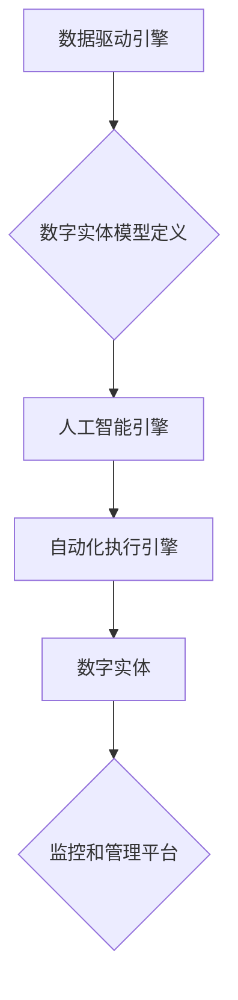

> 数字实体、自动化、人工智能、机器学习、数据驱动、流程自动化、软件架构、云计算

## 1. 背景介绍

数字经济时代，数据已成为重要的生产要素，而数字实体作为数据化的实体，在推动经济数字化转型中扮演着越来越重要的角色。数字实体的自动化，意味着能够通过程序和算法，自动完成数字实体的创建、管理、运营和销毁等一系列操作，从而提高效率、降低成本，并释放出数字实体的更大价值。

传统的软件开发模式，往往是围绕着特定的业务场景进行定制开发，缺乏灵活性，难以应对快速变化的市场需求。而数字实体自动化，则提供了一种全新的开发模式，即通过定义数字实体的属性、行为和交互规则，并利用人工智能和机器学习技术，实现数字实体的自动生成、演化和管理。

## 2. 核心概念与联系

**2.1 数字实体**

数字实体是指用数字形式表示的任何事物，包括物理实体、抽象概念、事件、关系等。例如，一个商品的数字化描述就是一个数字实体，一个用户的身份信息也是一个数字实体。

**2.2 自动化**

自动化是指通过程序和算法，自动完成一系列操作，减少人工干预的过程。

**2.3 数字实体自动化**

数字实体自动化是指利用人工智能、机器学习等技术，自动完成数字实体的创建、管理、运营和销毁等一系列操作。

**2.4 核心架构**

数字实体自动化系统通常由以下几个核心组件组成：

* **数字实体模型定义:** 定义数字实体的属性、行为和交互规则。
* **数据驱动引擎:** 从各种数据源中获取数据，并将其转换为数字实体模型可以理解的形式。
* **人工智能引擎:** 利用人工智能和机器学习技术，对数字实体进行分析、预测和决策。
* **自动化执行引擎:** 根据人工智能引擎的决策，自动执行数字实体的操作。
* **监控和管理平台:** 对数字实体自动化系统进行监控和管理。



## 3. 核心算法原理 & 具体操作步骤

**3.1 算法原理概述**

数字实体自动化的核心算法原理主要包括：

* **知识图谱:** 建立数字实体之间的关系网络，以便于理解和推理。
* **机器学习:** 利用机器学习算法，从数据中学习数字实体的特征和行为模式。
* **自然语言处理:** 理解和处理人类语言，以便于与数字实体进行交互。
* **规则引擎:** 根据预先定义的规则，自动执行数字实体的操作。

**3.2 算法步骤详解**

1. **数据收集和预处理:** 从各种数据源中收集相关数据，并进行清洗、转换和格式化。
2. **数字实体模型构建:** 根据数据分析和业务需求，构建数字实体的模型，定义其属性、行为和交互规则。
3. **知识图谱构建:** 建立数字实体之间的关系网络，形成知识图谱。
4. **机器学习模型训练:** 利用机器学习算法，从数据中学习数字实体的特征和行为模式，构建预测模型。
5. **自动化规则定义:** 根据业务需求和机器学习模型的预测结果，定义自动化执行规则。
6. **自动化执行:** 利用自动化执行引擎，根据规则自动执行数字实体的操作。
7. **监控和评估:** 对数字实体自动化系统进行监控和评估，并根据结果进行优化和调整。

**3.3 算法优缺点**

**优点:**

* **提高效率:** 自动化操作可以显著提高效率，减少人工干预。
* **降低成本:** 自动化可以减少人工成本，提高资源利用率。
* **提高准确性:** 机器学习算法可以提高决策的准确性。
* **增强灵活性:** 数字实体模型的定义可以根据需求进行调整，提高系统的灵活性。

**缺点:**

* **数据依赖:** 数字实体自动化依赖于高质量的数据，数据质量问题会影响系统的性能。
* **算法复杂性:** 构建和训练机器学习模型需要一定的技术难度。
* **安全风险:** 数字实体自动化系统存在安全风险，需要采取相应的安全措施。

**3.4 算法应用领域**

数字实体自动化技术在各个领域都有广泛的应用，例如：

* **金融:** 自动化金融交易、风险管理、客户服务等。
* **医疗:** 自动化诊断、治疗方案推荐、药物研发等。
* **制造:** 自动化生产流程、设备维护、质量控制等。
* **零售:** 自动化商品推荐、库存管理、物流配送等。

## 4. 数学模型和公式 & 详细讲解 & 举例说明

**4.1 数学模型构建**

数字实体自动化系统可以利用数学模型来描述数字实体的属性、行为和交互规则。例如，可以使用图论模型来表示数字实体之间的关系网络，可以使用概率模型来描述数字实体的行为模式。

**4.2 公式推导过程**

例如，可以使用贝叶斯定理来推导数字实体分类的概率模型。

$$P(C|D) = \frac{P(D|C)P(C)}{P(D)}$$

其中：

* $P(C|D)$ 是给定证据 $D$ 下，类别 $C$ 的概率。
* $P(D|C)$ 是类别 $C$ 下，证据 $D$ 的概率。
* $P(C)$ 是类别 $C$ 的先验概率。
* $P(D)$ 是证据 $D$ 的概率。

**4.3 案例分析与讲解**

例如，假设我们有一个数字实体分类任务，需要将商品分类为“电子产品”或“服装”。我们可以使用贝叶斯定理来计算给定商品特征的分类概率。

假设我们收集了以下数据：

* $P(电子产品) = 0.6$
* $P(服装) = 0.4$
* $P(特征|电子产品) = 0.8$
* $P(特征|服装) = 0.2$
* $P(特征) = 0.6$

根据贝叶斯定理，我们可以计算出给定商品特征的分类概率：

$$P(电子产品|特征) = \frac{0.8 \times 0.6}{0.6} = 0.8$$

$$P(服装|特征) = \frac{0.2 \times 0.4}{0.6} = 0.2$$

因此，给定商品特征，分类为“电子产品”的概率为 0.8，分类为“服装”的概率为 0.2。

## 5. 项目实践：代码实例和详细解释说明

**5.1 开发环境搭建**

数字实体自动化项目可以使用 Python 语言和相关的库进行开发。

* Python 3.x
* TensorFlow 或 PyTorch
* Numpy
* Pandas
* Scikit-learn

**5.2 源代码详细实现**

以下是一个简单的数字实体自动化代码示例，用于根据商品特征自动分类商品：

```python
import numpy as np
from sklearn.model_selection import train_test_split
from sklearn.linear_model import LogisticRegression

# 数据集
data = np.array([
    [1, 0, 1],  # 电子产品
    [0, 1, 0],  # 服装
    [1, 1, 1],  # 电子产品
    [0, 0, 0],  # 服装
])
labels = np.array([1, 0, 1, 0])

# 数据分割
X_train, X_test, y_train, y_test = train_test_split(data, labels, test_size=0.2)

# 模型训练
model = LogisticRegression()
model.fit(X_train, y_train)

# 模型评估
accuracy = model.score(X_test, y_test)
print(f"模型准确率: {accuracy}")

# 新商品分类
new_data = np.array([1, 0, 1])
prediction = model.predict(new_data)
print(f"新商品分类结果: {prediction}")
```

**5.3 代码解读与分析**

* 代码首先定义了商品特征和类别标签的数据集。
* 然后使用 `train_test_split` 函数将数据分割为训练集和测试集。
* 使用 `LogisticRegression` 模型训练分类器。
* 使用 `score` 函数评估模型的准确率。
* 最后使用训练好的模型对新商品进行分类。

**5.4 运行结果展示**

运行代码后，会输出模型的准确率和新商品的分类结果。

## 6. 实际应用场景

**6.1 金融领域**

* **自动化的风险管理:** 利用数字实体自动化技术，可以自动识别和评估金融风险，并采取相应的措施进行控制。
* **智能化的客户服务:** 数字实体自动化可以实现智能客服机器人，自动回答客户常见问题，提高客户服务效率。
* **个性化的金融产品推荐:** 根据用户的金融需求和行为数据，数字实体自动化可以推荐个性化的金融产品。

**6.2 医疗领域**

* **智能化的诊断辅助:** 数字实体自动化可以帮助医生分析患者的病历、检查结果等数据，辅助进行诊断。
* **个性化的治疗方案推荐:** 根据患者的病情、基因信息等数据，数字实体自动化可以推荐个性化的治疗方案。
* **药物研发加速:** 数字实体自动化可以加速药物研发过程，例如模拟药物作用机制、预测药物安全性等。

**6.3 制造领域**

* **智能化的生产流程优化:** 数字实体自动化可以分析生产数据，优化生产流程，提高生产效率。
* **设备预测性维护:** 数字实体自动化可以预测设备故障，提前进行维护，降低设备故障率。
* **质量控制自动化:** 数字实体自动化可以自动检测产品质量，提高产品质量。

**6.4 未来应用展望**

数字实体自动化技术的发展前景广阔，未来将应用于更多领域，例如教育、交通、能源等。随着人工智能、机器学习等技术的不断发展，数字实体自动化将更加智能化、自动化，为人类社会带来更多便利和价值。

## 7. 工具和资源推荐

**7.1 学习资源推荐**

* **书籍:**
    * 《深度学习》
    * 《机器学习》
    * 《自然语言处理》
* **在线课程:**
    * Coursera
    * edX
    * Udacity

**7.2 开发工具推荐**

* **Python:** 
    * TensorFlow
    * PyTorch
    * Scikit-learn
* **云平台:**
    * AWS
    * Azure
    * Google Cloud

**7.3 相关论文推荐**

* **数字实体自动化:**
    * [Towards a Unified Framework for Digital Twin Management](https://ieeexplore.ieee.org/document/9297777)
    * [Digital Twin: A Comprehensive Review](https://www.sciencedirect.com/science/article/pii/S221209722100018X)
* **人工智能:**
    * [Attention Is All You Need](https://arxiv.org/abs/1706.03762)
    * [Deep Learning](https://www.deeplearningbook.org/)

## 8. 总结：未来发展趋势与挑战

**8.1 研究成果总结**

数字实体自动化技术取得了显著的进展，在各个领域都有广泛的应用。

**8.2 未来发展趋势**

* **更加智能化:** 数字实体自动化将更加智能化，能够自主学习和决策。
* **更加自动化:** 数字实体自动化将更加自动化，能够自动完成更多复杂的操作。
* **更加融合:** 数字实体自动化将更加融合，与其他技术，例如区块链、物联网等，形成更加强大的协同效应。

**8.3 面临的挑战**

* **数据质量:** 数字实体自动化依赖于高质量的数据，数据质量问题会影响系统的性能。
* **算法复杂性:** 构建和训练复杂的机器学习模型需要一定的技术难度。
* **安全风险:** 数字实体自动化系统存在安全风险，需要采取相应的安全措施。

**