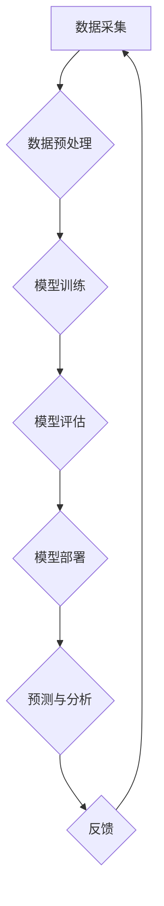

> 人工智能，AI 2.0，价值创造，伦理挑战，未来趋势

## 1. 背景介绍

人工智能（AI）技术近年来发展迅速，从语音识别、图像识别到自然语言处理，AI已经渗透到我们生活的方方面面。李开复，作为一位享誉全球的人工智能专家，在《AI 2.0 时代的价值》一文中，深刻地探讨了AI 2.0时代带来的机遇与挑战，以及AI如何为人类创造价值。

AI 1.0时代主要集中在规则驱动的系统，例如围棋、象棋等游戏的AI。而AI 2.0时代则以深度学习为核心，能够学习和理解复杂的数据模式，从而实现更智能、更灵活的应用。

## 2. 核心概念与联系

**2.1 AI 2.0 的核心概念**

AI 2.0时代的核心概念包括：

* **深度学习:** 深度学习是一种机器学习的子集，它利用多层神经网络来模拟人类大脑的学习过程，能够从海量数据中提取特征，并进行复杂的模式识别。
* **大数据:** AI 2.0时代需要海量数据来训练和优化模型，大数据提供了丰富的训练素材，推动了AI技术的进步。
* **云计算:** 云计算提供了强大的计算资源和存储能力，支持AI模型的训练和部署，降低了AI技术的门槛。

**2.2 AI 2.0 与价值创造的联系**

AI 2.0技术能够在各个领域创造价值，例如：

* **医疗保健:** AI可以辅助医生诊断疾病、预测患者风险、加速药物研发。
* **金融服务:** AI可以用于欺诈检测、风险管理、个性化金融服务。
* **制造业:** AI可以提高生产效率、优化供应链、实现智能制造。
* **教育:** AI可以提供个性化学习体验、辅助教师教学、提高教育质量。

**2.3 AI 2.0 的架构**



## 3. 核心算法原理 & 具体操作步骤

**3.1 算法原理概述**

深度学习算法的核心是多层神经网络，它模仿了人类大脑的神经元结构和连接方式。神经网络由多个层组成，每层包含多个神经元。每个神经元接收来自上一层的输入信号，并对其进行处理，然后将处理后的信号传递给下一层的神经元。通过训练，神经网络可以学习到数据的特征和模式，从而实现预测、分类、识别等任务。

**3.2 算法步骤详解**

1. **数据准备:** 收集和预处理数据，将其转换为神经网络可以理解的格式。
2. **网络结构设计:** 根据任务需求设计神经网络的结构，包括层数、神经元数量、激活函数等。
3. **参数初始化:** 为神经网络的参数进行随机初始化。
4. **前向传播:** 将输入数据通过神经网络进行前向传播，得到输出结果。
5. **损失函数计算:** 计算输出结果与真实值的差异，即损失函数的值。
6. **反向传播:** 根据损失函数的梯度，反向传播误差信号，更新神经网络的参数。
7. **迭代训练:** 重复前向传播、损失函数计算和反向传播的过程，直到损失函数达到预设的阈值。

**3.3 算法优缺点**

**优点:**

* 能够学习复杂的数据模式。
* 性能优于传统机器学习算法。
* 可应用于多种任务，例如图像识别、自然语言处理等。

**缺点:**

* 需要海量数据进行训练。
* 训练过程耗时和耗能。
* 模型解释性较差。

**3.4 算法应用领域**

深度学习算法广泛应用于以下领域：

* **计算机视觉:** 图像识别、物体检测、图像分割等。
* **自然语言处理:** 文本分类、机器翻译、语音识别等。
* **推荐系统:** 商品推荐、内容推荐等。
* **医疗诊断:** 疾病诊断、影像分析等。

## 4. 数学模型和公式 & 详细讲解 & 举例说明

**4.1 数学模型构建**

深度学习模型的核心是神经网络，其数学模型可以表示为一系列的矩阵运算。

* **激活函数:** 激活函数用于引入非线性，使神经网络能够学习复杂的数据模式。常见的激活函数包括 sigmoid 函数、ReLU 函数等。

* **损失函数:** 损失函数用于衡量模型预测结果与真实值的差异。常见的损失函数包括均方误差、交叉熵等。

* **优化算法:** 优化算法用于更新神经网络的参数，使其能够最小化损失函数。常见的优化算法包括梯度下降、Adam 等。

**4.2 公式推导过程**

* **前向传播公式:**

$$
y = f(W^L x^L + b^L)
$$

其中：

* $y$ 是输出结果。
* $f$ 是激活函数。
* $W^L$ 是第 L 层的权重矩阵。
* $x^L$ 是第 L 层的输入向量。
* $b^L$ 是第 L 层的偏置向量。

* **损失函数公式:**

$$
L = \frac{1}{N} \sum_{i=1}^{N} loss(y_i, \hat{y}_i)
$$

其中：

* $L$ 是损失函数的值。
* $N$ 是样本数量。
* $loss$ 是单个样本的损失函数。
* $y_i$ 是第 i 个样本的真实值。
* $\hat{y}_i$ 是第 i 个样本的预测值。

* **梯度下降公式:**

$$
\theta = \theta - \alpha \nabla L(\theta)
$$

其中：

* $\theta$ 是模型参数。
* $\alpha$ 是学习率。
* $\nabla L(\theta)$ 是损失函数对参数 $\theta$ 的梯度。

**4.3 案例分析与讲解**

以图像识别为例，深度学习模型可以学习图像特征，并将其映射到类别标签。训练过程中，模型会不断调整参数，使其能够将输入图像准确地分类。

## 5. 项目实践：代码实例和详细解释说明

**5.1 开发环境搭建**

* Python 3.x
* TensorFlow 或 PyTorch 等深度学习框架
* GPU 加速器

**5.2 源代码详细实现**

```python
import tensorflow as tf

# 定义模型结构
model = tf.keras.models.Sequential([
    tf.keras.layers.Conv2D(32, (3, 3), activation='relu', input_shape=(28, 28, 1)),
    tf.keras.layers.MaxPooling2D((2, 2)),
    tf.keras.layers.Conv2D(64, (3, 3), activation='relu'),
    tf.keras.layers.MaxPooling2D((2, 2)),
    tf.keras.layers.Flatten(),
    tf.keras.layers.Dense(10, activation='softmax')
])

# 编译模型
model.compile(optimizer='adam',
              loss='sparse_categorical_crossentropy',
              metrics=['accuracy'])

# 训练模型
model.fit(x_train, y_train, epochs=10)

# 评估模型
loss, accuracy = model.evaluate(x_test, y_test)
print('Test loss:', loss)
print('Test accuracy:', accuracy)
```

**5.3 代码解读与分析**

* 代码定义了一个简单的卷积神经网络模型，用于手写数字识别。
* 模型包含两层卷积层、两层最大池化层、一层全连接层和一层输出层。
* 模型使用 Adam 优化器、交叉熵损失函数和准确率作为评估指标。
* 模型在训练集上训练 10 个 epochs。
* 最后，模型在测试集上进行评估，并打印测试损失和准确率。

**5.4 运行结果展示**

运行代码后，会输出测试损失和准确率。

## 6. 实际应用场景

**6.1 医疗诊断**

AI 2.0技术可以辅助医生诊断疾病，例如通过分析医学影像识别肿瘤、预测患者风险等。

**6.2 金融服务**

AI 2.0技术可以用于欺诈检测、风险管理、个性化金融服务等。

**6.3 制造业**

AI 2.0技术可以提高生产效率、优化供应链、实现智能制造。

**6.4 未来应用展望**

AI 2.0技术将继续在各个领域发挥重要作用，例如：

* **自动驾驶:** AI 2.0技术将推动自动驾驶汽车的普及。
* **机器人:** AI 2.0技术将赋予机器人更强的智能和适应能力。
* **个性化教育:** AI 2.0技术将提供个性化的学习体验。

## 7. 工具和资源推荐

**7.1 学习资源推荐**

* **书籍:**
    * 《深度学习》
    * 《机器学习》
* **在线课程:**
    * Coursera
    * edX
    * Udacity

**7.2 开发工具推荐**

* **TensorFlow:** 开源深度学习框架。
* **PyTorch:** 开源深度学习框架。
* **Keras:** 高级深度学习API。

**7.3 相关论文推荐**

* **ImageNet Classification with Deep Convolutional Neural Networks**
* **Attention Is All You Need**

## 8. 总结：未来发展趋势与挑战

**8.1 研究成果总结**

AI 2.0技术取得了显著的成果，在各个领域展现出巨大的潜力。

**8.2 未来发展趋势**

* **模型规模和复杂度提升:** 未来深度学习模型将更加庞大、复杂。
* **跨模态学习:** AI将能够处理多种模态数据，例如文本、图像、音频等。
* **可解释性增强:** 研究者将致力于提高深度学习模型的可解释性。

**8.3 面临的挑战**

* **数据隐私和安全:** AI训练需要大量数据，如何保护数据隐私和安全是一个重要挑战。
* **算法偏见:** AI算法可能存在偏见，需要进行公平性和可解释性方面的研究。
* **伦理问题:** AI技术的发展引发了伦理问题，需要进行深入的探讨和规范。

**8.4 研究展望**

未来，AI研究将继续朝着更智能、更安全、更可解释的方向发展。


## 9. 附录：常见问题与解答

**9.1 如何选择合适的深度学习框架？**

选择深度学习框架需要考虑项目需求、个人经验和社区支持等因素。TensorFlow和PyTorch是目前最流行的深度学习框架，各有优缺点。

**9.2 如何处理数据不平衡问题？**

数据不平衡问题可以通过数据增强、权重调整等方法进行解决。

**9.3 如何评估深度学习模型的性能？**

常用的评估指标包括准确率、召回率、F1-score等。

作者：禅与计算机程序设计艺术 / Zen and the Art of Computer Programming


<end_of_turn>