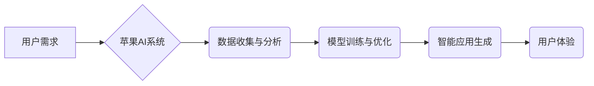

> 苹果, AI应用, 文化价值, 人工智能, 创新, 伦理, 社会影响

## 1. 背景介绍

近年来，人工智能（AI）技术飞速发展，已渗透到生活的方方面面。从智能手机的语音助手到自动驾驶汽车，AI正在改变着我们的生活方式。作为科技巨头，苹果也积极布局AI领域，并将其融入到产品和服务中。2023年，苹果发布了一系列AI应用，引发了广泛的关注和讨论。

李开复，作为一位享誉全球的人工智能专家，对苹果发布AI应用的文化价值进行了深入的思考。他认为，苹果的AI应用不仅仅是技术上的进步，更体现了苹果对用户体验、隐私保护和社会责任的重视。

## 2. 核心概念与联系

### 2.1 苹果AI应用的核心概念

苹果的AI应用的核心概念包括：

* **用户体验:** 苹果始终致力于为用户提供最佳的用户体验。AI技术可以帮助苹果更好地理解用户的需求，并提供更个性化、更智能化的服务。
* **隐私保护:** 苹果一直以来都非常重视用户隐私。在开发AI应用时，苹果采取了严格的隐私保护措施，确保用户数据安全。
* **安全可靠:** 苹果的AI应用经过严格的测试和验证，确保其安全可靠。

### 2.2 苹果AI应用与文化价值的联系

苹果的AI应用与文化价值的联系主要体现在以下几个方面：

* **推动科技进步:** 苹果的AI应用推动了人工智能技术的进步，并将其应用于实际生活中，为人类社会带来了新的价值。
* **提升生活品质:** 苹果的AI应用可以帮助用户提高生活效率，并提供更便捷、更智能化的服务，提升用户的生活品质。
* **促进社会发展:** 苹果的AI应用可以应用于医疗、教育、交通等各个领域，促进社会发展和进步。

### 2.3  AI应用流程图



## 3. 核心算法原理 & 具体操作步骤

### 3.1  算法原理概述

苹果的AI应用主要基于深度学习算法，包括卷积神经网络（CNN）、循环神经网络（RNN）等。这些算法能够从海量数据中学习特征，并进行预测、分类、识别等任务。

### 3.2  算法步骤详解

1. **数据收集与预处理:** 收集相关数据，并进行清洗、格式化等预处理工作。
2. **模型构建:** 根据任务需求选择合适的深度学习模型，并进行参数设置。
3. **模型训练:** 使用训练数据训练模型，并通过反向传播算法不断优化模型参数。
4. **模型评估:** 使用测试数据评估模型性能，并进行调整和优化。
5. **模型部署:** 将训练好的模型部署到实际应用场景中。

### 3.3  算法优缺点

**优点:**

* 能够从海量数据中学习复杂特征，具有较高的准确率。
* 能够处理各种类型的数据，包括文本、图像、音频等。

**缺点:**

* 训练数据量大，需要大量的计算资源。
* 模型解释性较差，难以理解模型的决策过程。

### 3.4  算法应用领域

深度学习算法广泛应用于以下领域：

* **图像识别:** 人脸识别、物体检测、图像分类等。
* **自然语言处理:** 语音识别、机器翻译、文本摘要等。
* **推荐系统:** 商品推荐、内容推荐等。
* **医疗诊断:** 疾病诊断、影像分析等。

## 4. 数学模型和公式 & 详细讲解 & 举例说明

### 4.1  数学模型构建

深度学习模型通常由多层神经网络组成，每层神经网络包含多个神经元。每个神经元接收来自上一层的输入信号，并通过激活函数进行处理，输出到下一层。

### 4.2  公式推导过程

深度学习模型的训练过程基于梯度下降算法。目标函数是模型预测结果与真实结果之间的误差。梯度下降算法通过不断调整模型参数，使目标函数最小化。

**目标函数:**

$$J(\theta) = \frac{1}{2} \sum_{i=1}^{m} (h_\theta(x^{(i)}) - y^{(i)})^2$$

**梯度下降算法:**

$$\theta_j := \theta_j - \alpha \frac{\partial J(\theta)}{\partial \theta_j}$$

其中：

* $J(\theta)$ 是目标函数
* $\theta$ 是模型参数
* $h_\theta(x^{(i)})$ 是模型预测结果
* $y^{(i)}$ 是真实结果
* $\alpha$ 是学习率

### 4.3  案例分析与讲解

例如，在图像识别任务中，深度学习模型可以学习图像特征，并将其映射到类别空间。训练过程中，模型会根据图像标签进行调整，使预测结果与真实标签尽可能一致。

## 5. 项目实践：代码实例和详细解释说明

### 5.1  开发环境搭建

使用Python语言开发深度学习模型，需要安装以下软件包：

* TensorFlow 或 PyTorch
* NumPy
* Pandas

### 5.2  源代码详细实现

```python
import tensorflow as tf

# 定义模型结构
model = tf.keras.models.Sequential([
    tf.keras.layers.Conv2D(32, (3, 3), activation='relu', input_shape=(28, 28, 1)),
    tf.keras.layers.MaxPooling2D((2, 2)),
    tf.keras.layers.Conv2D(64, (3, 3), activation='relu'),
    tf.keras.layers.MaxPooling2D((2, 2)),
    tf.keras.layers.Flatten(),
    tf.keras.layers.Dense(10, activation='softmax')
])

# 编译模型
model.compile(optimizer='adam',
              loss='sparse_categorical_crossentropy',
              metrics=['accuracy'])

# 训练模型
model.fit(x_train, y_train, epochs=5)

# 评估模型
loss, accuracy = model.evaluate(x_test, y_test)
print('Test loss:', loss)
print('Test accuracy:', accuracy)
```

### 5.3  代码解读与分析

这段代码定义了一个简单的卷积神经网络模型，用于手写数字识别任务。模型包含两层卷积层、两层池化层、一层全连接层和一层输出层。

### 5.4  运行结果展示

训练完成后，模型可以用于识别新的手写数字图像。

## 6. 实际应用场景

### 6.1  智能助手

苹果的Siri智能助手利用自然语言处理技术，可以理解用户的语音指令，并执行相应的操作，例如设置提醒、发送邮件、播放音乐等。

### 6.2  图像识别

苹果的iPhone手机内置了强大的图像识别功能，可以识别物体、场景、人脸等，并提供相关信息。

### 6.3  个性化推荐

苹果的App Store和Apple Music等平台利用机器学习算法，根据用户的喜好和行为，提供个性化的应用和音乐推荐。

### 6.4  未来应用展望

未来，苹果的AI应用将更加智能化、个性化和场景化。例如，AI可以帮助用户更好地管理健康、学习新技能、创造艺术作品等。

## 7. 工具和资源推荐

### 7.1  学习资源推荐

* **斯坦福大学CS229课程:** https://cs229.stanford.edu/
* **DeepLearning.AI课程:** https://www.deeplearning.ai/
* **TensorFlow官方文档:** https://www.tensorflow.org/

### 7.2  开发工具推荐

* **TensorFlow:** https://www.tensorflow.org/
* **PyTorch:** https://pytorch.org/
* **Keras:** https://keras.io/

### 7.3  相关论文推荐

* **ImageNet Classification with Deep Convolutional Neural Networks:** https://arxiv.org/abs/1202.1409
* **Attention Is All You Need:** https://arxiv.org/abs/1706.03762

## 8. 总结：未来发展趋势与挑战

### 8.1  研究成果总结

苹果的AI应用取得了显著的成果，为用户带来了更好的体验，并推动了人工智能技术的进步。

### 8.2  未来发展趋势

未来，苹果的AI应用将更加智能化、个性化和场景化，并应用于更多领域。

### 8.3  面临的挑战

* **数据隐私保护:** AI应用需要大量数据进行训练，如何保护用户数据隐私是一个重要的挑战。
* **算法公平性:** AI算法可能存在偏见，导致不公平的结果，需要研究如何构建公平的算法。
* **伦理问题:** AI技术的应用引发了伦理问题，例如人工智能的责任和义务，需要进行深入的探讨。

### 8.4  研究展望

未来，需要继续研究如何构建更安全、更可靠、更公平的AI应用，并将其应用于更多领域，造福人类社会。

## 9. 附录：常见问题与解答

### 9.1  常见问题

* 苹果的AI应用是如何保证用户隐私的？
* 苹果的AI应用是如何避免算法偏见的？
* 苹果的AI应用有哪些伦理方面的考虑？

### 9.2  解答

* 苹果的AI应用采用严格的隐私保护措施，例如数据加密、匿名化等。
* 苹果的研究人员正在积极研究如何构建公平的AI算法，并采取措施避免算法偏见。
* 苹果的AI应用开发遵循严格的伦理准则，并与相关机构合作，探讨AI技术的伦理问题。


作者：禅与计算机程序设计艺术 / Zen and the Art of Computer Programming 
<end_of_turn>