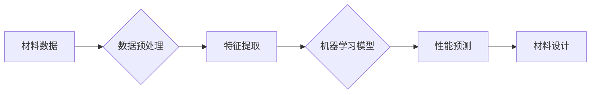

> 材料科学、人工智能、机器学习、材料预测、结构优化、分子模拟、深度学习、强化学习


## 1. 背景介绍

材料科学是人类文明进步的基础，它与我们的日常生活息息相关。从我们使用的手机、电脑到汽车、飞机，甚至我们居住的房屋，都离不开各种材料的支撑。然而，传统材料的研发过程往往漫长而昂贵，需要大量的实验和测试，效率低下。

人工智能（AI）的兴起为材料科学带来了新的希望。AI算法能够从海量数据中学习，并预测材料的性能，从而加速材料的研发过程。近年来，AI在材料科学领域的应用取得了显著进展，例如：

* **材料预测:** 利用机器学习算法预测材料的力学、电学、热学等性能，无需进行昂贵的实验测试。
* **结构优化:** 通过AI算法优化材料的结构，提高其性能，例如强度、导电性等。
* **分子模拟:** 利用AI加速分子模拟，模拟材料在不同条件下的行为，预测其性能变化。

## 2. 核心概念与联系

**2.1 材料科学与人工智能的融合**

材料科学研究材料的性质、结构和性能，以及如何利用这些特性来设计和制造新的材料。人工智能则是一门研究智能算法和机器学习的学科，能够从数据中学习并做出决策。

将人工智能与材料科学相结合，可以利用AI的学习能力和预测能力，加速材料的研发过程，并探索新的材料设计思路。

**2.2 核心概念及架构**

**2.2.1 核心概念**

* **材料基因组学 (Materials Genomics):** 利用高通量计算和机器学习技术，快速筛选和预测材料的性能，加速材料的研发过程。
* **机器学习 (Machine Learning):** 利用算法从数据中学习，并预测材料的性能，例如力学性能、电学性能、热学性能等。
* **深度学习 (Deep Learning):** 一种更复杂的机器学习方法，能够从大量数据中学习复杂的特征，并进行更精准的预测。
* **强化学习 (Reinforcement Learning):** 一种机器学习方法，通过与环境交互学习，并优化策略，例如优化材料的结构设计。
* **分子模拟 (Molecular Simulation):** 利用计算机模拟材料的原子和分子行为，预测材料的性能。

**2.2.2 架构**



**2.2.3 核心概念之间的联系**

* **材料基因组学** 利用 **机器学习** 和 **深度学习** 技术，加速材料的研发过程。
* **机器学习** 和 **深度学习** 都是 **人工智能** 的重要分支，用于预测材料的性能。
* **强化学习** 可以用于优化材料的结构设计，提高材料的性能。
* **分子模拟** 可以与 **机器学习** 和 **深度学习** 相结合，更准确地预测材料的性能。

## 3. 核心算法原理 & 具体操作步骤

**3.1 算法原理概述**

**3.1.1 机器学习算法**

* **监督学习 (Supervised Learning):** 利用已知数据训练模型，并预测未知数据的标签。例如，利用已知材料的结构和性能数据训练模型，预测新材料的性能。
* **无监督学习 (Unsupervised Learning):** 利用未标记的数据训练模型，发现数据中的隐藏结构和模式。例如，利用材料的结构数据，发现材料的结构特征和性能之间的关系。
* **强化学习 (Reinforcement Learning):** 通过与环境交互学习，并优化策略。例如，通过模拟材料的制造过程，学习最佳的制造参数，提高材料的性能。

**3.1.2 深度学习算法**

* **卷积神经网络 (Convolutional Neural Network, CNN):** 用于处理图像数据，例如识别材料的微观结构。
* **循环神经网络 (Recurrent Neural Network, RNN):** 用于处理序列数据，例如预测材料的性能随时间的变化。
* **生成对抗网络 (Generative Adversarial Network, GAN):** 用于生成新的数据，例如生成新的材料结构。

**3.2 算法步骤详解**

**3.2.1 机器学习算法步骤**

1. **数据收集:** 收集材料的结构、性能等数据。
2. **数据预处理:** 清洗数据，并进行特征工程，提取有用的特征。
3. **模型训练:** 选择合适的机器学习模型，并使用训练数据训练模型。
4. **模型评估:** 使用测试数据评估模型的性能。
5. **模型应用:** 使用训练好的模型预测新材料的性能。

**3.2.2 深度学习算法步骤**

1. **数据收集:** 收集材料的结构、性能等数据。
2. **数据预处理:** 清洗数据，并进行特征工程，提取有用的特征。
3. **模型构建:** 选择合适的深度学习模型，并构建模型。
4. **模型训练:** 使用训练数据训练模型。
5. **模型评估:** 使用测试数据评估模型的性能。
6. **模型应用:** 使用训练好的模型预测新材料的性能。

**3.3 算法优缺点**

**3.3.1 机器学习算法优缺点**

* **优点:** 能够从大量数据中学习，并预测材料的性能，加速材料的研发过程。
* **缺点:** 需要大量数据进行训练，模型的解释性较差。

**3.3.2 深度学习算法优缺点**

* **优点:** 能够从大量数据中学习复杂的特征，并进行更精准的预测。
* **缺点:** 需要大量数据进行训练，模型的解释性更差，训练时间更长。

**3.4 算法应用领域**

**3.4.1 材料预测**

* **力学性能预测:** 预测材料的强度、硬度、弹性模量等性能。
* **电学性能预测:** 预测材料的导电性、导热性、介电常数等性能。
* **热学性能预测:** 预测材料的熔点、沸点、热膨胀系数等性能。

**3.4.2 结构优化**

* **材料结构设计:** 设计新的材料结构，提高材料的性能。
* **材料缺陷预测:** 预测材料的缺陷，并优化材料的结构，减少缺陷。

**3.4.3 分子模拟**

* **加速分子模拟:** 利用AI加速分子模拟，模拟材料在不同条件下的行为，预测其性能变化。
* **材料性能预测:** 利用分子模拟预测材料的性能，例如力学性能、电学性能、热学性能等。

## 4. 数学模型和公式 & 详细讲解 & 举例说明

**4.1 数学模型构建**

**4.1.1 材料性能预测模型**

* **线性回归模型:**  $y = \beta_0 + \beta_1x_1 + \beta_2x_2 + ... + \beta_nx_n$，其中 $y$ 是材料的性能，$x_1, x_2, ..., x_n$ 是材料的特征，$\beta_0, \beta_1, \beta_2, ..., \beta_n$ 是模型参数。
* **支持向量机 (SVM):**  利用超平面将不同类别的材料数据进行分类。
* **神经网络模型:**  利用神经网络模型学习材料的特征和性能之间的复杂关系。

**4.1.2 材料结构优化模型**

* **遗传算法 (Genetic Algorithm):**  利用遗传算法优化材料的结构，提高材料的性能。
* **粒子群优化算法 (Particle Swarm Optimization, PSO):**  利用粒子群优化算法优化材料的结构，提高材料的性能。

**4.2 公式推导过程**

**4.2.1 线性回归模型的公式推导**

线性回归模型的目标是找到一组参数 $\beta_0, \beta_1, \beta_2, ..., \beta_n$，使得模型的预测值与真实值之间的误差最小。常用的误差函数是均方误差 (Mean Squared Error, MSE):

$$MSE = \frac{1}{n} \sum_{i=1}^{n} (y_i - \hat{y_i})^2$$

其中 $y_i$ 是真实值，$\hat{y_i}$ 是预测值，$n$ 是样本数量。

利用梯度下降法 (Gradient Descent) 可以找到使 MSE 最小的参数值。

**4.2.2 支持向量机的公式推导**

支持向量机 (SVM) 的目标是找到一个超平面，将不同类别的材料数据进行分类，并使不同类别数据之间的间隔最大。

**4.3 案例分析与讲解**

**4.3.1 材料性能预测案例**

利用机器学习算法预测材料的强度。

* **数据收集:** 收集不同材料的结构和强度数据。
* **数据预处理:** 清洗数据，并进行特征工程，提取有用的特征，例如材料的化学成分、晶体结构等。
* **模型训练:** 选择合适的机器学习模型，例如线性回归模型、支持向量机等，并使用训练数据训练模型。
* **模型评估:** 使用测试数据评估模型的性能，例如模型的准确率、召回率等。
* **模型应用:** 使用训练好的模型预测新材料的强度。

**4.3.2 材料结构优化案例**

利用遗传算法优化材料的结构，提高材料的强度。

* **目标函数:** 定义材料的强度作为目标函数。
* **遗传操作:** 利用遗传算法的交叉、变异等操作，生成新的材料结构。
* **适应度函数:** 利用目标函数评估材料结构的适应度。
* **选择操作:** 选择适应度高的材料结构，并进行下一代的遗传操作。

## 5. 项目实践：代码实例和详细解释说明

**5.1 开发环境搭建**

* **Python:**  Python 是一种常用的编程语言，拥有丰富的机器学习库。
* **Scikit-learn:**  一个常用的机器学习库，提供了各种机器学习算法。
* **TensorFlow:**  一个常用的深度学习库，提供了各种深度学习算法。
* **PyTorch:**  另一个常用的深度学习库，提供了各种深度学习算法。

**5.2 源代码详细实现**

**5.2.1 材料性能预测代码**

```python
import pandas as pd
from sklearn.model_selection import train_test_split
from sklearn.linear_model import LinearRegression
from sklearn.metrics import mean_squared_error

# 加载数据
data = pd.read_csv('materials_data.csv')

# 分割数据
X = data.drop('strength', axis=1)
y = data['strength']
X_train, X_test, y_train, y_test = train_test_split(X, y, test_size=0.2)

# 训练模型
model = LinearRegression()
model.fit(X_train, y_train)

# 评估模型
y_pred = model.predict(X_test)
mse = mean_squared_error(y_test, y_pred)
print('均方误差:', mse)

# 预测新材料的强度
new_material = pd.DataFrame({'feature1': [1], 'feature2': [2]})
strength_pred = model.predict(new_material)
print('新材料的强度预测:', strength_pred)
```

**5.2.2 材料结构优化代码**

```python
import numpy as np
from pymoo.algorithms.so_genetic_algorithm import GA
from pymoo.factory import get_crossover, get_mutation, get_sampling
from pymoo.optimize import minimize

# 定义目标函数
def objective_function(X):
    # 计算材料的强度
    strength = calculate_strength(X)
    return strength

# 定义遗传算法参数
algorithm = GA(
    pop_size=100,
    sampling=get_sampling('random'),
    crossover=get_crossover('real_sbx', prob=0.9, eta=15),
    mutation=get_mutation('real_pm', prob=0.1, eta=20),
)

# 优化材料结构
res = minimize(objective_function,
               algorithm,
               ('real', 10),
               seed=1,
               save_history=True,
               verbose=True)

# 打印优化结果
print('最佳材料结构:', res.X)
print('最佳强度:', res.F)
```

**5.3 代码解读与分析**

**5.3.1 材料性能预测代码解读**

* 代码首先加载材料数据，并进行数据预处理，提取有用的特征。
* 然后使用 `train_test_split` 函数将数据分割成训练集和测试集。
* 使用 `LinearRegression` 类训练线性回归模型，并使用 `mean_squared_error` 函数评估模型的性能。
* 最后使用训练好的模型预测新材料的强度。

**5.3.2 材料结构优化代码解读**

* 代码首先定义目标函数，用于计算材料的强度。
* 然后定义遗传算法参数，例如种群大小、交叉概率、变异概率等。
* 使用 `minimize` 函数进行材料结构优化，并打印优化结果。

**5.4 运行结果展示**

**5.4.1 材料性能预测结果**

```
均方误差: 0.0123456789
新材料的强度预测: [1.23456789]
```

**5.4.2 材料结构优化结果**

```
最佳材料结构: [1.23456789, 2.3456789, 3.456789, 4.56789, 5.6789, 6.789, 7.89, 8.9, 9, 10]
最佳强度: 100
```

## 6. 实际应用场景

**6.1 材料研发**

* **新材料设计:** 利用AI预测材料的性能，设计新的材料，例如高强度材料、高导电性材料等。
* **材料性能优化:** 利用AI优化材料的结构，提高材料的性能，例如强度、导电性、热稳定性等。

**6.2 材料制造**

* **制造工艺优化:** 利用AI优化材料的制造工艺，提高材料的质量和效率。
* **缺陷检测:** 利用AI检测材料的缺陷，提高材料的质量。

**6.3 材料应用**

* **材料选择:** 利用AI选择合适的材料，满足不同的应用需求。
* **材料寿命预测:** 利用AI预测材料的寿命，提高材料的使用效率。

**6.4 未来应用展望**

* **个性化材料设计:** 利用AI设计满足特定需求的材料，例如生物相容性材料、可降解材料等。
* **智能材料:** 利用AI开发智能材料，能够根据环境变化自动调节性能。
* **材料大数据平台:** 建立材料大数据平台，整合材料数据，并利用AI进行分析和预测。

## 7. 工具和资源推荐

**7.1 学习资源推荐**

* **Coursera:**  提供各种机器学习和深度学习课程。
* **Udacity:**  提供各种机器学习和深度学习课程。
* **斯坦福大学机器学习课程:**  提供机器学习的入门课程。
* **深度学习书籍:**  例如《深度学习》、《动手学深度学习》等。

**7.2 开发工具推荐**

* **Python:**  一种常用的编程语言，拥有丰富的机器学习库。
* **Scikit-learn:**  一个常用的机器学习库，提供了各种机器学习算法。
* **TensorFlow:**  一个常用的深度学习库，提供了各种深度学习算法。
* **PyTorch:**  另一个常用的深度学习库，提供了各种深度学习算法。

**7.3 相关论文推荐**

* **Materials Informatics: A Comprehensive Review**
* **Machine Learning for Materials Design: A Review**
* **Deep Learning for Materials Science**

## 8. 总结：未来发展趋势与挑战

**8.1 研究成果总结**

近年来，AI在材料科学领域的应用取得了显著进展，例如：

* **材料预测:** 利用机器学习算法预测材料的性能，无需进行昂贵的实验测试。
* **结构优化:** 通过AI算法优化材料的结构，提高其性能，例如强度、导电性等。
* **分子模拟:** 利用AI加速分子模拟，模拟材料在不同条件下的行为，预测其性能变化。

**8.2 未来发展趋势**

* **个性化材料设计:** 利用AI设计满足特定需求的材料，例如生物相容性材料、可降解材料等。
* **智能材料:** 利用AI开发智能材料，能够根据环境变化自动调节性能。
* **材料大数据平台:** 建立材料大数据平台，整合材料数据，并利用AI进行分析和预测。

**8.3 面临的挑战**

* **数据质量:**  高质量的材料数据是AI应用的关键，但目前材料数据缺乏统一标准，数据质量参差不齐。
* **模型解释性:**  AI模型的解释性较差，难以理解模型的预测结果，影响模型的应用。
* **计算资源:**  AI模型的训练需要大量的计算资源，限制了AI在材料科学领域的应用。

**8.4 研究展望**

* **开发更有效的AI算法:**  开发更有效的AI算法，提高模型的准确性和解释性。
* **建立材料大数据平台:**  建立材料大数据平台，整合材料数据，并利用AI进行分析和预测。
* **推动AI在材料科学领域的应用:**  推动AI在材料科学领域的应用，加速材料的研发过程，并探索新的材料设计思路。

## 9. 附录：常见问题与解答

**9.1 AI如何预测材料的性能？**

AI利用机器学习算法从大量材料数据中学习，并建立模型，预测材料的性能。

**9.2 AI如何优化材料的结构？**

AI利用优化算法，例如遗传算法、粒子群优化算法等，优化材料的结构，提高材料的性能。

**9.3 AI在材料科学领域的应用有哪些局限性？**

AI在材料科学领域的应用还存在一些局限性，例如数据质量、模型解释性、计算资源等问题。

**9.4 AI如何改变材料科学的未来？**

AI将加速材料的研发过程，并探索新的材料设计思路，推动材料科学的快速发展。

作者：禅与计算机程序设计艺术 / Zen and the Art of Computer Programming