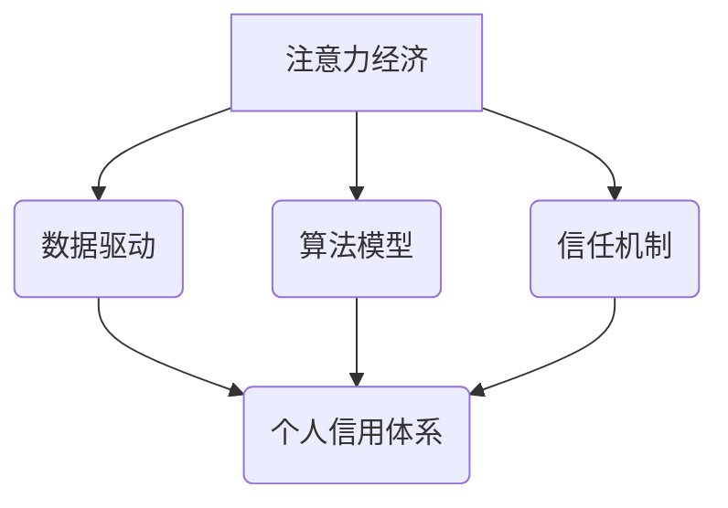

>  注意力经济、个人信用体系、数据驱动、算法模型、信任机制、去中心化、区块链、隐私保护

## 1. 背景介绍

在数字时代，信息爆炸和网络化浪潮席卷而来，人们面临着前所未有的信息过载。注意力，作为稀缺的资源，成为了至关重要的竞争要素。同时，随着互联网的普及和数据经济的兴起，个人信用体系也逐渐成为社会发展的重要基石。

**1.1 注意力经济的兴起**

注意力经济是指在信息过载的时代，人们对信息的筛选和选择能力成为重要的经济资源。注意力被视为一种稀缺的商品，而能够吸引和获取用户注意力的内容、产品和服务，则能够获得更高的价值。

**1.2 个人信用体系的意义**

个人信用体系是指基于个人行为、信用记录和社会评价，建立起一个客观、公正、可信的信用评价体系。个人信用体系能够促进社会信任，降低交易成本，推动经济发展。

**1.3 融合与挑战**

注意力经济和个人信用体系之间存在着密切的联系。一方面，个人信用体系可以帮助构建更精准的注意力分配机制，引导用户关注更优质、更有价值的内容和服务。另一方面，注意力经济的发展也为个人信用体系的构建提供了新的数据来源和技术支撑。

然而，融合注意力经济和个人信用体系也面临着诸多挑战：

* **数据隐私保护:** 个人信用体系需要收集和分析大量的个人数据，如何保障数据隐私和安全成为一个重要问题。
* **算法偏见:** 信用算法的训练数据可能存在偏见，导致信用评分不公平，加剧社会不平等。
* **信任机制:** 如何建立一个公正、透明、可信的信任机制，确保个人信用体系的有效运行，也是一个关键问题。

## 2. 核心概念与联系

**2.1 注意力经济的核心概念**

* **注意力:**  作为一种稀缺资源，注意力是指个体对特定信息或事件的集中和投入。
* **注意力经济:** 指在信息过载的时代，人们对信息的筛选和选择能力成为重要的经济资源。
* **注意力产品:**  能够有效吸引和获取用户注意力的产品或服务。

**2.2 个人信用体系的核心概念**

* **个人信用:** 指个人在社会交往和经济活动中，遵守规则、履行承诺、保持诚信的程度。
* **信用评分:**  基于个人信用记录和行为，赋予个人一个信用等级或分数。
* **信用体系:**  指建立在法律法规和社会规范基础上的，对个人信用进行评价、管理和服务的体系。

**2.3 联系与融合**

注意力经济和个人信用体系之间存在着密切的联系：

* **数据驱动:**  注意力经济的发展依赖于海量数据，而个人信用体系也需要大量数据进行信用评估。
* **算法模型:**  注意力经济和个人信用体系都依赖于算法模型进行数据分析和预测。
* **信任机制:**  注意力经济和个人信用体系都需要建立一个可靠的信任机制，确保信息的真实性和可靠性。

**2.4 核心概念架构图**



## 3. 核心算法原理 & 具体操作步骤

**3.1 算法原理概述**

个人信用体系的构建需要利用机器学习算法对个人行为数据进行分析和预测，从而建立一个客观、公正的信用评分模型。常用的算法包括：

* **逻辑回归:**  用于预测个体是否会发生特定行为，例如是否会逾期还款。
* **支持向量机:**  用于寻找数据中的最佳分类边界，将个体分为不同的信用等级。
* **决策树:**  用于构建一个基于规则的信用评分模型，根据个体的不同特征进行信用评估。
* **神经网络:**  用于学习复杂的数据关系，构建更精准的信用评分模型。

**3.2 算法步骤详解**

1. **数据收集:** 收集个人行为数据，例如信用记录、消费记录、社交行为等。
2. **数据预处理:** 对收集到的数据进行清洗、转换和特征工程，例如处理缺失值、归一化数据、提取特征等。
3. **模型训练:** 选择合适的算法模型，利用训练数据对模型进行训练，学习数据中的规律和模式。
4. **模型评估:** 利用测试数据对模型进行评估，例如计算准确率、召回率、F1-score等指标，评估模型的性能。
5. **模型部署:** 将训练好的模型部署到生产环境中，用于对新用户的信用进行评估。

**3.3 算法优缺点**

不同的算法模型具有不同的优缺点，需要根据实际情况选择合适的算法。

* **逻辑回归:**  易于理解和实现，但对复杂的数据关系难以建模。
* **支持向量机:**  能够处理高维数据，但训练时间较长。
* **决策树:**  易于解释，但容易过拟合。
* **神经网络:**  能够学习复杂的数据关系，但训练时间长，参数众多，需要大量的训练数据。

**3.4 算法应用领域**

个人信用体系的算法模型可以应用于多个领域，例如：

* **金融服务:**  评估贷款申请、设定信用卡额度、防范欺诈等。
* **电商平台:**  评估用户信用，提供信用贷款、信用分期等服务。
* **社交平台:**  评估用户信用，推荐优质内容、提供个性化服务等。

## 4. 数学模型和公式 & 详细讲解 & 举例说明

**4.1 数学模型构建**

个人信用评分模型可以构建为一个线性回归模型，例如：

$$
Score = w_1 * X_1 + w_2 * X_2 + ... + w_n * X_n + b
$$

其中：

* $Score$：个人信用评分
* $w_1, w_2, ..., w_n$：各个特征的权重
* $X_1, X_2, ..., X_n$：各个特征的值
* $b$：截距

**4.2 公式推导过程**

线性回归模型的目标是找到最佳的权重和截距，使得模型预测的信用评分与实际信用评分之间的误差最小。可以使用最小二乘法来求解最佳的权重和截距。

**4.3 案例分析与讲解**

假设我们想要构建一个简单的个人信用评分模型，包含以下特征：

* $X_1$：信用记录长度
* $X_2$：逾期次数
* $X_3$：收入水平

我们可以使用线性回归模型来构建信用评分模型，并根据训练数据求解最佳的权重和截距。

## 5. 项目实践：代码实例和详细解释说明

**5.1 开发环境搭建**

* 操作系统：Windows/macOS/Linux
* Python 版本：3.6+
* 必要的库：pandas, scikit-learn, matplotlib

**5.2 源代码详细实现**

```python
import pandas as pd
from sklearn.linear_model import LinearRegression
from sklearn.model_selection import train_test_split
from sklearn.metrics import mean_squared_error

# 加载数据
data = pd.read_csv('credit_data.csv')

# 划分训练集和测试集
X = data[['credit_length', 'overdue_count', 'income']]
y = data['credit_score']
X_train, X_test, y_train, y_test = train_test_split(X, y, test_size=0.2, random_state=42)

# 创建线性回归模型
model = LinearRegression()

# 训练模型
model.fit(X_train, y_train)

# 预测测试集结果
y_pred = model.predict(X_test)

# 计算模型性能
mse = mean_squared_error(y_test, y_pred)
print(f'Mean Squared Error: {mse}')

# 打印模型系数
print(f'Coefficients: {model.coef_}')
print(f'Intercept: {model.intercept_}')
```

**5.3 代码解读与分析**

* 代码首先加载数据，并划分训练集和测试集。
* 然后创建线性回归模型，并使用训练集训练模型。
* 接着使用训练好的模型预测测试集结果，并计算模型性能。
* 最后打印模型系数和截距。

**5.4 运行结果展示**

运行代码后，会输出模型的性能指标（例如均方误差）和模型系数。

## 6. 实际应用场景

**6.1 金融服务**

* **贷款审批:**  根据个人信用评分，快速评估贷款申请的风险，提高贷款审批效率。
* **信用卡额度:**  根据个人信用评分，设定信用卡额度，降低信用卡风险。
* **风险控制:**  识别高风险用户，采取相应的风险控制措施，降低金融机构的损失。

**6.2 电商平台**

* **信用分期:**  根据个人信用评分，提供信用分期服务，提高用户购物体验。
* **信用贷款:**  根据个人信用评分，提供信用贷款服务，满足用户资金需求。
* **推荐服务:**  根据个人信用评分，推荐更符合用户需求的商品和服务。

**6.3 其他领域**

* **租房:**  根据个人信用评分，评估租房风险，提高房东的收益。
* **保险:**  根据个人信用评分，设定保险费率，降低保险公司风险。
* **招聘:**  根据个人信用评分，评估求职者的诚信度，提高招聘效率。

**6.4 未来应用展望**

随着个人信用体系的不断发展，其应用场景将会更加广泛，例如：

* **数字身份:**  个人信用评分可以作为数字身份的一部分，用于身份验证和授权。
* **去中心化信用体系:**  利用区块链技术构建去中心化的信用体系，提高透明度和安全性。
* **人工智能驱动的信用评估:**  利用人工智能技术，构建更精准、更智能的信用评估模型。

## 7. 工具和资源推荐

**7.1 学习资源推荐**

* **书籍:**
    * 《信用评分模型》
    * 《机器学习实战》
    * 《深度学习》
* **在线课程:**
    * Coursera: 机器学习
    * edX: 数据科学
    * Udacity: 深度学习

**7.2 开发工具推荐**

* **Python:**  数据分析和机器学习的常用语言。
* **pandas:**  数据处理和分析库。
* **scikit-learn:**  机器学习库。
* **TensorFlow/PyTorch:**  深度学习框架。

**7.3 相关论文推荐**

* 《信用评分模型的构建与应用》
* 《基于机器学习的个人信用评分模型研究》
* 《区块链技术在信用体系中的应用》

## 8. 总结：未来发展趋势与挑战

**8.1 研究成果总结**

个人信用体系的构建是一个复杂的系统工程，需要多学科交叉融合。近年来，在数据科学、人工智能、区块链等领域的快速发展，为个人信用体系的构建提供了新的技术支撑。

**8.2 未来发展趋势**

* **数据驱动:**  个人信用体系将更加依赖于海量数据的驱动，需要不断探索新的数据来源和数据分析方法。
* **人工智能:**  人工智能技术将被更加广泛地应用于个人信用体系的构建，例如用于信用评分模型的训练、风险评估和欺诈检测。
* **去中心化:**  区块链技术将被用于构建去中心化的信用体系，提高透明度和安全性。

**8.3 面临的挑战**

* **数据隐私保护:**  个人信用体系需要收集和分析大量的个人数据，如何保障数据隐私和安全是一个重要问题。
* **算法偏见:**  信用算法的训练数据可能存在偏见，导致信用评分不公平，加剧社会不平等。
* **信任机制:**  如何建立一个公正、透明、可信的信任机制，确保个人信用体系的有效运行，也是一个