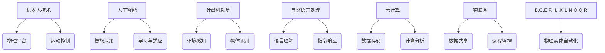

> 物理实体自动化、机器人技术、人工智能、深度学习、计算机视觉、自然语言处理、云计算、物联网

## 1. 背景介绍

随着科技的飞速发展，自动化技术已渗透到各个领域，其中物理实体自动化尤为引人注目。物理实体自动化是指利用机器人、传感器、人工智能等技术，使物理实体能够自主完成预设的任务，从而提高生产效率、降低成本、提升安全性。

传统自动化技术主要依赖于预先编程的规则和逻辑，难以应对复杂、多变的现实环境。而现代物理实体自动化则借助人工智能技术，赋予实体自主学习、决策和适应能力，使其能够更灵活地应对各种挑战。

## 2. 核心概念与联系

物理实体自动化的核心概念包括：

* **机器人技术:** 提供实体的物理平台和运动控制能力。
* **人工智能:** 赋予实体智能决策、学习和适应能力。
* **计算机视觉:** 帮助实体感知周围环境，识别物体和场景。
* **自然语言处理:** 使实体能够理解和响应人类语言指令。
* **云计算:** 提供数据存储、计算和分析能力，支持实体的远程控制和协作。
* **物联网:** 连接实体与网络，实现数据共享和远程监控。

这些核心概念相互关联，共同构成了物理实体自动化的完整体系。



## 3. 核心算法原理 & 具体操作步骤

### 3.1  算法原理概述

物理实体自动化的核心算法主要包括路径规划、运动控制、物体识别、行为决策等。

* **路径规划:** 算法旨在找到实体从起点到终点的最优路径，避免障碍物和安全风险。常用的路径规划算法包括A*算法、Dijkstra算法等。
* **运动控制:** 算法控制实体的运动速度、方向和姿态，使其能够精确地执行任务。常用的运动控制算法包括PID控制、模型预测控制等。
* **物体识别:** 算法利用计算机视觉技术识别和分类周围环境中的物体，例如人、物体、场景等。常用的物体识别算法包括卷积神经网络、支持向量机等。
* **行为决策:** 算法根据环境感知信息和任务目标，做出最优的行为决策，例如移动、抓取、放置等。常用的行为决策算法包括强化学习、决策树等。

### 3.2  算法步骤详解

以路径规划为例，详细说明其算法步骤：

1. **构建地图:** 利用传感器数据构建实体周围环境的二元地图，其中0表示空旷区域，1表示障碍物区域。
2. **定义起点和终点:** 指定实体的起点和目标位置。
3. **搜索路径:** 使用A*算法或Dijkstra算法搜索从起点到终点的最优路径。
4. **规划轨迹:** 将搜索到的路径转化为实体可执行的轨迹，包括速度、方向和姿态等信息。
5. **执行轨迹:** 控制实体按照规划的轨迹运动，完成路径规划任务。

### 3.3  算法优缺点

不同的算法具有不同的优缺点，需要根据具体应用场景选择合适的算法。

* **A*算法:** 优点是效率高，缺点是需要预先定义启发函数，启发函数的选择会影响算法的性能。
* **Dijkstra算法:** 优点是保证找到最短路径，缺点是效率较低，不适合处理大型地图。

### 3.4  算法应用领域

物理实体自动化算法广泛应用于以下领域：

* **制造业:** 自动化生产线、机器人焊接、自动化仓储等。
* **物流业:** 自动化配送、无人驾驶卡车、智能仓库等。
* **医疗保健:** 机器人手术、药物配送、康复训练等。
* **服务业:** 自动化客服、机器人导游、智能家居等。

## 4. 数学模型和公式 & 详细讲解 & 举例说明

### 4.1  数学模型构建

物理实体自动化的数学模型通常基于动力学、控制理论和概率统计等学科。

* **动力学模型:** 描述实体的运动状态和受力情况，例如牛顿第二定律。
* **控制理论模型:** 设计控制算法，使实体的运动状态满足预设目标。
* **概率统计模型:** 用于处理不确定性和随机性，例如贝叶斯网络、马尔科夫决策过程等。

### 4.2  公式推导过程

以PID控制为例，推导其控制算法公式：

$$u(t) = K_p e(t) + K_i \int e(t) dt + K_d \frac{de(t)}{dt}$$

其中：

* $u(t)$: 控制量
* $e(t)$: 误差信号
* $K_p$: 比例系数
* $K_i$: 积分系数
* $K_d$: 微分系数

### 4.3  案例分析与讲解

假设一个机器人需要控制其关节角度，目标角度为$\theta_d$, 实际角度为$\theta$. 

使用PID控制算法，可以根据误差信号$e(t) = \theta_d - \theta$ 计算控制量$u(t)$, 使机器人关节角度逐渐逼近目标角度。

## 5. 项目实践：代码实例和详细解释说明

### 5.1  开发环境搭建

* 操作系统: Ubuntu 20.04
* 编程语言: Python 3.8
* 库依赖: ROS (Robot Operating System), OpenCV, TensorFlow

### 5.2  源代码详细实现

```python
import rospy
from sensor_msgs.msg import Image
from cv_bridge import CvBridge
import cv2

class ObjectDetector:
    def __init__(self):
        rospy.init_node('object_detector', anonymous=True)
        self.bridge = CvBridge()
        self.image_sub = rospy.Subscriber('/camera/image_raw', Image, self.image_callback)

    def image_callback(self, msg):
        cv_image = self.bridge.imgmsg_to_cv2(msg, "bgr8")
        # 使用TensorFlow模型进行物体识别
        # ...
        # 处理识别结果并发布到其他节点
        # ...

if __name__ == '__main__':
    detector = ObjectDetector()
    rospy.spin()
```

### 5.3  代码解读与分析

* 该代码定义了一个名为`ObjectDetector`的类，用于处理来自相机传感器的图像数据。
* `rospy.init_node()`初始化ROS节点。
* `CvBridge()`用于将ROS图像消息转换为OpenCV图像格式。
* `rospy.Subscriber()`订阅`/camera/image_raw`话题，接收相机图像数据。
* `image_callback()`函数处理接收到的图像数据，使用TensorFlow模型进行物体识别，并发布识别结果。

### 5.4  运行结果展示

运行该代码后，机器人将接收来自相机的图像数据，并利用TensorFlow模型识别图像中的物体。识别结果可以用于控制机器人的运动行为，例如避开障碍物、抓取目标物体等。

## 6. 实际应用场景

### 6.1  智能制造

* 自动化生产线: 机器人协同工作，完成装配、焊接、喷涂等任务，提高生产效率和产品质量。
* 智能仓库: 无人叉车和机器人搬运货物，实现自动化仓储和物流管理。

### 6.2  智慧物流

* 自动化配送: 无人配送车在城市街道上行驶，将货物送达目的地。
* 智能港口: 机器人协同工作，完成货物装卸、搬运和堆放，提高港口效率和安全性。

### 6.3  医疗保健

* 机器人手术: 机器人辅助医生进行微创手术，提高手术精度和安全性。
* 药物配送: 机器人自动配送药物，提高医疗效率和患者体验。

### 6.4  未来应用展望

物理实体自动化技术将继续发展，在更多领域发挥重要作用。例如：

* **个性化医疗:** 机器人辅助医生进行个性化治疗，提高医疗效果。
* **智能家居:** 机器人完成家务清洁、烹饪等任务，提高生活品质。
* **环境保护:** 机器人参与环境监测、污染治理等工作，保护生态环境。

## 7. 工具和资源推荐

### 7.1  学习资源推荐

* **ROS (Robot Operating System):** https://www.ros.org/
* **OpenCV:** https://opencv.org/
* **TensorFlow:** https://www.tensorflow.org/

### 7.2  开发工具推荐

* **Gazebo:** https://gazebosim.org/
* **RViz:** https://discourse.ros.org/t/rviz-visualizer-for-ros/1044

### 7.3  相关论文推荐

* **Deep Reinforcement Learning for Robotics:** https://arxiv.org/abs/1705.09365
* **End-to-End Learning for Navigation in Deep Reinforcement Learning:** https://arxiv.org/abs/1707.02286

## 8. 总结：未来发展趋势与挑战

### 8.1  研究成果总结

物理实体自动化技术取得了显著进展，在机器人控制、计算机视觉、自然语言处理等领域取得了突破性成果。

### 8.2  未来发展趋势

* **更智能的算法:** 研究更先进的机器学习算法，赋予实体更强的智能决策和适应能力。
* **更安全可靠的系统:** 提高物理实体自动化的安全性、可靠性和鲁棒性，确保其在复杂环境中安全运行。
* **更广泛的应用场景:** 将物理实体自动化技术应用于更多领域，例如医疗保健、教育、娱乐等。

### 8.3  面临的挑战

* **数据获取和标注:** 物理实体自动化算法需要大量的数据进行训练，数据获取和标注成本较高。
* **安全性和伦理问题:** 物理实体自动化技术可能带来安全性和伦理问题，需要制定相应的规范和政策。
* **技术复杂性和成本:** 物理实体自动化技术复杂度高，成本较高，需要进一步降低技术门槛和成本。

### 8.4  研究展望

未来，物理实体自动化技术将继续发展，成为推动社会进步的重要力量。需要加强基础研究，突破关键技术瓶颈，推动技术产业化应用，为人类创造更加美好的未来。

## 9. 附录：常见问题与解答

* **Q1: 物理实体自动化技术与传统自动化技术有什么区别？**

* **A1:** 传统自动化技术主要依赖于预先编程的规则和逻辑，难以应对复杂、多变的现实环境。而物理实体自动化则借助人工智能技术，赋予实体自主学习、决策和适应能力，使其能够更灵活地应对各种挑战。

* **Q2: 物理实体自动化技术有哪些应用场景？**

* **A2:** 物理实体自动化技术广泛应用于制造业、物流业、医疗保健、服务业等领域。

* **Q3: 物理实体自动化技术有哪些挑战？**

* **A3:** 物理实体自动化技术面临的数据获取和标注成本高、安全性和伦理问题、技术复杂性和成本高等挑战。


作者：禅与计算机程序设计艺术 / Zen and the Art of Computer Programming 
<end_of_turn>