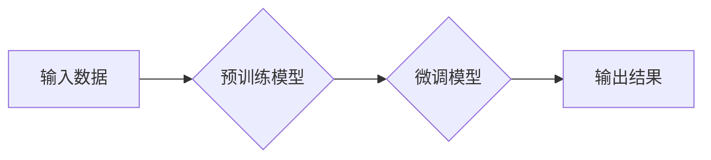

> 生成式AI, AIGC, 自然语言处理, 深度学习, Transformer, 文本生成, 图像生成, 代码生成, 商业应用

## 1. 背景介绍

近年来，人工智能（AI）技术取得了飞速发展，特别是生成式人工智能（AIGC）领域，展现出强大的潜力和应用前景。AIGC是指能够根据输入信息生成新内容的AI模型，例如文本、图像、音频、视频等。与传统的AI模型相比，AIGC更加注重创造性和创新性，能够突破人类的想象力，为人们带来全新的体验和价值。

AIGC技术的兴起，得益于以下几个关键因素：

* **深度学习算法的进步:** 深度学习算法，特别是Transformer模型的出现，为AIGC提供了强大的学习和生成能力。Transformer模型能够捕捉文本中的长距离依赖关系，生成更加流畅、自然、连贯的文本。
* **海量数据量的积累:**  互联网时代，海量数据被不断生成和积累，为AIGC模型提供了充足的训练数据。
* **计算能力的提升:**  近年来，计算能力的飞速发展，使得训练大型AIGC模型成为可能。

## 2. 核心概念与联系

AIGC的核心概念包括：

* **生成模型:**  生成模型是一种能够从数据中学习并生成新数据的机器学习模型。
* **深度学习:**  深度学习是一种基于多层神经网络的机器学习方法，能够学习复杂的数据模式。
* **Transformer:**  Transformer是一种新型的深度学习架构，能够有效地处理序列数据，例如文本和音频。

**Mermaid 流程图:**



## 3. 核心算法原理 & 具体操作步骤

### 3.1  算法原理概述

AIGC的核心算法原理是基于深度学习的生成模型，例如：

* **变分自编码器 (VAE):**  VAE是一种生成模型，通过学习数据的潜在表示来生成新数据。
* **生成对抗网络 (GAN):**  GAN由两个网络组成：生成器和判别器。生成器试图生成逼真的数据，而判别器试图区分真实数据和生成数据。两者相互竞争，最终生成器能够生成逼真的数据。
* **Transformer:**  Transformer是一种强大的序列数据处理模型，能够捕捉文本中的长距离依赖关系，生成更加流畅、自然、连贯的文本。

### 3.2  算法步骤详解

以文本生成为例，使用Transformer模型进行AIGC的具体操作步骤如下：

1. **数据预处理:**  收集和预处理文本数据，例如分词、词嵌入等。
2. **模型训练:**  使用预训练的Transformer模型，在文本数据上进行微调训练。
3. **文本生成:**  输入文本提示，模型根据训练数据生成新的文本内容。

### 3.3  算法优缺点

**优点:**

* 生成能力强，能够生成高质量、多样化的文本、图像、音频等内容。
* 适应性强，能够应用于多种领域和场景。

**缺点:**

* 训练成本高，需要大量的计算资源和数据。
* 模型容易受到训练数据的影响，可能生成带有偏见或错误的信息。

### 3.4  算法应用领域

AIGC技术在多个领域都有广泛的应用，例如：

* **内容创作:**  自动生成新闻报道、广告文案、小说等。
* **教育培训:**  生成个性化学习内容、自动批改作业等。
* **客服服务:**  构建智能客服机器人，自动回复用户问题。
* **艺术创作:**  生成音乐、绘画、诗歌等艺术作品。

## 4. 数学模型和公式 & 详细讲解 & 举例说明

### 4.1  数学模型构建

AIGC模型通常基于深度学习框架，例如TensorFlow或PyTorch。模型结构通常包括多个神经网络层，例如卷积层、循环层和全连接层。

### 4.2  公式推导过程

AIGC模型的训练过程涉及到优化目标函数，例如交叉熵损失函数。目标函数的最小化可以通过梯度下降算法实现。

**交叉熵损失函数:**

$$
H(p, q) = -\sum_{i} p(i) \log q(i)
$$

其中：

* $p(i)$ 是真实标签的概率分布。
* $q(i)$ 是模型预测的概率分布。

### 4.3  案例分析与讲解

以文本生成为例，可以使用Transformer模型进行训练。训练过程中，模型会学习文本数据的语义和语法规则，并根据输入的文本提示生成新的文本内容。

## 5. 项目实践：代码实例和详细解释说明

### 5.1  开发环境搭建

AIGC项目开发通常需要以下环境：

* Python 3.x
* TensorFlow 或 PyTorch
* CUDA 和 cuDNN

### 5.2  源代码详细实现

以下是一个使用TensorFlow实现文本生成的简单代码示例：

```python
import tensorflow as tf

# 定义模型结构
model = tf.keras.Sequential([
    tf.keras.layers.Embedding(input_dim=vocab_size, output_dim=embedding_dim),
    tf.keras.layers.LSTM(units=lstm_units),
    tf.keras.layers.Dense(units=vocab_size, activation='softmax')
])

# 编译模型
model.compile(optimizer='adam', loss='sparse_categorical_crossentropy', metrics=['accuracy'])

# 训练模型
model.fit(x_train, y_train, epochs=epochs)

# 生成文本
text_input = 'The quick brown fox'
generated_text = model.predict(text_input)
```

### 5.3  代码解读与分析

* **Embedding层:** 将单词转换为向量表示。
* **LSTM层:** 处理文本序列数据，捕捉文本中的长距离依赖关系。
* **Dense层:** 将LSTM层的输出转换为每个单词的概率分布。
* **训练过程:** 使用训练数据训练模型，优化模型参数。
* **文本生成:** 输入文本提示，模型根据训练数据生成新的文本内容。

### 5.4  运行结果展示

训练完成后，可以使用模型生成新的文本内容。例如，输入文本提示“The quick brown fox jumps over the”，模型可以生成“lazy dog”。

## 6. 实际应用场景

### 6.1  新闻报道生成

AIGC可以自动生成新闻报道，例如天气预报、股票行情等。

### 6.2  广告文案创作

AIGC可以根据目标用户和产品特点，自动生成吸引人的广告文案。

### 6.3  聊天机器人

AIGC可以构建智能聊天机器人，能够与用户进行自然流畅的对话。

### 6.4  未来应用展望

AIGC技术未来将更加智能化、个性化和自动化，应用场景将更加广泛，例如：

* **虚拟助手:**  提供更加智能、个性化的虚拟助手服务。
* **教育辅助:**  提供更加个性化的学习体验和辅助教学。
* **创意设计:**  辅助设计师进行创意设计，例如生成新的产品设计、服装款式等。

## 7. 工具和资源推荐

### 7.1  学习资源推荐

* **书籍:**
    * 《深度学习》
    * 《自然语言处理》
* **在线课程:**
    * Coursera
    * edX
* **博客和论坛:**
    * TensorFlow Blog
    * PyTorch Forum

### 7.2  开发工具推荐

* **TensorFlow:**  开源深度学习框架。
* **PyTorch:**  开源深度学习框架。
* **Hugging Face:**  提供预训练的AIGC模型和工具。

### 7.3  相关论文推荐

* **Attention Is All You Need:**  Transformer模型的论文。
* **Generative Adversarial Networks:**  GAN模型的论文。
* **BERT: Pre-training of Deep Bidirectional Transformers for Language Understanding:**  BERT模型的论文。

## 8. 总结：未来发展趋势与挑战

### 8.1  研究成果总结

AIGC技术取得了显著的进展，能够生成高质量、多样化的内容，并应用于多个领域。

### 8.2  未来发展趋势

* **模型规模和能力的提升:**  未来AIGC模型将更加庞大，拥有更强的生成能力和理解能力。
* **多模态生成:**  AIGC模型将能够生成多种类型的媒体内容，例如文本、图像、音频、视频等。
* **个性化定制:**  AIGC模型将能够根据用户的需求和偏好，生成个性化的内容。

### 8.3  面临的挑战

* **数据安全和隐私:**  AIGC模型的训练需要大量数据，如何保证数据安全和隐私是一个重要挑战。
* **模型可解释性和信任度:**  AIGC模型的决策过程往往难以理解，如何提高模型的可解释性和信任度是一个关键问题。
* **伦理和社会影响:**  AIGC技术可能带来一些伦理和社会问题，例如内容虚假、版权侵权等，需要进行深入的探讨和监管。

### 8.4  研究展望

未来，AIGC技术将继续发展，为人类社会带来更多创新和价值。需要加强基础研究，解决技术难题，并制定相应的政策和规范，引导AIGC技术健康发展。

## 9. 附录：常见问题与解答

### 9.1  AIGC和传统AI的区别是什么？

传统AI主要关注于数据分析和预测，而AIGC则侧重于生成新内容。

### 9.2  AIGC技术有哪些应用场景？

AIGC技术应用场景广泛，例如内容创作、教育培训、客服服务、艺术创作等。

### 9.3  如何学习AIGC技术？

可以通过学习相关书籍、在线课程、博客和论坛等方式学习AIGC技术。

### 9.4  AIGC技术有哪些伦理和社会问题？

AIGC技术可能带来一些伦理和社会问题，例如内容虚假、版权侵权等，需要进行深入的探讨和监管。


作者：禅与计算机程序设计艺术 / Zen and the Art of Computer Programming 
<end_of_turn>