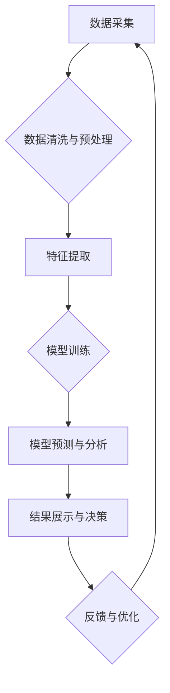

> 生成式AI, AIGC, 商业智能, 自然语言处理, 深度学习, 图像生成, 文本生成, 代码生成

## 1. 背景介绍

近年来，人工智能（AI）技术取得了飞速发展，特别是生成式人工智能（Generative AI）的兴起，为各行各业带来了革命性的变革。生成式AI是指能够根据输入数据生成新内容的AI模型，例如文本、图像、音频、视频等。与传统的AI模型相比，生成式AI更加注重创造性和创新性，能够突破数据依赖的局限，实现对全新内容的生成。

商业智能（BI）作为企业数据分析和决策支持的重要工具，一直致力于帮助企业从海量数据中挖掘价值，洞察市场趋势，优化运营效率。随着数据量的爆炸式增长和分析需求的不断提升，传统的BI工具面临着新的挑战。生成式AI的出现为BI领域带来了新的机遇，能够有效提升BI的效率、准确性和创造力。

## 2. 核心概念与联系

**2.1 生成式AI的原理**

生成式AI的核心是深度学习算法，特别是基于Transformer架构的模型，例如GPT-3、DALL-E 2等。这些模型通过学习海量文本或图像数据，掌握了数据的规律和模式，能够根据输入的提示或条件生成新的文本、图像或其他类型的数据。

**2.2 生成式AI与商业智能的联系**

生成式AI可以与商业智能相结合，在以下几个方面发挥重要作用：

* **数据分析和洞察：** 生成式AI可以帮助分析师自动生成数据报告、图表和可视化，简化分析流程，提高效率。
* **预测分析：** 生成式AI可以学习历史数据，预测未来的趋势和事件，为企业决策提供更精准的依据。
* **个性化体验：** 生成式AI可以根据用户的需求和偏好，生成个性化的产品推荐、营销内容和客户服务，提升用户体验。
* **自动化决策：** 生成式AI可以根据预设的规则和条件，自动做出决策，例如自动审批、自动交易等，提高决策效率。

**2.3 生成式AI与商业智能的架构**



## 3. 核心算法原理 & 具体操作步骤

### 3.1 算法原理概述

生成式AI的核心算法是基于深度学习的生成模型，其中Transformer架构的模型最为常见。Transformer模型通过自注意力机制学习数据之间的关系，能够捕捉长距离依赖关系，生成更流畅、更自然的文本。

### 3.2 算法步骤详解

1. **数据预处理:** 收集并清洗数据，将其转换为模型可理解的格式。
2. **模型训练:** 使用训练数据训练生成模型，调整模型参数，使其能够生成符合要求的新内容。
3. **文本生成:** 根据输入的提示或条件，使用训练好的模型生成新的文本。

### 3.3 算法优缺点

**优点:**

* 能够生成高质量、原创的内容。
* 适应性强，可以生成不同类型和风格的文本。
* 自动化程度高，可以解放人力资源。

**缺点:**

* 训练数据质量对模型性能至关重要。
* 模型可能生成不准确或有偏见的文本。
* 需要强大的计算资源进行训练。

### 3.4 算法应用领域

* 文本生成：文章写作、故事创作、对话系统、机器翻译等。
* 图像生成：图像合成、图像修复、图像风格转换等。
* 代码生成：代码自动完成、代码翻译、代码注释等。
* 音频生成：语音合成、音乐创作等。

## 4. 数学模型和公式 & 详细讲解 & 举例说明

### 4.1 数学模型构建

生成式AI模型通常基于概率模型，例如变分自编码器（VAE）和生成对抗网络（GAN）。

**4.1.1 变分自编码器（VAE）**

VAE是一种将输入数据映射到低维潜在空间，然后从潜在空间中生成新数据的模型。

**4.1.2 生成对抗网络（GAN）**

GAN由两个网络组成：生成器和判别器。生成器试图生成逼真的数据，而判别器试图区分真实数据和生成数据。两者在对抗博弈中相互竞争，最终生成器能够生成与真实数据相似的样本。

### 4.2 公式推导过程

**4.2.1 VAE的损失函数**

$$
\mathcal{L}_{VAE} = \mathcal{L}_{KL} + \mathcal{L}_{Reconstruction}
$$

其中：

* $\mathcal{L}_{KL}$ 是KL散度损失，衡量编码器输出的潜在分布与标准正态分布之间的差异。
* $\mathcal{L}_{Reconstruction}$ 是重建损失，衡量解码器输出的重建数据与真实数据的差异。

**4.2.2 GAN的损失函数**

$$
\begin{aligned}
\mathcal{L}_{Generator} &= -\mathbb{E}_{x \sim p_{data}(x)}[\log D(x)] \\
\mathcal{L}_{Discriminator} &= -\mathbb{E}_{x \sim p_{data}(x)}[\log D(x)] - \mathbb{E}_{z \sim p_{z}(z)}[\log (1 - D(G(z)))]
\end{aligned}
$$

其中：

* $D(x)$ 是判别器对真实数据 $x$ 的预测概率。
* $G(z)$ 是生成器对噪声 $z$ 的预测结果。

### 4.3 案例分析与讲解

**4.3.1 文本生成案例**

使用GPT-3模型可以生成各种类型的文本，例如：

* **小说:** 根据用户提供的主题和人物设定，生成一篇小说故事。
* **诗歌:** 根据用户提供的关键词和风格，生成一首诗歌。
* **代码:** 根据用户提供的功能描述，生成相应的代码。

**4.3.2 图像生成案例**

使用DALL-E 2模型可以生成逼真的图像，例如：

* **合成图像:** 根据用户提供的文字描述，生成一张不存在的图像。
* **图像风格转换:** 将一张图像转换为不同的艺术风格。
* **图像修复:** 修复损坏或缺失的图像部分。

## 5. 项目实践：代码实例和详细解释说明

### 5.1 开发环境搭建

* Python 3.7+
* TensorFlow/PyTorch
* CUDA/cuDNN

### 5.2 源代码详细实现

```python
# 使用GPT-3模型生成文本
import openai

openai.api_key = "YOUR_API_KEY"

prompt = "写一篇关于人工智能的博客文章。"
response = openai.Completion.create(
    engine="text-davinci-003",
    prompt=prompt,
    max_tokens=500,
    temperature=0.7
)

print(response.choices[0].text)
```

### 5.3 代码解读与分析

* 首先，需要导入openai库并设置API密钥。
* 然后，定义一个提示文本，用于指导模型生成内容。
* 使用openai.Completion.create()函数调用GPT-3模型，生成文本。
* 设置max_tokens参数控制生成的文本长度，temperature参数控制文本的随机性。
* 最后，打印生成的文本内容。

### 5.4 运行结果展示

运行上述代码，将生成一篇关于人工智能的博客文章。

## 6. 实际应用场景

### 6.1 数据分析与洞察

* 自动生成数据报告和图表，帮助分析师快速了解数据趋势。
* 使用自然语言进行数据查询，简化数据分析流程。
* 生成数据可视化，帮助用户更直观地理解数据。

### 6.2 预测分析

* 预测销售额、客户流失率等关键指标，帮助企业制定决策。
* 预测市场趋势，帮助企业把握市场机会。
* 预测设备故障，帮助企业进行预防性维护。

### 6.3 个性化体验

* 根据用户的购买历史和浏览记录，生成个性化的产品推荐。
* 根据用户的兴趣爱好，生成个性化的营销内容。
* 使用聊天机器人提供个性化的客户服务。

### 6.4 未来应用展望

* 生成式AI将进一步提升BI的智能化水平，实现更精准、更自动的数据分析和决策支持。
* 生成式AI将与其他AI技术融合，例如机器学习、深度学习等，形成更强大的数据分析和决策支持系统。
* 生成式AI将应用于更多BI场景，例如财务分析、人力资源管理、供应链管理等。

## 7. 工具和资源推荐

### 7.1 学习资源推荐

* **书籍:**
    * 《深度学习》
    * 《生成对抗网络》
* **在线课程:**
    * Coursera: 深度学习
    * Udacity: 生成式对抗网络
* **博客和网站:**
    * OpenAI Blog
    * TensorFlow Blog
    * PyTorch Blog

### 7.2 开发工具推荐

* **TensorFlow:** 开源深度学习框架
* **PyTorch:** 开源深度学习框架
* **Hugging Face:** 提供预训练模型和工具

### 7.3 相关论文推荐

* **Generative Adversarial Networks**
* **Attention Is All You Need**
* **BERT: Pre-training of Deep Bidirectional Transformers for Language Understanding**

## 8. 总结：未来发展趋势与挑战

### 8.1 研究成果总结

生成式AI在商业智能领域取得了显著的进展，能够有效提升BI的效率、准确性和创造力。

### 8.2 未来发展趋势

* 模型性能将进一步提升，能够生成更逼真、更自然的文本和图像。
* 模型规模将进一步扩大，能够处理更复杂的数据和任务。
* 生成式AI将与其他AI技术融合，形成更强大的数据分析和决策支持系统。

### 8.3 面临的挑战

* 数据安全和隐私保护
* 模型偏见和公平性
* 模型解释性和可信度

### 8.4 研究展望

未来研究将重点关注以下几个方面：

* 开发更安全、更可靠的生成式AI模型。
* 减少模型偏见和提高公平性。
* 提升模型解释性和可信度。


## 9. 附录：常见问题与解答

**9.1 如何选择合适的生成式AI模型？**

选择合适的生成式AI模型取决于具体的应用场景和需求。例如，如果需要生成文本，可以选择GPT-3等文本生成模型；如果需要生成图像，可以选择DALL-E 2等图像生成模型。

**9.2 如何避免模型生成不准确或有偏见的文本？**

可以通过以下方法避免模型生成不准确或有偏见的文本：

* 使用高质量的训练数据。
* 对训练数据进行预处理，去除偏见和错误信息。
* 使用正则化技术，防止模型过拟合。
* 对生成的文本进行人工审核。

**9.3 如何评估生成式AI模型的性能？**

可以使用以下指标评估生成式AI模型的性能：

* perplexity
* BLEU
* ROUGE

作者：禅与计算机程序设计艺术 / Zen and the Art of Computer Programming


<end_of_turn>