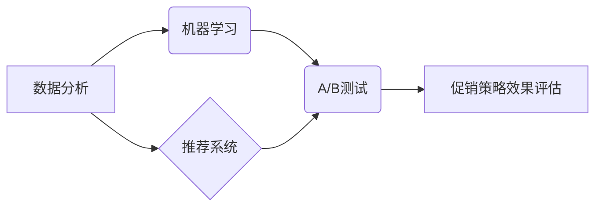

> 电商促销策略，效果评估，数据分析，机器学习，推荐系统，A/B测试，转化率优化

## 1. 背景介绍

在当今竞争激烈的电商市场，促销策略是商家提升销量、增加利润的关键手段。然而，传统的促销策略往往缺乏数据支撑，难以精准地把握目标客户需求，导致促销效果难以预估，甚至可能造成资源浪费。随着大数据、人工智能等技术的快速发展，电商促销策略也迎来了新的变革。数据驱动、精准化、个性化成为了电商促销策略的新趋势。

## 2. 核心概念与联系

电商促销策略的实际效果评估需要结合多种核心概念和技术，包括：

* **数据分析**: 通过对用户行为、商品销售数据等进行分析，挖掘潜在的促销策略和效果评估指标。
* **机器学习**: 利用机器学习算法，预测用户对促销活动的响应程度，优化促销策略参数，提高促销效果。
* **推荐系统**: 基于用户历史行为和商品特征，推荐合适的促销活动，提高用户参与度和转化率。
* **A/B测试**: 通过对比不同促销策略的效果，选择最优的策略，不断优化促销方案。

**核心概念架构图:**



## 3. 核心算法原理 & 具体操作步骤

### 3.1  算法原理概述

电商促销策略效果评估的核心算法主要包括：

* **回归算法**: 用于预测促销活动对销售额的影响，例如线性回归、逻辑回归等。
* **分类算法**: 用于预测用户是否会参与促销活动，例如决策树、支持向量机等。
* **聚类算法**: 用于将用户群体进行细分，针对不同用户群体制定个性化的促销策略，例如K-means聚类等。

### 3.2  算法步骤详解

以预测促销活动对销售额影响为例，使用线性回归算法进行效果评估的具体步骤如下：

1. **数据收集**: 收集促销活动期间的销售数据、用户行为数据等相关信息。
2. **数据预处理**: 对收集到的数据进行清洗、转换、特征工程等处理，使其适合模型训练。
3. **模型训练**: 使用线性回归算法对预处理后的数据进行训练，建立预测模型。
4. **模型评估**: 使用测试数据对模型进行评估，评估模型的预测精度。
5. **模型优化**: 根据模型评估结果，调整模型参数，提高模型预测精度。
6. **效果预测**: 将预测模型应用于新的促销活动，预测促销活动对销售额的影响。

### 3.3  算法优缺点

**线性回归算法的优点**:

* 计算简单，易于理解和实现。
* 训练速度快，适合处理大规模数据。

**线性回归算法的缺点**:

* 假设数据服从线性关系，如果数据存在非线性关系，模型预测精度会降低。
* 对异常值敏感，异常值可能会影响模型的训练效果。

### 3.4  算法应用领域

线性回归算法广泛应用于电商促销策略效果评估、用户行为预测、市场营销分析等领域。

## 4. 数学模型和公式 & 详细讲解 & 举例说明

### 4.1  数学模型构建

假设促销活动对销售额的影响可以用线性回归模型表示：

$$
y = \beta_0 + \beta_1x_1 + \beta_2x_2 + ... + \beta_nx_n + \epsilon
$$

其中：

* $y$：销售额
* $x_1, x_2, ..., x_n$：促销活动相关特征，例如折扣力度、活动时间、用户年龄等
* $\beta_0, \beta_1, \beta_2, ..., \beta_n$：回归系数，表示每个特征对销售额的影响程度
* $\epsilon$：随机误差项

### 4.2  公式推导过程

通过最小二乘法，可以求解回归系数 $\beta_0, \beta_1, \beta_2, ..., \beta_n$，使得模型预测值与实际值之间的误差最小。

### 4.3  案例分析与讲解

假设电商平台进行了一次促销活动，活动期间的销售额数据如下：

| 折扣力度 | 活动时间 | 销售额 |
|---|---|---|
| 10% | 1小时 | 1000 |
| 20% | 2小时 | 2000 |
| 30% | 3小时 | 3000 |

我们可以使用线性回归模型来预测促销活动对销售额的影响。

* 将折扣力度和活动时间作为特征，销售额作为目标变量。
* 使用最小二乘法求解回归系数。
* 得到的回归模型可以用来预测其他促销活动的效果。

## 5. 项目实践：代码实例和详细解释说明

### 5.1  开发环境搭建

本项目使用Python语言进行开发，需要安装以下软件包：

* pandas
* scikit-learn
* matplotlib

### 5.2  源代码详细实现

```python
import pandas as pd
from sklearn.linear_model import LinearRegression
import matplotlib.pyplot as plt

# 加载数据
data = pd.read_csv('sales_data.csv')

# 数据预处理
X = data[['折扣力度', '活动时间']]
y = data['销售额']

# 训练模型
model = LinearRegression()
model.fit(X, y)

# 预测效果
new_data = pd.DataFrame({'折扣力度': [25], '活动时间': [4]})
predicted_sales = model.predict(new_data)

# 展示结果
plt.scatter(X['折扣力度'], y)
plt.plot(X['折扣力度'], model.predict(X), color='red')
plt.xlabel('折扣力度')
plt.ylabel('销售额')
plt.title('促销活动效果预测')
plt.show()

print(f'预测销售额: {predicted_sales[0]}')
```

### 5.3  代码解读与分析

* 代码首先加载数据，并对数据进行预处理，将特征和目标变量分离。
* 然后使用线性回归模型训练模型，并使用训练好的模型预测新的促销活动的效果。
* 最后，代码使用matplotlib库绘制图表，展示模型预测结果。

### 5.4  运行结果展示

运行代码后，会生成一个图表，展示促销活动对销售额的影响。图表中，蓝色点表示实际销售额，红色线表示模型预测的销售额。

## 6. 实际应用场景

电商促销策略效果评估在实际应用场景中具有广泛的应用价值，例如：

* **促销活动方案设计**: 通过对历史促销活动效果进行分析，可以帮助商家制定更有效的促销活动方案。
* **目标客户精准定位**: 通过对用户行为数据进行分析，可以识别出对促销活动更感兴趣的用户群体，进行精准营销。
* **资源优化分配**: 通过对促销活动效果进行评估，可以帮助商家优化资源分配，提高促销活动投资回报率。

### 6.4  未来应用展望

随着人工智能技术的不断发展，电商促销策略效果评估将更加智能化、个性化。未来，我们可以期待以下应用场景：

* **基于深度学习的促销策略效果预测**: 利用深度学习算法，对更复杂的数据进行分析，提高促销活动效果预测精度。
* **个性化促销策略推荐**: 基于用户的历史行为和偏好，推荐个性化的促销策略，提高用户参与度和转化率。
* **实时促销策略调整**: 利用实时数据分析，动态调整促销策略参数，优化促销活动效果。

## 7. 工具和资源推荐

### 7.1  学习资源推荐

* **书籍**:
    * 《Python机器学习实战》
    * 《数据挖掘与数据分析》
* **在线课程**:
    * Coursera: 数据科学
    * edX: 机器学习
* **博客**:
    * Towards Data Science
    * Analytics Vidhya

### 7.2  开发工具推荐

* **Python**: 
    * pandas
    * scikit-learn
    * matplotlib
* **云计算平台**:
    * AWS
    * Azure
    * GCP

### 7.3  相关论文推荐

* **论文**:
    * "A Survey of Recommender Systems"
    * "Deep Learning for Recommender Systems"

## 8. 总结：未来发展趋势与挑战

### 8.1  研究成果总结

电商促销策略效果评估的研究取得了显著进展，已经形成了较为完善的理论体系和技术方法。

### 8.2  未来发展趋势

未来，电商促销策略效果评估将朝着更加智能化、个性化、实时化的方向发展。

### 8.3  面临的挑战

* 数据质量问题：电商促销数据往往存在缺失、噪声等问题，需要进行有效的数据清洗和处理。
* 模型解释性问题：深度学习模型的预测结果难以解释，需要开发更易于理解的模型。
* 隐私保护问题：电商促销数据往往包含用户隐私信息，需要采取有效措施保护用户隐私。

### 8.4  研究展望

未来，需要进一步研究以下问题：

* 如何提高电商促销数据质量？
* 如何开发更易于解释的深度学习模型？
* 如何在保证用户隐私的前提下进行数据分析和模型训练？


## 9. 附录：常见问题与解答

**常见问题**:

* 如何选择合适的促销策略效果评估算法？
* 如何处理电商促销数据中的缺失值和异常值？
* 如何评估促销活动效果的指标有哪些？

**解答**:

* 选择合适的促销策略效果评估算法需要根据具体业务场景和数据特点进行选择。
* 处理电商促销数据中的缺失值和异常值可以使用多种方法，例如插值法、删除法、异常值处理等。
* 评估促销活动效果的指标可以包括转化率、客单价、利润率等。


作者：禅与计算机程序设计艺术 / Zen and the Art of Computer Programming 
<end_of_turn>