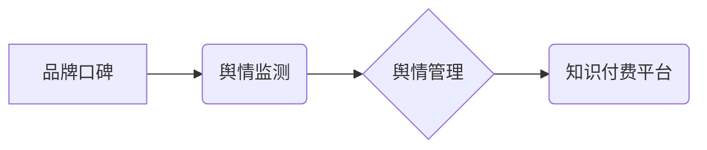

> 知识付费、品牌口碑、舆情监测、舆情管理、机器学习、自然语言处理、深度学习、情感分析

## 1. 背景介绍

知识付费行业近年来蓬勃发展，成为新兴经济的重要组成部分。众多企业和个人纷纷涌入，提供各种类型的知识产品和服务。然而，知识付费市场竞争激烈，用户选择更加理性，品牌口碑和舆情管理的重要性日益凸显。

品牌口碑是消费者对品牌认知、态度和情感的综合反映，是品牌价值的重要体现。良好的品牌口碑能够提升用户信任度，促进产品销售，增强品牌竞争力。而舆情管理则是及时监测和应对与品牌相关的网络信息，维护品牌形象和声誉的主动性工作。

知识付费平台需要建立完善的品牌口碑监测与舆情管理体系，才能在激烈的市场竞争中脱颖而出，实现可持续发展。

## 2. 核心概念与联系

**2.1 品牌口碑**

品牌口碑是指消费者对品牌认知、态度和情感的综合反映，是消费者对品牌价值的评价和认可。良好的品牌口碑能够提升用户信任度，促进产品销售，增强品牌竞争力。

**2.2 舆情监测**

舆情监测是指对与品牌相关的网络信息进行实时收集、分析和监控，了解公众对品牌的认知、态度和情感，以及潜在的风险和危机。

**2.3 舆情管理**

舆情管理是指对监测到的舆情信息进行分析和评估，制定相应的应对策略，及时化解危机，维护品牌形象和声誉。

**2.4 知识付费平台**

知识付费平台是指提供知识产品和服务的在线平台，用户可以通过付费的方式获取知识和技能。

**2.5 核心概念关系图**



## 3. 核心算法原理 & 具体操作步骤

**3.1 算法原理概述**

品牌口碑监测与舆情管理的核心算法主要包括：

* **自然语言处理 (NLP)**：用于对文本数据进行分析和理解，例如文本分类、情感分析、主题提取等。
* **机器学习 (ML)**：用于从数据中学习模式和规律，例如预测舆情趋势、识别潜在风险等。
* **深度学习 (DL)**：用于处理复杂的数据，例如识别用户画像、分析用户行为等。

**3.2 算法步骤详解**

1. **数据采集**: 从互联网、社交媒体等渠道收集与品牌相关的文本数据。
2. **数据预处理**: 对收集到的数据进行清洗、去噪、格式化等处理，使其适合算法训练和分析。
3. **特征提取**: 使用 NLP 技术提取文本数据中的关键特征，例如关键词、情感倾向、主题标签等。
4. **模型训练**: 使用 ML 或 DL 算法对提取的特征进行训练，构建品牌口碑监测和舆情管理模型。
5. **模型评估**: 对训练好的模型进行评估，验证其准确性和有效性。
6. **舆情监测**: 使用训练好的模型对实时数据进行监测，识别潜在的风险和危机。
7. **舆情分析**: 对监测到的舆情信息进行分析，了解公众对品牌的认知、态度和情感。
8. **舆情管理**: 根据舆情分析结果，制定相应的应对策略，及时化解危机，维护品牌形象和声誉。

**3.3 算法优缺点**

* **优点**: 能够自动化处理海量数据，提高监测和分析效率，及时识别潜在风险，有效维护品牌形象。
* **缺点**: 算法模型需要大量数据进行训练，训练成本较高；算法模型的准确性受数据质量影响，需要不断优化和改进。

**3.4 算法应用领域**

* 品牌口碑监测
* 舆情管理
* 危机公关
* 市场营销
* 产品研发

## 4. 数学模型和公式 & 详细讲解 & 举例说明

**4.1 数学模型构建**

品牌口碑监测与舆情管理的数学模型可以基于以下几个方面构建：

* **情感分析模型**: 使用机器学习算法对文本数据进行情感分析，识别用户对品牌的正面、负面或中性情感。
* **主题提取模型**: 使用主题模型算法对文本数据进行主题提取，识别用户对品牌的关注点和议题。
* **舆情趋势预测模型**: 使用时间序列分析和机器学习算法预测舆情趋势，识别潜在的风险和危机。

**4.2 公式推导过程**

情感分析模型的构建可以基于以下公式：

* **情感强度**:  $S = \sum_{i=1}^{n} w_i * e_i$

其中：

* $S$：情感强度
* $n$：文本中情感词的数量
* $w_i$：情感词 $i$ 的权重
* $e_i$：情感词 $i$ 的情感值

**4.3 案例分析与讲解**

假设一个知识付费平台想要监测用户对平台产品的口碑，可以使用情感分析模型对用户评论进行分析。

如果用户评论中包含大量的“非常好”、“值得推荐”等正面情感词，则平台的口碑良好。反之，如果用户评论中包含大量的“失望”、“垃圾”等负面情感词，则平台的口碑较差。

## 5. 项目实践：代码实例和详细解释说明

**5.1 开发环境搭建**

* 操作系统：Windows/macOS/Linux
* Python 版本：3.6+
* 必要的库：NLTK、spaCy、scikit-learn、TensorFlow/PyTorch

**5.2 源代码详细实现**

```python
# 情感分析示例代码

import nltk
from nltk.sentiment import SentimentIntensityAnalyzer

nltk.download('vader_lexicon')

analyzer = SentimentIntensityAnalyzer()

text = "这个知识付费课程非常棒，内容丰富，讲解清晰，值得推荐！"

scores = analyzer.polarity_scores(text)

print(scores)
```

**5.3 代码解读与分析**

* 该代码使用 NLTK 库中的 SentimentIntensityAnalyzer 类进行情感分析。
* 首先下载 VADER 词典，该词典包含了大量情感词及其对应的权重。
* 然后使用 analyzer.polarity_scores() 方法对文本进行分析，返回情感强度分数。
* 分数包括：
    * `neg`: 负面情感分数
    * `neu`: 中性情感分数
    * `pos`: 正面情感分数
    * `compound`: 综合情感分数，范围从 -1 到 1，其中 1 表示极度正面，-1 表示极度负面。

**5.4 运行结果展示**

运行该代码后，会输出以下结果：

```
{'neg': 0.0, 'neu': 0.328, 'pos': 0.672, 'compound': 0.8933}
```

结果表明，该文本的综合情感分数为 0.8933，属于极度正面情感。

## 6. 实际应用场景

**6.1 品牌口碑监测**

知识付费平台可以利用品牌口碑监测工具，实时监测用户对平台、课程、老师等方面的评价，了解用户对品牌的认知和态度，及时发现潜在的问题。

**6.2 舆情管理**

知识付费平台可以利用舆情管理工具，监测与品牌相关的网络信息，识别潜在的风险和危机，及时制定应对策略，维护品牌形象和声誉。

**6.3 课程改进**

通过分析用户对课程的评价，知识付费平台可以了解用户对课程的满意度，及时改进课程内容和教学方式，提升用户体验。

**6.4 未来应用展望**

随着人工智能技术的不断发展，品牌口碑监测与舆情管理将更加智能化、自动化。未来，知识付费平台可以利用更先进的算法和技术，实现更精准的监测和分析，提供更个性化的服务，提升用户体验。

## 7. 工具和资源推荐

**7.1 学习资源推荐**

* 自然语言处理入门书籍：
    * 《自然语言处理入门》
    * 《Speech and Language Processing》
* 机器学习入门书籍：
    * 《机器学习》
    * 《Hands-On Machine Learning with Scikit-Learn, Keras & TensorFlow》

**7.2 开发工具推荐**

* Python：
    * NLTK
    * spaCy
    * scikit-learn
    * TensorFlow/PyTorch
* 其他工具：
    * Brand24
    * Mention
    * Hootsuite

**7.3 相关论文推荐**

* 《Sentiment Analysis Using Deep Learning》
* 《A Survey of Text Summarization Methods》
* 《Topic Modeling: An Introduction》

## 8. 总结：未来发展趋势与挑战

**8.1 研究成果总结**

品牌口碑监测与舆情管理是知识付费平台发展的重要环节，通过利用人工智能技术，可以实现更精准的监测和分析，为平台提供更有效的决策支持。

**8.2 未来发展趋势**

* **更智能化**: 利用深度学习等更先进的算法，实现更精准的文本分析和情感识别。
* **更个性化**: 根据用户的兴趣和需求，提供更个性化的服务和内容。
* **更实时化**: 实现实时监测和分析，及时应对突发事件。

**8.3 面临的挑战**

* 数据质量问题：算法模型的准确性受数据质量影响，需要不断优化和改进数据采集和处理方法。
* 算法解释性问题：深度学习模型的决策过程难以解释，需要研究更可解释的算法模型。
* 伦理问题：数据隐私保护和算法公平性等伦理问题需要得到重视。

**8.4 研究展望**

未来，品牌口碑监测与舆情管理将继续朝着更智能化、个性化、实时化的方向发展，为知识付费平台提供更有效的决策支持，促进平台的健康发展。

## 9. 附录：常见问题与解答

**9.1 如何选择合适的品牌口碑监测与舆情管理工具？**

选择合适的工具需要根据平台的具体需求和预算进行考虑。一些常用的工具包括 Brand24、Mention、Hootsuite 等。

**9.2 如何提高算法模型的准确性？**

提高算法模型的准确性需要从以下几个方面入手：

* 提升数据质量：确保数据准确、完整、无重复。
* 优化算法模型：选择合适的算法模型，并进行参数调优。
* 增加训练数据量：增加训练数据量可以提高模型的泛化能力。

**9.3 如何应对负面舆情？**

应对负面舆情需要采取以下措施：

* 及时了解负面舆情：及时监测和分析负面舆情，了解其原因和影响。
* 制定应对策略：根据负面舆情的性质和影响程度，制定相应的应对策略。
* 及时沟通回应：及时与用户沟通，回应用户的疑问和诉求，化解用户的负面情绪。


作者：禅与计算机程序设计艺术 / Zen and the Art of Computer Programming 
<end_of_turn>