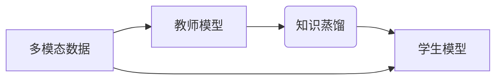

> 知识蒸馏，多模态学习，迁移学习，深度学习，计算机视觉

## 1. 背景介绍

近年来，深度学习在计算机视觉、自然语言处理等领域取得了显著成就。然而，深度学习模型通常需要海量数据进行训练，并且训练成本高昂。知识蒸馏（Knowledge Distillation）作为一种有效的迁移学习技术，能够将知识从大型模型（教师模型）转移到小型模型（学生模型）中，从而降低模型训练成本，提高模型效率。

多模态学习（Multimodal Learning）旨在从多种模态数据（如文本、图像、音频等）中学习，并融合不同模态的信息，以获得更全面的理解和表示。多模态学习在许多应用场景中具有重要意义，例如图像字幕生成、视频理解、情感分析等。

将知识蒸馏与多模态学习相结合，可以有效地解决多模态学习中的挑战，例如数据稀缺、模态间交互复杂等问题。

## 2. 核心概念与联系

**2.1 知识蒸馏**

知识蒸馏是一种迁移学习技术，旨在将知识从一个大型模型（教师模型）转移到一个小型模型（学生模型）中。教师模型通常是经过大量数据训练的，拥有丰富的知识和表达能力。学生模型则通常更小，更轻量，并且训练成本更低。

知识蒸馏的核心思想是，通过最小化教师模型和学生模型的输出分布之间的差异，将教师模型的知识“蒸馏”到学生模型中。

**2.2 多模态学习**

多模态学习旨在从多种模态数据中学习，并融合不同模态的信息，以获得更全面的理解和表示。

多模态学习的挑战包括：

* 数据稀缺：不同模态的数据往往难以获得，并且模态间的数据对齐困难。
* 模态间交互复杂：不同模态之间存在复杂的交互关系，需要有效的融合机制。
* 模型复杂度高：多模态学习模型通常非常复杂，训练成本高昂。

**2.3 知识蒸馏与多模态学习的结合**

将知识蒸馏与多模态学习相结合，可以有效地解决多模态学习中的挑战。

* **数据稀缺:** 可以利用教师模型的知识，帮助学生模型学习少量的多模态数据。
* **模态间交互复杂:** 可以利用教师模型的知识，学习到不同模态之间的交互关系，并将其传递给学生模型。
* **模型复杂度高:** 可以利用知识蒸馏技术，将大型多模态模型的知识压缩到小型模型中，降低模型训练成本。



## 3. 核心算法原理 & 具体操作步骤

### 3.1 算法原理概述

知识蒸馏在多模态学习中的核心算法原理是将教师模型的知识“蒸馏”到学生模型中。

具体来说，教师模型和学生模型都接受相同的多模态输入，并输出相应的预测结果。知识蒸馏的目标是最小化教师模型和学生模型的输出分布之间的差异。

常用的知识蒸馏方法包括：

* **Soft Target Distillation:** 将教师模型的输出概率分布作为学生模型的软目标，而不是硬目标（one-hot编码）。
* **Temperature Scaling:** 通过调整教师模型的输出温度参数，可以改变教师模型的输出分布的平滑度，从而提高知识蒸馏的效果。
* **Ensemble Distillation:** 使用多个教师模型的输出作为学生模型的软目标，可以提高知识蒸馏的鲁棒性。

### 3.2 算法步骤详解

1. **训练教师模型:** 使用大量的多模态数据训练一个大型的教师模型。
2. **构建学生模型:** 设计一个小型学生模型，其结构和功能与教师模型相似。
3. **知识蒸馏:** 使用教师模型的输出作为学生模型的软目标，并通过优化损失函数，最小化教师模型和学生模型的输出分布之间的差异。
4. **评估学生模型:** 使用测试数据评估学生模型的性能，并与教师模型和未进行知识蒸馏的学生模型进行比较。

### 3.3 算法优缺点

**优点:**

* 降低模型训练成本
* 提高模型效率
* 提升模型泛化能力

**缺点:**

* 需要一个预先训练好的教师模型
* 知识蒸馏过程可能需要较长时间

### 3.4 算法应用领域

知识蒸馏在多模态学习中的应用领域非常广泛，例如：

* **图像字幕生成:** 将知识蒸馏应用于图像字幕生成任务，可以提高模型的准确性和效率。
* **视频理解:** 将知识蒸馏应用于视频理解任务，可以帮助模型更好地理解视频内容。
* **情感分析:** 将知识蒸馏应用于情感分析任务，可以提高模型对情感的识别能力。

## 4. 数学模型和公式 & 详细讲解 & 举例说明

### 4.1 数学模型构建

知识蒸馏的目标是最小化教师模型和学生模型的输出分布之间的差异。常用的度量方法是交叉熵损失函数。

假设教师模型的输出为 $p_t$, 学生模型的输出为 $p_s$, 则交叉熵损失函数为：

$$
L_{KD} = -\sum_{i=1}^{N} p_t(i) \log p_s(i)
$$

其中，$N$ 是类别数。

### 4.2 公式推导过程

交叉熵损失函数的推导过程如下：

1. 假设教师模型的输出为一个概率分布，即 $p_t(i)$ 表示第 $i$ 个类别的预测概率。
2. 学生模型的输出也为一个概率分布，即 $p_s(i)$ 表示第 $i$ 个类别的预测概率。
3. 我们希望学生模型的输出分布尽可能接近教师模型的输出分布。
4. 交叉熵损失函数可以衡量两个概率分布之间的差异，其值越小，表示两个分布越接近。

### 4.3 案例分析与讲解

假设我们有一个图像分类任务，教师模型是一个大型的卷积神经网络，学生模型是一个小型卷积神经网络。

在训练过程中，教师模型的输出作为学生模型的软目标，通过最小化交叉熵损失函数，将教师模型的知识“蒸馏”到学生模型中。

经过训练，学生模型的性能可以达到与教师模型相似的水平，但训练成本和模型大小都大大降低。

## 5. 项目实践：代码实例和详细解释说明

### 5.1 开发环境搭建

* Python 3.7+
* PyTorch 1.7+
* CUDA 10.2+

### 5.2 源代码详细实现

```python
import torch
import torch.nn as nn

# 定义教师模型
class TeacherModel(nn.Module):
    # ...

# 定义学生模型
class StudentModel(nn.Module):
    # ...

# 定义知识蒸馏损失函数
def knowledge_distillation_loss(teacher_output, student_output, temperature=1.0):
    # ...

# 训练循环
for epoch in range(num_epochs):
    for batch_idx, (data, target) in enumerate(train_loader):
        # 前向传播
        teacher_output = teacher_model(data)
        student_output = student_model(data)

        # 计算损失
        loss = criterion(target, student_output) + knowledge_distillation_loss(teacher_output, student_output)

        # 反向传播
        optimizer.zero_grad()
        loss.backward()
        optimizer.step()

```

### 5.3 代码解读与分析

* 教师模型和学生模型的结构可以根据具体任务进行调整。
* 知识蒸馏损失函数可以根据具体任务进行调整。
* 训练循环中，教师模型的输出作为学生模型的软目标，通过最小化损失函数，将教师模型的知识“蒸馏”到学生模型中。

### 5.4 运行结果展示

训练完成后，可以评估学生模型的性能，并与教师模型和未进行知识蒸馏的学生模型进行比较。

## 6. 实际应用场景

### 6.1 医疗诊断

知识蒸馏可以用于将专家医生的诊断知识“蒸馏”到小型模型中，帮助医生更快、更准确地诊断疾病。

### 6.2 自动驾驶

知识蒸馏可以用于将高级驾驶辅助系统的知识“蒸馏”到小型模型中，帮助自动驾驶汽车更好地感知周围环境。

### 6.3 人机交互

知识蒸馏可以用于将自然语言处理模型的知识“蒸馏”到小型模型中，帮助人机交互系统更好地理解用户意图。

### 6.4 未来应用展望

随着多模态学习和知识蒸馏技术的不断发展，其应用场景将更加广泛，例如：

* **个性化教育:** 根据学生的学习情况，定制个性化的学习内容和教学方法。
* **智能客服:** 提供更智能、更人性化的客服服务。
* **虚拟现实:** 创建更逼真的虚拟现实体验。

## 7. 工具和资源推荐

### 7.1 学习资源推荐

* **书籍:**
    * Deep Learning by Ian Goodfellow, Yoshua Bengio, and Aaron Courville
    * Knowledge Distillation by Geoffrey Hinton
* **论文:**
    * Hinton, G., Vinyals, O., & Dean, J. (2015). Distilling the knowledge in a neural network. arXiv preprint arXiv:1503.02531.
* **在线课程:**
    * Coursera: Deep Learning Specialization
    * Udacity: Deep Learning Nanodegree

### 7.2 开发工具推荐

* **PyTorch:** 深度学习框架
* **TensorFlow:** 深度学习框架
* **Keras:** 深度学习框架

### 7.3 相关论文推荐

* **Teacher-Student Generative Adversarial Networks for Multimodal Learning**
* **Multimodal Knowledge Distillation for Few-Shot Learning**
* **Cross-Modal Knowledge Transfer via Distillation for Image Captioning**

## 8. 总结：未来发展趋势与挑战

### 8.1 研究成果总结

知识蒸馏在多模态学习中取得了显著成果，有效地解决了多模态学习中的数据稀缺、模态间交互复杂等问题。

### 8.2 未来发展趋势

* **更有效的知识蒸馏方法:** 研究更有效的知识蒸馏方法，例如基于自监督学习的知识蒸馏、基于强化学习的知识蒸馏等。
* **跨模态知识蒸馏:** 研究跨模态知识蒸馏方法，例如将文本知识蒸馏到图像模型中，将图像知识蒸馏到文本模型中等。
* **动态知识蒸馏:** 研究动态知识蒸馏方法，例如根据任务需求动态调整知识蒸馏的强度。

### 8.3 面临的挑战

* **模态间对齐:** 不同模态的数据往往难以对齐，需要有效的模态间对齐方法。
* **知识表示:** 如何有效地表示不同模态的知识，是知识蒸馏的关键挑战。
* **模型复杂度:** 多模态学习模型通常非常复杂，需要研究更轻量、更高效的模型架构。

### 8.4 研究展望

未来，知识蒸馏在多模态学习领域将继续发挥重要作用，并推动多模态学习技术的进一步发展。


## 9. 附录：常见问题与解答

**Q1: 知识蒸馏需要一个预先训练好的教师模型吗？**

**A1:** 是的，知识蒸馏需要一个预先训练好的教师模型。

**Q2: 知识蒸馏的训练时间是否会比直接训练学生模型长？**

**A2:** 知识蒸馏的训练时间通常比直接训练学生模型长，但由于学生模型的规模较小，因此训练时间仍然比训练教师模型短。

**Q3: 知识蒸馏的应用场景有哪些？**

**A3:** 知识蒸馏的应用场景非常广泛，例如图像分类、文本生成、语音识别等。

**Q4: 如何选择合适的知识蒸馏方法？**

**A4