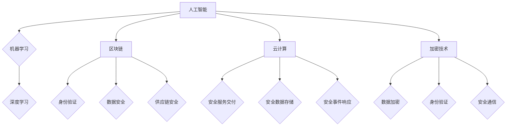

> 网络安全,人工智能,机器学习,深度学习,区块链,云计算,加密技术

## 1. 背景介绍

在当今数字化时代，网络安全已成为全球性的头等大事。随着互联网的蓬勃发展和数字化转型加速，网络攻击手段日益复杂，攻击者利用漏洞获取敏感信息、破坏关键基础设施的威胁日益严峻。传统安全防护手段已难以有效应对新兴的网络安全挑战。因此，探索和应用新的网络安全技术，构建更加安全可靠的网络环境，显得尤为重要。

硅谷作为全球科技创新中心，一直走在网络安全技术的前沿。近年来，硅谷涌现出一批新兴的网络安全技术，例如人工智能、机器学习、深度学习、区块链、云计算等，这些技术为网络安全领域带来了新的机遇和挑战。

## 2. 核心概念与联系

### 2.1  人工智能 (AI)

人工智能 (AI) 是指模拟人类智能行为的计算机系统。在网络安全领域，AI 可以用于多种应用场景，例如：

* **威胁检测和响应:** AI 算法可以分析网络流量和系统日志，识别异常行为和潜在的威胁。
* **恶意软件分析:** AI 可以分析恶意软件样本，识别其功能和行为模式，帮助安全人员进行防御。
* **安全自动化:** AI 可以自动化安全任务，例如漏洞扫描、安全配置管理等，提高效率和准确性。

### 2.2  机器学习 (ML)

机器学习 (ML) 是人工智能的一个子领域，它通过算法学习数据中的模式，并根据这些模式进行预测或决策。在网络安全领域，ML 可以用于：

* **入侵检测:** ML 算法可以学习正常网络行为的模式，识别异常行为并发出警报。
* **欺诈检测:** ML 可以分析交易数据，识别欺诈行为并阻止其发生。
* **身份验证:** ML 可以用于生物特征识别和行为分析，提高身份验证的安全性。

### 2.3  深度学习 (DL)

深度学习 (DL) 是机器学习的一个子领域，它使用多层神经网络来学习数据中的复杂模式。在网络安全领域，DL 可以用于：

* **恶意软件分类:** DL 算法可以识别不同类型的恶意软件，并根据其特征进行分类。
* **网络流量分析:** DL 可以分析网络流量数据，识别攻击行为和潜在的威胁。
* **漏洞发现:** DL 可以分析代码和软件架构，识别潜在的漏洞。

### 2.4  区块链

区块链是一种分布式账本技术，它可以记录和验证交易信息，并确保其不可篡改。在网络安全领域，区块链可以用于：

* **身份验证:** 区块链可以用于创建安全的数字身份，并防止身份盗用。
* **数据安全:** 区块链可以用于存储和保护敏感数据，防止数据泄露。
* **供应链安全:** 区块链可以用于跟踪和验证供应链中的商品和信息，防止欺诈和假冒。

### 2.5  云计算

云计算是一种按需使用的计算资源模式，它可以提供弹性、可扩展性和成本效益。在网络安全领域，云计算可以用于：

* **安全服务交付:** 云计算平台可以提供各种安全服务，例如入侵检测、防火墙、数据加密等。
* **安全数据存储:** 云计算可以提供安全的云存储服务，保护敏感数据免受攻击。
* **安全事件响应:** 云计算可以提供快速响应安全事件的平台和工具。

### 2.6  加密技术

加密技术是一种用于保护数据安全的技术，它可以将数据转换为不可读的形式，防止未经授权的访问。在网络安全领域，加密技术可以用于：

* **数据加密:** 加密技术可以保护数据在传输和存储过程中不被窃取。
* **身份验证:** 加密技术可以用于数字签名和身份验证，确保通信的安全性。
* **安全通信:** 加密技术可以用于建立安全的通信通道，防止数据被窃听。

**核心概念与联系流程图:**



## 3. 核心算法原理 & 具体操作步骤

### 3.1  算法原理概述

在网络安全领域，许多算法被用于识别威胁、分析恶意软件、保护数据等。以下是一些常见的网络安全算法及其原理：

* **哈希算法:** 哈希算法将任意长度的数据转换为固定长度的哈希值。哈希值具有唯一性，即使数据稍有改变，哈希值也会发生变化。哈希算法常用于数据完整性验证、密码存储等。
* **加密算法:** 加密算法将明文转换为密文，只有拥有密钥的人才能解密密文。常见的加密算法包括对称加密算法（如AES）和非对称加密算法（如RSA）。
* **数字签名算法:** 数字签名算法使用私钥对数据进行签名，并生成一个数字签名。任何人都可以使用公钥验证数字签名的有效性。数字签名用于数据完整性验证、身份验证等。
* **机器学习算法:** 机器学习算法可以从数据中学习模式，并用于识别威胁、分析恶意软件等。常见的机器学习算法包括决策树、支持向量机、神经网络等。

### 3.2  算法步骤详解

以哈希算法为例，详细说明其步骤：

1. **输入数据:** 将需要进行哈希处理的数据输入到哈希算法中。
2. **迭代处理:** 哈希算法会对输入数据进行一系列的数学运算，例如加、减、乘、异或等。
3. **生成哈希值:** 经过一系列的运算后，哈希算法会生成一个固定长度的哈希值。
4. **输出哈希值:** 将生成的哈希值输出。

### 3.3  算法优缺点

**哈希算法的优点:**

* **速度快:** 哈希算法的计算速度很快，可以快速生成哈希值。
* **安全性高:** 好的哈希算法具有抗碰撞性，即很难找到两个不同的输入数据生成相同的哈希值。
* **不可逆性:** 哈希算法是不可逆的，即无法从哈希值恢复原始数据。

**哈希算法的缺点:**

* **不可恢复性:** 哈希算法是不可逆的，这意味着如果丢失了原始数据，就无法从哈希值恢复原始数据。
* **碰撞攻击:** 虽然好的哈希算法具有抗碰撞性，但仍然存在碰撞攻击的可能性。

### 3.4  算法应用领域

哈希算法广泛应用于以下领域:

* **密码学:** 用于密码存储、数字签名等。
* **数据完整性验证:** 用于验证数据是否被篡改。
* **文件校验:** 用于验证文件是否完整。
* **数据库索引:** 用于加速数据检索。

## 4. 数学模型和公式 & 详细讲解 & 举例说明

### 4.1  数学模型构建

在网络安全领域，数学模型常用于描述网络攻击、防御机制、数据加密等。例如，可以构建一个数学模型来描述网络攻击的传播路径，或者描述数据加密的安全性。

### 4.2  公式推导过程

以数据加密为例，RSA算法是一种常用的非对称加密算法。RSA算法的安全性基于大数分解的困难性。

RSA算法的数学基础包括以下公式：

* **公钥加密公式:**

$$C = M^e \pmod{n}$$

* **私钥解密公式:**

$$M = C^d \pmod{n}$$

其中：

* $M$ 是明文
* $C$ 是密文
* $e$ 是公钥指数
* $d$ 是私钥指数
* $n$ 是模数

### 4.3  案例分析与讲解

假设 Alice 想发送一条消息给 Bob。Alice 使用 Bob 的公钥加密消息，Bob 使用自己的私钥解密消息。

1. Alice 获取 Bob 的公钥 $(e, n)$。
2. Alice 将消息 $M$ 加密为密文 $C$：

$$C = M^e \pmod{n}$$

3. Alice 发送密文 $C$ 给 Bob。
4. Bob 使用自己的私钥 $d$ 解密密文 $C$：

$$M = C^d \pmod{n}$$

Bob 就可以得到原始消息 $M$。

## 5. 项目实践：代码实例和详细解释说明

### 5.1  开发环境搭建

为了演示网络安全算法的应用，我们可以使用 Python 语言进行开发。Python 是一个开源、易于学习的编程语言，并且拥有丰富的网络安全库。

需要安装以下软件：

* Python 3.x
* pip (Python 包管理器)
* 必要的网络安全库，例如 cryptography、scapy 等。

### 5.2  源代码详细实现

以下是一个简单的 Python 代码示例，演示了如何使用哈希算法对数据进行加密：

```python
import hashlib

# 明文
message = "Hello, world!"

# 使用 SHA-256 哈希算法生成哈希值
hash_object = hashlib.sha256(message.encode())
hash_value = hash_object.hexdigest()

# 打印哈希值
print(f"哈希值: {hash_value}")
```

### 5.3  代码解读与分析

这段代码首先导入 hashlib 库，该库提供了各种哈希算法的实现。然后，定义了一个明文字符串 "Hello, world!"。

接下来，使用 hashlib.sha256() 函数创建 SHA-256 哈希对象，并将明文转换为字节序列进行加密。最后，使用 hash_object.hexdigest() 函数获取哈希值并将其转换为十六进制字符串输出。

### 5.4  运行结果展示

运行这段代码后，会输出一个 64 位的十六进制字符串，这是明文 "Hello, world!" 的 SHA-256 哈希值。

## 6. 实际应用场景

### 6.1  网络入侵检测

AI 和机器学习算法可以分析网络流量和系统日志，识别异常行为和潜在的入侵攻击。例如，可以训练一个机器学习模型来识别常见的恶意软件攻击模式，并发出警报。

### 6.2  恶意软件分析

深度学习算法可以分析恶意软件样本，识别其功能和行为模式，帮助安全人员进行防御。例如，可以训练一个深度学习模型来分类不同的恶意软件类型，并识别其传播途径。

### 6.3  身份验证

区块链技术可以用于创建安全的数字身份，并防止身份盗用。例如，可以利用区块链技术构建一个身份验证系统，用户可以使用自己的数字身份进行身份验证，并确保其身份信息的安全。

### 6.4  数据安全

云计算平台可以提供安全的云存储服务，保护敏感数据免受攻击。例如，可以利用云计算平台提供的加密服务，对数据进行加密存储，防止未经授权的访问。

## 7. 工具和资源推荐

### 7.1  学习资源推荐

* **网络安全课程:** Coursera、edX 等在线学习平台提供丰富的网络安全课程。
* **网络安全书籍:** 《网络安全基础》、《渗透测试》、《网络安全实战》等书籍可以帮助你深入了解网络安全知识。
* **网络安全博客:** SANS Institute、Krebs on Security 等网络安全博客提供最新的网络安全资讯和技术分析。

### 7.2  开发工具推荐

* **Python:** Python 是一个开源、易于学习的编程语言，并且拥有丰富的网络安全库。
* **Wireshark:** Wireshark 是一个开源的网络协议分析工具，可以用于分析网络流量。
* **Nmap:** Nmap 是一个开源的网络扫描工具，可以用于发现网络设备和服务。

### 7.3  相关论文推荐

* **"Deep Learning for Intrusion Detection: A Survey"**
* **"Blockchain Technology for Secure Data Sharing"**