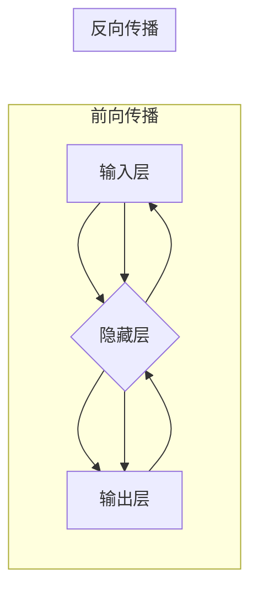

> 神经网络,深度学习,人工神经网络,激活函数,反向传播,卷积神经网络,循环神经网络

## 1. 背景介绍

神经网络作为人工智能领域的核心技术之一，近年来取得了令人瞩目的成就，在图像识别、自然语言处理、语音识别等领域展现出强大的应用潜力。 

人类大脑的复杂结构和功能一直是科学家们研究的焦点。神经网络的灵感来源于大脑中神经元之间的连接和信息传递机制。 

早期神经网络的研究始于20世纪40年代，但由于计算能力的限制，发展缓慢。随着计算机硬件和算法的不断进步，神经网络研究迎来了新的春天。

深度学习的兴起是神经网络发展的重要里程碑。深度学习通过构建多层神经网络，能够学习更复杂的特征表示，从而取得了在各种人工智能任务上的突破性进展。

## 2. 核心概念与联系

**2.1 神经元**

神经网络的基本单元是神经元，它模拟了生物神经元的结构和功能。每个神经元接收来自其他神经元的输入信号，经过处理后产生输出信号。

**2.2 权重和偏置**

连接神经元的线段称为连接，每个连接都具有一个权重，权重决定了输入信号对输出信号的影响程度。偏置是一个常数，用于调整神经元的激活阈值。

**2.3 激活函数**

激活函数是神经网络中一个重要的组成部分，它决定了神经元对输入信号的响应方式。常见的激活函数包括 sigmoid 函数、ReLU 函数、tanh 函数等。

**2.4 层次结构**

神经网络通常由多个神经元层组成，包括输入层、隐藏层和输出层。输入层接收原始数据，隐藏层对数据进行特征提取和表示，输出层产生最终的预测结果。

**2.5 前向传播和反向传播**

前向传播是指将输入数据通过神经网络传递，最终得到输出结果的过程。反向传播是指根据输出结果与真实值的误差，调整神经网络的权重和偏置，以减小误差的过程。

**2.6 训练和测试**

神经网络的训练过程是指使用训练数据调整神经网络的权重和偏置，使其能够准确地预测未知数据。测试过程是指使用测试数据评估神经网络的性能。

**Mermaid 流程图**



## 3. 核心算法原理 & 具体操作步骤

### 3.1 算法原理概述

神经网络的核心算法是反向传播算法，它通过迭代更新神经网络的权重和偏置，使网络的输出结果与真实值之间的误差最小化。

反向传播算法的基本步骤如下：

1. 将输入数据传递到神经网络，得到输出结果。
2. 计算输出结果与真实值的误差。
3. 根据误差反向传播，计算每个神经元的梯度。
4. 使用梯度下降法更新神经网络的权重和偏置。
5. 重复步骤1-4，直到误差达到预设阈值。

### 3.2 算法步骤详解

1. **前向传播:** 将输入数据逐层传递到神经网络，计算每个神经元的输出值。
2. **损失函数:** 计算输出结果与真实值的误差，使用损失函数衡量误差的大小。
3. **反向传播:** 计算损失函数对每个权重和偏置的梯度。
4. **梯度下降:** 使用梯度下降法更新权重和偏置，减小误差。

### 3.3 算法优缺点

**优点:**

* 能够学习复杂的非线性关系。
* 具有强大的泛化能力。
* 可以处理各种类型的数据。

**缺点:**

* 训练时间长，计算资源消耗大。
* 容易陷入局部最优解。
* 对训练数据质量要求高。

### 3.4 算法应用领域

神经网络在各个领域都有广泛的应用，例如：

* **图像识别:** 人脸识别、物体检测、图像分类。
* **自然语言处理:** 机器翻译、文本摘要、情感分析。
* **语音识别:** 语音转文本、语音助手。
* **推荐系统:** 商品推荐、内容推荐。
* **医疗诊断:** 疾病预测、影像分析。

## 4. 数学模型和公式 & 详细讲解 & 举例说明

### 4.1 数学模型构建

神经网络可以看作是一个多层感知机，每个神经元接收多个输入信号，经过加权求和和激活函数处理后产生输出信号。

**输入层:**

* $x_1, x_2, ..., x_n$ 表示输入数据。

**隐藏层:**

* $z_j = \sum_{i=1}^{n} w_{ij}x_i + b_j$ 表示第j个隐藏层神经元的输入值，其中 $w_{ij}$ 是连接第i个输入神经元和第j个隐藏层神经元的权重， $b_j$ 是第j个隐藏层神经元的偏置。
* $a_j = f(z_j)$ 表示第j个隐藏层神经元的输出值，其中 $f(z)$ 是激活函数。

**输出层:**

* $y_k = f(\sum_{j=1}^{m} w_{jk}a_j + b_k)$ 表示第k个输出神经元的输出值，其中 $w_{jk}$ 是连接第j个隐藏层神经元和第k个输出神经元的权重， $b_k$ 是第k个输出神经元的偏置。

### 4.2 公式推导过程

损失函数用于衡量预测结果与真实值的误差。常用的损失函数包括均方误差 (MSE) 和交叉熵损失 (Cross-Entropy Loss)。

**均方误差 (MSE):**

$$
MSE = \frac{1}{N} \sum_{i=1}^{N} (y_i - \hat{y}_i)^2
$$

其中 $y_i$ 是真实值， $\hat{y}_i$ 是预测值， $N$ 是样本数量。

**交叉熵损失 (Cross-Entropy Loss):**

$$
Cross-Entropy Loss = -\sum_{i=1}^{N} y_i \log(\hat{y}_i)
$$

其中 $y_i$ 是真实值， $\hat{y}_i$ 是预测值。

反向传播算法通过计算损失函数对每个权重和偏置的梯度，并使用梯度下降法更新权重和偏置。

**梯度下降法:**

$$
w_{ij} = w_{ij} - \alpha \frac{\partial Loss}{\partial w_{ij}}
$$

$$
b_j = b_j - \alpha \frac{\partial Loss}{\partial b_j}
$$

其中 $\alpha$ 是学习率。

### 4.3 案例分析与讲解

**图像分类:**

假设我们有一个图像分类任务，目标是将图像分类为猫、狗或鸟。我们可以使用卷积神经网络 (CNN) 来解决这个问题。

CNN 是一种专门用于处理图像数据的深度学习模型。它利用卷积层和池化层来提取图像特征，并使用全连接层进行分类。

**训练过程:**

1. 使用大量的猫、狗和鸟的图像数据训练 CNN 模型。
2. 将图像数据输入 CNN 模型，并计算模型的输出结果。
3. 使用损失函数衡量预测结果与真实值的误差。
4. 使用反向传播算法更新 CNN 模型的权重和偏置。
5. 重复步骤2-4，直到模型的性能达到预设阈值。

**预测过程:**

1. 将新的图像数据输入到训练好的 CNN 模型。
2. 模型会输出每个类别的概率分数。
3. 选择概率分数最高的类别作为预测结果。

## 5. 项目实践：代码实例和详细解释说明

### 5.1 开发环境搭建

* Python 3.x
* TensorFlow 或 PyTorch

### 5.2 源代码详细实现

```python
import tensorflow as tf

# 定义模型结构
model = tf.keras.models.Sequential([
    tf.keras.layers.Conv2D(32, (3, 3), activation='relu', input_shape=(28, 28, 1)),
    tf.keras.layers.MaxPooling2D((2, 2)),
    tf.keras.layers.Conv2D(64, (3, 3), activation='relu'),
    tf.keras.layers.MaxPooling2D((2, 2)),
    tf.keras.layers.Flatten(),
    tf.keras.layers.Dense(10, activation='softmax')
])

# 编译模型
model.compile(optimizer='adam',
              loss='sparse_categorical_crossentropy',
              metrics=['accuracy'])

# 训练模型
model.fit(x_train, y_train, epochs=5)

# 评估模型
loss, accuracy = model.evaluate(x_test, y_test)
print('Test Loss:', loss)
print('Test Accuracy:', accuracy)
```

### 5.3 代码解读与分析

* **模型结构:** 该代码定义了一个简单的卷积神经网络模型，包含两层卷积层、两层池化层和一层全连接层。
* **激活函数:** 使用 ReLU 激活函数，可以提高模型的学习能力。
* **损失函数:** 使用交叉熵损失函数，适合多分类问题。
* **优化器:** 使用 Adam 优化器，可以加速模型训练。
* **训练过程:** 使用训练数据训练模型，并设置训练轮数 (epochs)。
* **评估过程:** 使用测试数据评估模型的性能，并打印测试损失和准确率。

### 5.4 运行结果展示

训练完成后，可以将模型应用于新的图像数据进行分类。

## 6. 实际应用场景

### 6.1 图像识别

* **人脸识别:** 用于解锁手机、验证身份、监控安全。
* **物体检测:** 用于自动驾驶、安防监控、零售分析。
* **图像分类:** 用于医疗诊断、产品识别、内容推荐。

### 6.2 自然语言处理

* **机器翻译:** 将文本从一种语言翻译成另一种语言。
* **文本摘要:** 自动生成文本的简短摘要。
* **情感分析:** 分析文本的情感倾向，例如正面、负面或中性。

### 6.3 语音识别

* **语音转文本:** 将语音转换为文本。
* **语音助手:** 例如 Siri、Alexa、Google Assistant。

### 6.4 其他应用

* **推荐系统:** 根据用户的历史行为推荐商品、内容或服务。
* **医疗诊断:** 辅助医生诊断疾病，例如癌症检测、疾病预测。
* **金融分析:** 分析金融数据，预测市场趋势。

### 6.5 未来应用展望

* **更智能的虚拟助手:** 能够理解更复杂的自然语言指令，并提供更个性化的服务。
* **自动驾驶汽车:** 更安全、更可靠的自动驾驶系统。
* **个性化医疗:** 根据患者的基因信息和生活习惯提供个性化的医疗方案。

## 7. 工具和资源推荐

### 7.1 学习资源推荐

* **书籍:**
    * 深度学习 (Deep Learning) - Ian Goodfellow, Yoshua Bengio, Aaron Courville
    * 神经网络与深度学习 (Neural Networks and Deep Learning) - Michael Nielsen
* **在线课程:**
    * TensorFlow 官方教程: https://www.tensorflow.org/tutorials
    * PyTorch 官方教程: https://pytorch.org/tutorials/
    * Coursera 深度学习课程: https://www.coursera.org/specializations/deep-learning

### 7.2 开发工具推荐

* **TensorFlow:** https://www.tensorflow.org/
* **PyTorch:** https://pytorch.org/
* **Keras:** https://keras.io/

### 7.3 相关论文推荐

* **ImageNet Classification with